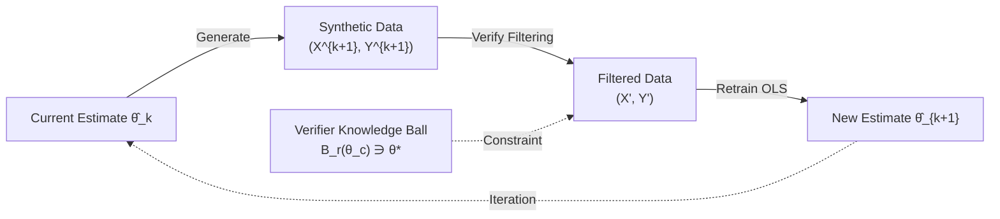

# Escaping Model Collapse via Synthetic Data Verification: Near-term Improvements and Long-term Convergence

**Conference**: ICLR 2026  
**OpenReview**: [https://openreview.net/forum?id=yfk6c39omW](https://openreview.net/forum?id=yfk6c39omW)  
**Code**: [liuqiyuanhhh/Verified-Synthetic-Data](https://github.com/liuqiyuanhhh/Verified-Synthetic-Data)  
**Area**: learning theory  
**Keywords**: model collapse, synthetic data, verifier filtering, bias-variance tradeoff, iterative retraining

## TL;DR
Starting from the classic theoretical setting of linear regression, this paper proves that model collapse can be avoided by introducing an external "verifier" to filter and retrain on self-generated synthetic data. The model achieves near-term improvements via a bias-variance tradeoff and converges long-term to the verifier's "knowledge center" $\theta_c$ (rather than the ground truth) because the verifier constitutes a contraction mapping. This is empirically validated on VAE and LLM.

## Background & Motivation
**Background**: Synthetic data is increasingly used to train frontier generative models (CV, medical, finance, LLM). However, the "model collapse" phenomenon proposed by Shumailov et al. suggests that repeated retraining on self-generated data continuously degrades performance, which sharply contradicts the industrial experience of successfully improving models with synthetic data.

**Limitations of Prior Work**: Theoretical analyses (Dohmatob, Gerstgrasser, etc.) almost all assume the use of **unfiltered** raw synthetic data, modeling it as a pure source of variance-inflating noise. The few studies exploring filtering effects rely on **ideal assumptions**—either assuming the verifier is perfectly reliable (Amin et al.) or that errors are highly structured i.i.d. noise with binary labels (Feng et al.).

**Key Challenge**: In reality, synthetic data is **rarely used in its raw form**. Practitioners commonly use grammar checkers, LLM-as-a-judge, pretrained discriminators, or human annotation to filter low-quality samples. This "verifier/discriminator" stage is precisely the key to the gap between empirical success and pessimistic theory, yet it lacks rigorous characterization.

**Goal**: To characterize the near-term gain conditions and long-term convergence behavior of verifier-based synthetic retraining under an **imperfect verifier** (possessing both bias and variance).

**Core Idea**: While the verifier only provides one bit of feedback (Yes/No), it "injects" external knowledge into the retraining process, transforming the iterative update from an "identity mapping" into a "contraction mapping"—the fundamental mechanism for reversing collapse into improvement.

## Method

### Overall Architecture
The paper establishes a theoretical framework rather than proposing a specific algorithm. The core is a **Generate–Verify–Retrain** loop: the current model $\hat\theta_k$ generates synthetic data $\to$ the verifier filters out inconsistent samples according to rules $\to$ the model is re-estimated on the filtered data to obtain $\hat\theta_{k+1}$. The analysis is anchored on linear regression $y = x^\top\theta^\star + \xi$, proving that the loop induces a Markov process and providing two theorems for **one-step (Theorem 3.1)** and **long-term (Theorem 4.1)** behavior.

### Key Designs
**1. Verifier Modeling: Characterizing imperfect verifiers via knowledge balls and binary feedback.** The verifier possesses prior knowledge of the true value, modeled as a ball $B_r(\theta_c)=\{\theta:\|\theta-\theta_c\|\le r\}$, assuming $\theta^\star\in B_r(\theta_c)$. It **does not expose** $\theta_c$ or $r$ but provides a binary judgment for each sample $(x_i,y_i)$: Yes, if $|y_i-x_i^\top\theta_c|\le r\|x_i\|+\sigma_c$. Here, $\Delta=\|\theta^\star-\theta_c\|$ represents the verifier's **bias**, and $r$ represents its **selectivity** (smaller $r$ is stricter). The motivation for binary feedback over direct exposure of $\theta_c$ comes from practice—RLHF-style accept/reject judgments have lower noise and cost, and verifiers (humans or stronger models) often cannot articulate their internal parameters.

**2. Block-structured Covariate Design: Diagonalizing the transfer operator.** For mathematical clarity, synthetic covariates $X^k$ are constructed in blocks along a fixed orthonormal basis $\{v_1,\dots,v_p\}$ (each direction is repeated several times). This design "diagonalizes" the transfer operator $\hat\theta_k\mapsto\hat\theta_{k+1}$, eliminating rotational variability from arbitrary designs and decoupling the dynamics of each orthogonal direction. The authors emphasize that this design is not unique (standard bases or isotropic random directions yield similar qualitative conclusions) but facilitates rigorous proof.

**3. Short-term: Bias-Variance Tradeoff (Theorem 3.1).** The initial OLS estimate $\hat\theta_0$ is unbiased but suffers from high variance due to small $n_0$. Filtering discards inconsistent samples to **reduce variance**, but the imperfect verifier **injects systematic bias**. The theorem provides an exact decomposition of the single-round MSE:
$$\frac{1}{\sigma^2}\mathrm{MSE}(\hat\theta_1)=\sum_{j=1}^p\Big(\underbrace{\frac{m_{2,j}}{n_1}}_{\text{Synthetic Variance}}+\underbrace{\frac{m_{1,j}^2+m_{1,j}m_{3,j}+m_{2,j}^2}{\mu_j^2}}_{\text{Verification Error}}\Big)+O(n_0^{-4/3})$$
where $m_{1,j},m_{3,j}$ capture the directional bias between the verifier center and the truth (vanishing when $\theta_c=\theta^\star$), and $m_{2,j}<1$ quantifies the variance reduction. When the verifier is sufficiently accurate and the synthetic sample size $n_1$ is large, $\mathrm{MSE}(\hat\theta_1)$ is **strictly better** than the baseline $\sum_j\mu_j^{-2}$. This contrasts sharply with classic collapse theory: verification turns synthetic data from "variance-inflating noise" into a "variance-reducing resource."

**4. Long-term: Convergence to the Verifier's Knowledge Center (Theorem 4.1).** Iterative updates are written as $\hat\theta_{k+1}=T(\hat\theta_k)+\eta_{k+1}$, where $T(\cdot)$ is a deterministic mapping determined by verifier filtering, and $\eta$ is sub-Gaussian noise decaying at $\sim 1/n_k$. The key proof shows that $T(\cdot)$ is a **contraction mapping**:
$$\mathbb{E}\|\hat\theta_k-\theta_c\|^2\le\rho^{2k}\mathbb{E}\|\hat\theta_0-\theta_c\|^2+p\sigma^2\sum_{j=0}^{k-1}\frac{\rho^{2(k-j)-1}}{n_j},\quad 0<\rho<1$$
If $n_k\to\infty$, then $\hat\theta_k \to \theta_c$. This leads to three long-term phases: ① **Unbiased verifier** ($\theta_c=\theta^\star$) improves continuously until converging to the truth; ② **Slightly biased** improves initially then plateaus or regresses (most realistic); ③ **Strongly biased** leads to degradation or collapse. Compared to prior work without verification—where the update degrades into an identity mapping and increasing samples only bounds error without convergence—the verifier's selectivity $r$ affects convergence speed but does not change the convergence point $\theta_c$.

## Key Experimental Results

### Main Results

| Setting | Metric | Key Finding | Control | Description |
|--------|------|------|------|---|
| Linear Regression (Sim) | MSE landscape | Filtering outperforms baseline in low-bias regions; degrades in high-bias regions | Theoretical prediction vs. Empirics highly consistent | Validates the sharp boundary of Theorem 3.1 |
| CVAE / MNIST | FID | 21.17 (Best at 40 rounds of filtered retraining) | 60K real data upper bound: 17.56 | Started with only 500 real images |
| SmolLM2-135M / XSUM | ROUGE-1 | Monotonic improvement in early stages of filtered retraining | No significant gain without filtering | 15 rounds of generate-verify-retrain |

### Ablation Study

| Configuration | Metric | Description |
|------|------|------|
| Biased Verifier $\Delta=1$ (60 rounds) | $\|\hat\theta_k-\theta_c\|^2$ | Converges to $\theta_c$ rather than $\theta^\star$; smaller $r$ accelerates convergence |
| Unbiased Verifier $\Delta=0$ | $\|\hat\theta_k-\theta^\star\|^2$ | Filtering consistently outperforms the unfiltered baseline |
| Verifier Quality (VAE, 20K synthetic/round) | FID | More training data for the verifier leads to greater FID improvement; weak verifiers plateau early or degrade |
| Keep Ratio top 10% | FID | Guided by single-round analysis to balance quality and diversity |

### Key Findings
- Even with only 1-bit feedback, the verifier is sufficient to inject external knowledge into retraining and reverse the collapse trend.
- Short-term improvement and long-term convergence are governed by different mechanisms: the former is a bias-variance tradeoff, while the latter is convergence via contraction mapping.
- Even with a perfect verifier and infinite synthetic samples, a single step cannot achieve convergence—alignment must occur iteratively (the verification error term does not vanish with $n_1$).
- In VAE experiments, strong verifiers (trained on 60K real images) bring rapid early FID improvement before plateauing; unverified retraining (dashed line) degrades severely, consistent with collapse theory.
- In LLM experiments, filtered retraining shows monotonic ROUGE-1 gains in the early stages, while unfiltered shows no gain—proving that text generation follows this mechanism.
- Verifier selectivity $r$ controls the convergence **speed** but does not change the **point**, decoupling the near-term and long-term metrics.

## Highlights & Insights
- This work is the first to incorporate "verifier filtering"—a practical step ignored by the theoretical community—into a rigorous analysis of model collapse, bridging the gap between empirical success and pessimistic theory.
- The binary comparison of "Identity Mapping vs. Contraction Mapping" clearly identifies what the verifier changes: it transforms divergent/bounded dynamics into dynamics with a convergence point.
- The conclusion that models "converge to the verifier's knowledge center rather than the truth" is a cautionary negative result: the ceiling of even the strongest synthetic data pipeline is determined by verifier quality.
- The single-round MSE decomposition explicitly separates "synthetic variance" from "verification error," providing an actionable criterion for "when to filter and how strictly."
- By viewing iterative retraining as a discretized Stochastic Differential Equation (SDE) and establishing convergence using supermartingales and concentration inequalities, the methodology provides a template for analyzing more complex models.

## Limitations & Future Work
- The theory is anchored in linear regression with block-structured orthogonal covariate designs; while the authors argue for generalizability, rigorous proofs for other designs are not provided.
- The verifier is modeled as a spherical knowledge set with a fixed center; real-world verifier bias might be non-static and change with data distribution.
- The VAE experiment ceiling (FID 21.17 vs. 17.56) is partially limited by the initial 500 real images and the lack of diversity-preserving mechanisms in the MLP verifier; "selection bias" may excessively reject hard-to-generate modes.
- Using ROUGE-1 as an oracle verifier in LLM experiments is idealized; real-world verifiers possess their own biases.
- Since $\theta_c$ is determined by the verifier, breaking the ceiling requires continuous improvement of verifier quality or the introduction of fresh real data; simply adding more synthetic data is futile.
- Future work could explore verifiers that adapt during training, multi-verifier ensembles, and whether contraction mapping properties hold under non-linear/deep models.

## Related Work & Insights
- **vs. Unfiltered collapse theories (Dohmatob/Gerstgrasser/Shumailov)**: These treat synthetic data as variance noise where updates are identity mappings that can only be bounded; Ours proves verification makes it a variance-reducing resource and brings convergence.
- **vs. Ideal Verifiers (Amin et al. 2025)**: Ours allows the verifier to have both bias and variance and does not assume perfect reliability.
- **vs. Feng et al. 2025 (Binary label noise classification)**: In Ours, errors originate from the generative model itself rather than exogenous noise; performance varies smoothly with bias/selectivity rather than showing a sharp phase transition.
- **vs. Reward maximization frameworks (preference matching, RLVR)**: While both use external feedback, Ours is knowledge injection via filtering rather than reward maximization; the latter converges to the highest reward level set and loses diversity.
- **vs. Data accumulation/mixing strategies (Gerstgrasser, Bertrand)**: Accumulating data or mixing real data stabilizes retraining but lacks active knowledge injection; the verifier filtering in Ours is an orthogonal and complementary third mechanism.

## Rating
- Novelty: ⭐⭐⭐⭐⭐ First to incorporate imperfect verifier filtering into rigorous model collapse theory; the "contraction mapping $\to$ knowledge center convergence" insight is clean and powerful.
- Experimental Thoroughness: ⭐⭐⭐⭐ Three-tier theoretical validation (Linear Regression/VAE/LLM) provides good coverage; however, VAE/LLM scales are small and verifier settings are idealized.
- Writing Quality: ⭐⭐⭐⭐⭐ Theory and intuition progress in tandem; theorem implications are thoroughly explained, and the identity vs. contraction mapping comparison is highly instructive.
- Value: ⭐⭐⭐⭐ Provides principled guidance on "whether and how to filter" when training with synthetic data, offering practical significance for synthetic pipeline design.

<!-- RELATED:START -->

## Related Papers

- [\[ICLR 2026\] Preventing Model Collapse Under Overparametrization: Optimal Mixing Ratios for Interpolation Learning and Ridge Regression](preventing_model_collapse_under_overparametrization_optimal_mixing_ratios_for_in.md)
- [\[ICLR 2026\] High-dimensional Analysis of Synthetic Data Selection](high-dimensional_analysis_of_synthetic_data_selection.md)
- [\[ICML 2026\] When Sample Selection Bias Precipitates Model Collapse](../../ICML2026/learning_theory/when_sample_selection_bias_precipitates_model_collapse.md)
- [\[ICLR 2026\] Optimizing Data Augmentation through Bayesian Model Selection](optimizing_data_augmentation_through_bayesian_model_selection.md)
- [\[ICLR 2026\] Memorizing Long-tail Data Can Help Generalization Through Composition](memorizing_long-tail_data_can_help_generalization_through_composition.md)

<!-- RELATED:END -->
