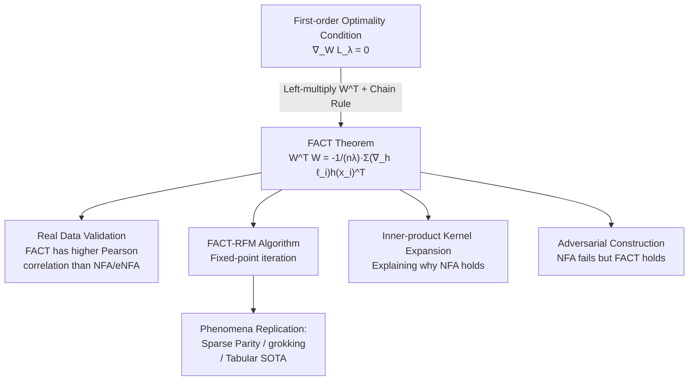

# FACT: a first-principles alternative to the Neural Feature Ansatz for how networks learn representations

**Conference**: ICLR 2026  
**OpenReview**: [https://openreview.net/forum?id=j4964wtJMz](https://openreview.net/forum?id=j4964wtJMz)  
**Code**: To be confirmed  
**Area**: Deep Learning Theory / Feature Learning  
**Keywords**: Neural Feature Ansatz, Feature Learning, First-order Optimality, AGOP, Recursive Feature Machine, grokking  

## TL;DR
This paper derives **FACT (Features at Convergence Theorem)** using first-order optimality conditions at training convergence. For networks with weight decay, it establishes a self-consistent formula $W^\top W = -\frac{1}{n\lambda}\sum_i (\nabla_h \ell_i) h(x_i)^\top$ at convergence points. This replaces the purely empirical Neural Feature Ansatz (NFA), providing a better fit to converged features and explaining why NFA typically holds and in which degenerate scenarios it fails.

## Background & Motivation
- **Background**: Understanding how neural networks learn representations is a core problem in deep learning theory. The **Neural Feature Ansatz (NFA)**, proposed by Radhakrishnan et al. (2024), is a highly influential conjecture asserting that converged layers satisfy the proportional relationship $W^\top W \propto (\text{AGOP})^s$, where AGOP is the Average Gradient Outer Product of input gradients. NFA has been empirically validated across MLPs, CNNs, and Transformers, used to explain grokking, staircase functions, and catapult spikes, and has inspired the SOTA adaptive kernel algorithm RFM.
- **Limitations of Prior Work**: NFA is an "educated guess" lacking first-principles support. Because it is empirically fitted, it cannot answer three key questions: Why **should** it hold? Under what conditions does it **fail**? And how can it be **improved**?
- **Key Challenge**: The empirical NFA literature and the theoretical "first-order optimality" literature have remained largely disconnected. While the latter has proven that first-order conditions at convergence lead to low-rank bias, sparsity bias, and neural collapse, it has never been linked to NFA.
- **Goal**: Derive an alternative relationship from first principles that is provably true at convergence, fits learned features better empirically, and unifies the two aforementioned research lines.
- **Core Idea**: **Starting from the first-order critical point condition of the loss with respect to $W$ ($\nabla_W L_\lambda = 0$), left-multiplying by $W^\top$ and rearranging yields a closed-form expression for $W^\top W$**—this is FACT. It is not a guess but an identity derived algebraically from stationarity conditions.

## Method

### Overall Architecture
The core of FACT is a self-consistent formula that "must hold at convergence." The paper explores four aspects: (1) Deriving the FACT theorem and showing it fits real data better than NFA/eNFA; (2) Embedding FACT into the Recursive Feature Machine (RFM) kernel learning algorithm to replicate phenomena like sparse parity phase transitions, modular arithmetic grokking, and tabular SOTA; (3) Algebraically expanding FACT under inner-product kernels to explain why NFA usually holds; (4) Constructing adversarial datasets where NFA fails but FACT remains valid.

### Key Designs

**1. Features at Convergence Theorem: Directly reading $W^\top W$ from stationarity.** Let the model be $f(x;\theta)=g(Wh(x),x)$. The only architectural requirement is that the model depends on $W$ solely through the matrix multiplication $Wh(x)$ (covering nearly any layer with a weight matrix). At a critical point of the training loss $L_\lambda(\theta)=L(\theta)+\frac{\lambda}{2}\|\theta\|_F^2$ with weight decay $\lambda>0$, $\nabla_W L_\lambda=\lambda W+\nabla_W L=0$. Left-multiplying by $W^\top$ and applying the chain rule yields:
$$W^\top W = \text{FACT} := -\frac{1}{n\lambda}\sum_{i=1}^{n}(\nabla_h \ell_i)\,h(x_i)^\top,$$
where $\nabla_h \ell_i$ is the gradient of the loss with respect to the layer input. The proof is only four lines, essentially a rearrangement of the stationarity condition—but this "near-triviality" provides a solid first-principles counterpart to NFA. Unlike NFA, which uses the outer product of model output gradients $\nabla_h f_i (\nabla_h f_i)^\top$, FACT uses the **outer product of loss gradients and activations**, and explicitly incorporates the weight decay $\lambda$ in the coefficient.

**2. Symmetrization and Forward/Backward Versions.** While $W^\top W$ is always positive semi-definite (PSD), the right-hand side of FACT is only guaranteed to be PSD at a critical point. Using identities like $W^\top W=(W^\top W)^\top=\sqrt{(W^\top W)(W^\top W)^\top}$, multiple equivalent relationships such as $W^\top W=\text{FACT}^\top$ or $W^\top W=\sqrt{\text{FACT}\cdot\text{FACT}^\top}$ can be derived to "correct" the right-hand side to be PSD. The paper also provides a dual **backward version (bFACT)**: $WW^\top=-\frac{1}{n\lambda}\sum_i (Wh(x_i))(\nabla_{Wh}\ell_i)^\top$, characterizing the **left** singular vectors of $W$.

**3. FACT-RFM: Aligning fixed-point iteration with the FACT relationship.** RFM simulates neural network feature learning by applying kernels $K_W(x,x')=K(Wx,Wx')$ to transformed data. Original NFA-RFM updates $W_{t+1}\leftarrow(\text{AGOP}_t)^{s/2}$. This paper replaces the update with $W_{t+1}\leftarrow((\text{FACT}_t)(\text{FACT}_t)^\top)^{1/4}$, and provides a variation using geometric means for stability: $W_{t+1}\leftarrow((\text{FACT}_t)(W_t^\top W_t)^2(\text{FACT}_t)^\top)^{1/8}$. The exponents are carefully chosen so that the **fixed point of the iteration exactly equals** the FACT relationship from Theorem 3.1.

**4. Expanding Under Inner-Product Kernels: NFA as a "similarity proxy" for FACT.** For kernels $K_W(x,x')=k(x^\top M x')$ with $M=W^\top W$, both FACT and AGOP can be written in the unified form $\sum_{i,j}(\cdot)\,M x_i \alpha_i^\top \alpha_j x_j^\top M^\top$. The difference lies in the weights: NFA uses $\tau(x_i,M,x_j)=\frac{1}{n}\sum_l k'(x_l^\top M x_i)k'(x_l^\top M x_j)$, while FACT uses $k'(x_i^\top M x_j)$. Both can be interpreted as data point similarities. When $k$ is non-increasing (e.g., $k(t)=\exp(t)$), $\text{FACT}\cdot M^\top$ is PSD, and the update simplifies to $M_{t+1}\leftarrow(\text{FACT}_t M_t)^{1/2}$, isomorphic to NFA's $M_t\leftarrow(\text{AGOP})^{1/2}$. Thus, if $\tau$ is approximately proportional to $k'$, NFA approximates FACT, explaining its empirical success (fitting $R^2=0.987$ on mod 61).

## Key Experimental Results

### Main Results: Tabular Data (120 UCI Datasets)

| Method | Mean Test Accuracy (%) |
|------|------|
| FACT-RFM (No geometric mean) | **85.22** |
| FACT-RFM (Geometric mean) | 84.99 |
| NFA-RFM | 85.10 |
| Laplace Kernel Regression (No feature learning) | 83.71 |

FACT-RFM and NFA-RFM achieve comparable accuracy, both significantly outperforming kernel regression without feature learning.

### FACT Relationship Validation (MNIST / CIFAR-10)

| Setting | Conclusion |
|------|------|
| 5-layer ReLU MLP, MSE loss, weight decay $10^{-4}$ | Pearson correlation for FACT is **consistently higher** than for NFA/eNFA at convergence. |
| Averaged over hidden layers across 5 runs | FACT remains highly correlated across all layers. |

### Phenomenon Reproduction and Separability

| Task | Results |
|------|------|
| Sparse Parity $k=2,3,4$ ($d=50$) | FACT-RFM and NFA-RFM learn "strikingly similar" low-rank features aligned with the parity support. |
| Low-data Sparse Parity $n{=}25000,k{=}4$ | FACT-RFM reproduces the **phase transition** observed in MLP training. |
| Modular Arithmetic $(x+y)\bmod 61$ | Both methods achieve 100% test accuracy and exhibit **grokking** with block-circulant feature matrices. |
| Adversarial Two-layer Network | **Theorem 6.1**: There exist $p_\epsilon,\tau_\epsilon, \lambda_\epsilon$ such that $\text{corr}((\text{AGOP})^s,W^\top W)<\epsilon$, proving NFA can be decoupled from actual weights while FACT remains valid. |

### Key Findings
- FACT fits $W^\top W$ better than NFA/eNFA on real data and is **provably** strict at convergence.
- FACT-RFM reproduces all known feature learning phenomena of NFA without performance loss, showing the first-principles version captures the core mechanism.
- Expansion under inner-product kernels maps NFA's similarity factor $\tau$ to FACT's $k'$, providing a verifiable explanation for why NFA works.
- Adversarial construction proves NFA can be broken while FACT cannot, establishing FACT as a more reliable theoretical surrogate.

## Highlights & Insights
- **Upgrading Conjecture to Theorem**: FACT's primary value is transforming a widely used but poorly understood empirical relationship into an identity that networks with weight decay **must satisfy** at convergence.
- **Unifying Research Lines**: Empirical NFA literature and theoretical first-order optimality literature are linked for the first time via a single formula.
- **Falsifiability & Verifiability**: The work explains NFA's success (via $R^2=0.987$ fits) while constructing counterexamples where it fails (Theorem 6.1), completing the logical loop.
- **Architecture Agnostic**: Applicable as long as a layer depends on $W$ via matrix multiplication; FACT generalizes across MLPs, CNNs, and Transformers.

## Limitations & Future Work
- **Dependency on Convergence**: FACT holds strictly at critical points; for under-trained networks, it is only an approximation.
- **Requirement for Non-zero Weight Decay**: The formula's denominator contains $\lambda$, making it ill-defined as $\lambda\to0$ without additional limits.
- **Inner-product Kernel Limitation for Explanation**: The algebraic correspondence in Section 5 is specific to inner-product kernels; relationships in deep non-linear stacks require further study.
- **Exponent Selection**: Exponents like $1/4$ and $1/8$ in FACT-RFM were manually set to align fixed points rather than derived from a general optimality principle.
- **Future Work**: FACT provides a probe for failure modes in feature learning, potentially characterizing data distributions that break empirical ansatzes and guiding more robust adaptive kernels.

## Related Work & Insights
- **Neural Feature Ansatz** (Radhakrishnan et al., 2024): The direct baseline and algorithm source.
- **Equivariant NFA** (Ziyin et al., 2025): An alternative invariant to linear transformations of the loss, compared in the experiments.
- **First-order Optimality / KKT Implicit Bias** (Soudry et al. 2018; Lyu & Li 2019; Gunasekar et al. 2017/2018): FACT brings these theoretical tools into the NFA conversation.
- **Grokking & Sparse Parity** (Nanda et al. 2023; Mallinar et al. 2025): Tasks used to verify if FACT-RFM captures real-world learning phenomena.
- **Insight**: When an empirical relationship is consistently effective but lacks foundation, returning to first-order optimality conditions often yields the most elegant explanation.

## Rating
- **Novelty**: ⭐⭐⭐⭐⭐ Upgrades NFA from conjecture to theorem and unifies independent research lines.
- **Experimental Thoroughness**: ⭐⭐⭐⭐ Covers real data, SOTA tabular results, grokking, and adversarial cases, though testing on large-scale Transformers is limited.
- **Writing Quality**: ⭐⭐⭐⭐⭐ Concise derivation, clear motivation, and a complete logical loop between "why it works" and "when it fails."
- **Value**: ⭐⭐⭐⭐⭐ Provides a solid theoretical tool for feature learning that will likely guide future adaptive kernel designs.

<!-- RELATED:START -->

## Related Papers

- [\[ICLR 2026\] Scaling Laws and Spectra of Shallow Neural Networks in the Feature Learning Regime](scaling_laws_and_spectra_of_shallow_neural_networks_in_the_feature_learning_regi.md)
- [\[ICLR 2026\] Feature Compression is the Root Cause of Adversarial Fragility in Neural Networks](feature_compression_is_the_root_cause_of_adversarial_fragility_in_neural_network.md)
- [\[ICLR 2026\] Transfer Learning in Infinite Width Feature Learning Networks](transfer_learning_in_infinite_width_feature_learning_networks.md)
- [\[ICLR 2026\] Proper Velocity Neural Networks](proper_velocity_neural_networks.md)
- [\[ICLR 2026\] On the Convergence of Two-Layer Kolmogorov-Arnold Networks with First-Layer Training](on_the_convergence_of_two-layer_kolmogorov-arnold_networks_with_first-layer_trai.md)

<!-- RELATED:END -->
