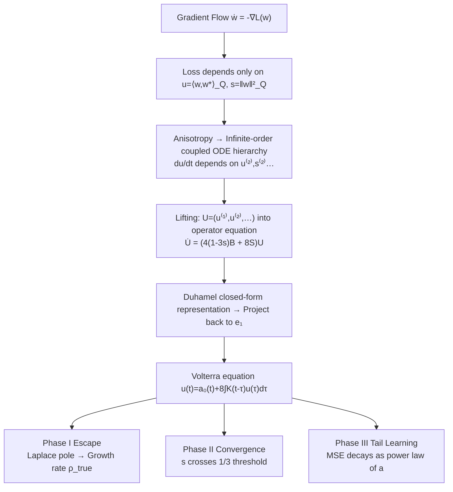

# Fast Escape, Slow Convergence: Learning Dynamics of Phase Retrieval under Power-Law Data

**Conference**: ICLR 2026  
**OpenReview**: [https://openreview.net/forum?id=Ae4eZpkXBX](https://openreview.net/forum?id=Ae4eZpkXBX)  
**Code**: TBD  
**Area**: learning theory / learning dynamics  
**Keywords**: scaling laws, phase retrieval, anisotropic data, power-law spectrum, gradient flow, Volterra equation  

## TL;DR
This paper provides the first rigorous characterization of learning dynamics for **anisotropic (power-law covariance) non-linear regression** (phase retrieval). It proves that the training trajectory consists of three phases: "fast escape from mediocrity—slow convergence—learning the spectral tail," and explicitly derives the MSE scaling law from the spectral decay index $a$.

## Background & Motivation
- **Background**: Scaling laws (loss decreasing as a power law of data/compute/time) are core empirical observations in modern deep learning. However, they are theoretically well-understood only in **linear models** (kernel ridge, random features, SGD), where the source/capacity condition framework is quite mature.
- **Limitations of Prior Work**: Real-world scenarios involve **non-linear** feature mappings, yet scaling law analysis in non-linear settings almost exclusively assumes **isotropic** inputs. Under isotropy, the dynamics of phase retrieval collapse into a 2D ODE, where the core analytical difficulty is merely "escaping mediocrity." Once the input covariance follows an anisotropic power-law spectrum, this 2D closed structure fails.
- **Key Challenge**: Anisotropy completely breaks "finite-dimensional closure"—the derivatives of summary statistics $u(t)=\langle w,w^\star\rangle_Q$ and $s(t)=\|w\|_Q^2$ couple with higher-order weighted overlaps $u^{(k)},s^{(k)}$, forming an **infinite-order coupled ODE hierarchy** that cannot be solved directly like the isotropic case.
- **Goal**: Using the canonical non-linear model phase retrieval $y=\langle x,w^\star\rangle^2+\xi,\ x\sim\mathcal N(0,Q)$ (with $Q$ eigenvalues $\lambda_i\propto i^{-a},\ a>1$), the authors aim to answer how the input spectrum governs finite-time convergence and whether learning curves can be predicted from spectral decay.
- **Core Idea**: **Represent the infinite hierarchy in closed form using Duhamel's formula, then reduce the infinite-dimensional dynamics to a solvable Volterra equation via stage-wise approximations** to extract stopping times and decay rates for each phase, ultimately reading off the scaling law.

## Method

### Overall Architecture
The object of study is the population gradient flow of phase retrieval $\dot w(t)=-\nabla_w L(w(t))$. The authors first prove that the loss depends only on two summary statistics to characterize the landscape; however, anisotropy causes the evolution of these statistics to couple into infinite-order higher-order overlaps. Thus, the analytical path follows a "**first lift then project**" strategy: encompass the infinite coupled equations into an operator equation generated by a right-shift operator + a rank-one perturbation, solve it in closed form using Duhamel, and project back to $u(t)$ to obtain a single Volterra integral equation. Finally, approximations are made according to three physical phases, and growth/decay rates are extracted using Laplace/residue calculus.

### Key Designs

**1. Loss Simplification: Compressing high-dimensional non-convex problems into two scalar observables.** The authors first prove (Proposition 1) that although $w$ is $d$-dimensional and the loss is non-convex, the population loss enters only through two $Q$-weighted statistics: $L(w)=3s^2+3s_\star^2-4u^2-2s_\star s$, where $s=\|w\|_Q^2$ and $u=\langle w,w^\star\rangle_Q$. Combined with the gradient/Hessian (Proposition 2), it is shown that critical points consist only of $\{0,\pm w^\star\}$ and a set of saddle points $(u,s)=(0,s_\star/3)$, with **no spurious local minima**. $\pm w^\star$ are the global optima. This indicates that slow convergence is not due to getting stuck in bad minima but rather a geometric plateau: at initialization, $u(0)\approx d^{-1/2} \approx 0$ falls in a low-correlation region with minimal gradient, requiring a long time to escape.

**2. Infinite Hierarchy and the Fundamental Difficulty of Anisotropy.** A key observation (Proposition 3) is that under anisotropy, the derivatives of $u(t), s(t)$ necessarily involve higher-order weighted overlaps $s^{(k)}=\|w\|_{Q^k}^2$ and $u^{(k)}=\langle w,w^\star\rangle_{Q^k}$, leading to recurrences such as $\dot u^{(k)}=4(s_\star-3s)u^{(k+1)}+8u\,s_\star^{(k+1)}$—the **rate of change of the $k$-th order depends on the $(k+1)$-th order**, precluding finite-dimensional closure. Anisotropic gradient flow is essentially a $Q$-preconditioned version of isotropic flow ($\dot z=-Q\nabla L_I(z)$), where critical points remain the same but dynamics are heavily distorted by $Q$. This is the structural obstacle the paper overcomes.

**3. Duhamel Lifting + Volterra Reduction: Making Infinite Dimensions Solvable.** This is the technical core of the method. The authors collect all relevant terms into a vector $U(t)=(u^{(1)},u^{(2)},\dots)^\top$ and use a right-shift operator $B$ ($(Bx)_k=x_{k+1}$) and a rank-one operator $S$ to compress the hierarchy into a compact operator equation $\dot U=\big(4(1-3s)B+8S\big)U$—the **entire infinite system is generated by a "shift operator + rank-one perturbation."** Applying Duhamel's formula yields a closed-form solution (Lemma 1). Projecting this back to the first coordinate $e_1$ and approximating $\Theta(t)\approx t$ in the early interval where $s(t)\le\delta$ yields a scalar Volterra equation $u(t)=a_0(t)+8\int_0^t K(t-\tau)u(\tau)\,d\tau$, where the kernel is $K(t)=\sum_i(w_i^\star)^2\lambda_i^2 e^{4\lambda_i t}$. Using the Laplace transform $\hat u(p)=\hat a_0(p)/(1-8\hat K(p))$, the growth of $u(t)$ is dominated by the rightmost pole of $\hat u$, causing $u(t)$ to grow at rate $e^{\rho_{\text{true}}t}$, where $\rho_{\text{true}}>4\lambda_1$ is the unique positive root of $1=8\hat K(\rho)$ (Lemma 2).

**4. Three-Phase Decomposition and Tail-Driven Scaling Law.** Observed from empirical trajectories (Figure 2), the authors provide rigorous stopping times for each phase (Theorem 1): **Phase I (Escape)** $t\le T_1=O(\log d)$, where $u$ escapes zero exponentially, but MSE barely moves (only large eigenvalue directions are learned); **Phase II (Convergence)** $T_1\le t<T_2$, where $s$ crosses the critical threshold $1/3$ and stabilizes, $u,s\to1$, with $T_2=T_1'+O(\varepsilon^{-2a/(a-1)}\log(1/\varepsilon))$ being slower than isotropic convergence; **Phase III (Tail Learning)** $t>T_2$, where summary statistics have stabilized but MSE continues to decrease, dominated by the smallest eigenvalue directions. Theorem 2 gives an explicit asymptotic for Phase III MSE: defining $x_d=(\beta_d\tau)^{1/a}$, then $S_d(\tau)$ satisfies $1-\Gamma(1-\tfrac1a)\tfrac{x_d}{d}+o(\cdot)$ in the middle range—the **index $a$ directly determines the slope of the log-log curve**, which is the source of the scaling law observed in Figure 1. Conclusion: escape can be faster (larger $a$ leads to faster $u$ growth), but low-MSE convergence is dragged down by the spectral tail, creating an escape–convergence tradeoff.

## Key Experimental Results

### Main Results (Numerical Validation of Phases and Indices)

| Phenomenon | Setting | Observations | Relation to Theory |
|------|------|----------|--------|
| MSE Learning Curves (Fig.1, online SGD) | Different spectral indices $a$, same init/noise/step-size | For $a>1$, convergence is significantly slower than isotropic exponential decay; larger $a$ results in slower decay | Consistent with spectral tail scaling law |
| $u(t),s(t)$ Evolution (Fig.2, population GD) | $a=2,\ d=10^4,\ \eta=10^{-2},\ T=10^6$ | Clearly presents I→IIa→IIb→III phases, sharp drop after plateau | Validates three-phase decomposition |
| Correlation $u(t)$ Growth (Fig.3) | Different $a$, $d=1000,\ \eta=10^{-3}$ | Larger $a$ leads to faster attainment of constant-order correlation for $u$ | Validates Remark 4 (faster escape) |

### Key Experimental Results (Theoretical Characterization)

| Phase | Stopping Time | Meaning |
|------|------|------|
| Phase I (Escape) | $T_1=O(\log d)$ | Controlled by $\log(1/\|u(0)\|)$; anisotropy does not eliminate the $\log d$ barrier |
| Phase IIa (Threshold) | $T_1'=T_1+O(1)$ | $s$ crosses $1/3$ and stabilizes |
| Phase II (Convergence) | $T_2=T_1'+O(\varepsilon^{-2a/(a-1)}\log(1/\varepsilon))$ | Slower than isotropic case; higher precision $\varepsilon$ requires higher cost |

### Key Findings
- **Escape–Convergence Tradeoff**: Larger $a$ leads to faster escape but slower convergence, qualitatively flipping the intuition from isotropic cases.
- **Plateaus stem from geometry, not bad minima**: There are no spurious local minima; plateaus arise from minimal gradients in low-correlation regions and the difficulty of learning the spectral tail.
- **MSE barely drops before $T_2$** (Proposition 4 provides an upper bound for $\mathrm{MSE}(T_2)-\sigma_\star^2$), after which it decays with a slope determined by $a$.

## Highlights & Insights
- **First rigorous scaling law characterization for anisotropic non-linear regression**, filling the gap where linear anisotropy is understood but non-linear work focuses almost exclusively on isotropy.
- **The "lifting for closed form, projection for Volterra" technical paradigm** is elegant: it converts the seemingly intractable "infinite-order coupling" into an operator equation of a shift operator + rank-one perturbation, using classical Duhamel/residue tools to extract growth rates.
- **Mechanizes the "plateau–drop" structure of empirical scaling laws**: Explicitly points out that the plateau corresponds to large eigenvalue directions being learned while MSE remains stagnant, whereas the drop comes from the gradual learning of the spectral tail.

## Limitations & Future Work
- **Analysis is at the population gradient flow level**, treating label noise as a constant term and neglecting fluctuations in finite-sample/one-pass SGD, though Fig.1 uses SGD as supporting evidence.
- **The model is single-neuron quadratic activation phase retrieval**, the minimal solvable non-linear model, which is far from multi-layer networks or real feature learning; the power-law spectrum is also an idealized assumption.
- **No preconditioning**: The authors intentionally analyze non-preconditioned gradient flow to expose anisotropy effects, but preconditioning is common in practice; the dynamical differences between the two deserve future characterization.
- Future work: Extend the three-phase characterization to multi-index settings, finite step-size SGD, and the joint setting of spectral tails and feature learning.

## Related Work & Insights
- **Scaling Law Theory**: The source-capacity framework for kernel ridge / random features / SGD (Caponnetto-De Vito, Cui et al., Bahri et al.), and kernel ridge under anisotropic power-laws (Wortsman & Loureiro 2025); this paper pushes this line into the **non-linear** regime.
- **Phase Retrieval and Quadratic Nets**: Spectral init, Wirtinger flow (Candès et al.), quadratic network training dynamics (Sarao Mannelli et al., Ben Arous et al. 2025's one-pass SGD scaling law); this paper focuses on the neglected aspect of how anisotropic covariance affects learning curves.
- **Non-convex Optimization and Feature Learning**: Phase transitions and computational-statistical tradeoffs for multi-index/shallow nets are mostly done under isotropy; this paper proves anisotropy destroys finite-dimensional closure and uses Duhamel–Volterra reduction to obtain explicit scaling laws.
- **Insight**: For any dynamics where summary statistics do not close, the path of "infinite hierarchy → operator equation → Duhamel closed form → project to Volterra" is a reusable template for analysis.

## Rating
- **Novelty**: ⭐⭐⭐⭐⭐ First rigorous scaling law for anisotropic non-linear regression; structural observations (hierarchy = shift + rank-1) and Volterra reduction are highly original.
- **Experimental Thoroughness**: ⭐⭐⭐⭐ Numerical experiments clearly validate the three phases, stopping times, and indices, though experiments primarily serve as evidence for a theory paper and do not touch real data.
- **Writing Quality**: ⭐⭐⭐⭐ The three-phase narrative and proof sketch are well-structured; notation is heavy, but Remarks provide clear intuition.
- **Value**: ⭐⭐⭐⭐ Provides the first provable mechanism for scaling laws of non-linear models under power-law data; the methodological paradigm is transferable and offers a substantial advancement for the scaling law theory community.

<!-- RELATED:START -->

## Related Papers

- [\[ICLR 2026\] Theoretical Analysis of Contrastive Learning under Imbalanced Data: From Training Dynamics to a Pruning Solution](theoretical_analysis_of_contrastive_learning_under_imbalanced_data_from_training.md)
- [\[ICLR 2026\] Data-to-Energy Stochastic Dynamics](data-to-energy_stochastic_dynamics.md)
- [\[ICLR 2026\] Convergence Dynamics of Over-Parameterized Score Matching for a Single Gaussian](convergence_dynamics_of_over-parameterized_score_matching_for_a_single_gaussian.md)
- [\[ICLR 2026\] Escaping Model Collapse via Synthetic Data Verification: Near-term Improvements and Long-term Convergence](escaping_model_collapse_via_synthetic_data_verification_near-term_improvements_a.md)
- [\[ICLR 2026\] A Sharp KL Convergence Analysis for Diffusion Models under Minimal Assumptions](a_sharp_kl_convergence_analysis_for_diffusion_models_under_minimal_assumptions.md)

<!-- RELATED:END -->
