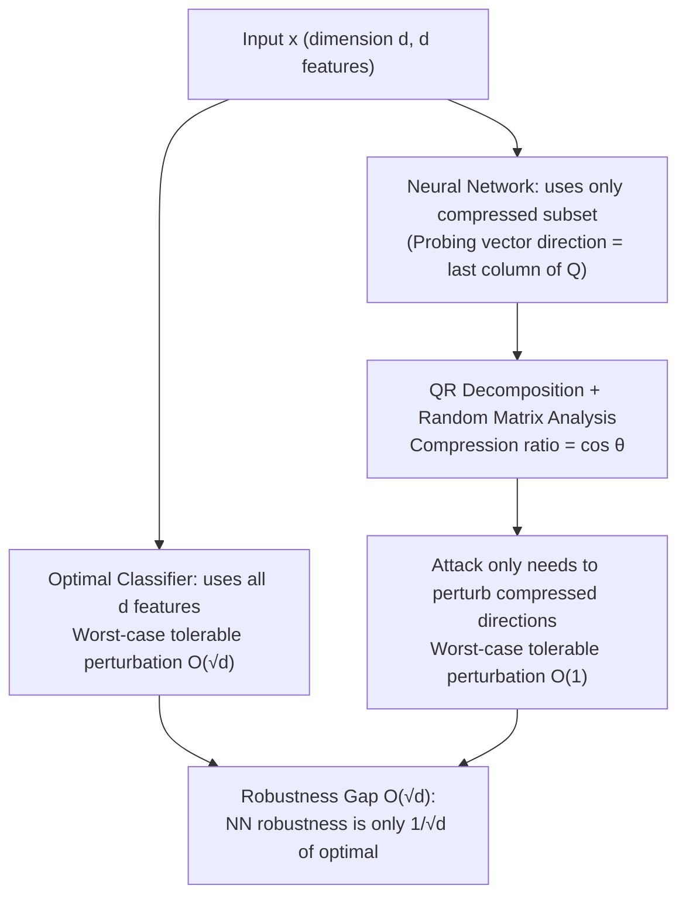

# Feature Compression is the Root Cause of Adversarial Fragility in Neural Networks

**Conference**: ICLR 2026  
**OpenReview**: [https://openreview.net/forum?id=UYM3yaiUX9](https://openreview.net/forum?id=UYM3yaiUX9)  
**Code**: Not available  
**Area**: Learning Theory / Adversarial Robustness Theory  
**Keywords**: Adversarial Robustness, Feature Compression, Random Matrix Theory, Optimal Classifier, QR Decomposition  

## TL;DR
This paper provides a "feature compression" explanation for adversarial fragility using random matrix theory: neural networks classify using only a compressed subset of features, resulting in a worst-case robustness that may be only $1/\sqrt{d}$ of the optimal classifier's, validated on ImageNet.

## Background & Motivation
- **Background**: While deep networks achieve high classification accuracy, they are almost universally fragile under adversarial perturbations—small, imperceptible noise can flip labels. Various competing explanations have been proposed: quasi-linearity/gradient magnitude of decision boundaries, high curvature, proximity of boundaries to the data manifold, and the existence of "highly predictive but non-robust features."
- **Limitations of Prior Work**: No consensus has been reached, and defenses designed based on these theories have "all been broken without exception." More embarrassingly, recent work shows that even when trained on "robust features," networks remain fragile under stronger attacks, suggesting fragility does not stem solely from the data.
- **Key Challenge**: A popular explanation attributes fragility to the discrepancy between "average-case performance vs. worst-case performance." However, the authors argue this gap exists for almost all classifiers (including optimal ones) and is not unique to neural networks. Furthermore, classifiers exist that maintain excellent average performance while possessing worst-case performance far superior to neural networks. Thus, fragility must have a deeper cause.
- **Goal**: **For the first time**, directly compare the worst-case performance of neural network classifiers with that of the **optimal classifier**, quantify the $O(\sqrt{d})$ gap between them, and provide an analytical cause.
- **Core Idea (Feature Compression)**: Neural networks tend to use only a **compressed subset** of the total $d$ features when making decisions. Attackers, therefore, only need to perturb this small set of utilized feature directions to flip the output—**this is the root cause of adversarial fragility.** This conclusion aligns with the earlier information-theoretic "feature compression hypothesis" but provides a proof based on specific network architectures and classification samples using matrix theory.

## Method

### Overall Architecture
The paper builds a progressive theoretical framework from linear to non-linear networks and from local to global analysis. The core tool is the random matrix analysis of the QR decomposition (applied to products of Gaussian matrices): by projecting the network's "probing vector" onto the "good feature" directions favored by the optimal classifier, the cosine of the angle $\cos\theta$ serves as the "compression ratio," which directly determines the perturbation required for an attack relative to the optimal classifier.

### Key Designs

**1. Matrix-theoretic proof for linear networks: The compression direction is the attack direction.** Taking a two-layer network with $d$ classes and one standard Gaussian sample $x_i\in\mathbb{R}^d$ per class as an example (Theorem 1). By performing QR decomposition $X=Q_2R$ on the data matrix $X=[x_1,\dots,x_d]$, and assuming the "one-hot output for each training point" condition, the second-layer weights are solved as $H_2=R^{-1}$. Although the input $x_d=\sum_i (Q_2)_{:,i}R_{i,d}$ is a linear combination of $d$ feature directions in $Q_2$, the network's decision **depends only on the final compressed direction $(Q_2)_{:,d}$**. The authors explicitly construct a perturbation $e=Q_2 b$ acting only on this subspace, with a magnitude determined by the last two rows of $R$: $\|e\|_2\le |R_{d-1,d-1}|+|R_{d-1,d}|+|R_{d,d}|$. Per random matrix theory, $R_{d,d}$ is the absolute value of a standard Gaussian, and $R_{d-1,d-1}$ is the square root of a Chi-squared distribution with 2 degrees of freedom—both are $O(1)$ and independent of $d$. Thus, an attack with $\|e\|_2\le C$ (constant) can flip the label, whereas an optimal (minimum distance) classifier requires $\Omega(\sqrt{d})$, leading to the $O(\sqrt{d})$ gap.

**2. Generalization to multi-layer, massive data points, and general weights.** To move beyond single samples, the authors extend the conclusion in three dimensions. First (Theorem 3), they extend to multiple layers using a linear generative model $x_i=G_t\cdots G_1 v_i$, proving a new lemma (Lemma 7): **a distributional characterization of the QR decomposition of products of Gaussian matrices**, a standalone technical contribution. Second (Theorem 4), relaxing the "one-hot" condition, they define probing vectors $\text{probe}_i=(w_i^T H_{l-1}\cdots H_1)^T$ for general weights, proving that flipping a label from $i$ to $j$ only requires perturbation within the 2D subspace spanned by the two probing vectors, with magnitude $\le\sqrt{a_{i1}^2+a_{i2}^2}$—reconfirming that only compressed features need to be attacked. Third (Theorem 5), they handle complex data with **$2^{d-1}$ points per class (exponential in input dimension)** where labels are determined by the sign of the last element of $z_i$ ($x_i=Az_i$), proving fragility via $O(1)$ perturbations along the last column of $Q$ in $A$'s QR decomposition. This setting is strictly stronger than prior works like Vardi et al. (2022).

**3. Global algebraic explanation of "Compression ratio $\cos\theta$" in non-linear networks.** Theorem 6 extends the analysis to general non-linear multi-layers: near input $x$, misclassifying $x+\epsilon x_1$ as $x+\epsilon x_2$ requires a perturbation $\|e\|_2\le\epsilon\|P_{\nabla f_1,\nabla f_2}(x_1-x_2)\|$, projecting the difference onto the subspace spanned by output gradients. Evaluation in Section 5 provides a global algebraic explanation: along a path $x_2\to x_1$, the total change in logit difference $D=\int_0^{\|x_1-x_2\|}\|\nabla g\|\cos(\theta_\gamma)\,d\gamma$ (containing the compression factor $\cos\theta_\gamma$, which is small or negative) equals the attacker's path integral along the gradient $D=\int_0^{z}-\|\nabla g\|\,d\gamma$. This equality implies that the optimal classifier's distance $\|x_1-x_2\|$ must be much larger than the attacker's path $z$—**the compression factor $\cos\theta_\gamma$ is precisely what widens the gap and is a necessary condition for fragility.**

## Key Experimental Results

Experiments verify theoretical predictions rather than maximizing accuracy. The core approach: calculate the "theoretical compression ratio $\phi$" via QR decomposition and measure the trained network's "empirical compression ratio $|\cos\theta_1|$."

### Main Results (Linear Network, $d=12$)
A single-hidden-layer (3000 neurons) linear network was trained on the data model from Theorem 5. $|\cos\theta_1|$ represents the ratio of the perturbation required to flip the label relative to the $\ell_2$ norm of the last column of $A$, and $\phi$ is the theoretically predicted ratio.

| Metric | Meaning | Representative Result (Exp.9) |
| --- | --- | --- |
| $\phi$ | Theoretical compression ratio ($R_{d,d} / \|A_{:,d}\|$) | 0.1480 |
| $\|\cos\theta_1\|$ | Empirical adversarial robustness (actual perturbation ratio) | 0.1665 |
| $\|\cos\theta_2\|$ | Alignment of probe vector with last row of $A^{-1}$ (should be ≈1) | 0.9942 |

Theory fits empirical data closely: small $\phi$ leads to small required perturbations, verifying that "higher compression implies higher fragility."

### Statistical Experiment (Average of 18 valid runs)

| Metric | Value |
| --- | --- |
| Average $\|\cos\theta_1\|$ (Empirical robustness) | 0.3645 |
| Average $\|\phi\|$ (Theoretical prediction) | 0.3280 |
| Average $\big\|\,\|\cos\theta_1\|-\|\phi\|\,\big\|$ (Error) | 0.0367 |

The error is only 0.037, and the $\phi$ vs. $\cos\theta_1$ curves consistently overlap across dimensions $d=7\sim 17$ (Figure 1).

### ImageNet Non-linear Network (Inception-ResNet-v2)
For "English springer" and "Afghan hound" classes, compression rates $\cos\theta_\alpha$ were measured along interpolation paths (universally small, mean $\approx -0.002\sim -0.035$, indicating strong compression). Theoretical predictions $|M/(0.5L)|$ were compared with actual minimal attack perturbations $Q/(0.5L)$.

| Exp. | $\|M/(0.5L)\|$ (Theory) | $Q/(0.5L)$ (Actual) |
| --- | --- | --- |
| 1 | 0.0765 | 0.0722 |
| 2 | 0.0349 | 0.0828 |
| 3 | 0.0387 | 0.0607 |
| 4 | 0.0806 | 0.0679 |

The magnitudes match, validating that feature compression causes adversarial fragility in real, large-scale networks.

### Key Findings
- The optimal classifier tolerates $O(\sqrt{d})$ worst-case perturbations, while neural networks tolerate only $O(1)$; the $O(\sqrt{d})$ gap matches theory.
- The average-worst gap exists even for the optimal classifier; thus, **fragility stems from feature compression, not the average-worst gap itself.**
- The theoretical compression ratio $\phi$ can predict the adversarial robustness of a network before training.

## Highlights & Insights
- **Perspective shift as a key contribution**: Unlike prior work exploring phenomena or comparing NNs, this is the first to benchmark NN worst-case performance against the **optimal classifier**, quantifying "fragility" as a clean $1/\sqrt{d}$ gap.
- **Insights on "non-robust features"**: The authors argue that what Ilyas et al. (2019) called "non-robust features" might not be inherently non-robust; they may be the residual parts of robust features after compression. Therefore, robust models **should not wash away these features** but rather require them.
- **Guidance for training**: Since compression is the root cause, the conclusion suggests a concrete path for robustification: regularizing feature compression during training.
- **Theory predicting real networks**: The fact that $\phi$ from QR decomposition aligns with ImageNet attack magnitudes indicates the abstract analysis captures the real mechanism.

## Limitations & Future Work
- The theory is primarily built on structured data (Gaussian, linear generative models) and strong assumptions (one-hot output condition, stable gradient magnitudes). Its extension to unstructured data like MNIST/ImageNet relies on numerical experiments.
- Most theorems target linear networks; non-linear conclusions use local first-order approximations + global algebraic arguments, lacking end-to-end rigorous non-linear bounds.
- The paper diagnoses "feature compression as the root cause" but does not yet implement "compression regularization" as a complete defense method with empirical proof.
- Future work is needed to extend the analysis to more general data distributions, architectures, and training schemes (e.g., training regimes in Frei et al. 2023).

## Related Work & Insights
- **Feature Compression Hypothesis (Xie et al. 2019)**: This paper serves as a matrix-theoretic, architecture-specific "hard proof" of that hypothesis, arriving at consistent conclusions through different analytical levels.
- **Two-layer ReLU Fragility (Vardi et al. 2022 / Frei et al. 2023)**: This work is more general in terms of data points (exponential vs. sparse orthogonal sets), benchmarking (vs. optimal classifier rather than another NN), and provides tighter $\tilde O(1)$ perturbation bounds.
- **Non-robust Features (Ilyas et al. 2019) and Gradient Size (Simon-Gabriel et al. 2019)**: This paper attributes fragility to the **angle** of the gradient (compression) rather than its size or the data features themselves, offering a different causal narrative.
- **Insight**: Measuring the alignment between the "effective feature subspace utilized by the model" and the "complete feature space required by the task" may be more fundamental to robustness than adversarial training; $\cos\theta$ could serve as a robustness metric estimable without attacks.

## Rating
- **Novelty**: ⭐⭐⭐⭐ First to benchmark NN against optimal classifiers with an $O(\sqrt{d})$ gap; the matrix-theoretic characterization of "compression = root cause" is highly original.
- **Experimental Thoroughness**: ⭐⭐⭐ Theoretical-empirical alignment for linear networks is solid, and ImageNet results capture the mechanism, though the sample size is small and systematic comparison with mainstream defenses is missing.
- **Writing Quality**: ⭐⭐⭐⭐ Theorems progress logically, and the refutation of the average-worst gap is compelling. While technical density is high, the notation is consistent.
- **Value**: ⭐⭐⭐⭐ Provides a quantifiable, verifiable, and actionable unified explanation for adversarial fragility, significantly advancing robust learning theory.

<!-- RELATED:START -->

## Related Papers

- [\[ICLR 2026\] Scaling Laws and Spectra of Shallow Neural Networks in the Feature Learning Regime](scaling_laws_and_spectra_of_shallow_neural_networks_in_the_feature_learning_regi.md)
- [\[ICLR 2026\] Transfer Learning in Infinite Width Feature Learning Networks](transfer_learning_in_infinite_width_feature_learning_networks.md)
- [\[ICLR 2026\] FACT: a first-principles alternative to the Neural Feature Ansatz for how networks learn representations](fact_a_first-principles_alternative_to_the_neural_feature_ansatz_for_how_network.md)
- [\[ICLR 2026\] From Neural Networks to Logical Theories: The Correspondence between Fibring Modal Logics and Fibring Neural Networks](from_neural_networks_to_logical_theories_the_correspondence_between_fibring_moda.md)
- [\[ICLR 2026\] Overparametrization bends the landscape: BBP transitions at initialization in simple Neural Networks](overparametrization_bends_the_landscape_bbp_transitions_at_initialization_in_sim.md)

<!-- RELATED:END -->
