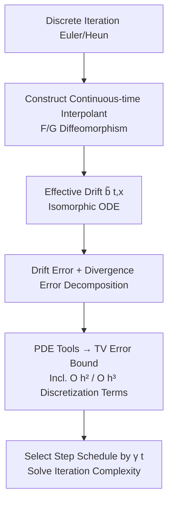

# Finite-Time Convergence Analysis of ODE-based Generative Models for Stochastic Interpolants

**Conference**: ICLR 2026  
**OpenReview**: [https://openreview.net/forum?id=VCStVrq0BZ](https://openreview.net/forum?id=VCStVrq0BZ)  
**Code**: To be confirmed  
**Area**: Learning Theory / Convergence Analysis of Generative Sampling  
**Keywords**: Stochastic interpolants, ODE sampling, finite-time convergence, iteration complexity, Heun method, diffusion model theory  

## TL;DR
This paper presents the first finite-time convergence analysis for numerical ODE solvers within the stochastic interpolant framework. It establishes discrete-time TV error bounds and iteration complexities ($O(\varepsilon^{-1}d^2)$ and $O(\varepsilon^{-1/2}d^{3/2})$) for first-order forward Euler and second-order Heun methods. When reduced to diffusion models, the results surpass existing literature in terms of smoothness assumptions and dimensionality dependence.

## Background & Motivation
**Background**: Stochastic interpolants (Albergo & Vanden-Eijnden, 2023) unify flow matching and score-based diffusion by constructing interpolation paths between two arbitrary distributions $\rho_0, \rho_1$ and estimating the average velocity field. This framework enables data-to-data generative transformations via ODEs or SDEs and serves as a major framework for contemporary generative modeling.

**Limitations of Prior Work**: Progress in theoretical convergence analysis has been uneven. SDE versions already have error bounds for continuous-time (Albergo et al., 2023) and discrete-time (Liu et al., 2025) settings. However, analysis for the deterministic ODE counterpart—the probability-flow ODE actually used in many practical applications—has remained restricted to **continuous-time**, lacking characterization of actual numerical discretization.

**Key Challenge**: Directly applying ODE analysis from diffusion models is problematic. First, stochastic interpolants represent general data-to-data transforms where the process is **non-Markovian**, making specialized Gaussian-to-data techniques inapplicable. Second, migrating the finite-time analysis of SDEs (Liu et al., 2025) to ODEs encounters fundamental difficulties at the singular behavior of the degradation process, as the absence of the SDE diffusion term prevents "smoothing" of errors.

**Goal**: To answer "how many iterations a numerical ODE solver requires to guarantee generative accuracy for stochastic interpolants," specifically providing discrete-time TV error bounds, iteration complexity, and optimal step size schedules.

**Core Idea**: **[Continuous-time Interpolation Reconstruction]** The discrete iterations are reinterpreted as a continuous-time ODE isomorphic to the true process. This allows the invocation of continuous-time PDE analysis tools to quantify discretization errors by comparing the "induced drift" and "divergence."

## Method

### Overall Architecture
The paper handles both numerical solvers using a unified analysis paradigm: first, the discrete iterations $\{\hat X_{t_k}\}$ are **rewritten as a piecewise-defined continuous-time process** $\hat X_t$ that satisfies an ODE of the form $\mathrm{d}\hat X_t=\tilde b(t,\hat X_t)\mathrm{d}t$ (isomorphic to the true process $\mathrm{d}X_t=b(t,X_t)\mathrm{d}t$). Using PDE tools, the TV distance between the target and approximate distributions is reduced to the gap between the "effective drift $\tilde b$ and true drift $b$" and their divergences. Finally, specialized step size schedules are optimized for specific interpolants $\gamma(t)$ to derive the iteration complexity.

### Key Designs

**1. Continuous-time Interpolation Reconstruction: Converting discrete iterations back to ODEs.** This is the technical pivot of the paper. For forward Euler, the update on the interval $[t_k, t_{k+1}]$ is written as a mapping $\hat X_t=F_{t_k\to t}(\hat X_{t_k}):=\hat X_{t_k}+(t-t_k)\hat b(t_k,\hat X_{t_k})$. For small step sizes, $F_{t_k\to t}$ is a diffeomorphism on $\mathbb{R}^d$, allowing the definition of an effective drift $\tilde b(t,x):=\hat b(t_k,F^{-1}_{t_k\to t}(x))$, yielding $\mathrm{d}\hat X_t=\tilde b(t,\hat X_t)\mathrm{d}t$. Consequently, the discrete estimation is expressed in the same form as the true ODE, enabling direct comparison in a continuous-time framework and bypassing the fundamental alignment obstacles of "discrete vs. continuous."

**2. Sequential decomposition of drift and divergence errors.** With the isomorphic ODE, controlling the TV distance depends on proving $\tilde b\approx b$ and $\nabla\!\cdot\tilde b\approx\nabla\!\cdot b$. The authors utilize sequential approximations $\tilde b(t,X_t)\approx\hat b(t_k,X_{t_k})\approx b(t,X_t)$. For the divergence term, they use $\nabla\!\cdot\tilde b(t,X_t)=\mathrm{tr}[\nabla\hat b(t_k,F^{-1}_{t_k\to t}(X_t))\cdot\nabla F_{t_k\to t}(\cdot)^{-1}]\approx\mathrm{tr}[\nabla\hat b(t_k,X_{t_k})\cdot I_d]\approx\nabla\!\cdot b(t,X_t)$. Combined with a PDE lemma (Lemma D.2) that bounds TV distance by drift/divergence errors, the total error bound in Theorem 4.5 is obtained. The discretization term is $\sum_k h_k^2(\bar\gamma_k^{-4}d^2+\bar\gamma_k^{-2}M^2)$, where $O(h_k^2)$ per step is consistent with known results for first-order samplers in diffusion models.

**3. Linear velocity interpolation and high-order acceleration for Heun.** For the second-order Heun update, the authors construct a more refined continuous interpolant $\hat X_t=G_{t_k\to t}(\hat X_{t_k})$, where the velocity $\frac{\mathrm{d}}{\mathrm{d}t}\hat X_t=\frac{t_{k+1}-t}{t_{k+1}-t_k}\hat b(t_k,\hat X_{t_k})+\frac{t-t_k}{t_{k+1}-t_k}\hat b(t_{k+1},F_{t_k\to t_{k+1}}(\hat X_{t_k}))$ performs a **linear interpolation** between two drift estimates. This construction compresses the per-step approximation error from $O(h_k)$ in Euler to $O(h_k^2)$, elevating the discretization term to $\sum_k h_k^3(\bar\gamma_k^{-6}d^3+\bar\gamma_k^{-4}M^3)$ (Theorem 5.4). Unlike methods requiring the bound of the estimator over the entire continuous interval, **this only requires accessing $\hat b$ at discrete time steps**, relaxing the requirements on the estimator.

**4. Exponentially decaying step size schedule adapted to $\gamma(t)$.** Since the discretization error is proportional to $h_k^2\bar\gamma_k^{-4}$ (Euler) or $h_k^3\bar\gamma_k^{-6}$ (Heun), balancing the error naturally requires $h_k\propto\bar\gamma_k^2$. For the Brownian-bridge type $\gamma(t)=\sqrt{at(1-t)}$, the authors utilize a midpoint $t_m=0.5$ as a boundary and construct exponential decay towards both sides: $t_k=\tfrac12(1-h)^{m-k}$ ($k\le m$) and $t_k=1-\tfrac12(1-h)^{k-m}$ ($k>m$). For interpolants corresponding to VP diffusion, $t_k=1-(1-h)^k$ is used. This schedule ensures $h_k\bar\gamma_k^{-2}=O(h)$. Coupled with early stopping (simulating on a sub-interval $[t_0,t_N]\subset(0,1)$ to avoid singularities at $\gamma(0)=\gamma(1)=0$), the final complexities are $O(\varepsilon^{-1}d^2\log^2(1/\delta))$ for Euler and $O(\varepsilon^{-1/2}d^{3/2}\log^{3/2}(1/\delta))$ for Heun.

## Key Experimental Results

### Main Results: Convergence Rate Verification

| Setting | Solver | Theoretical Discretization Error Order | Experimental Observation |
|------|--------|------------------|----------|
| 2D Density Transform (3 task pairs) | Forward Euler | $O(h)$ | TV vs $h$ linear, matches |
| 2D Density Transform | Heun | $O(h^2)$ | TV vs $h^2$ linear, matches |
| $d$-dim Gaussian mixture (Analytic $b$, training-free) | Euler / Heun | $O(h)$ / $O(h^2)$ | Step size dependence matches |

### Ablation Study: Theory vs. Experiment (Dimensionality)

| Solver | Theoretical Dim Dependence | Experimental Observation |
|--------|--------------|----------|
| Euler | $O(hd^2)$ | Approximately **linear** growth |
| Heun | $O(h^2d^3)$ | Approximately **linear** growth |

### Key Findings
- Step size dependence ($O(h)$ / $O(h^2)$) was empirically verified on both 2D and high-dimensional Gaussian mixtures.
- A **theory-experiment gap** exists in dimensionality dependence: the measured growth in dimensionality is nearly linear, which is significantly better than the theoretical $d^2/d^3$. The authors explicitly state that the current bounds can be tightened in future work.
- The applicability of both methods was validated on real image generation tasks (see Appendix C).

## Highlights & Insights
- **Fills the gap in discrete-time ODE analysis**: This is the first work to provide finite-time convergence guarantees for stochastic interpolant ODE solvers, covering all interpolation processes satisfying mild regularity (including the famous VP diffusion).
- **Surpasses SOTA upon reduction to diffusion models**: The dimensionality dependence of $\tilde O(\varepsilon^{-1/2}d^{3/2})$ for the Heun method is lower than the $\tilde O(\varepsilon^{-1/2}d^2)$ in Li et al. (2025a). Compared to Huang et al. (2025), which also achieves $\tilde O(\varepsilon^{-1/2}d^{3/2})$, this work only requires the second derivative of $\hat b$ with respect to $x$ to be bounded, rather than requiring the third derivative of $\hat s$ with respect to $t,x$ to be uniformly bounded (a key relaxation since the time derivative of the true drift may be unbounded).
- **The "isomorphic ODE rewriting" paradigm is transferable**: The strategy of continuous interpolation reconstruction plus drift/divergence error decomposition provides a general template for analyzing higher-order solvers or more general interpolants.

## Limitations & Future Work
- **Loose dimensionality dependence**: The theory ($d^2$ for Euler, $d^3$ for Heun) shows a significant gap compared to the near-linear growth observed in experiments.
- **Reliance on strong smoothness assumptions**: Requires $\hat b$ and its derivatives to be bounded (Assumption 4.4). For Heun, even higher-order moments and time derivatives are required; real neural network estimators may not strictly satisfy these.
- **Early stopping approximation**: The analysis is performed on a sub-interval $[t_0,t_N]\subset(0,1)$, meaning the endpoint is not exactly $\rho_1$. Initial/terminal errors are assumed to be negligible terms.
- **Theoretically oriented experiments**: Image generation experiments mainly serve to corroborate error trends rather than pursuing SOTA generation quality.

## Related Work & Insights
- **Stochastic Interpolants**: Albergo & Vanden-Eijnden (2023) proposed the framework and provided continuous-time Wasserstein bounds; Benton et al. (2024b) tightened these with time-varying Lipschitz constants; Liu et al. (2025) provided the first discrete-time finite-time bound for SDEs—this paper serves as its ODE counterpart.
- **ODE Diffusion Model Analysis**: Chen et al. (2023b) provided the first polynomial convergence bound for DDIM-type samplers; Li et al. (2024b,c) controlled TV via discrete-time density evolution; Huang et al. (2025) and Li et al. (2025b) bounded TV using PDE techniques. This paper aligns with and improves upon this line of work when degenerated to diffusion.
- **Insights**: Rewriting discrete numerical iterations as continuous ODEs isomorphic to the true process is a powerful strategy for sampler convergence analysis. For researchers in generative model theory, the drift/divergence error decomposition and step schedule optimization in this paper provide a reusable toolbox.

## Rating
- **Novelty**: ⭐⭐⭐⭐ First finite-time analysis for stochastic interpolant ODE solvers; continuous interpolation reconstruction is a substantive technical innovation.
- **Experimental Thoroughness**: ⭐⭐⭐ Verified step size dependence on 2D and high-dimensional Gaussian mixtures; however, the gap between theoretical and experimental dimensionality dependence suggests the experiments serve mainly as theoretical validation.
- **Writing Quality**: ⭐⭐⭐⭐ Assumptions, theorems, proof sketches, and complexity derivations are clearly structured. Comparisons with existing work regarding smoothness and dimensionality are well-documented.
- **Value**: ⭐⭐⭐⭐ Provides discrete-time theoretical guarantees for widely used ODE samplers and offers a transferable analysis paradigm with optimal step size scheduling, of clear value to the generative model theory community.

<!-- RELATED:START -->

## Related Papers

- [\[ICLR 2026\] Polynomial Convergence of Riemannian Diffusion Models](polynomial_convergence_of_riemannian_diffusion_models.md)
- [\[NeurIPS 2025\] Finite-Time Analysis of Stochastic Nonconvex Nonsmooth Optimization on the Riemannian Manifolds](../../NeurIPS2025/learning_theory/finite-time_analysis_of_stochastic_nonconvex_nonsmooth_optimization_on_the_riema.md)
- [\[ICLR 2026\] DAK-UCB: Diversity-Aware Prompt Routing for LLMs and Generative Models](dak-ucb_diversity-aware_prompt_routing_for_llms_and_generative_models.md)
- [\[ICLR 2026\] A Sharp KL Convergence Analysis for Diffusion Models under Minimal Assumptions](a_sharp_kl_convergence_analysis_for_diffusion_models_under_minimal_assumptions.md)
- [\[ICLR 2026\] Learning-Augmented Moment Estimation on Time-Decay Models](learning-augmented_moment_estimation_on_time-decay_models.md)

<!-- RELATED:END -->
