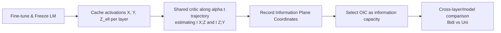

# FlowNIB: An Information Bottleneck Analysis of Bidirectional vs. Unidirectional Language Models

**Conference**: ICLR 2026  
**OpenReview**: [https://openreview.net/forum?id=fF6n8gDCZH](https://openreview.net/forum?id=fF6n8gDCZH)  
**Code**: [https://github.com/Kowsher/BidiVsUniLM](https://github.com/Kowsher/BidiVsUniLM)  
**Area**: Learning Theory / Information Bottleneck / Language Model Representation Analysis  
**Keywords**: Information Bottleneck, Mutual Information, MINE, Bidirectional vs. Unidirectional, Representation Quality, Effective Dimension  

## TL;DR
This paper explains "why bidirectional language models understand context better than unidirectional models" through the lens of the Information Bottleneck—bidirectional layers retain more mutual information on both the input and label sides. It proposes FlowNIB, a lightweight posterior framework that aligns two mutual information estimations onto a single optimization trajectory, making layer-wise and cross-model mutual information comparable to empirically validate this theoretical judgment.

## Background & Motivation
- **Background**: Bidirectional models like BERT have long outperformed unidirectional models (GPT-style) of similar scale on NLU tasks like GLUE. This is an empirically verified fact, but a clear theoretical explanation is missing—while it is known that "bidirectional is better," it is unclear "where it is better and why."
- **Limitations of Prior Work**: Information Bottleneck (IB) theory is well-suited for analyzing representation quality, but applying it to Large Language Models (LLMs) faces two hurdles. First, the representation dimensions are extremely high, making Mutual Information (MI) estimation expensive. Second, even when using neural estimators like MINE to separately estimate $I(X;Z_\ell)$ and $I(Z_\ell;Y)$, two independently trained critics differ in capacity, learning rate, and training steps, resulting in MI values on different scales. This makes **direct comparisons across layers and models impossible**. Prior work applying IB to LMs has mostly remained at the level of descriptive interpretation or single-sided MI estimation.
- **Key Challenge**: To verify the proposition that "bidirectional layers carry more task-relevant information," one must simultaneously and comparably measure how much information a representation retains from the input and how much it transmits to the target. Existing MI tools naturally fail to provide comparable bilateral values.
- **Goal**: First, establish theoretical criteria $I(X;Z^{\leftrightarrow}_\ell)\ge I(X;Z^{\rightarrow}_\ell)$ and $I(Z^{\leftrightarrow}_\ell;Y)\ge I(Z^{\rightarrow}_\ell;Y)$ based on IB principles, then build a comparable MI estimation framework for empirical testing.
- **Core Idea**: **Bind the MI estimations of the input and target sides to the same critic and optimization history using an "information flow trajectory" with time-varying weights $\alpha(t)$**. This makes them naturally comparable and allows for the selection of an "Optimal Information Coordinate" (OIC) on the trajectory as a relative measure of a layer's information capacity.

## Method

### Overall Architecture
The method consists of two levels: the theoretical level proves that bidirectional representations are information-theoretic upper bounds for unidirectional ones—since $Z^{\leftrightarrow}_\ell=(Z^{\rightarrow}_\ell, Z^{\leftarrow}_\ell)$ "sees future tokens" compared to purely forward representations, the monotonicity of conditional entropy $H(X\mid Z^{\leftrightarrow}_\ell)\le H(X\mid Z^{\rightarrow}_\ell)$ directly leads to higher $I(X;Z)$. The empirical level is FlowNIB: first, fine-tune the LM on a dataset and freeze it, cache activations per layer, then use a shared critic to estimate MI on both sides along a single-objective trajectory scheduled by $\alpha(t)$. Finally, the OIC is used to compare different layers and models.

### Key Designs

**1. Information Bottleneck Upper Bound Theorem: Translating "Bidirectional is Better" into Inequalities.** The theoretical pivot is to write the bidirectional representation as a concatenation of forward and backward representations $Z^{\leftrightarrow}_\ell=(Z^{\rightarrow}_\ell,Z^{\leftarrow}_\ell)$, such that it contains strictly more context than the purely forward $Z^{\rightarrow}_\ell$. Based on the definition of mutual information $I(X;Z)=H(X)-H(X\mid Z)$ and the monotonicity of conditional entropy (which does not increase with more information), Theorem 2.1 is derived: $I(X;Z^{\leftrightarrow}_\ell)\ge I(X;Z^{\rightarrow}_\ell)$ and $I(Z^{\leftrightarrow}_\ell;Y)\ge I(Z^{\rightarrow}_\ell;Y)$, with strict inequality under mild conditions where future context reduces input uncertainty or provides predictive signals. This theorem elevates an empirical observation into a testable proposition.

**2. Effective Dimension as a Structural Supplement to MI.** Mutual information only answers "how much information is retained" without characterizing the internal structure. The authors introduce the generalized effective dimension $d_{\text{eff}}(Z_\ell;M)=\exp(M(p))$, where $p_i=\lambda_i/\sum_j\lambda_j$ are normalized eigenvalues of the covariance spectrum, and $M$ is a spectral functional (defaulting to the $\ell_2$ participation ratio $d_{\text{eff}}=(\sum_i\lambda_i)^2/\sum_i\lambda_i^2$, which intuitively measures "how many feature directions are active"). Lemma 2.3 proves that as long as $\mathrm{Cov}(Z^{\leftarrow}_\ell,Z^{\rightarrow}_\ell)$ is non-singular, the effective dimension of bidirectional representations is no lower than unidirectional ones, with equality only if the backward representation is conditionally redundant given the forward. This shows that bidirectional representations are not only higher in MI but also "spread out" more in the latent space.

**3. FlowNIB’s Comparability Trick—Time-Varying Weights on a Single Trajectory.** This is the core engineering contribution. FlowNIB does not train two critics separately; instead, it uses a shared critic minimizing a single loss $L_\ell(t)=-[\alpha(t)\,I(X;Z_\ell)+(1-\alpha(t))\,I(Z_\ell;Y)]$, where $\alpha(t):\{0,\dots,T\}\to[0,1]$ is a monotonically non-increasing schedule (e.g., $\alpha(0)=1$, $\alpha(t{+}1)=\max\{0,\alpha(t)-\delta\}$ with $\delta \approx 0.001$). Early in training, $\alpha\approx1$, so the critic focuses on $I(X;Z_\ell)$; as $\alpha$ decays, the focus smoothly shifts to $I(Z_\ell;Y)$. Because both estimations **come from the same network, capacity, learning rate, and training history**, the difference between them reflects the true nature of the representation $Z_\ell$ rather than artifacts of independent optimization.

**4. Optimal Information Coordinate (OIC)—Compressing a Trajectory into a Comparable Point.** Each iteration $t$ produces a pair of coordinates $(I^{(t)}(X;Z_\ell), I^{(t)}(Z_\ell;Y))$, tracing a curve on the information plane. The authors select a point as OIC using a trade-off weight $\gamma$ via $t^*(\gamma)\in\arg\max_t\,\gamma x_t+(1-\gamma)y_t$. A default value $\gamma^\star=R_y/(R_x+R_y)$ ($R_x, R_y$ being the ranges of the trajectories) is used to ensure scale balance. OIC summarizes the entire flow trajectory into a single relative value representing "the layer's joint capacity to capture input and target information," allowing for comparisons across models—where Bidi OICs are significantly higher than Uni ones.

**5. Single-Token Prediction Representation Extraction (PredGen Simplified).** Instead of using average pooling over final hidden states, the authors simplify PredGen to leverage the models' native behaviors: Masked Token Prediction for Bidi and Next-Token Generation for Uni. This is simplified to **single-token generation/mask prediction** at a specific position, passing the final hidden state through a lightweight MLP. This preserves the advantage that "native prediction retains more input MI than pooling" while reducing computational overhead.

## Key Experimental Results

### Main Results (Table 1, Avg. Acc.% and MAE/MSE)

| Model | Type | Extraction | Acc.↑ | MAE / MSE↓ |
|---|---|---|---|---|
| DeBERTa-v3-Base (184M) | Bidi | Masking | **81.52** | 0.197 / 0.298 |
| DeBERTa-v3-Large (435M) | Bidi | Masking | **84.73** | 0.184 / 0.282 |
| RoBERTa-Large (355M) | Bidi | Masking | 83.95 | 0.195 / 0.297 |
| ModernBERT-Large (395M) | Bidi | Masking | 83.84 | 0.197 / 0.300 |
| GPT-2 Large (762M) | Uni | Generation | 72.07 | 0.279 / 0.354 |
| SmolLM2-360M | Uni | Generation | 74.40 | 0.207 / 0.310 |
| MobileLLM-600M | Uni | Generation | 76.55 | 0.193 / 0.302 |

Key Comparison: The 184M DeBERTa-v3-Base (81.52%) outperforms the 762M GPT-2 Large (72.07%) and 600M MobileLLM-600M (76.55%) by several points—**smaller bidirectional models outperform larger unidirectional ones**, consistent with the theoretical judgment.

### Ablation Study (Inside Table 1)

| Model | Pooling Acc. | Native Pred Acc. | Gain |
|---|---|---|---|
| DeBERTa-v3-Base | 77.90 | 81.52 (Masking) | +3.62 |
| RoBERTa-Base | 76.53 | 79.95 (Masking) | +3.42 |
| MobileLLM-350M | 71.89 | 73.73 (Generation) | +1.84 |
| SmolLM2-135M | 71.37 | 72.82 (Generation) | +1.45 |

Regardless of directionality, using native single-token masking/generation prediction is consistently better than average pooling, validating the effectiveness of the simplified PredGen.

### Key Findings
- **MI Correlates with Performance**: Models/layers with higher MI on both the input $X$ and target $Y$ sides exhibit higher downstream accuracy.
- **Richer Spectra**: Bidirectional representations consistently show higher effective dimensions per layer; the trend of $d_{\text{eff}}$ with depth also relates to label space size.
- **Efficiency Counter-Intuition**: Although Bidi Transformers have theoretically more expensive self-attention per layer, DeBERTa-v3-Base trains faster than many Uni counterparts (e.g., GPT-2 Medium/Large), being **both faster to train and more accurate**.
- **Three Questions Answered**: Bidirectional models retain more useful info, higher MI leads to better context modeling, and single-token prediction outperforms traditional pooling.

## Highlights & Insights
- Grounded a widely observed empirical phenomenon (Bidi > Uni) in a provable and measurable information-theoretic framework.
- The use of "shared critic + time-varying weights" in FlowNIB is a clever engineering solution to the long-standing problem of incomparable neural MI estimations at low cost.
- Information plane visualizations (layer-wise OIC lines) make the higher information capacity of bidirectional layers immediately evident and intuitive.

## Limitations & Future Work
- FlowNIB provides neural lower bounds; these are **relative** rather than absolute MI values and depend on critic expressivity.
- Experiments are limited by the scarcity of large Bidi LMs, with comparisons capped at $\le 600M$ parameters.
- The theoretical upper bound assumes "deterministic fusion," which may not fully extend to complex fusion methods or generative bidirectional architectures like diffusion LMs.

## Related Work & Insights
- **Information Bottleneck**: Extends from Tishby’s principles to "architectural choice" explanations.
- **MI Estimation**: Based on MINE (Belghazi 2018) with a focus on making bilateral estimations comparable.
- **Representation Extraction**: Simplifies PredGen (Kowsher 2025b) and uses RoCoFT for PEFT to ensure fair cross-architecture comparisons.
- **Insight**: This "comparable MI + OIC" diagnostic tool can be generalized to any scenario requiring layer-wise information capacity comparison, such as pruning, distillation, or neural architecture search.

## Rating
- **Novelty**: ⭐⭐⭐⭐
- **Experimental Thoroughness**: ⭐⭐⭐⭐
- **Writing Quality**: ⭐⭐⭐⭐
- **Value**: ⭐⭐⭐⭐

<!-- RELATED:START -->

## Related Papers

- [\[ICLR 2026\] Automata Learning and Identification of the Support of Language Models](automata_learning_and_identification_of_the_support_of_language_models.md)
- [\[ICLR 2026\] Diffusion Language Models are Provably Optimal Parallel Samplers](diffusion_language_models_are_provably_optimal_parallel_samplers.md)
- [\[ICLR 2026\] Unveiling the Basin-like Loss Landscape in Large Language Models](unveiling_the_basin-like_loss_landscape_in_large_language_models.md)
- [\[ICLR 2026\] Information Estimation with Discrete Diffusion](information_estimation_with_discrete_diffusion.md)
- [\[ICLR 2026\] Implicit Regularisation in Diffusion Models: An Algorithm-Dependent Generalisation Analysis](implicit_regularisation_in_diffusion_models_an_algorithm-dependent_generalisatio.md)

<!-- RELATED:END -->
