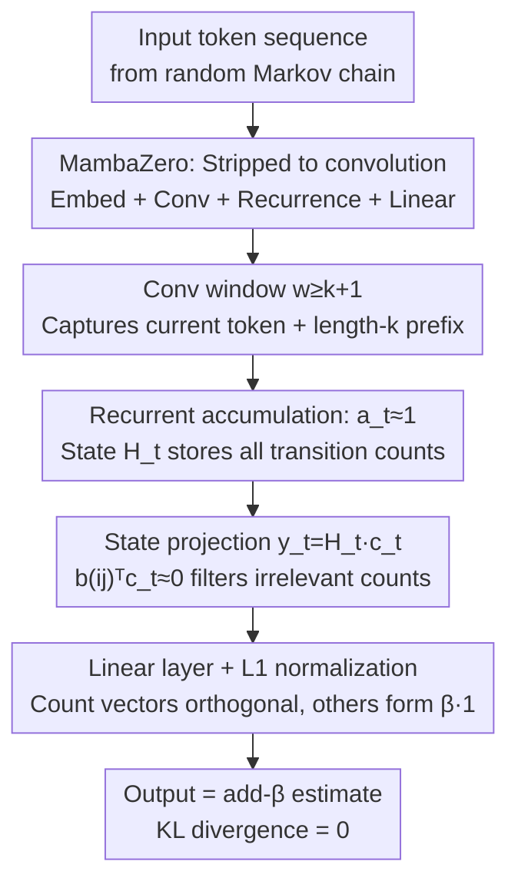

# From Markov to Laplace: How Mamba In-Context Learns Markov Chains

**Conference**: ICLR 2026  
**OpenReview**: [https://openreview.net/forum?id=kmK3WSCOCT](https://openreview.net/forum?id=kmK3WSCOCT)  
**Code**: https://github.com/Bond1995/Markov-Mamba  
**Area**: Learning Theory / State Space Models / In-Context Learning  
**Keywords**: Mamba, In-Context Learning, Markov Chains, Laplacian Smoothing, Convolution, Expressivity

## TL;DR
This work employs "in-context learning on random Markov chains" as a microscope to prove and empirically demonstrate that even a single-layer, single-head Mamba (Selective SSM) can learn an add-$\beta$ (Laplacian smoothing) count estimator that is both Bayes and minimax optimal. The decisive component is **convolution** rather than gating or nonlinearity. The authors further provide a constructive proof for exactly reproducing this estimator, alongside an $\Omega(2^k)$ lower bound for the hidden state dimension that any recurrent architecture cannot escape.

## Background & Motivation

**Background**: Transformers have driven the current AI wave, but their quadratic complexity with respect to sequence length and linearly growing KV-cache during inference have led to a continuous search for alternatives. Structured State Space Models (SSMs), particularly Mamba / Mamba-2 with selectivity, have achieved performance comparable to or better than Transformers on various language modeling tasks while significantly increasing inference throughput, making them a popular alternative architecture.

**Limitations of Prior Work**: While mechanistic understanding of "why Transformers work" is accumulating (e.g., how induction heads perform count-based prediction in-context), the **fundamental learning capability** of Mamba remains largely a black box. Existing research mostly consists of empirical comparisons of whether Mamba's ICL is stronger or weaker than Transformer's, yielding contradictory conclusions and lacking a formal theory to clarify "what Mamba is actually computing."

**Key Challenge**: Mamba's recurrent updates incorporate multiple components including selective decay $a_t$, input-dependent convolution, ReLU nonlinearity, and gating. It is unclear which component is responsible for in-context learning. Without a clean sandbox to decouple them, one can only guess based on intuition.

**Goal**: Systematically answer two sub-questions using a task that strictly defines the "optimal solution": (1) What estimator does single-layer Mamba learn in-context? (2) Which architectural component enables this learning? This work aims to provide an upper bound on expressivity (via exact implementation) and a lower bound (on the minimum required dimension).

**Key Insight**: Borrowing the **Markov-ICL framework** designed by Edelman et al. for Transformers, each training/test sequence is generated from a **randomly sampled** $k$-th order Markov chain (with transition kernels sampled independently from a Dirichlet prior). Since the transition distribution differs for every sequence, the model **must** perform in-context statistics of transition frequencies to optimally predict the next token. Crucially, the **Bayes optimal solution** for this task has a closed form—the classic Laplacian add-$\beta$ smoothing count estimator—allowing "what Mamba learned" to be precisely measured.

**Core Idea**: By stripping Mamba to its minimal skeleton of "convolution + recurrence" (MambaZero), it is proven that this skeleton can **exactly** (with zero KL divergence) reproduce the add-$\beta$ estimator, establishing a formal link between Mamba and optimal statistical estimators for the first time.

## Method

### Overall Architecture

The logic follows a chain from "empirical phenomenon → decomposition and attribution → constructive proof → expressivity lower bound." The task defines the input as a sequence of tokens from a random $k$-th order Markov chain. The training target is next-token prediction with cross-entropy. The Bayes/minimax optimal predictor is the **Laplacian add-$\beta$ smoothing**:

$$P_\beta^{(k)}\big(x_{t+1}=j \mid x_1^t\big) = \frac{n_j + \beta}{n + 2\beta},$$

where $n_j$ is the count of token $j$ following the current length-$k$ context, and $n$ is the total occurrences of that context. To achieve this, the model must perform **in-place counting** in-context.

Experiments reveal two counter-intuitive phenomena: ① Single-layer Mamba fits the optimal estimator sharply (whereas Transformers require two layers); ② Ablations show **convolution** is the indispensable component—removing it causes total failure, while the simplified MambaZero performs as well as the full Mamba. The authors then provide a constructive proof for MambaZero and a lower bound for all recurrent architectures.

### Key Designs

**1. MambaZero: Locating the critical component**

The recurrence in full Mamba-2 is $H_t = a_t H_{t-1} + \tilde{x}_t b_t^\top$, $y_t = H_t c_t$, plus gating $z_t = y_t \odot \mathrm{ReLU}(W_z x_t)$. The authors ablated three categories: convolution in input selectivity, ReLU nonlinearity, and gating. Removing convolution prevents $|L(\theta)-L_\beta|$ from converging to 0, whereas removing nonlinearity and gating has limited impact. **MambaZero** is thus defined: retaining only embeddings, Mamba-block convolution, linear recurrence, and the final linear layer. $L_1$ normalization replaces softmax for theoretical alignment. The conclusion is that **convolution (paired with recurrence) is the carrier of in-context counting capability**.

**2. How Convolution + Recurrence + Selectivity form the estimator**

Theorem 1 (Constructive Proof): There exists a set of MambaZero parameters (with $N=S, d=2S, e=1, w=2$) that **exactly** reproduces the add-$\beta$ estimator for first-order Markov chains. Two mechanisms are key: first, **state decay $a_t \approx 1$**, allowing $H_t$ to accumulate all historical transition counts linearly. Second, **convolution window $w \ge k+1$**, which must cover the "current token + length-$k$ prefix" to calculate necessary counts; $w \le k$ leads to "confusable sequences" and suboptimal estimation. Finally, **selective readout** ensures $b(ij)^\top c_t \approx 0$ when $i \ne x_t$, such that only counts $n_{x_t,j}$ relevant to the current context enter the logits.

**3. Expressivity Lower Bound**

Theorem 2 answers how large the dimension must be. For any recurrent model $H_t = h_t(H_{t-1}, x_t)$ approximating the $k$-th order Laplacian estimator to absolute error $\varepsilon$ with $p$ bits of precision, the dimension must satisfy $d \cdot p \ge 2^k(1-3\varepsilon)\log(1/\varepsilon)$. Thus, $d$ must grow **exponentially** with the Markov order $k$, regardless of depth. This distinguishes recurrent architectures from Transformers, where the best known result for Transformers requires only $d$ growing **linearly** with $k$.

### Mechanism (Mechanism)

Applying to a binary sequence $x_1^t = 0\,1\,1\,0\,1$ with $x_t = 0$ and $\beta=1$: The convolution window $w=2$ allows each step to see the $(x_{t-1}, x_t)$ pair. As $a_t\approx 1$, $H_t$ accumulates counts $n_{01}=2, n_{11}=1$, etc. During prediction for $x_{t+1}$, the context is $x_t=0$. Selective readout $b(0j)^\top c_t$ retains counts $n_{00}=0, n_{01}=2$ and discards others. The normalized output $(n_{01}+\beta)/(n_0+2\beta) = (2+1)/(2+2) = 0.75$ yields the add-$\beta$ estimate.

### Loss & Training

Standard next-token cross-entropy loss is used with AdamW. In theory, softmax is replaced by $L_1$ normalization to match the fraction form of add-$\beta$ analytically, following established practices in Transformer Markov analysis.

## Key Experimental Results

### Main Results: Single-layer Mamba fits the optimal estimator

After training on random Markov chains, $L_1$ deviation from the optimal add-$\beta$ estimator was measured on fixed test sequences.

| Model | Order 1 | Order 2–4 | Fit to Optimal |
|------|------|---------------|-------------|
| Single-layer Mamba | Sharp fit | Fit | Best, nearly identical |
| Single-layer Transformer | Failed | Failed | Cannot learn task |
| Two-layer Transformer | Fit (loose) | Fit (loose) | Second best |
| Optimal add-$\beta$ | — | — | Baseline |

### Ablation Study: Convolution is key

| Configuration | Task Learned? | Description |
|------|---------------------|------|
| Full Mamba | ✅ | Baseline |
| Mamba w/o Conv | ❌ | $\|L(\theta)-L_\beta\|$ does not vanish |
| MambaZero | ✅ | Fits as well as full model |

### Generalization

- **Switching Markov Processes**: Mamba learns to reset $a_t$ when a switch token is encountered, activating selective decay.
- **Natural Language (WikiText-103 Perplexity)**:

| Model | Params | PPL |
|------|--------|--------|
| Mamba-2 (No Conv) | 14.53 M | 30.68 |
| Mamba-2 (With Conv) | 14.54 M | 27.55 |
| Transformer (No Conv) | 14.46 M | 29.28 |
| Transformer (With Conv) | 14.46 M | 28.67 |

Convolution benefits both, but the Gain is significantly higher for Mamba (11% vs. 2%).

### Key Findings
- **Conv > Gating > Nonlinearity**: Convolution is indispensable for Markov tasks; gating becomes more important for real language.
- **Depth dilutes convolution importance**: As layers increase, the relative impact of convolution decreases.
- **$a_t$ "Dormancy"**: $a_t \approx 1$ in stationary Markov tasks; selectivity is only "activated" in non-stationary processes requiring forgetting.

## Highlights & Insights
- **Optimal-solution-as-probe**: Random Markov-ICL allows measuring learning as KL divergence from an analytical solution.
- **Stripping to MambaZero**: Simplification allows constructive proofs to align with empirically learned parameters like $a_t\approx 1$ and $w=k+1$.
- **Upper and Lower Bound Pair**: Theorem 1 ("it can be done") and Theorem 2 ("it needs $\Omega(2^k)$") together explain SSM's efficiency in local dependencies and difficulty in long-range/high-order dependencies.

## Limitations & Future Work
- **Proof limited to first-order**: Constructive proof only covers $k=1$; higher orders are supported only empirically.
- **No Learning Dynamics**: The work addresses expressivity, not whether gradient descent is guaranteed to find this solution.
- **Synthetic Gap**: Markov chains are simpler than natural language; the "learned add-$\beta$" finding is not yet verified in LLMs.

## Related Work & Insights
- **vs. Transformer Markov-ICL**: Whereas Transformers need multiple layers for induction heads, Mamba needs only one, but requires significantly higher hidden dimensions for high-order chains.
- **vs. Empirical SSM ICL studies**: Provides a formal anchor to resolve contradictory empirical findings.
- **vs. Formal Languages**: Complements formal language limits of SSMs by focusing on statistical estimation precision.

## Rating
- Novelty: ⭐⭐⭐⭐⭐ Exact link between Mamba and Laplacian estimators is a significant theoretical step.
- Experimental Thoroughness: ⭐⭐⭐⭐ Solid synthetic ablations, though real-world language tasks are less explored.
- Writing Quality: ⭐⭐⭐⭐⭐ Exceptionally clear logical chain from observation to proof.
- Value: ⭐⭐⭐⭐⭐ Foundation for mechanistic understanding of SSMs.

<!-- RELATED:START -->

## Related Papers

- [\[ICLR 2026\] Infinite Horizon Markov Economies](infinite_horizon_markov_economies.md)
- [\[ICLR 2026\] Theory of Scaling Laws for In-Context Regression: Depth, Width, Context and Time](theory_of_scaling_laws_for_in-context_regression_depth_width_context_and_time.md)
- [\[ICLR 2026\] A Theoretical Analysis of Mamba's Training Dynamics: Filtering Relevant Features for Generalization in State Space Models](a_theoretical_analysis_of_mambas_training_dynamics_filtering_relevant_features_f.md)
- [\[ICLR 2026\] Transformers with Endogenous In-Context Learning: Bias Characterization and Mitigation](transformers_with_endogenous_in-context_learning_bias_characterization_and_mitig.md)
- [\[ICLR 2026\] Towards a Theoretical Understanding of In-Context Learning: Stability and Non-i.i.d. Generalisation](towards_a_theoretical_understanding_of_in-context_learning_stability_and_non-iid.md)

<!-- RELATED:END -->
