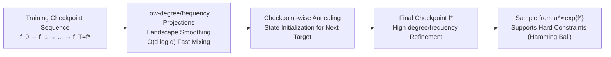

# From Predictors to Samplers via the Training Trajectory

**Conference**: ICLR 2026  
**OpenReview**: [https://openreview.net/forum?id=JAOOOgzVUl](https://openreview.net/forum?id=JAOOOgzVUl)  
**Code**: TBD  
**Area**: Learning Theory / Sampling / MCMC / Training Dynamics  
**Keywords**: Training Trajectory Annealing, coarse-to-fine, Spectral Bias, NTK, Boolean Functions, GWG, Mixing Time  

## TL;DR
Without training any additional generative models, this work directly reuses the **sequence of checkpoints** left by a trained predictor during its training process to perform "trajectory annealing" MCMC. Early checkpoints provide coarse-to-fine smoothing that enables fast mixing, while late checkpoints refine details, effectively reducing exponential MCMC mixing times on rugged/needle-type landscapes to near-linear.

## Background & Motivation
**Background**: In structured data scenarios such as medical devices, recommendations, and credit scoring, small CNNs/MLPs remain the primary models for deployment rather than large Transformers. Sampling from these **pre-trained scalar predictors** $f^*:\mathcal{X}\to\mathbb{R}$ (i.e., sampling from their induced Gibbs density $\pi^*(x)\propto\exp\{f^*(x)\}$) addresses TWO major needs: **interpretability** (e.g., sampling minimal counterfactual edits to reveal shortcut biases, like a skin cancer CNN treating surgical markers as lesions) and **active design** (e.g., sampling high-value candidates from DNA-transcription factor affinity or protein fitness models).

**Limitations of Prior Work**: When the landscape is rugged (high-frequency, high-amplitude fluctuations creating numerous sharp local optima) or contains **synergy/needle gadgets** (where only rare multivariate configurations yield rewards), local samplers degenerate into random walks on the hypercube. The hitting time grows **exponentially** with the needle dimension and synergy order.

**Key Challenge**: Traditional approaches to tackle this involve training reward-conditioned diffusion or walk-jump samplers. However, these face three issues: (1) they require training an additional generative model with significant compute, contradicting the goal of "reusing existing predictors"; (2) adding **hard constraints** like Hamming balls requires separate guidance networks or SMC mechanisms; (3) they cannot perform interpretability sampling directly on a pre-deployed model. Pure test-time temperature annealing MCMC (Parallel Tempering, AIS, etc.) only relaxes barriers without providing directional guidance, still resulting in exponential mixing times for rare synergies.

**Goal**: Achieve near-linear sampling acceleration on rugged/needle landscapes under a **pure plug-and-play, zero-additional-compute** premise.

**Core Idea (Training Trajectory Annealing)**: Neural network training is naturally coarse-to-fine. **Early checkpoints suppress high-degree/high-frequency components (Boolean monomials ordered by degree, spherical harmonics decaying by degree under NTK), while late checkpoints recover details.** Instead of sampling $\pi^*$ directly, the method performs short-chain MCMC along the sequence of training checkpoints $\{f_t\}_{t=0}^T$ using $\pi_t(x)\propto\exp\{f_t(x)\}$. Highly fluid early proposals explore and locate modes, while late proposals refine them. This process requires no changes to training and no extra computation.

## Method

### Overall Architecture
The method is simple: Given an MSE-trained predictor and its saved checkpoint sequence $\{f_t\}_{t=0}^T$ ($f_T\equiv f^*$), define intermediate targets $\pi_t(x)\propto\exp\{f_t(x)\}$. Starting at $t=0$, run $N_t$ steps of a short Markov kernel on each $\pi_t$, using the final state as the initialization for the next checkpoint $\pi_{t+1}$, progressing coarse-to-fine until $t=T$. GWG+MH (Gibbs-with-Gradients + Metropolis-Hastings) kernels are used for discrete variables, and MALA for continuous variables. The core contribution is the theoretical justification: why early checkpoints correspond to low-degree/low-frequency projections and how mixing on these projections transforms exponential complexity into linear.

### Key Designs

**1. Degree-wise Checkpoint Hypothesis: Interpreting the training trajectory as a "low-degree to high-degree projection sequence."** The theoretical foundation relies on the hierarchical learning conclusions of Abbe et al. (2023)—when SGD fits sparse Boolean targets, low-degree monomials converge first. This paper adopts this as a working hypothesis: along the trajectory, there exist increasing checkpoints $\tau_0<\tau_1<\cdots<\tau_K$ such that at $\tau_k$, the model has learned all interactions of degree $\le k$, while higher degrees remain negligible. Thus, $f_{\tau_k}$ approximates the degree-$k$ projection $f_{\le k}(x):=\sum_{|S|\le k}\hat f^*(S)\prod_{i\in S}x_i$. Empirical evidence on FCNN/CNN shows that lower-degree Fourier–Walsh components align earlier.

**2. High-frequency High-amplitude Barriers: Bypassing the exponential wall via early checkpoints.** For $\pi_\gamma(x)\propto\exp\{\sum_i x_i+\gamma\prod_i x_i\}$, linear terms prefer $+1$, but the parity term $\prod_i x_i$ builds high barriers when $|\gamma|$ is large. Under low temperatures, vanilla Gibbs sampling gets stuck in parity-satisfying states, requiring moves across barriers of magnitude $|\gamma|$, with mixing time $\tilde\Theta(\exp\{c|\gamma|\})$. The trajectory sampler runs on $\tau_1$ first (where high-degree parity is not yet learned, and the landscape is smooth), allowing Gibbs to mix in $O(d\log d)$ steps to reach $+1$ states before moving to the final checkpoint to adjust parity, bypassing the exponential wall.

**3. Synergy Needles: Turning random walks into fast mixing on Curie–Weiss.** For the indicator function $f^*(x)=\mathbf{1}\{x=z^\star\}$, the Walsh expansion is $2^{-d}\sum_S\prod_{i\in S}(z^\star_i x_i)$. Since the density is flat outside the needle, the local chain is a random walk on the hypercube, exponential in $d$. However, the degree-$\le 2$ proxy $f_{\le 2}(y)\approx 2^{-d}(\sum_i y_i+\sum_{i<j}y_i y_j)$ (where $y_i:=x_i z^\star_i$) is exactly a **Curie–Weiss Hamiltonian** with a positive field. This allows hitting $z^\star$ with high probability in $O(d\log d)$ steps using constant parallel chains.

**4. Continuous Domain NTK Perspective: Training trajectory = sequence of heat kernel smoothed versions.** On the sphere $S^{d-1}$, Gaussian/diffusion smoothing acts on spherical harmonics by degree; the degree-$k$ coefficient is multiplied by $M_k(t)=\exp\{-t\,k(k+d-2)\}$. NTK training (idealized FCNN) similarly acts by degree, with $M_k\sim\Theta(k^{-d})$ for ReLU. This implies that the NTK training trajectory $\{f_t\}$ provides a family of "gradually smoothed versions of $f^*$," functionally equivalent to heat kernel smoothing without the need to learn additional diffusion functions.

## Key Experimental Results

### Main Results
Performance was compared under **matched compute** across synthetic Boolean, binary MNIST-EBM, DNA design (constrained), Ackley-10D, and superconductor design tasks.

| Task | Ours | Strongest Baseline | Note |
|---|---|---|---|
| 8-var Poly (Table 1) | **0.52** Success / 40 steps | GWG+TempAnneal 0.04 / 2000 steps | 50× fewer steps, superior performance |
| MNIST-EBM FID↓ 10K steps (Table 5) | **5.49** | Temp-GWG 21.12 | 1K steps: 11.73 vs 29.61 |
| DNA Design Median Fitness (Table 6) | **10.04** (Pct. 99.78) | GWG 2.72 | Motif hit 74% vs 39% |
| DNA Constrained Hamming≤7 (Table 7) | **7.42** (Pct. 99.45) | GWG 2.09 / PT-GWG 1.92 | Motif 63% vs 31% |
| Ackley-10D Best↓ (Table 8) | **3.69** (SMC-Train) | 7.86 (SMC-Temp) | Non-overlapping CI |
| Superconductor Tc↑ Best (Table 8) | **318.4** | 107.4 (Multiple baselines) | Exceeds reference 185 |

### Ablation Study

| Indicator Dim $d$ (Table 2) | Ours Success | GWG Success |
|---|---|---|
| 3 | 0.98 | 0.47 |
| 5 | 1.00 | 0.21 |
| 8 | 1.00 | 0.17 |
| 10 | 0.99 | 0.12 |

- **Adversarial Non-convex Linear Terms (Table 3)**: Adding a reverse degree-1 term to the indicator function, Ours remains 1.00 whereas GWG drops to 0.08.
- **Multiple Needles (Table 4)**: Hitting 3 non-overlapping indicators of length 5, Ours 1.00, GWG 0.025.
- **Checkpoint Count Ablation (App. G)**: Significantly outperforms baselines across a wide range of checkpoint counts.

### Key Findings
- GWG's median conditional hitting time is only 1–4 steps, meaning it **only succeeds if initialized near the target**. Success probability decays exponentially with $d$ and synergy order. Ours avoids this degradation via fast mixing on low-degree projections.
- All synthetic tasks included **500 spurious variables** for stress testing; the method remained unaffected.
- Constrained sampling (Hamming ball) is natively supported by restricting the MCMC chain, whereas diffusion requires separate guidance/SMC mechanisms.

## Highlights & Insights
- **The "training trajectory as a free annealing ladder" perspective is the core novelty**: While traditional annealing relies on temperature or explicit smoothing, this work uses the byproduct of SGD (checkpoint sequence) as a ready-made degree-wise smoothing sequence with zero extra compute.
- **Discrete domain theoretical closure**: Using the leap complexity and Curie–Weiss mixing times, the paper transforms "exponential to $O(d\log d)$" into a provable conclusion rather than just an empirical observation.
- **Unified explanation for continuous and discrete**: The spectral bias of "low-frequency/low-degree first" applies across FCNN/CNN/ResNet architectures.
- Native support for hard constraints and interpretability sampling for deployed models are key differentiators compared to diffusion-based routes.

## Limitations & Future Work
- **Not applicable to Transformers**: The degree-wise checkpoint hypothesis is FCNN-specific. Transformers learn interactions via attention, and while they satisfy "low-degree alignment first," they do not satisfy "delayed degree-wise quality growth." Applying this to Transformers is future work.
- Theoretical guarantees rely on **idealized assumptions** (Abbe's restricted two-layer networks, NTK infinite width). The existence of degree-wise checkpoints is treated as a hypothesis rather than a proof for large-scale networks.
- Dependency on **sufficiently dense checkpoint saving** during training.
- Evaluation focuses on CNN/MLP-friendly scientific design and EBM tasks, not covering broad modern generative scenarios.

## Related Work & Insights
- **Smoothing for Sampling**: Reward-conditioned diffusion and walk-jump methods often require learning additional smoothing functions. Ours uses intrinsic training smoothing with zero additional compute.
- **Test-time MCMC**: Temperature-based annealing cannot bypass the random walk behavior of rare synergies. Methods like Diffusive Gibbs or IRED introduce auxiliary noise but still rely on local energy gradients.
- **Discrete Sampling**: Ours is compatible with all gradient-based discrete kernels (GWG, discrete Langevin, etc.).
- **Coarse-to-fine Learning Theory**: This work is the first to bridge the gap between "low-frequency-first" training dynamics (Abbe, Murray) and "sampling" efficiency.
- **Insights**: Training trajectories are often discarded resources. Reinterpreting training dynamics as annealing/curricula could extend to constrained optimization and model auditing.

## Rating
- **Novelty**: ⭐⭐⭐⭐⭐ Using "training trajectories" as a free annealing ladder is a highly original and coherent perspective.
- **Experimental Thoroughness**: ⭐⭐⭐⭐ Solid testing on synthetic stress tests, EBM, and DNA design with proper baselines and ablations, though limited in task scale.
- **Writing Quality**: ⭐⭐⭐⭐ Clear chain from motivation to theory to experiments.
- **Value**: ⭐⭐⭐⭐ Zero-compute, plug-and-play, and hard-constraint support provide direct utility for scientific design and interpretability.

<!-- RELATED:START -->

## Related Papers

- [\[ICLR 2026\] Diffusion Language Models are Provably Optimal Parallel Samplers](diffusion_language_models_are_provably_optimal_parallel_samplers.md)
- [\[ICLR 2026\] Strong Correlations Induce Cause Only Predictions in Transformer Training](strong_correlations_induce_cause_only_predictions_in_transformer_training.md)
- [\[ICLR 2026\] Training-Free Determination of Network Width via Neural Tangent Kernel](training-free_determination_of_network_width_via_neural_tangent_kernel.md)
- [\[ICLR 2026\] Tractability via Low Dimensionality: The Parameterized Complexity of Training Quantized Neural Networks](tractability_via_low_dimensionality_the_parameterized_complexity_of_training_qua.md)
- [\[ICLR 2026\] On the Convergence of Two-Layer Kolmogorov-Arnold Networks with First-Layer Training](on_the_convergence_of_two-layer_kolmogorov-arnold_networks_with_first-layer_trai.md)

<!-- RELATED:END -->
