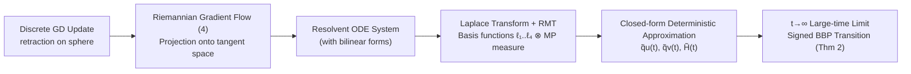

# Gradient Descent Dynamics of Rank-One Matrix Denoising

**Conference**: ICLR 2026  
**OpenReview**: [https://openreview.net/forum?id=S5oAnaIbgb](https://openreview.net/forum?id=S5oAnaIbgb)  
**Code**: To be confirmed  
**Area**: learning theory / high-dimensional statistics  
**Keywords**: matrix denoising, gradient descent dynamics, random matrix theory, BBP transition, spiked model, closed-form solution  

## TL;DR
This paper provides a **closed-form deterministic approximation of the gradient descent learning trajectory in the rectangular (Wishart) rank-one matrix denoising problem** using high-dimensional random matrix theory. It proves the almost sure convergence of the inner product between the estimate and the ground truth, revealing an asymptotic limit corresponding to a signed BBP transition.

## Background & Motivation
- **Background**: Matrix denoising (recovering a low-rank signal $P$ from $X = P + Z$) is a fundamental problem in statistics and machine learning. Classical theory (spiked model + BBP transition) has thoroughly characterized the "static/asymptotic" performance of the top singular vector—showing a phase transition in the alignment between the top singular vector and the ground truth when the Signal-to-Noise Ratio (SNR) exceeds a critical threshold.
- **Limitations of Prior Work**: When dimensions $p,n$ are very large, the storage and computational overhead of direct SVD can be prohibitive. In practice, iterative methods like **Gradient Descent (GD)** are commonly used to optimize the quadratic cost. However, the **learning dynamics** of GD—especially the analytical solutions describing its exact trajectory—have been largely neglected in the literature. While Approximate Message Passing (AMP) has theory, it depends on specific prior distributions and is problem-specific; GD is more general but lacks trajectory characterization.
- **Key Challenge**: The most related work (Bodin & Macris, 2021) only solved the closed-form dynamics for the **symmetric Wigner model** (where $P,Z$ are symmetric). Real-world data often follows the **rectangular Wishart model** formed by stacking sequences $\{x_j\}$, which is non-symmetric and governed by higher-order equations, making analytical solutions significantly harder.
- **Goal**: To fill the gap in GD learning dynamics for the rectangular Wishart model by providing closed-form deterministic approximations for the inner products $q_u(t)=\langle u^*,u_t\rangle$ and $q_v(t)=\langle v^*,v_t\rangle$, along with convergence proofs and large-time asymptotic analysis.
- **Core Idea**: **Constructing approximate solutions using Random Matrix Theory (RMT)**—expressing the Riemannian gradient flow of GD as a system of differential equations involving resolvents (Green's functions), solving them via Laplace transforms, and ultimately representing the dynamics as integrals of "basis functions" against the Marčenko-Pastur measure.

## Method

### Overall Architecture
The object of study is the rank-one Johnstone spiked model $X = Z + \lambda\, u^* v^{*\top}\in\mathbb{R}^{p\times n}$. Taking the quadratic cost $H(u,v)=\tfrac12\|X-uv^\top\|_F^2$ as the objective, a projected Riemannian gradient flow is performed on the unit sphere. The analysis pipeline is: **(1) Approximate discrete GD as Riemannian gradient flow → (2) Use resolvents to write inner product evolution as an ODE system → (3) Solve with Laplace transforms + RMT for closed-form deterministic approximations → (4) Take $t\to\infty$ to obtain the signed BBP transition.**

### Key Designs

**1. Riemannian Gradient Flow Modeling: Converting constrained GD into solvable continuous dynamics.** The estimators are constrained to the unit sphere $\|u\|_2=\|v\|_2=1$. The authors approximate small-step GD as a Riemannian gradient flow $\frac{d}{dt}(u_t,v_t)^\top = -\mathrm{grad}(H)$, where the gradient is projected onto the tangent space $\mathrm{proj}_x(y)=(I-xx^\top)y$ to automatically maintain unit norms. The quantities of interest are the inner products $q_u(t),q_v(t)$ (equivalent to the distance $\|x^*-x\|_2^2=2-2\langle x,x^*\rangle$). Remark 7 provides discrete-continuous error bounds: $\max_k(\|\tilde u_k-u_{k\eta}\|_2,\|\tilde v_k-v_{k\eta}\|_2)\le C(\eta+\eta^2)$.

**2. Closed-form Deterministic Approximation (Theorem 1): Integral representation of basis functions ⊗ MP measure.** This is the core contribution. The authors prove that the stochastic processes $q_u(t),q_v(t)$ converge **almost surely and uniformly** as $p,n\to\infty$ to deterministic functions $\tilde q_u(t)=\hat q_u(t)/\sqrt{\hat p(t)}$ and $\tilde q_v(t)=\hat q_v(t)/\sqrt{\hat p(t)}$. Here, $\hat q_u, \hat q_v, \hat p$ are constructed by convolving and integrating four **basis functions**—$\ell_{1,x}(t)=\cosh(\sqrt{x}t)$, $\ell_{2,x}(t)=\tfrac{1}{2\sqrt x}\sinh(2\sqrt x t)$, $\ell_{3,x}(t)=\tfrac{1}{\sqrt x}\sinh(\sqrt x t)$, and $\ell_{4,x}(t)=\cosh(2\sqrt x t)$—against the Marčenko-Pastur measure $\mu(dx)$. The expressions depend only on $(c,\lambda,\alpha_u,\alpha_v)$, where $\alpha_u=\langle u_0,u^*\rangle$ and $\alpha_v=\langle v_0,v^*\rangle$ are initial alignments, implying that **all initial points with the same initial inner products share the same asymptotic learning curve (rotational invariance)**.

**3. Signed Large-time Phase Transition (Theorem 2): More information than standard BBP.** Taking $t\to\infty$, the authors obtain $\tilde q_u^\infty = I\cdot\sqrt{\tfrac{1-c\lambda^{-4}}{1+c\lambda^{-2}}}\,\mathbf 1\{\lambda>c^{1/4}\}$ (and similarly for $\tilde q_v^\infty$), where the sign $I=\mathrm{Sgn}\{\tfrac{\alpha_v}{\sqrt{1+\lambda^2}}+\tfrac{\alpha_u}{\sqrt{\lambda^2+c}}\}$. When $\lambda<c^{1/4}$, the estimation is asymptotically trivial (inner product $\to 0$). Crossing the threshold $c^{1/4}$, a transition occurs—the **magnitude is identical to the classical BBP**, but while BBP gives the unsigned $|\langle\hat u_1,u^*\rangle|^2$, this work provides the **sign**. This refines the "recoverability" condition from just SNR to a joint condition of "SNR + initial alignment direction."

**4. Utility of Dynamics: Early stopping, SNR estimation, and landscape insights.** Since $\tilde q_u, \tilde q_v$ are computable in closed form, the authors propose applications: (i) **Early stopping**—given a performance threshold $\gamma$, the stopping time $\hat t=\inf\{t:\min(\tilde q_u(t),\tilde q_v(t))\ge\gamma\}$ can be found via line search; (ii) **SNR estimation**—fitting the observed curve to theory in $C([0,T])$ norm to solve for $\hat \lambda$; (iii) **Loss landscape**—Corollary 2 gives the asymptotic loss $\lim_t \tilde H(t)=J\cdot[\sqrt{\vartheta_{\lambda,c}}-1-\sqrt c]$, showing GD can reach the global optimum and avoid saddle points under random initialization.

## Key Experimental Results

> This is a theoretical paper; "experiments" refer to numerical simulations verifying the theorems. Simulations use Riemannian GD with learning rate $\eta=0.005$.

### Main Results: Accuracy of Deterministic Approximation

| Setting | Parameters | Observation |
|------|------|------|
| Accuracy Verification (Fig.1) | $p=900,\ n=1200$; $u^*$ Gaussian, $v^*$ Bernoulli(0.3) then normalized; $u_0\propto 10u^*+z_1$, $v_0\propto 5v^*+z_2$ | Simulation curves for $q_u,q_v,H$ **highly overlap** with theoretical $\tilde q_u,\tilde q_v,\tilde H$, validating Thm 1 + Cor 1 |
| Below Threshold | $\lambda=0.3<c^{1/4}$ | Inner products tend to 0 as $t \to \infty$, estimation is trivial |
| Above Threshold | $\lambda=1.5>c^{1/4}$ | Inner products converge to positive $\tilde q^\infty$, validating Thm 2 |

### Key Findings
| Experiment | Setting | Key Findings |
|------|------|----------|
| SNR Impact (Fig.2) | $c=0.5,\ \alpha_u=0.211,\ \alpha_v=-0.121$ | $\lambda\le c^{1/4}=0.841$ leads to inner product $\to 0$; above threshold it converges to a positive limit. Higher SNR implies faster learning, but **initial loss might remain higher**—rapid loss reduction does not always mean better final performance. |
| Initial Condition (Fig.3) | $c=0.5,\ \alpha_v=0.4$, $\lambda=1.5$ vs $0.2$ | Estimation is difficult when $\tfrac{\alpha_v}{\sqrt{1+\lambda^2}}+\tfrac{\alpha_u}{\sqrt{c+\lambda^2}}=0$ (critical initial value), validating the signed transition and Cor 2. |

- The deterministic approximation becomes **more accurate as SNR increases**.
- Learning is a **global process**: higher SNR signals may show slower initial loss decay but eventually reach a lower loss floor.

## Highlights & Insights
- **First closed-form solution for GD dynamics in rectangular Wishart models**: This breaks the previous limitation to symmetric Wigner models, technically handling non-symmetric structures and high-order Laplace poles.
- **Signed BBP Transition**: While classical BBP only provides alignment magnitude, this work incorporates "dynamics + initial conditions" to provide sign information, allowing for confidence intervals on the direction of ground truth based on priors.
- **Practical Utility**: The closed-form solutions make early stopping and SNR estimation computable in $O(N_t^2 N_x)$, providing actionable tuning parameters for high-dimensional estimation.
- **Comparison with Statistical Physics**: In contrast to implicit numerical descriptions like CHSCK equations for Langevin dynamics, this closed-form expression is more interpretable and computationally efficient.

## Limitations & Future Work
- **Rank-one Constraint**: Only rank-one spiked models are treated. Higher ranks or tensor cases (where saddle points grow exponentially with dimension) remain for future work.
- **Continuous Flow Approximation**: While $O(\eta+\eta^2)$ error bounds are provided, the theory is built on gradient flow; large learning rates or non-asymptotic regimes are not yet covered.
- **i.i.d. Noise Assumption**: Relies on standard RMT assumptions like i.i.d. elements for $Z$ and finite fourth moments.
- **Future Directions**: Generalization to **SGD (with gradient noise)** using stochastic calculus on manifolds, and extensions to tensor structures.

## Related Work & Insights
- **Static/Asymptotic Work**: BBP transitions in spiked Wigner/Wishart models (Baik et al., 2005). These characterize the final states but not the trajectories.
- **Iterative Algorithms**: AMP achieves minimum MSE under information-theoretic frameworks but depends on specific priors. This work complements the GD line of research which is prior-agnostic.
- **Direct Precursor**: (Bodin & Macris, 2021) solved symmetric Wigner dynamics but lacked existence/uniqueness proofs for the analytical properties; this paper generalizes to Wishart and completes the integral representation proof.

## Rating
- **Novelty**: ⭐⭐⭐⭐⭐ First closed-form deterministic approximation for rectangular Wishart GD trajectories; provides a signed version of the BBP transition.
- **Experimental Thoroughness**: ⭐⭐⭐ As a theoretical paper, simulations (Fig.1-3) systematically cover accuracy, SNR, and initial conditions; however, no real-world data is used.
- **Writing Quality**: ⭐⭐⭐⭐ Clear structure, progressive theorems, and well-explained application motivations. High formula density may be challenging for non-RMT experts.
- **Value**: ⭐⭐⭐⭐ Provides a clean, computable analytical template for understanding GD dynamics in high-dimensional statistics and optimization theory.

<!-- RELATED:START -->

## Related Papers

- [\[ICLR 2026\] Interactive Learning of Single-Index Models via Stochastic Gradient Descent](interactive_learning_of_single-index_models_via_stochastic_gradient_descent.md)
- [\[ICLR 2026\] Transformers Trained via Gradient Descent Can Provably Learn a Class of Teacher Models](transformers_trained_via_gradient_descent_can_provably_learn_a_class_of_teacher_.md)
- [\[ICLR 2026\] Continuum Transformers Perform In-Context Learning by Operator Gradient Descent](continuum_transformers_perform_in-context_learning_by_operator_gradient_descent.md)
- [\[ICLR 2026\] Separable Neural Networks: Approximation Theory, NTK Regime, and Preconditioned Gradient Descent](separable_neural_networks_approximation_theory_ntk_regime_and_preconditioned_gra.md)
- [\[ICLR 2026\] Computational Bottlenecks for Denoising Diffusions](computational_bottlenecks_for_denoising_diffusions.md)

<!-- RELATED:END -->
