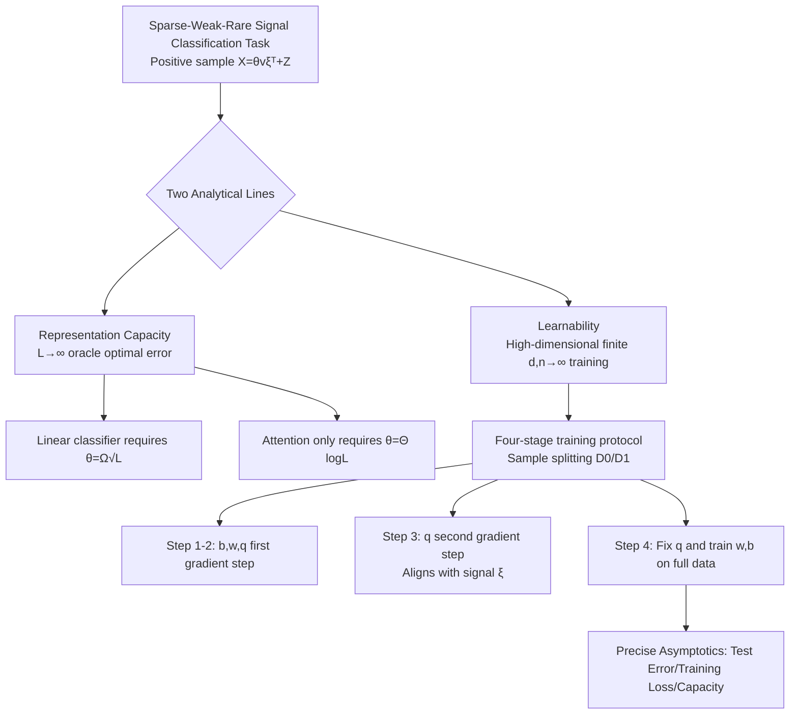

# High-Dimensional Analysis of Single-Layer Attention for Sparse-Token Classification

**Conference**: ICLR 2026  
**OpenReview**: [https://openreview.net/forum?id=Ae7VWAEIAW](https://openreview.net/forum?id=Ae7VWAEIAW)  
**Code**: To be confirmed  
**Area**: learning theory  
**Keywords**: Attention mechanism theory, sparse token classification, high-dimensional asymptotic analysis, gradient descent learnability, signal detection  

## TL;DR
The authors provide a precise high-dimensional theory of single-layer attention on a "sparse-weak-rare" signal classification model: at the representation level, attention requires only $\theta=\Theta(\log L)$ signal strength for perfect classification (whereas linear classifiers require $\sqrt{L}$); at the learnability level, it is proven that **two gradient steps** are sufficient for the query weight $q$ to align with the hidden signal, providing exact asymptotic expressions for post-training test error and capacity.

## Background & Motivation
**Background**: As attention mechanisms have achieved great success in NLP and CV, the theoretical community generally believes their core advantage lies in the "dynamic selection of relevant tokens." Several works on sparse token regression/classification using solvable single-layer models (Sanford, Marion, Oymak, Mousavi-Hosseini, etc.) have demonstrated exponential separation between attention and fully connected networks in terms of sample/neuron complexity.

**Limitations of Prior Work**: Most previous analyses are limited to **square loss** and only consider the challenge of signal "sparsity." However, in real-world scenarios, sparsity is often coupled with **weak signals** (very faint lesions) and **rare signals** (only a few tokens in positive samples carry the signal, or negative samples contain no signal at all). Furthermore, most works only characterize "representation capability/oracle error" or crude gradient step bounds, lacking a precise (including constants) characterization of the **actual post-training test error**.

**Key Challenge**: While the advantage of attention appears as a "crushing" separation in the $L\to\infty$ asymptotic limit, this separation becomes subtle under **finite $L$ and finite samples**. Determining exactly when and by how much attention wins requires analytical tools precise down to the constants. The non-linear distribution of attention features $f_q(X)$ prevents the direct application of classical high-dimensional linear model theory.

**Goal**: To provide a precise comparison between a single-layer attention classifier and linear baselines (vectorized/pooled) from both "representation capability" and "learnability" perspectives, using a binary classification task that models the triple difficulties of sparse, weak, and rare signals.

**Core Idea**: (1) **Representation side**—proving that attention achieves perfect classification with logarithmic signal strength, revealing exponential separation in signal detection compared to linear classifiers; (2) **Learnability side**—employing a four-stage training protocol with sample splitting to prove the query weight aligns with the signal in just two gradient steps, and providing exact solutions for test error, training loss, and capacity using leave-one-out high-dimensional asymptotics.

## Method

### Overall Architecture
The task is $L\times d$ binary classification: negative samples are pure Gaussian noise $X=Z$, and positive samples have a fixed unit signal $\xi$ superimposed on $R$ randomly selected tokens, i.e., $X=\theta v\xi^\top+Z$, where $v$ marks signal positions, $\theta$ is signal strength, and $\pi$ is the prior probability of positive samples. The difficulty lies in the signal positions $R_i$ changing per sample, requiring the classifier to **dynamically locate** signal-bearing tokens. The study is divided into two layers: first, comparing the oracle optimal error of three models (vectorized linear, pooled linear, and single-layer attention) as $L\to\infty$ to characterize representation capability; second, precisely characterizing the actual test error and capacity after a four-stage training process in the high-dimensional finite-length limit ($d,n\to\infty$, $\alpha=n/d$ fixed, $L,\theta,R$ finite).

### Key Designs

**1. A Signal Model with Triple Difficulties: Integrating "Sparse × Weak × Rare" into the data distribution.** Unlike settings that only characterize sparsity, the positive samples $X=\theta v\xi^\top+Z$ in this paper introduce three simultaneous challenges: signal positions $|R|=R<L$ reflect **sparsity**; the signal component norm $O(\theta\sqrt R)$ is much smaller than the background noise $\|Z\|=O(\sqrt{Ld})$, reflecting **weakness**; and negative samples contain no signal at all, with $\pi$ possibly being very small, reflecting **rareness**. The position distribution is also constrained to be sufficiently dispersed ($\|p\|\le CR/\sqrt L$) to prevent privileged tokens from leaking information, making detection harder. This modeling directly corresponds to real-world tasks like detecting lesions in CT scans and is more realistic than the "noise-free signal in all samples" setting of Oymak et al.

**2. Logarithmic Signal Detection Advantage of Attention: Exponential separation in representation.** As $L\to\infty$ and $R=\Theta(1)$, the authors prove that for pooled and vectorized linear classifiers to achieve zero test error, the signal strength must satisfy $\theta=\Omega(\sqrt L)$ (Proposition 1, Theorem 1, controlled by SNR $=\lim \theta R/\sqrt L$; when SNR is finite, error is strictly bounded above zero). The root cause is that average pooling dilutes the signal term to $O(R/L)$ while noise only drops to $O(\sqrt{d/L})$, worsening the signal-to-noise ratio. Conversely, the attention model $f_q(X)=X^\top\mathrm{softmax}(\beta Xq)$ aligns $q$ with $\xi$ to dynamically concentrate weights on signal-bearing tokens, amplifying the SNR. Theorem 2 proves $E^*_{\text{test}}[A]=0$ as long as $\liminf \theta/\log L>0$. Thus, attention can detect **exponentially weaker signals** than linear classifiers—strictly quantifying the value of "dynamic token selection."

**3. Two-Step Gradient Alignment + Four-Stage Sample Splitting: Precise characterization of learnability.** Strong representation does not guarantee learnability via gradient descent. The authors design an analytically tractable training protocol: split data into $D_0, D_1$; after zero initialization, the first gradient step moves $w,b$ while $q^{(1)}$ remains zero; the critical **second gradient step for $q$** is $q^{(2)}=-\frac{\eta_q\beta}{n_0L}\sum_i h_i\,X_i^\top(I-\tfrac{1_L 1_L^\top}{L})X_i w^{(1)}$, which generates a non-trivial alignment between the query weight and signal $\xi$; finally, $w,b$ are trained on $D_1$ while fixing $q^{(2)}$. Theorem 3 provides the deterministic limits for $\|q^{(2)}\|$ and $\langle q^{(2)},\xi\rangle$, and Corollary 1 proves the cosine similarity $|s_q|=1-C/\alpha_0+o(1/\alpha_0)$, meaning alignment approaches 1 at a rate of $1/\alpha_0$. Sample splitting ensures $q^{(2)}$ is independent of $D_1$, reducing Step 4 to a high-dimensional linear classification problem solvable by existing theory.

**4. Leave-one-out Asymptotics + Softmax Low-Dimensional Reduction: Precise solution for non-linear attention features.** After fixing $q$ in Step 4, it is equivalent to training a linear model on highly non-Gaussian attention features $f_{q^{(2)}}(X)$, where classical Gaussian mixture assumptions fail. The key observation is that **softmax only acts on the low-dimensional projection $g\in\mathbb R^L$ of tokens along the $q^{(2)}$ direction**, which can be handled separately. Based on this, Theorem 4 uses the leave-one-out method to show that post-training test error and training loss converge to deterministic limits determined by a set of self-consistent equations, **precise down to explicit constants**. This is tighter than the error bounds or oracle-dependent characterizations in works like Oymak et al. Corollary 2 further provides a concise conclusion for ridgeless square loss where all three models converge to their limit errors at a rate of $1/\alpha_1$, noting that whether attention wins depends on the alignment $s_q$: if $s_q$ is too small (insufficient $\alpha_0$ or improper hyperparameters), attention loses to linear classifiers; if $s_q$ is moderate to large, attention wins through dynamic reweighting.

## Key Experimental Results

> This is a theoretical work; "experiments" refers to the validation of theoretical curves against finite-dimensional numerical simulations.

### Main Results: Test/Training Error vs. Sample Complexity for Three Models

| Model | Representation Capacity (Required $\theta$ for $L\to\infty$) | Finite Sample Test Error | Remarks |
|------|------|------|------|
| Vectorized Linear $L^{\text{vec}}$ | $\Omega(\sqrt L)$ | High, cannot adapt to dynamic sparsity | Error $>0$ when SNR is finite |
| Pooled Linear $L^{\text{pool}}$ | $\Omega(\sqrt L)$ | High, average pooling dilutes SNR | Shares $\alpha_1\to\infty$ limit with vec |
| Single-Layer Attention $A$ | $\Theta(\log L)$ | **Lowest** (at moderate/high $s_q$) | Dynamic reweighting amplifies SNR |

Fig.1 uses $L=10,R=1,\pi=0.5,\theta=5,\lambda=10^{-5},d=1000$: Theoretical solid lines from Theorem 4/5 match numerical dots (8 trials) perfectly, with attention test error significantly lower than both linear baselines.

### Ablation Study: Alignment $s_q$ Determines Attention Superiority

| Alignment Case | Trigger Condition | Result |
|------|------|------|
| High/Moderate $s_q$ | Sufficient $\alpha_0$, reasonable $\eta_{w,b}$ | $E^\infty_{\text{test}}[A]<E^\infty_{\text{test}}[L]$, Attention wins |
| Low $s_q$ | Insufficient $\alpha_0$ or poor hyperparameters | $E^\infty_{\text{test}}[A]>E^\infty_{\text{test}}[L]$, Attention loses |
| $q=0$ (Degeneracy) | Equivalent to average pooling | Degenerates to pooled linear classifier |

### Key Findings

| Finding | Content |
|------|------|
| Exponential Signal Separation | Attention detects signals **exponentially weaker** than linear classifiers ($\log L$ vs $\sqrt L$) |
| Two-Step Gradient Sufficiency | Only 2 gradient steps are needed for $q$ to align with the signal; alignment $\to 1$ at $1/\alpha_0$ rate |
| Consistent Convergence Rates | Under square loss, all three models' test errors converge to limits at $1/\alpha_1$ rate |
| Attention Does Not Always Win | If $s_q$ is too small, $E^\infty_{\text{test}}[A]>E^\infty_{\text{test}}[L]$; insufficient alignment is detrimental |
| Capacity Ordering | Under experimental settings $\alpha^\star_{\text{vec}}>\alpha^\star_A>\alpha^\star_{\text{pool}}$ (Conjecture 1) |
| Lowest Capacity for Pooling | $\alpha^\star_{\text{pool}}=\alpha^\star_{\text{vec}}/L$; average pooling compresses separable capacity by $L$ times |

## Highlights & Insights
- **Turning "Why Attention is Strong" Intuition into Provable Theorems**: Signal amplification is no longer a hand-wavy explanation but a precise separation of $\theta=\log L$ vs $\sqrt L$ and a deterministic characterization of query alignment.
- **Separate Proofs for Learnability and Representation**: Representation capacity (Theorem 2) does not guarantee gradient learnability; this paper bridges the gap with a two-step gradient protocol, making the conclusions more complete.
- **Test Error Precise to Constants**: Unlike previous bounds, the self-consistent equations in Theorem 4 allow for quantitative engineering predictions of the impact of samples, sequence length, and signal strength on error.
- **Honestly Identifying Attention's Failure Zone**: When $s_q$ is insufficient, attention performs worse than linear models, reminding us that dynamic representation requires a sufficient alignment budget (data/hyperparameters).
- **Softmax Low-Dimensional Reduction Technique**: Reducing the high-dimensional analysis of non-linear attention features to controllable low-dimensional projections + leave-one-out is a reusable methodological contribution.

## Limitations & Future Work
- **Single-Layer, Simplified Attention Model**: Analysis is limited to the [CLS]-style simplified structure $f_q(X)=X^\top\mathrm{softmax}(\beta Xq)$, excluding multi-head, multi-layer, or full self-attention with value projections (empirical comparisons only in Appendix A).
- **Highly Idealized Training Protocol**: The four-stage, sample-splitting, two-step gradient protocol is designed for tractability and deviates from real end-to-end joint training (though Appendix notes similar behavior when reusing data).
- **Capacity Conclusion Remains a Conjecture**: The capacity expression in Eq. (18) involves heuristic steps and lacks a full rigorous proof.
- **Simplified Signal Model**: Uses a single fixed signal vector $\xi$, $R=\Theta(1)$, and isotropic Gaussian noise, which is distant from the structured correlations in real images or text.
- **Future Work**: Extending analysis to multi-step/joint training, multi-layer attention, structured noise, and upgrading the capacity conjecture to a theorem.

## Related Work & Insights
- **Sparse Token Regression/Classification**: Sanford (2023), Wang (2024), Mousavi-Hosseini (2025), Marion (2024), and Oymak (2023) prove sample/neuron separation for attention over fully connected networks. This work is closest to Oymak (2023) but extends to arbitrary convex losses (including logistic) and incorporates weak and rare signal challenges while providing precise error constants.
- **High-Dimensional Attention Asymptotics**: The high-dimensional analysis line by Cui, Troiani, Duranthon, Rende, etc., provided technical tools (leave-one-out, self-consistent equations).
- **Learning Features via Single-Step Gradient**: Ba (2022), Moniri (2023), and Dandi (2023/2024) proved that one gradient step in two-layer networks can learn meaningful first-layer features; this paper transfers this paradigm to attention query weights (two steps).
- **Insight**: (1) Evaluating attention's advantage requires looking at both "representation capacity" and "alignment budget"—representation alone is insufficient; (2) Low-dimensional reduction of softmax is an effective entry point for analyzing non-linear attention; (3) The logarithmic advantage in "weak + rare" signal detection may explain attention's practical gains in tasks with sparse weak signals, such as medical imaging.

## Rating
- Novelty: ⭐⭐⭐⭐⭐ First to model sparse, weak, and rare difficulties simultaneously and provide precise high-dimensional asymptotics for attention test error/capacity, complementing logarithmic representation separation.
- Experimental Thoroughness: ⭐⭐⭐⭐ Theoretical work; numerical simulations ($d=1000/2000$, multiple trials) match theoretical curves perfectly; however, only validated on simplified models, with complex attention only briefly discussed in the appendix.
- Writing Quality: ⭐⭐⭐⭐ Clear two-layer structure (representation/learnability); theorems and intuitive explanations are well-coordinated. Some core expressions are moved to the appendix, making the main text slightly abstract.
- Value: ⭐⭐⭐⭐ Provides a rigorous, quantifiable theoretical foundation for "why attention can selectively focus on weak sparse signals," offering long-term reference value for understanding Transformer inductive biases and sparse signal tasks.

<!-- RELATED:START -->

## Related Papers

- [\[ICLR 2026\] High-dimensional Analysis of Synthetic Data Selection](high-dimensional_analysis_of_synthetic_data_selection.md)
- [\[ICLR 2026\] A Generalized Geometric Theoretical Framework of Centroid Discriminant Analysis for Linear Classification of Multi-dimensional Data](a_generalized_geometric_theoretical_framework_of_centroid_discriminant_analysis_.md)
- [\[ICLR 2026\] Learning under Quantization for High-Dimensional Linear Regression](learning_under_quantization_for_high-dimensional_linear_regression.md)
- [\[ICLR 2026\] Improved High-Dimensional Estimation with Langevin Dynamics and Stochastic Weight Averaging](improved_high-dimensional_estimation_with_langevin_dynamics_and_stochastic_weigh.md)
- [\[ICLR 2026\] On the Convergence of Two-Layer Kolmogorov-Arnold Networks with First-Layer Training](on_the_convergence_of_two-layer_kolmogorov-arnold_networks_with_first-layer_trai.md)

<!-- RELATED:END -->
