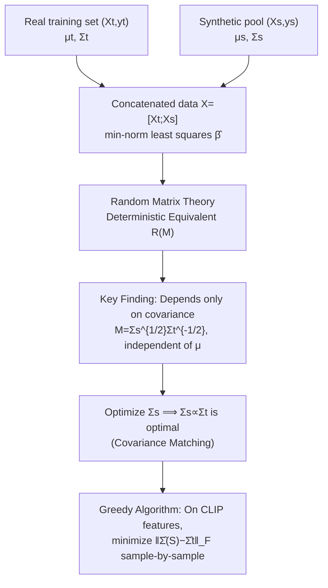

# High-dimensional Analysis of Synthetic Data Selection

**Conference**: ICLR 2026  
**OpenReview**: [https://openreview.net/forum?id=Y54P2BBPPh](https://openreview.net/forum?id=Y54P2BBPPh)  
**Code**: To be confirmed  
**Area**: Learning Theory / High-dimensional Regression / Synthetic Data Augmentation  
**Keywords**: Synthetic data selection, High-dimensional regression, Covariance matching, Random matrix theory, Data augmentation  

## TL;DR
The study characterizes the test error of joint training with "training data + synthetic data" using high-dimensional ridgeless regression theory. It proves that **only covariance shift affects generalization, while mean shift surprisingly does not**, and derives an extremely simple synthetic data selection criterion—covariance matching—that matches or exceeds all recent CLIP-based screening methods in real-world image/text classification.

## Background & Motivation
- **Background**: Generative models are becoming increasingly powerful, raising expectations for "generating infinite synthetic data to train classifiers" (especially in scenarios of data scarcity, privacy, and class imbalance). However, experimental conclusions have been contradictory—some report improvements, others question if it is better than retrieving more real data, and some even warn of model collapse and additional bias.
- **Limitations of Prior Work**: In practice, only heuristic slogans like "synthetic data should be close to the real distribution" exist. **It remains unclear which properties of the distribution actually determine the generalization error.** Various screening methods (pruning by CLIP similarity, sampling by text embeddings, clustering for representatives) are empirically tested but lack theoretical support and fail to explain when they succeed or fail.
- **Key Challenge**: The difference between synthetic and real data is reflected in both **mean shift** $\mu_t \neq \mu_s$ and **covariance shift** $\Sigma_t \neq \Sigma_s$. Most existing screening methods essentially focus on "aligning means/centers" (center matching, text matching, etc.), yet no one has asked: is mean alignment truly important?
- **Goal**: To place the question (Q) "how to select a synthetic set $(X_s, y_s)$ to minimize test error" into a rigorously solvable high-dimensional linear regression framework, **precisely characterizing the dependence of test error on various distributional parameters**, and subsequently deriving selection criteria with theoretical optimality guarantees.
- **Core Idea**: **[Theoretical Conclusion]** Provided that the training data is not too scarce, the limit test error of joint training depends only on the covariance matrices $\Sigma_t, \Sigma_s$ (via $M = \Sigma_s^{1/2}\Sigma_t^{-1/2}$) and **is completely independent of the means** $\mu_t, \mu_s$; **[Practical Criterion]** Therefore, aligning the covariance of synthetic data to that of real data ($\Sigma_s \propto \Sigma_t$) is optimal, without the need to worry about mean alignment.

## Method

### Overall Architecture
The paper follows a three-stage path: "theoretical characterization → deriving the optimal criterion → empirical implementation." It first models data augmentation as a two-stage linear Gaussian model, solving for the excess risk of the min-norm least squares solution (i.e., the interpolating solution from gradient descent initialized at 0). It then uses random matrix theory to provide a **deterministic equivalent** of the risk under the $n, p \to \infty$ scaling. Finding that this equivalent expression contains only covariances, it reduces "data selection" to an "optimization problem for $\Sigma_s$," proving covariance matching is optimal. Finally, the abstract conclusion is translated into a greedy algorithm and empirically tested on real image classification using CLIP/DINO feature spaces.

### Key Designs

**1. High-dimensional regression modeling with non-zero means: Taking "the test set cannot be decentralized" seriously.** The paper models both the training and synthetic sets as $y^{(i)} = X^{(i)}\beta + \varepsilon^{(i)}$, where the row vectors $X^{(i)} = Z^{(i)}(\Sigma^{(i)})^{1/2} + \mathbf{1}\mu_{(i)}^\top$ possess non-zero means $\mu_{(i)}$, and $\beta$ is shared between real and synthetic sides (i.e., conditional label distributions are consistent). A key difference from prior works like Yang et al. (2025) and Song et al. (2024) is that they assumed zero-mean data, whereas this paper points out that **the test distribution cannot be decentralized**—because knowing the mean of a test sample is equivalent to knowing its unknown label, so mean shifts must be explicitly preserved in the analysis. Excess risk is defined as $R_X(\hat\beta;\beta) = \mathbb{E}[\|\hat\beta - \beta\|^2_{\Sigma_t + \mu_t\mu_t^\top} \mid X]$. Note that the metric matrix $\Sigma_t + \mu_t\mu_t^\top$ includes both covariance and mean outer product terms specifically to keep the potential influence of the mean "on the table" before theoretically proving it eventually vanishes.

**2. Deterministic equivalent and the "mean-independence" phenomenon: Using random matrix theory to pin down random risk as a constant containing only covariance.** Under both under-parameterized ($n > p$, bias is 0) and over-parameterized regimes ($n < p$, bias does not vanish), the paper provides deterministic limits for the excess risk (Theorem 4.1 / 4.4). Under the under-parameterized regime, let $M = \Sigma_s^{1/2}\Sigma_t^{-1/2}$; the risk converges to $R_u(M) = \frac{\sigma^2}{n}\mathrm{Tr}[(\alpha_1 M^\top M + \alpha_2 I_p)^{-1}]$, where $\alpha_1, \alpha_2$ are determined by two self-consistent equations—**the entire expression depends only on $\Sigma_t, \Sigma_s$ and is independent of $\mu_t, \mu_s$**. The core trick of the proof is to treat the means $\mu_t, \mu_s$ as a rank-2 perturbation of the random matrix and "factor" them out, then apply anisotropic local laws to the zero-mean case, with a convergence rate of $O(\sigma^2 p^{-1/2})$. For contrast, the paper also proves that when **training only on synthetic data** ($\gamma_t = 0$), the risk expression contains terms like $\|\Sigma_s^{-1/2}\mu_t\|^2$ that explicitly include the mean (Proposition 4.2). This highlights the counter-intuitive and subtle nature of the "joint training eliminates mean influence" phenomenon: as long as sufficient real training data is preserved, mean alignment becomes irrelevant.

**3. Optimality proof of covariance matching: Spectral equalization yields $\Sigma_s \propto \Sigma_t$.** Since risk depends only on $M$, the problem (Q) reduces to "given $\Sigma_t$, what $\Sigma_s$ minimizes $R_u(M)$." Under the normalization constraint $\mathrm{Tr}[M^\top M] = p$, Theorem 4.3 proves that all eigenvalues of the optimal $M_{\mathrm{opt}}$ are equal ($\lambda_i(M_{\mathrm{opt}}^\top M_{\mathrm{opt}}) = 1$), meaning $M \propto I$, which is equivalent to $\Sigma_s \propto \Sigma_t$—**covariance matching is optimal**. The proof strategy involves writing $R_u(M)$ as a monotonic function of a single parameter $\alpha_1$, then using a transformation of the form $(\lambda_i, \lambda_j) \to (\lambda_i - c, \lambda_j + c)$ combined with majorization arguments to show that the more balanced the spectrum, the lower the risk. The paper also includes an interesting conclusion: overall expansion of $\Sigma_s$ in a fixed direction (i.e., $R_u(\eta M) \le R_u(M), \eta > 1$) can further reduce risk, **implying that greater synthetic data diversity is better**—but the magnification factor $\eta$ must be of constant order; otherwise, the deterministic equivalent no longer holds, which is why trace normalization is performed. Under the over-parameterized regime (Theorem 4.5), the same covariance matching optimality is given under the simplifying assumption of isotropic training data $\Sigma_t = I_p$.

**4. From theory to implementation: The greedy covariance matching algorithm.** The theory suggests "aligning covariance," but in practice, $\Sigma_s$ is "selected" from a fixed pool of generated samples and cannot be arbitrarily constructed. The paper implements this as a greedy selection: initialize $S = \emptyset$, and repeatedly add the sample $x$ from the generation pool that minimizes $\|\hat\Sigma(S \cup \{x\}) - \hat\Sigma_t\|_F$ until $|S| = n_s$, where $\hat\Sigma$ is the sample covariance of CLIP features. To accelerate, the covariance is calculated in a 32-dimensional PCA subspace fitted using $n_t$ real reference features. After selection, the classifier is trained on the union of "real + selected synthetic" data. This algorithm translates abstract spectral matching into a purely unsupervised filter that is universal for any generative model/feature extractor and requires no label or mean information.

## Key Experimental Results

### Main Results (CIFAR-10, CLIP ViT-B features, $n_t=200, n_s=800$/class)

Truncated StyleGAN2-Ada generation (Table 1, Classification Accuracy %):

| Method | Scratch | Distillation | Pretrained |
|------|---------|--------------|------------|
| No synthetic | 44.36 | 47.33 | 63.40 |
| Center matching (He 2023) | 50.04 | 53.83 | 67.01 |
| Center sampling (Lin 2023) | 50.48 | 54.91 | 67.71 |
| DS3 (Hulkund 2025) | 52.83 | 58.32 | 68.21 |
| K-means (Lin 2023) | 50.74 | 56.06 | 66.50 |
| Random | 49.38 | 54.89 | 67.65 |
| **Covariance matching (ours)** | **54.00** | **59.77** | **69.20** |
| Real upper bound | 61.08 | 65.38 | 74.35 |

Text-to-Image (T2I: SANA-1.5 + PixArt-α + SD1.4) mixed generation (Table 2): Covariance matching achieved Scratch 54.45 / Distillation 59.17 / Pretrained 66.69, equaling or slightly outperforming the strongest baseline (DS3).

### Ablation Study

| Setting | Conclusion |
|------|------|
| ImageNet-100 (Table 3a, truncated model) | Covariance matching 57.52 ≈ DS3 57.47, significantly higher than Random 54.14 |
| RxRx1 Fluorescence Microscopy (Table 3b, MorphGen) | Covariance matching 90.00 is highest, exceeding DS3 89.67 / No-synthetic 86.83 |
| DINO features replacing CLIP (Table 6-7) | Gains do not depend on a specific feature extractor |
| Zero-diversity generator (Table 5) | Covariance matching automatically avoids collapsed clusters; DS3 etc. perform poorly |
| Real samples mixed into synthetic pool (Figure 2) | Covariance matching selects the highest proportion of target distribution samples |
| Text Classification Ironic-Tweet (Table 13) | Equally effective, demonstrating cross-modal generalization |

### Key Findings
- **Mean alignment is useless; covariance alignment is key**: Validated by both theory (Figure 1a showing risk remains constant despite changing mean cosine similarity) and experiments; this directly challenges all "center alignment" paradigms represented by center/text matching.
- **Covariance matching favors diversity**: In truncated StyleGAN experiments, it selects only 268/245/333 samples from a 0.2-truncation (high fidelity, low diversity) model but selects 3692/3462 from a 0.6-truncation (high diversity) model, leading to superior Recall/FID/KID—the theoretical prediction that "expanding covariance reduces risk" manifests in practice as a "preference for diverse samples."
- **Simple and universal**: An unsupervised greedy algorithm sweeps three training paradigms (from scratch/distillation/fine-tuning), two architectures (ResNet/Transformer), three datasets, and five generative models without needing hyperparameter tuning.

## Highlights & Insights
- **Counter-intuitive hard conclusions + immediately usable guidelines**: The "mean-independence" phenomenon derived from high-dimensional regression is both elegant and surprising. More importantly, it translates directly into a one-line greedy algorithm that works on real vision/text tasks, minimizing the gap between theory and practice.
- **Elevating "the test set is non-decentralizable" to a modeling principle**: Pointing out that decentralization is equivalent to peeking at labels, thereby necessitating the preservation of non-zero means—this seemingly technical detail is the fundamental divergence from previous work and makes the conclusion that "means eventually do not affect risk" more convincing.
- **Unifying explanation for the success and failure of existing methods**: The covariance matching framework explains why methods like center matching that only focus on the mean have a limited ceiling, and why methods like DS3 that implicitly consider diversity perform better but still fall short of explicit covariance alignment.

## Limitations & Future Work
- **Strong assumptions of single-class, linearity, and shared $\beta$**: Theoretical analysis is conducted in isolation within a single class (per-class augmentation), ignoring inter-class interactions, and is based on linear models and well-behaved covariance spectra. The authors acknowledge this as the cost of mathematical tractability, compensated by extensive experiments.
- **Optimality in the over-parameterized regime proven only for $\Sigma_t = I_p$**: Due to the complexity of the expressions, the optimality of covariance matching in the over-parameterized regime is only provided for isotropic training data; the more general case remains an open problem.
- **Dependence on feature space and PCA dimension reduction**: In practice, covariance is estimated in a 32-dimensional PCA subspace of CLIP/DINO features; feature space quality and dimensionality selection affect performance. The reliability of covariance estimation in original high-dimensional spaces is also a concern (echoing El Firdoussi 2025's point that "poor covariance estimation leads to performance degradation").
- **Model shift treated only in the appendix**: The case of different $\beta$ on the training and synthetic sides is deferred to Appendix B and not fully explored in the main text.

## Related Work & Insights
- **Lineage of random matrix analysis in high-dimensional regression**: Technical foundations include benign overfitting (Bartlett 2020), double descent (Belkin 2019), and ridgeless regression test error (Hastie 2022). This paper applies these tools to a new setting: "training on multiple distributions, testing on one," while adding the realistic dimension of non-zero means.
- **Multi-distribution/surrogate data theory**: Yang et al. (2025) and Song et al. (2024) analyzed multi-distribution training but assumed zero means; Ildiz et al. (2025) studied weak-to-strong generalization, and Jain et al. (2024) was limited to isotropic cases—this paper's non-zero mean anisotropic analysis is a substantial advancement in this line of research.
- **CLIP-based synthetic data screening practices**: Center matching (He et al. 2023), various sampling/filtering (Lin et al. 2023), and DS3 (Hulkund et al. 2025) are all comparison baselines. This paper provides a theoretical perspective on "what they are actually optimizing."
- **Insight**: When the engineering community provides diverse yet contradictory conclusions on a problem, a rigorously solvable simplified model (even with strong assumptions) can often identify "the variable that truly matters" and provide a simpler, more robust solution than complex heuristics—this is a paradigm for theory-guided practice.

## Rating
- **Novelty**: ⭐⭐⭐⭐⭐ The "mean-independence, covariance-matching optimality" is a counter-intuitive conclusion characterized rigorously for the first time, unifying the chaotic problem of synthetic data selection into a high-dimensional regression framework.
- **Experimental Thoroughness**: ⭐⭐⭐⭐⭐ Across 3 training paradigms × 2 architectures × 4 datasets × 5 generative models + text tasks, with multiple control experiments including DINO/CLIP dual features and zero-diversity/real-mixing, creating a closed loop between theory and empirical results.
- **Writing Quality**: ⭐⭐⭐⭐ Rigorous theory, clear motivation, and sufficient diagrams; however, many key proofs and settings (over-parameterization, model shift) are pushed to the appendix, making the main line of reasoning challenging for non-theoretical readers.
- **Value**: ⭐⭐⭐⭐⭐ Contributes both hard theoretical insights and a one-line, cross-scenario robust practical selection criterion, offering direct guidance for the data augmentation and synthetic data training communities.

<!-- RELATED:START -->

## Related Papers

- [\[ICLR 2026\] High-Dimensional Analysis of Single-Layer Attention for Sparse-Token Classification](high-dimensional_analysis_of_single-layer_attention_for_sparse-token_classificat.md)
- [\[ICLR 2026\] Optimizing Data Augmentation through Bayesian Model Selection](optimizing_data_augmentation_through_bayesian_model_selection.md)
- [\[ICLR 2026\] Learning under Quantization for High-Dimensional Linear Regression](learning_under_quantization_for_high-dimensional_linear_regression.md)
- [\[ICLR 2026\] A Generalized Geometric Theoretical Framework of Centroid Discriminant Analysis for Linear Classification of Multi-dimensional Data](a_generalized_geometric_theoretical_framework_of_centroid_discriminant_analysis_.md)
- [\[ICLR 2026\] Improved High-Dimensional Estimation with Langevin Dynamics and Stochastic Weight Averaging](improved_high-dimensional_estimation_with_langevin_dynamics_and_stochastic_weigh.md)

<!-- RELATED:END -->
