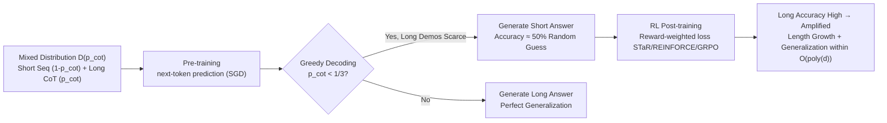

# How Reinforcement Learning after Next-Token Prediction Facilitates Learning

**Conference**: ICLR 2026  
**OpenReview**: [https://openreview.net/forum?id=CTGpC7xWHM](https://openreview.net/forum?id=CTGpC7xWHM)  
**Code**: To be confirmed  
**Area**: learning theory  
**Keywords**: Reinforcement learning theory, Chain-of-Thought, Parity, next-token prediction, GRPO/STaR, sample complexity separation, test-time compute  

## TL;DR
This paper uses a provable toy model of "parity + a mixed distribution of long/short Chain-of-Thought" to rigorously characterize, for the first time from an optimization theory perspective, why "next-token pre-training followed by RL post-training" enables learning difficult tasks that pure pre-training cannot, while explaining the mechanism behind increasing response lengths during RL.

## Background & Motivation
- **Background**: The success of reasoning models like o1 and DeepSeek-R1 relies on a recipe of "autoregressive Transformers performing next-token prediction (NTP) for pre-training, followed by RL (with correctness rewards) for post-training." The post-training phase is often accompanied by a significant increase in response length (the "thinking process"). While empirically effective, **theoretical explanations for why this works are lacking**.
- **Limitations of Prior Work**: Existing theories either analyze how supervised learning/CoT makes hard functions learnable, or focus on RL convergence. **No prior work has established a provable separation between "NTP" and "NTP+RL" in an autoregressive setting**, nor has the reason why "RL increases response length" been explained from an optimization perspective.
- **Key Challenge**: Tasks such as $d$-bit parity (XOR) are considered to require exponential samples/iterations for direct neural network prediction. However, if data **occasionally** includes long CoT demonstrations with intermediate steps, the task becomes efficiently learnable. The problem is: why does pre-training fail when long demonstrations are **scarce**, and how does RL rapidly remedy this?
- **Goal**: To answer three questions in a provable simplified setting: (1) why the pre-training stage fails to generalize; (2) why RL achieves rapid improvements with very few samples; and (3) what optimization pressure causes responses to become longer.
- **Key Insight**: **[Modeling Assumption]** Internet-scale data is modeled as a mixture distribution $\mathcal{D}(p_{\text{cot}})$ of "short demonstrations (input and answer only) + rare long demonstrations (full intermediate calculation chains)". **[Key Insight]** During pre-training, the model learns from long demonstrations significantly faster than from short ones while remaining "length-calibrated." RL, through reward-weighted loss, **amplifies the proportion of long answers in the training batch** (as long answers have higher accuracy), thereby driving length growth and ultimately achieving generalization.

## Method

### Overall Architecture
The paper constructs a minimal analytically tractable learning problem: predicting the parity $\prod_{i=1}^d x_i$ of $d$ bits $\pm1$. Data is sampled from a mixture distribution $\mathcal{D}(p_{\text{cot}})$, which provides a "long sequence" (full CoT of prefix products $x_1, x_1x_2, \dots, \prod x_i$) with probability $p_{\text{cot}}$, and a "short sequence" (final answer only) with probability $1-p_{\text{cot}}$. Training is split into two phases: NTP pre-training, followed by RL post-training (STaR / REINFORCE / GRPO + correctness rewards). The paper first performs empirical studies on Transformers (Sec. 3), then proves theorems on a "chain of autoregressive linear models" (Sec. 4), and finally validates the generality of these phenomena on multiplication and Llama-3-8B mathematical reasoning (Sec. 5).

### Key Designs

**1. Mixed CoT Distribution $\mathcal{D}(p_{\text{cot}})$:** Formalizes the observation that internet data occasionally contains long demonstrations. Input $x_1,\dots,x_d \sim \text{Rad}(1/2)$, and the output format is determined by a Bernoulli variable $Z\sim\text{Ber}(p_{\text{cot}})$. If $Z=1$, the output is a full chain $(x_1, x_1x_2, \dots, \prod_{i=1}^d x_i, \texttt{<EOS>})$; if $Z=0$, the output is only $(\prod_{i=1}^d x_i, \texttt{<EOS>})$. This compresses the observation that hard tasks have rare but correct detailed solutions into a provable model with a single tunable parameter $p_{\text{cot}}$.

**2. Pre-training "Length Calibration" and the Critical Threshold $p_{\text{cot}}=1/3$:** Explains why pre-training fails with scarce long demonstrations. Theorem 1 proves that autoregressive models learn long demonstrations much faster than short ones during pre-training and remain **length-calibrated**—i.e., the probability of generating a long answer matches the proportion of long demonstrations in the data. Consequently, under **greedy decoding**, the model only chooses the "long answer" path if $p_{\text{cot}}$ is sufficiently large. If $p_{\text{cot}}<1/3$, greedy decoding collapses to short answers with 50% accuracy (random guessing), precisely matching the threshold observed in Transformer experiments. The key conclusion: failure is due to **estimation (sample) limits**, not model capacity (approximation).

**3. Reward-weighted Loss Amplifying Long Answers → Length Growth Mechanism:** Post-training uses STaR/REINFORCE-style algorithms, sampling multiple answers per prompt and applying a correctness reward (end-to-end $r_{\text{e2e}}$ or per-step $r_{\text{cot}}$). Since **long answers have a much higher correctness probability than short answers**, the effective proportion of long answers in the batch is amplified after reward weighting, which is equivalent to pushing $p_{\text{cot}}$ upward. This provides an optimization explanation for why RL makes answers longer: length growth is a byproduct of rewarding correctness, not explicitly encouraged.

**4. Provable Separation and Rapidity on Autoregressive Linear Models (Theorem 2):** Using a "chain of linear models" architecture (Malach 2024), the paper proves that if long demonstrations are not exponentially rare ($p_{\text{cot}}$ is not exponentially small relative to $d$), NTP pre-training + STaR post-training can learn parity within $O(\text{poly}(d))$ iterations. Specifically, only $O\!\left(\log\frac{1-p_{\text{cot}}}{p_{\text{cot}}}\right)$ rounds of RL are needed to achieve generalization, characterizing the "rapid takeoff" observed in experiments when RL begins. This is the **first theoretical separation between NTP and NTP+RL** in an autoregressive setting.

## Key Experimental Results

### Main Results (Parity, Transformer trained from scratch)

| Setting | Pre-training (NTP only) | Post-training (NTP + RL/GRPO) |
|------|------------------|--------------------------|
| $d=50, p_{\text{cot}}=0.25$ Greedy Accuracy | Stalls at ~50% (Random Guess) | Rapidly rises to ~100% after RL begins |
| Answer Length (Median Greedy) | Short (≈1) | Increases significantly (→ approaches $d$) |
| Sample Volume | Fails even after millions of sequences | Generalizes in ~20 RL rounds |

### Ablation Study

| Variable | Phenomenon |
|------|------|
| Mixture Weight $p_{\text{cot}}$ ($d=25$) | Critical threshold ≈ $1/3$: pre-training succeeds if $p_{\text{cot}}\gtrsim1/3$ and fails otherwise, consistent with theory |
| RL Algorithms (STaR/REINFORCE/GRPO) | All algorithms improve accuracy and increase length during post-training; phenomenon is robust |
| Sampling Temperature $\tau_{\text{RL}}$ | Temperature affects exploration and length growth speed, but the generalization trend remains consistent |

### Key Findings
- Failure is caused by **estimation (sample) limits, not approximation (capacity) limits**: increasing model depth or width does not solve the problem; only RL (by changing the effective data distribution) can.
- The acceleration from RL comes from "amplifying existing rare long demonstrations" rather than learning new abilities from scratch—post-training requires only a logarithmic number of rounds.
- The phenomenon is replicated in multiplication tasks and Llama-3-8B on variants of GSM8K/MATH, suggesting the toy model captures the core mechanism of real-world reasoning post-training.

## Highlights & Insights
- **Translates vague empirical phenomena into provable theorems**: Uses parity and a single-parameter mixture distribution to ground "why RL post-training is effective" and "why answers lengthen" into optimization analysis with explicit convergence rates.
- **The alignment between the $1/3$ threshold theory and experimental results** provides strong evidence that the toy model captures real mechanisms.
- **Redefines "what RL learns"**: RL does not necessarily learn new skills but rather **re-weights the data distribution** to amplify rare, correct solutions already present during pre-training—offering a clean perspective on whether RL introduces "new capabilities."

## Limitations & Future Work
- The core theorem is based on a **chain of autoregressive linear models** rather than a real Transformer; a theoretical bridge from analytically tractable architectures to attention is still missing.
- The tasks are limited to verifiable problems with **unique, deterministic intermediate chains** (parity/multiplication); it is unknown if the conclusions hold for open-ended or multi-solution reasoning tasks with noisy rewards.
- The "non-exponential scarcity of long demonstrations" is a key premise. If correct long solutions for a hard task are exponentially scarce in the data, this framework predicts RL will also fail.
- Analyzes only correctness rewards; how more complex rewards (process rewards, length penalties) change length dynamics remains for future study.

## Related Work & Insights
- **Parity/XOR Learning Difficulty**: Long considered a litmus test for neural network learnability (Shalev-Shwartz 2017, Abbe 2023); this paper uses its exponential difficulty to construct the separation.
- **Chain-of-Thought Learnability**: Previous work (Malach 2024, Wies 2023) proved that intermediate computation chains make hard functions learnable; this paper embeds this into a "rare long demo" mixture distribution.
- **RL Post-training Algorithms**: STaR (Zelikman 2022) and GRPO (Shao 2024) are the analyzed objects; this paper provides optimization guarantees for them in this setting.
- **Insight**: Provides direct guidance for data mixture design—rather than pursuing massive amounts of short samples, ensure that a **small but sufficient (non-exponentially rare) amount of full reasoning demonstrations** exists, and then let RL amplify them.

## Rating
- **Novelty**: ⭐⭐⭐⭐⭐ First theoretical separation of NTP vs NTP+RL in an autoregressive setting and the first optimization result for RL-induced length growth.
- **Experimental Thoroughness**: ⭐⭐⭐⭐ Solid ablations on toy tasks across multiple algorithms/hyperparameters; generalizability verified on Llama-3-8B, though real-world LLM experiments remain limited in scale.
- **Writing Quality**: ⭐⭐⭐⭐ Clear interplay between theory and experiments; the theory-experiment alignment on thresholds is convincing.
- **Value**: ⭐⭐⭐⭐⭐ Provides a first-principles explanation for core LLM training recipes, offering long-term reference value for understanding and designing reasoning model training.

<!-- RELATED:START -->

## Related Papers

- [\[ICLR 2026\] Physics-informed learning under mixing: How physical knowledge speeds up learning](physics-informed_learning_under_mixing_how_physical_knowledge_speeds_up_learning.md)
- [\[ICLR 2026\] How hard is learning to cut? Trade-offs and sample complexity](how_hard_is_learning_to_cut_trade-offs_and_sample_complexity.md)
- [\[ICLR 2026\] The Lie of the Average: How Class Incremental Learning Evaluation Deceives You?](the_lie_of_the_average_how_class_incremental_learning_evaluation_deceives_you.md)
- [\[ICLR 2026\] High-Dimensional Analysis of Single-Layer Attention for Sparse-Token Classification](high-dimensional_analysis_of_single-layer_attention_for_sparse-token_classificat.md)
- [\[ICLR 2026\] Sharp Asymptotic Theory for Q-Learning with LD2Z Learning Rate and Its Generalization](sharp_asymptotic_theory_for_q-learning_with_textttld2z_learning_rate_and_its_gen.md)

<!-- RELATED:END -->
