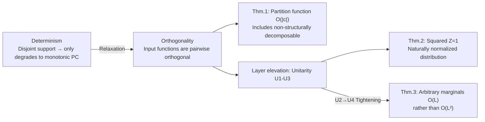

# How to Square Tensor Networks and Circuits Without Squaring Them

**Conference**: ICLR 2026  
**OpenReview**: [https://openreview.net/forum?id=gHPRSPxIsk](https://openreview.net/forum?id=gHPRSPxIsk)  
**Code**: Open sourced (provided in the Reproducibility Statement)  
**Area**: Learning Theory / Probabilistic Circuits / Tensor Networks  
**Keywords**: Squared Probabilistic Circuits, Tensor Networks, Orthogonality, Unitary Parameterization, Marginalization, Born machine  

## TL;DR
By unifying "orthogonality" in tensor network canonical forms and "determinism" in circuits into a new family of structural properties (orthogonality/unitarity), the normalization and marginalization of squared probabilistic circuits (squared PC) are reduced from $O(|c|^2)$ to $O(|c|)$. This enables efficient marginalization of "non-structurally decomposable" squared circuits for the first time—without actually materializing the squared circuit expansion.

## Background & Motivation
**Background**: Tensor networks (TN) and circuits (which generalize TNs into computation graphs) are both highly expressive distribution estimators. To ensure a circuit $c$ with real/complex parameters represents a valid probability distribution, a common approach is to take the squared magnitude $p(x)=Z^{-1}|c(x)|^2$ (i.e., Born machine / squared PC). This maintains closed-form marginalization while achieving expressivity far exceeding monotonic PCs (with non-negative parameters).

**Limitations of Prior Work**: This squaring step comes with a cost. To calculate the partition function $Z=\int|c(x)|^2\mathrm{d}x$ or any marginal, one must multiply $c$ with its conjugate $c^*$, materializing as another decomposable circuit. This causes the size to explode to $O(|c|^2)$, meaning the computation of the partition function and all marginals suffers from quadratic complexity. This puts squared PCs at a disadvantage in scenarios requiring efficient and exact conditioning, such as sampling or lossless compression.

**Key Challenge**: Tensor networks offer a potential solution through "canonical forms" using (semi-)unitary matrix parameterization, ensuring $|\psi|^2$ is naturally normalized ($Z=1$) and simplifying marginals. However, canonical forms have two major drawbacks: (1) each TN type (MPS/TTN) requires different left/right/mixed canonical forms, each serving only specific marginals; (2) they **only correspond to known TN structures** and cannot handle the "free-form" factorizations in circuits that do not correspond to any known tensor decompositions.

**Goal**: Extract the core principles behind canonical forms and reformulate them into structural properties in the language of circuits, such that (i) marginalization of squared PCs is reduced to linear time, and (ii) the properties cover a larger set of factorizations than TNs, including non-structurally decomposable circuits.

**Key Insight**: The authors discovered that "orthogonality" in TN canonical forms and the classical circuit property "determinism" (where sum unit inputs have pairwise disjoint supports) are essentially two sides of the same coin. By relaxing determinism to "orthogonality"—requiring the input functions of sum units to be pairwise orthogonal (inner product of 0) rather than having disjoint supports—one can retain the expressivity advantages of real/complex parameters while causing cross-terms in the squared circuit to cancel out, thus avoiding the need to materialize the squared circuit.

## Method

### Overall Architecture
The paper builds conditions step-by-step from "scalar units" to "layers" in three stages: first, it relaxes determinism with **orthogonality** (Def. 5) at the scalar sum unit level, proving that the partition function of orthogonal circuits can be computed in linear time (Thm. 1). Second, for GPU-friendly tensorized circuits, it elevates orthogonality to layer-level **unitarity** conditions U1–U3 (orthonormal input functions + semi-unitary weight matrices), ensuring $Z=1$ after squaring (Thm. 2). Finally, by adding a stricter condition U4, it provides an algorithm that marginalizes any variable subset in $O(L)$ rather than $O(L^2)$ time (Thm. 3). Crucially, the **circuit is never actually squared**; instead, the cancellations provided by orthogonality are used to skip the integration of cross-terms.

### Key Designs

**1. Orthogonality Relaxing Determinism: Using Cancellation Instead of Disjoint Support**  
The starting point is an observation of a 2-variable MPS: if the left factor satisfies orthonormality $\langle\psi_1^i|\psi_1^j\rangle=\delta_{ij}$, then the double sum in the marginal $p(x_2)=\int|\psi(x_1,x_2)|^2\mathrm{d}x_1$ collapses into a single sum $\sum_i|\psi_2^i(x_2)|^2$ because the inner products of cross-terms ($i\neq j$) are zero. The authors noted that if factors had **disjoint support** (determinism), the complexity would similarly reduce from $O(R^2)$ to $O(R)$—which is the case for squared PCs using determinism. However, determinism has a fatal side effect: squaring a deterministic circuit is equivalent to replacing weights and inputs with their squared magnitudes, resulting in non-negative activations and losing the advantage of real/complex parameters (degrading to a monotonic PC). Thus, the authors keep the "cancellation" mechanism but abandon "disjoint support," defining **ortho-decomposability** (Def. 5): any two distinct inputs of a smooth sum unit $n$ satisfy $\int_{\mathrm{dom}(Z)}c_i(z)c_j(z)^*\mathrm{d}z=0$. Orthogonality strictly generalizes determinism in non-monotonic cases. Thm. 1 further proves that for smooth, decomposable, and orthogonal circuits, the partition function can be computed in $O(|c|)$—**even if it is not structurally decomposable**, a task that is generally #P-hard. The trick is using orthogonality-driven cancellation to avoid integrating "incompatible circuit products."

**2. From Orthogonality to Unitarity: Moving Scalar Conditions to Layers for Tensorized Circuits**  
Scalar-level "regular orthogonality" (Def. 7: basis decomposability + orthogonality of input functions on the same variable) is too restrictive, requiring each sum input to depend on **different** input functions. However, tensorized circuits (Def. 8) running on GPUs are densely connected layers—a sum layer is a matrix-vector product with $W\in\mathbb{C}^{K_1\times K_2}$, where sums within a layer share input functions and are not basis decomposable (e.g., TTN). The authors therefore reformulate the conditions at the layer level, proposing **unitarity** U1–U3: (U1) each input layer encodes $K$ orthonormal functions $\int f_i f_j^*=\delta_{ij}$ on the same variable; (U2) input layers of each sum layer do not share input layers on **at least one** variable (a relaxed basis decomposability); (U3) each sum layer is parameterized by a (semi-)unitary matrix $WW^\dagger=I_{K_1}$ (row-orthonormal). Thm. 2 proves that circuits satisfying U1–U3 are orthogonal and $Z=1$ after squaring, making them **naturally normalized**. This aligns with the spirit of the upper-canonical form in TTNs, but the authors' unitarity can construct **non-structurally decomposable** circuits (Fig. 4: the same scope decomposed differently by various products), covering a strictly larger set of factorizations.

**3. Tighter Marginalization Complexity: Tightening U2 to U4 to Skip Cancelling Layers**  
Existing algorithms require $O(L^2 S_{\max}^2)$ for arbitrary marginals (first materializing the square, then a forward pass). The authors' core observation is that when computing marginals, layers whose scope depends only on integrated variables simplify to identity matrices and do not need to be computed. Furthermore, instead of squaring the entire circuit, one only needs to square the small subset of layers that "depend on both marginalized and retained variables," reducing part of the complexity from $S_{\max}^2$ back to $S_{\max}$. To enable marginalization of **any** variable subset, U2 is tightened from "$\exists X$" to "$\forall X$", yielding **U4**: input layers of each sum layer do not share input layers across **all** variables. With U4, all pairwise products between sum layer inputs vanish due to orthogonality, allowing the entire integration of those layers to be skipped. Thm. 3 provides a complexity of $O(|\phi_{Y\setminus Z}|S_{\max}+|\phi_{Y\cap Z}|S_{\max}^2)$ (where $\phi_\star$ is the set of layers with scope involving variables in $\star$), which in the best case is $O(|\phi_{Y\setminus Z}|S_{\max})$, reducing the overall cost from $O(L^2)$ to $O(L)$. Compared to TN canonical forms, this algorithm **does not require re-parameterizing for every marginal**, and naturally generalizes to non-structurally decomposable circuits.

## Key Experimental Results
The experiments aim to answer three RQs: whether unitary circuits are faster and more memory-efficient (RQ1); whether learning unitary squared PCs sacrifices performance (RQ2); and whether non-structurally decomposable squared PCs can be trained efficiently for the first time (RQ3). The baseline $\pm^2_{\mathbb{C}}$ uses Hadamard product layers with explicit $Z$ calculation; ours $\perp^2_{\mathbb{C}}$ uses Kronecker product layers + unitary parameterization. Optimization uses LandingSGD (a retraction-free optimizer on the Stiefel manifold) adapted for this scenario.

### Main Results (RQ1 Throughput + RQ2 Performance)

| Setting | Model | Key Results |
|------|------|----------|
| Large Scale (357M params) | $\perp^2_{\mathbb{C}}$ Kronecker | 12 GiB VRAM / 0.29 ms per step |
| Large Scale (357M params) | $\pm^2_{\mathbb{C}}$ Hadamard Baseline | 18 GiB VRAM / 0.52 ms per step |
| MNIST Density Estimation | $\perp^2_{\mathbb{C}}$ vs $\pm^2_{\mathbb{C}}$ | bpd decreases smoothly with scale, **matching** baseline (approx. 1.20) |
| FashionMNIST Density Estimation | $\perp^2_{\mathbb{C}}$ vs $\pm^2_{\mathbb{C}}$ | bpd matches baseline (approx. 3.5) |

### Ablation Study / Key Comparisons

| Comparison Dimension | Observation |
|----------|------|
| Kronecker vs Hadamard product layers | Kronecker is significantly better in practice, so unitary PCs use Kronecker |
| Structurally vs Non-structurally Decomposable (RQ3) | Non-structurally decomposable unitary PCs are trainable and competitive at scale, but harder to learn |
| Fourier vs Gaussian input functions (App D.1) | Fourier inputs are comparable to Gaussian for density estimation |
| Optimizer LandingSGD vs Adam (Fig. 5a) | Landing series enables retraction-free optimization on Stiefel manifolds, making large-scale unitary training feasible |

### Key Findings
- **RQ1**: Unitary squared PCs are consistently faster and more memory-efficient because they never materialize the square to calculate $Z$. This allows Kronecker layers (which would otherwise explode in size when squared) to scale to billions of parameters. At 357M parameters, VRAM usage dropped from 18 to 12 GiB, and step time from 0.52 to 0.29 ms, saving roughly 1/3 of resources.
- **RQ2**: Unitary constraints (despite the difficulty of Stiefel manifold optimization) do not sacrifice distribution estimation performance, matching the bpd of non-unitary baselines. This echoes the theory that adding semi-unitary weights is possible in polynomial time without losing expressive efficiency (App. A.9). In other words, the normalization "free lunch" is real—saving computation without losing accuracy.
- **RQ3**: For the first time, non-structurally decomposable squared PCs are trained efficiently. Previously, these were untreatable because squaring them was #P-hard. Now, they are feasible via unitarity and are competitive with structurally decomposable versions at large scales (Fig. 5b, grey line).

## Highlights & Insights
- **Conceptual Unification**: The paper reveals that TN canonical forms (orthogonality) and circuit determinism are manifestations of the same principle in different languages—"exchanging squaring for cancellation." This is the paper's most elegant insight.
- **Bypassing #P-hardness**: Since squared marginalization of non-structurally decomposable circuits is generally #P-hard, using orthogonality to "legally skip" incompatible product integrations is a genuine breakthrough from a complexity theory perspective.
- **Marginalization Without Re-parameterization**: Unlike TN canonical forms that require parameter adjustments for each marginal, unitary circuits use a single set of parameters to support rapid calculation of any marginal, which is much more engineering-friendly.
- **Retaining Real/Complex Parameters**: Unlike determinism (which degrades to non-negative monotonic PCs after squaring), orthogonality allows for the expressivity gains of real/complex parameters, which is the key value of relaxing rather than simply replacing determinism.
- **Theory and Engineering Loop**: From complexity theorems (Thm. 1–3) to practical layer-based algorithms (Alg. A.3) and manifold optimizers, the paper connects "why it saves" and "how to save" completely.
- **Opening New Design Spaces**: Both theory and experiments suggest that non-structurally decomposable factorizations (which may be exponentially more expressive) now have a trainable entry point, providing a new direction for designing stronger PCs/TNs.

## Limitations & Future Work
- **Expressivity Analysis is Preliminary**: The authors prove that enforcing orthogonality on smooth & decomposable circuits is #P-hard and speculate that certain functions cannot be encoded by polynomial-sized orthogonal circuits (analogous to deterministic circuits), but this remains a conjecture without a separation theorem.
- **Non-structurally Decomposable Circuits are Harder to Learn**: RQ3 shows that while these circuits are trainable and competitive at scale, optimization is more difficult, and no exponential expressivity jump was observed in experiments yet.
- **Engineering Challenges in Orthogonal Optimization**: Stiefel manifold / semi-unitary optimization is still an active field. The authors rely on LandingSGD, and performance is subject to progress in that area.
- **Narrow Evaluation Scope**: Validation is limited to MNIST/FashionMNIST density estimation. It has not yet covered broader distribution estimation tasks like tabular data or text.
- **Outlook**: Future work may extend orthogonality to properties "between two circuits" (similar to how Wang et al. (2024) extended determinism) to simplify combinatorial operations like causal inference or weighted model counting, and further clarify the expressivity of this new circuit class relative to others like positive unital circuits.

## Related Work & Insights
- **Squared PC / Born machine**: The Loconte et al. (2024, 2025a;b) series established the foundation for "real/complex parameters + squaring" to boost PC expressivity. This paper directly addresses the normalization/marginalization overhead of squaring.
- **Circuit Structural Properties**: The smoothness / decomposability / compatibility / determinism framework (Vergari et al. 2021, Darwiche & Marquis 2002) serves as the language for this paper's condition design, adding ortho-decomposability, basis decomposability, and unitarity to the taxonomy.
- **TN Canonical Forms**: Left/right/upper canonical forms of MPS/TTN (Orús, Cheng et al.) inspired using unitary matrices for normalization; this paper abstracts and generalizes these to circuits.
- **Manifold Optimization**: Retraction-free manifold optimization and LandingSGD (Ablin & Peyré) are critical tools that make unitary constraint training feasible.
- **Basis Decomposability and Regular Selective Circuits**: The "regular selective" construction for deterministic circuits (Peharz et al. 2014, Lowd & Rooshenas 2013) was adapted as a template for constructing "regular orthogonal" circuits.
- **Insight**: This research paradigm of "identifying isomorphic algebraic structures in two domains, then unifying and relaxing them with more general language" is an excellent reference for other expressivity-vs-tractability trade-offs.

## Rating
- Novelty: ⭐⭐⭐⭐⭐ Unifying TN orthogonality with circuit determinism and relaxing it into orthogonality/unitarity to enable efficient marginalization for non-structurally decomposable squared circuits is a solid and original conceptual contribution.
- Experimental Thoroughness: ⭐⭐⭐ Validated throughput, performance, and trainability across three RQs on MNIST/FashionMNIST and scaled to a billion parameters; however, the dataset count is small, lacking comparison on broader distribution estimation benchmarks.
- Writing Quality: ⭐⭐⭐⭐ Logical progression from determinism to orthogonality to unitarity; definitions and theorems are clearly organized, though the conceptual density and notation may be challenging for readers unfamiliar with the circuit framework.
- Value: ⭐⭐⭐⭐ Resolves a core efficiency bottleneck for squared PCs and opens the door for training non-structurally decomposable factorizations, providing a substantial push for the tractable probabilistic modeling community.

<!-- RELATED:START -->

## Related Papers

- [\[ICLR 2026\] Two Failure Modes of Deep Transformers and How to Avoid Them: A Unified Theory of Signal Propagation at Initialisation](two_failure_modes_of_deep_transformers_and_how_to_avoid_them_a_unified_theory_of.md)
- [\[ICLR 2026\] Subspace Kernel Learning on Tensor Sequences](subspace_kernel_learning_on_tensor_sequences.md)
- [\[ICLR 2026\] FACT: a first-principles alternative to the Neural Feature Ansatz for how networks learn representations](fact_a_first-principles_alternative_to_the_neural_feature_ansatz_for_how_network.md)
- [\[ICLR 2026\] On Universality of Deep Equivariant Networks](on_universality_of_deep_equivariant_networks.md)
- [\[ICLR 2026\] How hard is learning to cut? Trade-offs and sample complexity](how_hard_is_learning_to_cut_trade-offs_and_sample_complexity.md)

<!-- RELATED:END -->
