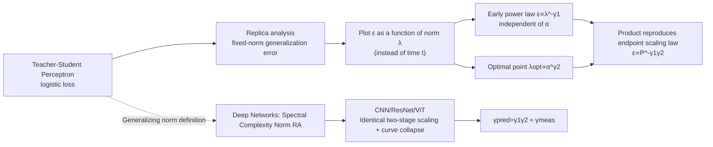

# Implicit bias produces neural scaling laws in learning curves, from perceptrons to deep networks

**Conference**: ICLR 2026  
**OpenReview**: [https://openreview.net/forum?id=qBAV2DEvAC](https://openreview.net/forum?id=qBAV2DEvAC)  
**Code**: TBD  
**Area**: learning_theory  
**Keywords**: Neural Scaling Laws, Implicit Bias, Perceptron, Statistical Mechanics, Learning Curves, Spectral Complexity, Replica Method  

## TL;DR
The authors propose a new perspective that plots learning curves throughout the training process as a function of the model norm $\lambda(t)$. Within a perceptron, two **dynamic scaling laws** are analytically derived using statistical mechanics, proving their product reproduces the classic "test error vs. dataset size" endpoint scaling law; these patterns also hold for CNN / ResNet / ViT, rooted in the implicit bias of gradient training.

## Background & Motivation
- **Background**: Neural scaling laws (the power-law decay of test error with data/model/compute) have become one of the most robust empirical laws in deep learning, serving as the foundation for "compute-optimal" works like Kaplan and Chinchilla. However, the vast majority of research focuses strictly on asymptotic behavior at the **end of training** (convergence point), compressing the entire training trajectory into a single point.
- **Limitations of Prior Work**: Another parallel theoretical line—the **implicit bias** of gradient descent (e.g., logistic loss on linearly separable data converging to the maximum margin solution)—is used only to explain "why the endpoint generalizes well." No connection has been made between this and "scaling behavior throughout training." The two lines of research remain disconnected.
- **Key Challenge**: Empirical scaling laws are "macroscopic, endpoint-focused, and lack clear mechanisms"; implicit bias theory is "microscopic, analytical, but limited to the endpoint." The scaling structure of the training dynamics in between remains a void.
- **Goal**: Characterize the scaling structure of the **entire learning curve**, provide an analytical explanation based on implicit bias, and eventually bridge "dynamic scaling laws" with classic "endpoint scaling laws."
- **Core Idea**: **[Key Insight]** Instead of plotting the learning curve as a function of time $t$, plot it as a function of the **weight norm $\lambda(t)$**. Because implicit bias causes the norm to grow monotonically during training, $\lambda(t)$ is a more fundamental measure of "training progress" than $t$. After this coordinate transformation, the previously messy curves reveal two clean power-law sections.

## Method

### Overall Architecture
The paper follows a two-step process: "analyzable perceptrons → non-analyzable deep networks." First, in a teacher–student perceptron, the generalization error under a fixed-norm is analytically derived using the replica method. Plotting error against $\lambda$ naturally identifies early/late scaling regions, leading to two power laws: $\hat\epsilon\propto\lambda^{-\gamma_1}$ and $\lambda_{\text{opt}}\propto\alpha^{\gamma_2}$. Their product reproduces the classical endpoint scaling law $\epsilon\propto P^{-\gamma_1\gamma_2}$. Then, the "norm" is generalized to the **spectral complexity norm** for deep networks, verifying that the same dual-stage scaling and curve collapse recur in CNN/ResNet/ViT.

### Key Designs

**1. Using Norm $\lambda$ as the "Training Schedule": A Bridge Between Fixed-norm and Free-norm.** The logistic loss $V_\lambda(\Delta)=-\frac{1}{\lambda}(\lambda\Delta-\log 2\cosh(\lambda\Delta))$ acts only through the product $\lambda\Delta$, while the margin $\Delta=y(w\cdot x/\sqrt N)$ is proportional to the weight norm $\|w\|$. This implies that "fixing the norm and tuning the hyperparameter $\lambda$" is mathematically equivalent to "fixing $\lambda=1$ and letting the norm grow freely $\|w(t)\|\equiv\lambda(t)$." Each point in the former represents the **training endpoint of different perceptrons** (calculable via replica), while the latter represents the **training trajectory of a single perceptron** (numerical training). The paper demonstrates that these curves coincide on the $\epsilon$–$\lambda$ plane, allowing static solutions to describe dynamics—a manifestation of "implicit bias during training."

**2. Three $\lambda$ Intervals for Logistic Loss: From Hebb to Bayes Optimal to Maximum Stability.** Analytical solutions show generalization error passes through three stages as $\lambda$ increases: As $\lambda\to0$, $V\to-\Delta$, degenerating into **Hebb learning**, yielding baseline error $\epsilon_0$ ($\epsilon_0\sim\alpha^{-1/2}$ for large $\alpha$); at a finite $\lambda_{\text{opt}}(\alpha)$, error reaches a minimum that **exactly equals the generalization error of the Bayes optimal predictor**; as $\lambda\to\infty$, $V\to-2\Delta\theta(-\Delta)$, corresponding to the **maximum stability perceptron** (max-margin solution), after which overfitting begins. Thus, a training curve is interpreted as an implicit bias journey through "Hebb, then Bayes optimal, and finally max-stability."

**3. Two Dynamic Scaling Laws and Their Product Reproducing the Endpoint Law.** Plotting relative error $\hat\epsilon\equiv\epsilon/\epsilon_0$ against $\lambda$ shows a split into two segments for large $\alpha$: an early **$\alpha$-independent** power law $\hat\epsilon=k_1\lambda^{-\gamma_1}+q_1$ (Eq. 2), and an optimal position following $\lambda_{\text{opt}}=k_2\alpha^{\gamma_2}+q_2$ (Eq. 3). Re-scaling each curve by its respective $(\lambda_{\text{opt}},\hat\epsilon_{\text{opt}})$ causes all large $\alpha$ curves to **collapse onto a single master curve** $\hat\epsilon/\hat\epsilon_{\text{opt}}=\Phi(\lambda/\lambda_{\text{opt}})$ (Eq. 4). Since the entire curve follows the same power law with $\alpha$, substituting Eq. 3 into Eq. 2 yields the endpoint scaling law $\hat\epsilon(\alpha)=k_1(k_2\alpha^{\gamma_2}+q_2)^{-\gamma_1}+q_1$ (Eq. 5), which simplifies to $\epsilon\sim\alpha^{-\gamma_1\gamma_2}$ in perceptrons. With fixed-norm $\gamma_1=1/2, \gamma_2=1$, it perfectly recovers $\gamma=\gamma_1\gamma_2=1/2$. The appendix uses MSE loss as a counterexample, showing these laws are specific to logistic/implicit bias and not universal to all losses.

**4. Generalizing "Norm" to Deep Networks: Spectral Complexity Norm.** Since deep networks lack a clean $\|w\|$, the authors adopt the **spectral complexity norm** from Bartlett et al., $R_A=\big(\prod_i\rho_i\|A_i\|_\sigma\big)\big(\sum_i \|A_i^\top-M_i^\top\|_{2,1}^{2/3}/\|A_i\|_\sigma^{2/3}\big)^{3/2}$ (Eq. 6): the first part is the product of maximum singular values across layers, and the second estimates the effective rank of layer outputs. Setting $\lambda(t)=R_A(t)$ (measured after epoch $t$), $\lambda(t)$ grows monotonically without weight decay. The authors note the relationship between $\lambda$ and $t$ is non-trivial—plotting $\epsilon(t)$ **does not reveal** scaling laws; only plotting $\epsilon(\lambda(t))$ uncovers the dual-stage scaling and curve collapse consistent with the perceptron. Other norm definitions in the appendix show qualitative dual stages but provide inconsistent $\gamma_{\text{pred}}$, suggesting spectral complexity is the "correct" metric.

## Key Experimental Results

### Main Results
On CNN / ResNet / ViT × MNIST / CIFAR-10 / CIFAR-100 (standard hyperparameters, no weight decay), the predicted endpoint exponent $\gamma_{\text{pred}}=\gamma_1\gamma_2$ (from independently fitted $\gamma_1, \gamma_2$) is compared with $\gamma_{\text{meas}}$ (from direct $\epsilon(P)$ fitting):

| Model | Dataset | $\gamma_{\text{pred}}$ | $\gamma_{\text{meas}}$ | $\sigma$ |
|------|--------|------|------|------|
| CNN | MNIST | 0.60 | 0.55 | 0.09 |
| CNN | CIFAR10 | 0.28 | 0.25 | 0.07 |
| CNN | CIFAR100 | 0.16 | 0.16 | 0.03 |
| ResNet | MNIST | 0.57 | 0.69 | 0.08 |
| ResNet | CIFAR10 | 0.54 | 0.56 | 0.04 |
| ResNet | CIFAR100 | 0.31 | 0.37 | 0.03 |
| ViT | MNIST | 0.47 | 0.54 | 0.03 |
| ViT | CIFAR10 | 0.23 | 0.21 | 0.03 |
| ViT | CIFAR100 | 0.14 | 0.12 | 0.04 |

Across nine configurations, $\gamma_{\text{pred}}$ and $\gamma_{\text{meas}}$ agree within the fitting error $\sigma$, demonstrating that "product of two dynamic laws = endpoint law" holds for real deep networks.

### Ablation Study

| Change | Phenomenon | Conclusion |
|------|------|------|
| Add moderate weight decay | $\gamma_1, \gamma_2$ change, but $\gamma_{\text{pred}}=\gamma_1\gamma_2$ remains consistent with non-WD case | Scaling laws are robust to regularization |
| Adam → SGD (CNN) | Dynamic curve deforms; $\gamma_1, \gamma_2$ differ | $\gamma_{\text{pred}}$ remains invariant, reproducing Hestness endpoint law |
| 4 Alternative norm definitions | Qualitative dual-stage scaling remains | $\gamma_{\text{pred}}$ and $\gamma_{\text{meas}}$ are inconsistent; only Spectral Complexity aligns |
| MSE loss (Perceptron) | No power-law scaling observed | Scaling laws are specific to logistic/implicit bias, not universal |

### Key Findings
- **Curve collapse appears at "finite $P$"**: Although each $P$ corresponds to a different loss landscape and increasing $P$ continues to lower error (far from $P\to\infty$), the early curves of large $P$ envelop all early curves of smaller $P$, collapsing self-similarly onto a master curve.
- **Early scaling is $\alpha$-independent (data size), late scaling is $\alpha$-dependent**: This provides a natural explanation for the research convention of "discarding models trained on too small datasets"—scaling is only clean at large $\alpha$.
- Numerical measurements of the free-norm perceptron yield $\gamma_1=0.4901\pm0.0005$ and $\gamma_2=0.96\pm0.25$, consistent with the fixed-norm analytical values of $1/2$ and $1$.

## Highlights & Insights
- **Coordinate Change as Insight**: The simple act of replacing the "time axis" with the "norm axis" transforms endpoint scaling laws from an "empirical black box" into a product of two analyzable sub-laws—a beautiful perspective shift.
- **Three Learning Rules in One Trajectory**: Hebb → Bayes Optimal → Max-stability are no longer isolated classical results but are unified as three stages on the same training trajectory, providing an "all-course" rather than "endpoint" image of implicit bias.
- **Alignment of Analyzable Models and Real Networks**: The combination of perceptron replica analysis and deep network spectral complexity norms allows conclusions from a statistical mechanics toy model to transfer successfully to ViT, with quantitatively matching exponents.
- **Practical Prediction**: Master curve collapse suggests generalization curve shapes can be measured on small data and extrapolated to large data, potentially saving compute (the authors honestly note this requires further robustness validation).

## Limitations & Future Work
- The "implicit bias during training" in perceptrons is currently primarily **qualitative**—the fixed-norm static solution only qualitatively matches free-norm dynamics. Quantitative precision would require Dynamical Mean Field Theory (DMFT) or methods similar to Wu et al. 2025 for full training dynamics.
- Deep networks **lack an analytical counterpart**: The spectral complexity norm is a "seemingly correct" candidate, but why it plays the role of $\|w\|$ in perceptrons and whether it can be quantified remains unknown.
- Experiments are limited to small-to-medium scale vision tasks (MNIST/CIFAR, CNN/ResNet/ViT), without touching LLMs, the primary arena for scaling laws.
- Free-norm perceptron training steps at large $\alpha$ and large $\lambda$ grow exponentially with $\lambda$, hindering direct $\gamma$ measurement and limiting verification on the pure dynamics side.
- **Outlook**: Test whether training while constraining spectral complexity to a preset $\lambda(t)$ trajectory reproduces the $\epsilon(\lambda)$ curve; extend the framework to square loss/regression, committee machines, etc. (Authors cite Montanari–Urbani 2025 as suggesting feasibility).

## Related Work & Insights
- **Empirical Neural Scaling Laws**: Hestness 2017, Kaplan 2020, Chinchilla (Hoffmann 2022), Caballero 2023 (broken scaling)—this work adds the microscopic mechanism of the "entire training process."
- **Implicit Bias**: Soudry 2018 (logistic convergence to max-margin), Lyu–Li 2020, Chizat–Bach 2020—this work extends "endpoint bias" to "all-course bias," complementing Wu et al. 2025 (trajectory bias under overparameterization).
- **Perceptron Statistical Mechanics**: Gardner 1987/1988 (storage capacity, teacher–student), Opper series (convergence time, Bayes optimal learning curves), Aubin 2020 (fixed-norm logistic regression solution, used here for normative growth derivation).
- **Training Time Scaling**: Velikanov–Yarotsky 2021, Bordelon 2024, Montanari–Urbani 2025 (dynamic regions and norm correlation in committee machines)—this work resonates with these and provides an analytical anchor.
- **Insight**: When studying "scaling laws of dynamic processes," finding a progress variable more fundamental than time (here, the norm) may be key to revealing hidden power-law structures; this approach is valuable for LLM training curves and optimization dynamics analysis.

## Rating
- **Novelty**: ⭐⭐⭐⭐⭐ The "learning curve as a norm function" perspective + reproducing the endpoint law from two dynamic laws is a genuine theoretical contribution, extending implicit bias from endpoint to trajectory.
- **Experimental Thoroughness**: ⭐⭐⭐⭐ 3 architectures × 3 datasets + weight decay / SGD / multiple norm ablations provide a solid chain of evidence; however, limited to small/medium vision tasks, lacks LLM data.
- **Writing Quality**: ⭐⭐⭐⭐ Clear narrative from analyzable perceptrons to deep networks; the statistical mechanics/replica sections may have high barriers for non-theory readers.
- **Value**: ⭐⭐⭐⭐ Provides a rare "mechanism-level" explanation for empirical scaling laws and hints at the practical potential of extrapolating large-data curves from small-data results. Significant for both scaling law theory and optimization dynamics communities.

<!-- RELATED:START -->

## Related Papers

- [\[ICLR 2026\] Scaling Laws and Spectra of Shallow Neural Networks in the Feature Learning Regime](scaling_laws_and_spectra_of_shallow_neural_networks_in_the_feature_learning_regi.md)
- [\[ICLR 2026\] Variational Deep Learning via Implicit Regularization](variational_deep_learning_via_implicit_regularization.md)
- [\[ICLR 2026\] Tversky Neural Networks: Psychologically Plausible Deep Learning with Differentiable Tversky Similarity](tversky_neural_networks_psychologically_plausible_deep_learning_with_differentia.md)
- [\[ICLR 2026\] Theory of Scaling Laws for In-Context Regression: Depth, Width, Context and Time](theory_of_scaling_laws_for_in-context_regression_depth_width_context_and_time.md)
- [\[ICLR 2026\] Saddle-To-Saddle Dynamics in Deep ReLU Networks: Low-Rank Bias in the First Saddle Escape](saddle-to-saddle_dynamics_in_deep_relu_networks_low-rank_bias_in_the_first_saddl.md)

<!-- RELATED:END -->
