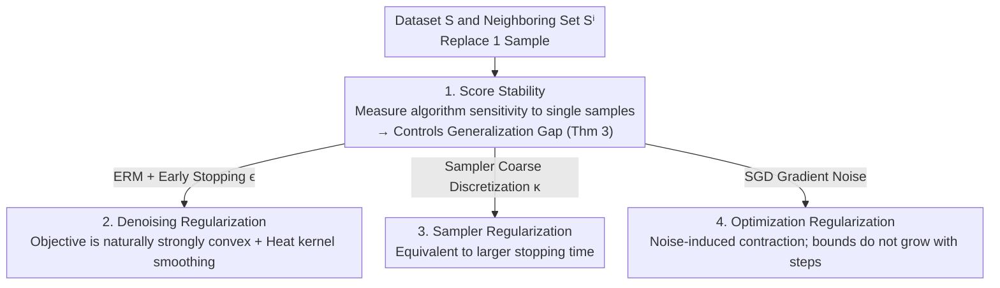

# Implicit Regularisation in Diffusion Models: An Algorithm-Dependent Generalisation Analysis

**Conference**: ICLR 2026  
**OpenReview**: [https://openreview.net/forum?id=3lSqgESdPu](https://openreview.net/forum?id=3lSqgESdPu)  
**Code**: None (Theoretical)  
**Area**: Learning Theory / Diffusion Models / Generalization Analysis  
**Keywords**: Diffusion Models, Implicit Regularization, Algorithmic Stability, Generalization Bounds, Score Matching

## TL;DR
This paper proposes "score stability," an **algorithm-dependent** generalization analysis framework that directly translates the sensitivity of a diffusion model to a single training sample into an upper bound on the generalization gap. Using this framework, the authors reveal three previously overlooked sources of implicit regularization: the denoising objective itself, the coarse-grained discretization of the sampler, and the gradient noise of SGD.

## Background & Motivation

**Background**: Diffusion models have achieved SOTA results in generating "new samples" of high-dimensional distributions for images, audio, video, and proteins using finite data. However, why they generalize rather than simply memorizing the training set remains theoretically unclear.

**Limitations of Prior Work**: A sharp fact is that if the empirical denoising score matching loss $\hat\ell_{\mathrm{dsm}}$ is fully minimized and followed by perfect sampling, the diffusion model will **precisely reproduce the training data** (the memorization phenomenon on CIFAR-10 in Fig 1). This occurs because the empirical objective has a **unique** minimum in the $L^2$ score function space—the empirical score function $\nabla\log\hat p_t$ (Lemma 1). This fundamentally differs from supervised learning, where empirical risk minimization often has infinite solutions and requires regularization to be well-posed. Therefore, the ability of diffusion models to produce new data implies they **did not truly minimize the objective or sample perfectly during training**—meaning some form of implicit regularization is key to generalization.

**Key Challenge**: Existing theories are mostly **algorithm-independent**. One class uses uniform convergence/covering numbers (Oko et al. 2023, etc.), where conclusions depend heavily on carefully selected network architectures and ignore the algorithm itself; another class (De Bortoli 2022) uses Wasserstein distance convergence with empirical measures, which is model-agnostic but ignores "how new data is generated." Other works retreat to restricted settings like Gaussian mixtures or random features to introduce algorithmic effects. Consequently, a gap exists: the lack of a **general, algorithm-dependent** generalization theory for diffusion models.

**Goal**: Construct a framework that utilizes the "algorithm promotes generalization" perspective without relying on specific model classes, and use it to **specifically locate** which implicit regularizations are at work in diffusion models.

**Key Insight**: Borrow the classic concept of **algorithmic stability** from learning theory—the less an algorithm depends on any single training sample, the better it generalizes. The authors adapt this into a version specifically designed to characterize score matching algorithms in diffusion models.

**Core Idea**: Define **score stability** $\varepsilon_{\mathrm{stab}}$ as "how much the learned score function changes after replacing one training sample," and prove that the generalization gap decays at the same rate. This "ruler" is then applied to three algorithmic components: ERM, the sampler, and SGD, to identify hidden regularizations.

## Method

### Overall Architecture

The "method" of this paper is an analytical chain: **first, create a ruler to measure algorithmic sensitivity (score stability); prove this ruler directly controls the generalization gap; then apply this ruler to the three real-world algorithmic stages of diffusion training/sampling to extract their respective implicit regularizations.**

Specifically: Given a dataset $S=\{x_1,\dots,x_N\}$, construct a **neighboring dataset** $S^i$ by replacing the $i$-th sample with an independent new sample $\tilde x$. Comparing the difference between the score functions $\hat s$ and $\hat s^i$ trained on $S$ and $S^i$ yields the score stability constant $\varepsilon_{\mathrm{stab}}$. Theorem 3 converts this constant into an upper bound for the generalization gap. The subsequent sections estimate $\varepsilon_{\mathrm{stab}}$ for **Empirical Risk Minimization (ERM, corresponding to denoising regularization)**, **discrete-time samplers (sampler regularization)**, and **SGD with clipping and weight decay (optimization regularization)**.

### Key Designs

**1. Score Stability: Translating score change into a generalization gap upper bound**

Classic algorithmic stability measures the sensitivity of the loss to a single sample. However, the "output" of a diffusion model is a **function** (the score network), not a scalar loss. The authors define sensitivity in the function space: an algorithm $A_{\mathrm{sm}}$ is score stable with constant $\varepsilon_{\mathrm{stab}}$ if for any $i$,

$$\mathbb{E}_{S,\tilde x}\Big[\inf_{(\hat s,\hat s^i)\in\Gamma_i}\int \mathbb{E}\big[\|\hat s(X_t,t)-\hat s^i(X_t,t)\|^2\,\big|\,X_0=\tilde x\big]\,\tau(dt)\Big]\le \varepsilon_{\mathrm{stab}}^2,$$

where $\hat s=A_{\mathrm{sm}}(S)$, $\hat s^i=A_{\mathrm{sm}}(S^i)$, and $\tau$ is a weighted measure of time steps. This measures the difference between two scores on the diffusion trajectory $X_t$ induced by the replaced sample $\tilde x$, taking the **optimal coupling** $\Gamma_i$ for stochastic algorithms.

Theorem 3 proves that this ruler directly controls the expected generalization gap between denoising score matching loss and score matching loss:

$$\mathbb{E}[\ell_{\mathrm{dsm}}(\hat s)]^{1/2}-\mathbb{E}[\hat\ell_{\mathrm{dsm}}(\hat s)]^{1/2}\le \varepsilon_{\mathrm{stab}},\qquad \mathbb{E}[\ell_{\mathrm{sm}}(\hat s)]\lesssim \mathbb{E}[\hat\ell_{\mathrm{sm}}(\hat s)]+\varepsilon_{\mathrm{stab}}C_{\mathrm{sm}}^{1/2}+\varepsilon_{\mathrm{stab}}^2.$$

Thus, the **generalization gap decays at the same rate as score stability**. Unlike uniform convergence, this is an algorithm-dependent bound.

**2. Denoising Regularization: Denoising objectives are inherently stable**

The first analyzed algorithm is ERM, which directly minimizes $\hat\ell_{\mathrm{dsm}}$. Unlike traditional supervised ERM, which requires restricted hypothesis classes to be stable, **the denoising score matching objective itself provides stability**. The proof has two steps: first, $\hat\ell_{\mathrm{dsm}}$ is **strongly convex** with respect to $s$ in a data-dependent weighted $L^2$ space; second, using the **Wang (1997) Harnack inequality** for heat kernels, the "smoothing" effect of the kernel is used to bound $\varepsilon_{\mathrm{stab}}$.

Under the manifold hypothesis (data on a sub-manifold of dimension $d^*$ and reach $\tau_{\mathrm{reach}}$), Proposition 6 gives:

$$\varepsilon_{\mathrm{stab}}^2\lesssim C\big(CC_{\mathrm{sm}}N^{-2}+\mathbb{E}[\hat\ell_{\mathrm{sm}}]\big)^c,\qquad C=\tfrac{D_{\mathcal H}^2}{\sigma_\epsilon^4}\vee\tfrac{1}{c_\nu\sigma_\epsilon^{d^*}},$$

for any $c\in(0,1)$. The bound **depends only on the intrinsic dimension $d^*$ rather than the ambient dimension $d$**, showing that diffusion models are automatically **manifold-adaptive**. The bound is also highly sensitive to the early stopping time $\epsilon$; as $\epsilon \to 0$, the bound explodes, explaining the necessity of **early stopping** commonly used in literature.

**3. Sampler Regularization: Coarse discretization as an "effective larger stopping time"**

Practical sampling requires numerical integration. The authors analyze the Euler–Maruyama discretization with time steps $t_k=T-(1+\kappa)^{(T-1)/\kappa-k}$, where $\kappa>0$ controls granularity. Crucially, score networks are often **only trained on time steps used by the sampler**. Therefore, the "effective stopping time" of the algorithm can be much larger than $\epsilon$.

Proposition 7 provides a bound for the KL divergence between the generated and data distributions, identifying a **trade-off**: the stability term decreases as $\kappa$ increases, while the discretization error increases with $\kappa$. This explicitly characterizes a **sampler precision $\leftrightarrow$ generalization** trade-off adjusted by $\kappa$.

**4. Optimization Regularization: SGD noise induces contraction**

Lastly, the authors analyze real training optimizers: SGD with gradient clipping and weight decay. By leveraging the **high variance of gradient estimators** in diffusion training as a "resource" rather than a drawback, and using **reflective coupling** for stochastic gradient Langevin dynamics, the authors prove that this noise causes training trajectories to **contract** in expectation. Proposition 14 provides a long-term stability bound that **does not grow infinitely with the number of iterations $K$**, maintaining a rate of $1/\sqrt N$.

## Key Experimental Results

### Summary of Implicit Regularization Sources

| Component | Source of Regularization | Control Variable | Key Property |
| :--- | :--- | :--- | :--- |
| ERM (Denoising) | Denoising Regularization | Early stopping $\epsilon$ | Naturally stable due to strong convexity; manifold-adaptive ($d^*$) |
| Discrete Sampler | Sampler Regularization | Discretization $\kappa$ | Coarse discretization acts as larger stopping time; accuracy-generalization trade-off |
| SGD (Clipping/WD) | Optimization Regularization | Gradient noise / Resampling $P$ | Noise induces trajectory contraction; bounds are step-independent |

### 1D Toy Experiment

| Scanned Variable | Observed Curve | Conclusion |
| :--- | :--- | :--- |
| Discretization $\kappa$ | Total KL is U-shaped | An optimal discretization exists; too coarse or too fine is detrimental |
| Discretization steps | KL decreases then increases (U-shape) | Too many steps harm generalization |
| Early stopping $\epsilon$ | KL is U-shaped | Moderate early stopping is best for generalization |

### Key Findings
- **Three U-shaped curves**: Restricting the sampling process (coarser discretization, earlier stopping) acts as an effective regularization—one must neither fail to restrict (leading to memorization) nor over-restrict (leading to high sampling error).
- **Dimension dependence on $d^*$**: Theoretically proves that diffusion models adapt to the intrinsic dimension of the data manifold.
- **Gradient noise as a "feature"**: The high-variance gradients in diffusion training are the mechanism preventing stability bounds from diverging over many steps.

## Highlights & Insights
- **Adapting algorithmic stability to function space**: Transforming sensitivity from scalar losses to "score functions" using optimal coupling allows classic tools to be applied to diffusion models.
- **Utilizing the memorization paradox**: Instead of ignoring that "perfect training + perfect sampling = memorization," the authors use it to prove that regularization must stem from the algorithm itself.
- **Mapping engineering heuristics to theory**: Early stopping, discretization steps, and gradient clipping are explained as generalization mechanisms, providing direct guidance for hyperparameter tuning.
- **Flipping the perspective on gradient noise**: High-variance estimators, usually seen as a flaw, are redefined as a source of contraction that ensures long-term stability.

## Limitations & Future Work
- **ERM Analysis**: Does not yet utilize the smoothness of model classes to adapt to data distribution smoothness.
- **Sampler Analysis**: Limited to specific SDE discretization schemes; does not compare different samplers (e.g., probability flow ODEs).
- **Bounds**: Results focus on expected generalization gaps; high-probability bounds and specific characterizations of memorization/privacy are left for the future.
- **Validation**: The only quantitative experiments are on 1D Gaussian targets with $N=40$, which is far from high-dimensional datasets like CIFAR/ImageNet.

## Related Work & Insights
- **vs. Uniform Convergence (Oko et al. 2023, etc.)**: Those works give worst-case bounds based on hypothesis complexity; this work shifts the burden to the discretization scheme used in practice.
- **vs. Wasserstein/Empirical Measure (De Bortoli 2022)**: Those are more model-agnostic but ignore the generation process; this work explicitly utilizes the sampler and optimizer.
- **vs. Restricted Settings (Shah et al. 2023, Chen et al. 2024)**: Previous algorithm-dependent works sacrificed generality; this paper provides a general framework.

## Rating
- Novelty: ⭐⭐⭐⭐⭐ 
- Experimental Thoroughness: ⭐⭐⭐ 
- Writing Quality: ⭐⭐⭐⭐ 
- Value: ⭐⭐⭐⭐⭐ 

<!-- RELATED:START -->

## Related Papers

- [\[ICLR 2026\] Towards a Theoretical Understanding of In-Context Learning: Stability and Non-i.i.d. Generalisation](towards_a_theoretical_understanding_of_in-context_learning_stability_and_non-iid.md)
- [\[ICLR 2026\] A Sharp KL Convergence Analysis for Diffusion Models under Minimal Assumptions](a_sharp_kl_convergence_analysis_for_diffusion_models_under_minimal_assumptions.md)
- [\[ICLR 2026\] On the Interpolation Effect of Score Smoothing in Diffusion Models](on_the_interpolation_effect_of_score_smoothing_in_diffusion_models.md)
- [\[ICLR 2026\] Provable Separations between Memorization and Generalization in Diffusion Models](provable_separations_between_memorization_and_generalization_in_diffusion_models.md)
- [\[ICLR 2026\] Quotient-Space Diffusion Models](quotient-space_diffusion_models.md)

<!-- RELATED:END -->
