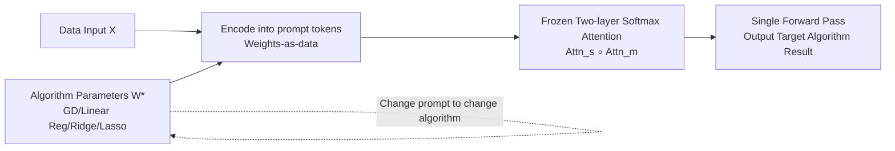

# In-Context Algorithm Emulation in Fixed-Weight Transformers

**Conference**: ICLR 2026  
**arXiv**: [2508.17550](https://arxiv.org/abs/2508.17550)  
**Code**: [MAGICS-LAB/algo_emu](https://github.com/MAGICS-LAB/algo_emu)  
**Area**: Learning Theory / Transformer Expressivity / In-Context Learning  
**Keywords**: in-context learning, softmax attention, algorithm emulation, prompt programming, universality  

## TL;DR
The authors provide a constructive proof demonstrating that a **fixed-weight minimalist softmax Transformer can emulate a broad class of algorithms solely by modifying the prompt**. A single-head single-layer attention can approximate algorithms in the form of $f(w^\top x-y)x$ (e.g., gradient descent, linear/ridge regression), while a fixed two-layer attention module further encodes target algorithm weights into tokens. This enables "switching algorithms by changing prompts" without any parameter updates.

## Background & Motivation
**Background**: In-context learning (ICL) in Large Language Models (LLMs) allows adaptation to new tasks using only examples in the prompt without updating weights. Theoretical research has followed two paths: one involves training models to perform ICL on specific function classes (Garg 2022, Akyürek 2023, etc.), while the other manually designs Transformer weights to hardcode specific algorithms (Bai 2023, Von Oswald 2023, etc.), proving that attention layers can implement least squares, ridge regression, Lasso, gradient descent, Newton's method, PCA, etc., during the forward pass.

**Limitations of Prior Work**: Existing constructions either require "one training per task" or "one set of weights per algorithm"—each new algorithm necessitates redesigning or retraining the entire Transformer block. No provable conclusion has been established for a **single fixed architecture capable of switching between multiple algorithms via prompts**.

**Key Challenge**: The actual power of ICL stems from "the same set of frozen weights switching behaviors via prompts," yet existing theories fail to explain this "algorithm library" style universality. Furthermore, most theoretical work utilizes linear/ReLU attention rather than the practical softmax attention.

**Goal**: Establish a new form of ICL universality—proving that **a fixed-weight softmax attention module** can serve as a "prompt-programmable algorithm interpreter," where the prompt acts as the program and the frozen model acts as the interpreter, requiring no FFNs or parameter updates.

**Core Idea**: **"Weights-as-data"**—encoding the parameters of the target algorithm into the token representations of the prompt. By constructing sufficiently large query-key dot-product gaps, the softmax is forced to follow intended computational paths, allowing the frozen attention to "execute algorithms according to prompt instructions."

## Method

### Overall Architecture
The paper distinguishes and sequentially addresses two modes of in-context algorithm emulation. **Task-specific mode (Section 3)**: For a given algorithm, there exists a fixed-weight attention module that implements said algorithm via a single forward pass on a well-formatted prompt, though each algorithm requires its own weights. **Prompt-programmable mode (Section 4, Main Result)**: There exists a **single** frozen module $\mathrm{Attn}^\star$ such that for every algorithm $A$ in a target class, a suitable prompt $P_A$ can be found to implement $A$—one set of weights emulating an entire algorithm library. The latter incorporates the former by "in-context emulating task-specific modules," leading to the universality conclusion.

### Key Designs

**1. Universal In-Context Approximation of $f(w^\top x-y)x$ via Single-Head Attention: Embedding the "Algorithm Template" into Residual Functions**. The paper identifies a highly general algorithm template $f(w^\top x-y)x$ acting on the residual $w^\top x-y$. This covers almost all "residual-driven" updates for linear models ($f(t)=t$ for raw residuals, $f=\nabla_w\ell$ for per-sample gradients, and sigmoid/step for perceptron updates). Theorem 3.1 proves: by concatenating data $X$ and weights $W=[w\,\cdots\,w]$ into input $Z=[X;W]\in\mathbb{R}^{(2d+1)\times n}$, for any continuously differentiable $f$ and any $\epsilon>0$, there exists a single-head softmax attention $\mathrm{Attn}_s$ with a column-wise affine layer $\mathrm{Linear}$ such that $\lVert\mathrm{Attn}_s\circ\mathrm{Linear}(Z)-[f(w^\top x_i-y_i)x_i]_{i=1}^n\rVert_\infty\le\epsilon$. The key is treating $w$ as "data" in the prompt rather than baking it into the weights—this is the foundation for all subsequent results.

**2. From Universal Approximation to Specific Algorithms: Switching Statistical Methods by Changing $f$**. With the template approximation, specific algorithms become corollaries of "choosing $f$." Setting $f=\ell'$ (the scalar derivative of the loss), Corollary 3.1.1 provides a parallel approximation of per-sample gradients $\{\ell'(w^\top x_i-y_i)x_i\}$. Using a readout vector $u=\frac1n\mathbf{1}_n$ for aggregation (i.e., right-multiplying $W_O=u$), Corollary 3.1.2 approximates single-step gradient descent $\hat w_{\mathrm{GD}}=w-\eta\nabla\hat L_n(w)$. Stacking $L+1$ such layers, where each layer writes the previous output $\hat w^{(t)}$ back into the prompt's $W^{(t)}$, yields multi-step GD with linearly accumulating error $\lVert\hat w^{(t)}_{\mathrm{GD}}-w^{(t)}_{\mathrm{GD}}\rVert_\infty\le t\epsilon$. Replacing this with squared loss yields linear regression (Corollary 3.1.3), and adding an $L_2$ penalty yields ridge regression (3.1.4). One template unifies GD, linear regression, and ridge regression.

**3. "Weight Vectorization into Prompt" Encoding: Creating Sharp Dot-Product Gaps**. To make a fixed module emulate any target attention head (parameters $W_K, W_Q, W_V$), the core is vectorizing these weights and embedding them into expanded rows of the prompt. Definition 4.2 constructs $X_p=[X;\,W_{\mathrm{in}};\,I_n]$, where the $j$-th column of $W_{\mathrm{in}}$ carries $(j\cdot w,\,w)$ ($w=[\overline{W_K};\overline{W_Q};\overline{W_V}]$ is the concatenated weight vector). Using "multiplication by index $j$" creates monotonically increasing markers between tokens, thereby generating **sharp query-key dot-product gaps** in the subsequent softmax. Larger gaps move the softmax closer to a hard-argmax, precisely "routing" to the intended tokens. This is the technical core of the "weights-as-data" mechanism.

**4. Universality Theorem for Two-Layer Attention: Fixed Weights Emulating Any Algorithm Library**. Theorem 4.1 proves: for any target heads $W_K, W_Q, W_V$ and any $\epsilon>0$, there exists a **two-layer network** (multi-head layer $\mathrm{Attn}_m$ followed by single-head layer $\mathrm{Attn}_s$) such that $\lVert\mathrm{Attn}_s\circ\mathrm{Attn}_m(X_p)-W_VX\,\mathrm{Softmax}_\beta((W_KX)^\top W_QX)\rVert_\infty\le\epsilon$, requiring **no FFNs and no parameter updates**. Theorem 4.2 provides a dual version (single-head then multi-head, treating weights as extra tokens rather than extra dimensions). By treating $\mathrm{Linear}(Z)$ from Theorem 3.1 as the input $X$ here, a fixed two-layer module can cover the entire $f(w^\top x-y)x$ class (Corollary 4.2.1: any finite algorithm library $\{a_1,\dots,a_k\}$ can be emulated by the same module by switching prompts). The paper further notes that any linear layer $x\mapsto\Theta x$ can be replaced in-context by encoding $\Theta$ into the prompt (Remark 4.5), implying that trainable linear mappings in standard networks can be replaced by prompt-programmable attention.

## Key Experimental Results
Experiments serve as "proof-of-concept," validating the two construction blocks on synthetic data and quantifying approximation error relative to model size and head count.

### Main Results: Verifying Theorem 3.1 (Approximating $f(w^\top x-y)x$)
- Data: $X\sim 10\cdot\mathcal{N}(0,1)-5$, $W,y\sim\mathcal{N}(0,1)$. The target function is $f=\tanh$, approximating $\tanh(w^\top x-y)\,x$.
- Model: Single-head softmax attention + linear connection. Linear transformations are applied to $[X;y]$ and $W$ before training for approximation.
- Result: The model approximates the target with minimal MSE loss, providing empirical support for the universal approximation theorem.

### Ablation Study: Sensitivity of Emulation Precision to Head Count (Theorem 4.1)
On synthetic data (50,000 points, sequence length 20, input dim 24, hidden dim 48, Adam lr=0.001, 50 epochs, 10 seeds), multi-head attention is used to emulate a single softmax head:

| Heads | 1 | 2 | 4 | 6 | 8 | 12 |
|-------|------|------|------|------|------|------|
| MSE | 3.469 | 2.802 | 1.222 | 1.012 | 0.793 | 0.686 |
| Std | 0.381 | 0.413 | 0.603 | 0.204 | 0.127 | 0.171 |

### Key Findings
- MSE decreases monotonically with the number of heads, following an $O(1/H)$ trend, confirming that multi-head softmax attention can emulate a target head with arbitrary precision and converges as the number of heads increases.
- Appendix C.1 supplements statistical algorithm emulation, and Appendix C.2 provides statistical model approximation on the Ames Housing dataset **without accessing true algorithm weights**, showing that the frozen module driven by prompts can still achieve low error.

## Highlights & Insights
- **Clarity of the "Weights-as-Data" Mechanism**: Decoupling algorithm parameters from "model weights" into "prompt data" (prompt as program, frozen model as interpreter) provides a clean, verifiable toy model for how GPT-style models switch internal algorithms via prompts.
- **Softmax-Native and Minimalist**: Uses actual softmax attention (unlike previous theories using linear/ReLU attention) and requires no FFNs with a minimum of two layers, making it lighter and more transparent than constructions like Giannou 2023 (13 layers with loops for Turing completeness).
- **Dot-Product Gap = Soft Argmax Routing**: Explicitly identifies "forcing softmax paths" as "creating sharp query-key gaps," offering an interpretable design principle for prompt engineering—prompt engineering is essentially the "interface design for algorithm selection."
- **Elegance of the Unified Template**: The $f(w^\top x-y)x$ formula unifies a vast array of residual-driven algorithms including gradient descent, linear regression, ridge regression, and perceptron updates. Changing $f$ changes the algorithm.

## Limitations & Future Work
- **Restricted to "Attention-Implementable" Algorithms**: Universality is relative to algorithms that a single layer of attention can implement; processes not expressible by attention are not covered.
- **Non-Standard Encoding Choices**: Features like encoding information along embedding dimensions and using $3n$ parallel heads are somewhat idealized. The authors admit that fewer hidden dimensions and heads can be used in practice, but this relies on empirical evidence rather than tight theoretical bounds.
- **Attention-Only Focus**: The assertion regarding "GPT-style models switching algorithms via prompts" is a heuristic extrapolation; the formal proof only covers pure attention modules without FFNs.
- **Proof-of-Concept Experiments**: Verification primarily uses synthetic data for approximation rates. Real-world data is limited to the Ames Housing case, leaving a gap between theory and empirical proof that LLMs actually internalize these algorithm libraries.
- **Future Work**: The authors propose three directions—treating prompt engineering as interface design for algorithm selection, designing pre-training objectives that encourage learning "compact reusable process libraries," and using internal routing analysis to understand how foundation models select between algorithms.

## Related Work & Insights
- **Bai et al. 2023 (Transformers as Statisticians)**: One of the closest works, proving Transformers can perform standard algorithms in-context but using ReLU attention and one set of weights per algorithm. This paper upgrades to softmax attention and achieves prompt-programmability.
- **Giannou et al. 2023**: Also proposes a "single fixed model for multiple tasks" but targets Turing-complete program execution requiring 13 layers with loops. This paper is narrower but cleaner—a fixed two-layer pure attention module emulating any algorithm implementable by a single attention layer.
- **Von Oswald 2023 / Akyürek 2023 etc.**: Interprets ICL as implicit gradient descent. This paper generalizes this view to "in-context algorithm emulation" and provides a constructive, verifiable recipe.
- **Insights**: Provides a theoretical foundation for "prompts as subroutine calls," suggesting future pre-training could explicitly optimize "algorithm installation and invocation" capabilities; also points toward a path for interpretability research by analyzing how internal routing completes algorithm selection.

## Rating
- **Novelty**: ⭐⭐⭐⭐⭐ First to establish "single fixed module + prompt-programmable" algorithm emulation universality on actual softmax attention, framing task-specific constructions as special cases. The "weights-as-data" perspective is clear and original.
- **Experimental Thoroughness**: ⭐⭐⭐ Solid proof-of-concept (the $O(1/H)$ trend is clear), but the scale is small and real-world data is limited to one example. Experiments primarily serve to support the theorems rather than approximate actual large-scale models.
- **Writing Quality**: ⭐⭐⭐⭐ Clear distinction between the two modes, logical progression from theorems to corollaries, good comparison with related work, and clear explanation of mechanisms (dot-product gaps/weight vectorization).
- **Value**: ⭐⭐⭐⭐ Provides a clean theoretical foundation and interpretable mechanism for ICL as algorithm emulation. Highly insightful for understanding foundation model universality and guiding prompt design/pre-training objectives. Theoretical significance outweighs immediate practical value.

<!-- RELATED:START -->

## Related Papers

- [\[ICLR 2026\] Transformers Learn Latent Mixture Models In-Context via Mirror Descent](transformers_learn_latent_mixture_models_in-context_via_mirror_descent.md)
- [\[ICLR 2026\] Transformers with Endogenous In-Context Learning: Bias Characterization and Mitigation](transformers_with_endogenous_in-context_learning_bias_characterization_and_mitig.md)
- [\[ICLR 2026\] Adversarially Pretrained Transformers May Be Universally Robust In-Context Learners](adversarially_pretrained_transformers_may_be_universally_robust_in-context_learn.md)
- [\[ICLR 2026\] Critical Attention Scaling in Long-Context Transformers](critical_attention_scaling_in_long-context_transformers.md)
- [\[ICLR 2026\] On learning linear dynamical systems in context with attention layers](on_learning_linear_dynamical_systems_in_context_with_attention_layers.md)

<!-- RELATED:END -->
