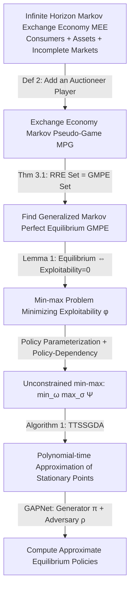

# Infinite Horizon Markov Economies

**Conference**: ICLR 2026  
**OpenReview**: [https://openreview.net/forum?id=S0jIiiMtf4](https://openreview.net/forum?id=S0jIiiMtf4)  
**Code**: Provided in the paper (GAPNet implementation)  
**Area**: Learning Theory / Game Equilibrium Computation / Computational Economics  
**Keywords**: Markov pseudo-game, Generalized Markov Perfect Equilibrium (GMPE), Recursive Radner Equilibrium, Incomplete markets, Policy gradient, Generative Adversarial Policy Network  

## TL;DR
This paper proposes the **Markov Pseudo-Game (MPG)** as a unified framework that integrates "dynamic uncertainty" (Markov games) and "action-dependent feasibility" (pseudo-games). It proves the existence of equilibria and provides a polynomial-time first-order algorithm. Consequently, it establishes the existence of Recursive Radner Equilibrium in generalized infinite-horizon incomplete market economies for the first time and computes the equilibrium using Generative Adversarial Policy Networks (GAPNet).

## Background & Motivation

**Background**: General equilibrium theory, from Walras's supply-demand model to the Arrow–Debreu competitive economy, provides a rigorous mathematical framework for how rational agents reach equilibrium through interaction. Arrow & Debreu characterized the competitive economy as a **pseudo-game**, where each player's feasible action set depends on the choices of others. Radner (1972) extended this to stochastic exchange economies with uncertainty, leading to the classic Radner equilibrium.

**Limitations of Prior Work**: Classical frameworks are essentially **static**, modeling only single-period transactions; even when goods are made "state-contingent," they rely on the unrealistic assumption of "complete markets" (possessing a full set of state-contingent assets). Real-world economies involve continuous trading of financial assets, intertemporal borrowing, and persistent shocks to productivity or preferences, all of which require **infinite-horizon** models. However, infinite horizons introduce significant theoretical difficulties—such as allowing for **Ponzi schemes** (agents rolling over debt infinitely)—making equilibrium existence in incomplete markets elusive. Magill & Quinzii (1994) pushed the Radner framework to infinite horizons but restricted it to financial assets, and computational progress has been extremely limited, with most solvers still confined to finite horizons.

**Key Challenge**: On one hand, the game-theoretic perspective of Markov games offers computable equilibria but lacks "action-dependent feasibility." On the other hand, the economic perspective of infinite-horizon general equilibrium features rich structures but is difficult to compute. There is a lack of a unified model that is both computable and capable of expressing incomplete market economies.

**Goal**: Construct a framework that possesses both the "dynamic uncertainty" of Markov games and the "action-dependent feasibility" of pseudo-games, prove its equilibrium existence, achieve polynomial-time approximation, and embed infinite-horizon incomplete market economies within it.

**Core Idea**: **(1) Unified Modeling** — Proposing the Markov Pseudo-Game (MPG), where feasible action sets vary with states and others' actions; **(2) Reducing Equilibrium Computation to Exploitability Minimization** — Solving via adversarial min-max optimization, leveraging recent advances in generative adversarial learning to obtain polynomial-time guarantees; **(3) Economic Reduction** — Proving that the set of Recursive Radner Equilibria for any infinite-horizon Markov exchange economy is exactly the set of equilibria for a corresponding pseudo-game, bridging existence proofs and algorithmic approximation.

## Method

### Overall Architecture

The paper proceeds along three lines: first, defining the **Markov Pseudo-Game (MPG)** and proving the existence of its **Generalized Markov Perfect Equilibrium (GMPE)** (Theorem 2.1); second, reducing the search for GMPE to a min-max optimization that minimizes **exploitability**, using Two-Time-Scale Stochastic Gradient Descent-Ascent (TTSSGDA) to achieve polynomial-time convergence (Theorem 2.2); third, mapping an infinite-horizon Markov Exchange Economy (MEE) to an "Exchange Economy MPG" and proving that the set of Recursive Radner Equilibria (RRE) equals the set of GMPEs for that MPG (Theorem 3.1), thereby inheriting existence and computability (Corollary 1, Theorem 3.2); and finally, implementing the solution using Generative Adversarial Policy Networks (GAPNet).

### Key Designs

**1. Markov Pseudo-Game (MPG): Allowing "Who Can Do What" to Vary with State and Others' Actions.** In standard Markov games, each player's action space $A_i$ is fixed. This paper replaces it with a **feasible action correspondence** $X_i(s,a_{-i})\subseteq A_i$—the actions player $i$ can choose at state $s$ depend on the current state and the actions of other players $a_{-i}$. This is a dynamic version of the coupling in the Arrow–Debreu pseudo-game where "budget constraints depend on prices, and prices are determined by an auctioneer." Building on this, the paper defines Markov policies $\pi_i: S\to A_i$ (dependent only on the current state), feasible policy correspondences $F_i(\pi_{-i})$, state-value functions $v^\pi$, and action-value functions $q^\pi$. Two solution concepts are proposed: **Generalized Nash Equilibrium (GNE)** (no unilateral deviation gain at the initial distribution) and the stronger **Generalized Markov Perfect Equilibrium (GMPE)** (requiring $v_i^{\pi^*}(s)\ge \max_{\pi_i\in F_i(\pi^*_{-i})} v_i^{(\pi_i,\pi^*_{-i})}(s)-\varepsilon$ for **all** states $s$, analogous to subgame perfection). Theorem 2.1 proves that under standard convexity/continuity assumptions and the assumption that the policy class is expressive enough for best responses, a concave MPG must possess a pure-strategy GMPE. This also implies that a broad class of continuous-action Markov games possesses **pure (deterministic)** Markov perfect equilibria, where prior literature only established existence for mixed (stochastic) strategies.

**2. Exploitability Minimization + Min-max Reformulation: Turning Equilibrium Discovery into an Adversarial Optimization Problem.** The paper adopts **exploitability**, a common merit function in game theory: $\phi(\pi)=\sum_{i\in[n]}\max_{\pi'_i\in F_i^{\mathrm{markov}}(\pi_{-i})} u_i(\pi'_i,\pi_{-i})$, which measures the sum of maximum unilateral deviation gains for all players. Lemma 1 provides a clean characterization: $\pi^*$ is a GMPE if and only if **state-wise exploitability** $\phi(s,\pi^*)=0$ holds for all $s$; it is a GNE if and only if $\phi(\pi^*)=0$. However, exploitability itself is neither convex nor differentiable, and GNE computation is PPAD-hard. Following the approach of Goktas & Greenwald (2022), the paper rewrites this as a **coupled quasi-min-max optimization**: $\min_{\pi\in F(\pi)}\max_{\pi'\in F^{\mathrm{markov}}(\pi)}\Psi(\pi,\pi')$, where $\Psi(\pi,\pi')$ is the cumulative regret. This step transforms the "fixed-point equilibrium search" into an adversarial game where an "outer player" minimizes their own exploitability while "inner players" seek optimal deviations, paving the way for GAN-style algorithms.

**3. Policy-Dependent Parameterization: Eliminating Inner Policy Space Dependency for Unconstrained Min-max.** The aforementioned min-max problem faces two hurdles: the outer minimization involves a fixed-point ($\pi\in F^{\mathrm{markov}}(\pi)$), and the inner players' feasible space depends on the outer choice. The paper introduces a **policy-dependent class** $R=\{\rho: S\times A\to A \mid \rho(s,a)\in X(s,a)\}$, which **explicitly parameterizes** the fact that inner best responses depend on outer decisions. This yields a decoupled formulation: $\min_{\pi}\max_{\rho\in R}\Psi(\pi,\rho(\cdot,\pi(\cdot)))$ (Lemma 2). Applying parameterization $(\pi,\rho,\mathbb{R}^\Omega,\mathbb{R}^\Sigma)$ and Assumption 1 (outer policies satisfy fixed-point feasibility, and inner $\rho$ takes $\pi(s)$ as input to encode dependencies), the problem becomes **unconstrained**: $\min_{\omega}\max_{\sigma}\Psi(\omega,\sigma)$. The unconstrained parameter space resolves both difficulties: it efficiently represents the outer fixed-point policy set and eliminates the dependency of the inner policy space on the outer choice. Lemma 3 proves such parameterization always exists for MPGs with a DAG dependency structure (including all exchange economy MPGs).

**4. Polynomial-time Convergence Guarantees + Economic Reduction.** On the unconstrained min-max formulation, the paper employs the Two-Time-Scale Stochastic simultaneous Gradient Descent-Ascent (**TTSSGDA**) algorithm (Algorithm 1), relying on a **differentiable game simulator** to estimate gradients of rewards and transitions. Under conditions of Lipschitz smoothness, inner-gradient dominance, and bounded **best-response mismatch coefficient** $C_{br}$, Theorem 2.2 proves the algorithm converges to an $(\varepsilon, \delta)$-stationary point of exploitability in polynomial steps. For the economic side, an infinite-horizon Markov Exchange Economy (MEE) is mapped to an MPG by **adding an "auctioneer" player** (whose reward is the value of excess demand, forcing market clearing). Theorem 3.1 proves that the set of RREs for the MEE is **exactly equal** to the set of GMPEs for the MPG. Consequently, RRE existence (Corollary 1) and polynomial-time approximation (Theorem 3.2) are inherited. This is the first known existence proof for recursive competitive equilibrium in a general incomplete market setting with multiple consumers, goods, and arbitrary assets.

## Key Experimental Results

The experiment parameterizes the MPG corresponding to the MEE using neural networks: a generator network for $\pi$ and an adversary network for $\rho$, forming the **Generative Adversarial Policy Network (GAPNet)**, trained via Algorithm 1. The baseline is the **Neural Projection Method (NPM)** (i.e., deep equilibrium nets), which minimizes the norm of the system of first-order necessary and sufficient conditions characterizing the RRE. Both use identical network architectures and grid-searched hyperparameters. Metrics: total first-order violation, average Bellman error, and exploitability.

### Main Results: Convergence in Benchmark Economies

| Setting | Economy Scale | Preference Type | GAPNet | NPM |
|------|----------|----------|--------|-----|
| Deterministic Transitions (App. E) | 10 Consumers / 10 Goods / 1 Asset / 5 States | Linear, Cobb-Douglas, Leontief | Strong performance across all metrics | Good only on the specific metric it minimizes |
| Stochastic Transitions (Figure 1) | Same as above | Same as above | Successfully minimizes all three metrics | Performance further degraded by stochasticity |

Key Comparison: NPM only meets criteria for the specific metric it was designed to minimize, whereas GAPNet approximates RRE necessary conditions across **all three metrics**. The introduction of stochasticity harms NPM significantly, while GAPNet remains robust.

### Economic Validity Verification (Different Preferences/Discount Rates)

| Preference / Setting | Learned Equilibrium Behavior | Consistency with Classical Theory |
|------------|----------------|------------------|
| Linear Preferences | Almost zero asset demand; ~97–98% of wealth used for current consumption | Consistent |
| Cobb-Douglas | Consumption share drops to 88–90%; positive asset positions (intertemporal smoothing) | Consistent (strictly quasi-concave, diminishing marginal utility) |
| Leontief | Spending rises to nearly 99%; asset demand approaches 0 | Consistent (constrained by scarcest good, avoiding intertemporal substitution) |
| High Discount Rate γ (Patient) | Higher investment, smoother intertemporal consumption | Consistent |
| Low Discount Rate γ (Impatient) | Almost all wealth used for current consumption | Consistent |

### Scalability

The framework scales to a larger economy with **20 consumers / 20 goods / 5 assets / 10 world states**. While dimensions of joint action spaces and endogenous state transition complexity increase—leading to higher variance and sensitivity to learning rates—GAPNet still clearly converges to near-zero exploitability (Figure 5, App. E).

### Key Findings
- GAPNet outperforms NPM across all convergence metrics and shows a more significant advantage under **stochastic transitions**—adversarial solving is more robust to uncertainty.
- The learned equilibria **replicate classical consumer theory** (consumption/saving patterns under different utility curvatures, effects of discount rates), indicating the solutions are economically meaningful rather than numerical artifacts.
- Even on non-smooth primitives like Leontief (where theoretical assumptions require smoothness), neural parameterization provides effective smooth approximations that work well in practice.

## Highlights & Insights
- **Unified Framework for Two Worlds**: Markov Pseudo-Games place game-theoretic "dynamic uncertainty" and economic "action-dependent feasibility" into the same object. This elegant bridge provides a Markov game with computable equilibria that can also express general infinite-horizon economies.
- **The "Auctioneer" Trick**: Encoding market-clearing conditions as the reward of an auctioneer player makes the reduction of "economic equilibrium = game equilibrium" natural, allowing existence and computability theorems to be "free-ridden" from game theory to economics.
- **An Indirect Proof for Pure Strategy Markov Perfect Equilibrium**: For a large class of continuous-action Markov games, where previously only mixed-strategy existence was known, this paper provides proof of deterministic equilibrium existence—a significant independent contribution to game theory.
- **Theory and Engineering Closed Loop**: Starting from pessimistic PPAD/FNP-hard conclusions, the paper targets approximate stationary points and uses a GAN-style GAPNet to compute them, forming a complete loop from theoretical guarantees to empirical implementation.

## Limitations & Future Work
- **Weak Theoretical Conlusions**: The algorithm only guarantees convergence to a **neighborhood** of a stationary point of exploitability and only "approximately satisfies GMPE necessary conditions"—a relatively weak conclusion acknowledged by the authors. Global equilibrium guarantees are absent.
- **Relies on Regularity Assumptions**: Polynomial-time guarantees depend on Lipschitz smoothness, gradient dominance, and bounded best-response mismatch, which may not hold for non-smooth economies like Leontief without neural approximation.
- **Requirement for Differentiable Simulators**: The algorithm assumes access to gradients of rewards and transition probabilities from a differentiable simulator, which may not be available in all real-world economic or financial environments.
- **Limited Experimental Scale**: The largest scale tested (20 consumers/goods) already showed slight instability. There is still a gap to reach true macro-scale economic simulations.
- **Future Work**: Applying the framework to richer economies with production, heterogeneous beliefs, or incomplete information; exploring stronger global convergence guarantees; and promoting "differentiable economic simulators" as infrastructure for policy evaluation and macro-control simulation.

## Related Work & Insights
- **General Equilibrium Lineage**: Walras → Arrow & Debreu (pseudo-games/competitive economy) → Radner (1972) (stochastic exchange economy) → Magill & Quinzii (1994) (infinite horizon, asset-limited). This paper extends this line toward "infinite horizon + arbitrary assets + computability."
- **Stochastic/Markov Games**: Shapley (1953), Fink (1964), Takahashi (1964); Littman (1994) named the Markov game. This work adds action-dependent feasibility.
- **Complexity of Equilibrium Computation**: NE computation is PPAD-hard (Chen et al. 2009; Daskalakis et al. 2009); this paper’s exploitability minimization shares roots with policy gradient results in zero-sum Markov games.
- **Min-max Optimization & GANs**: TTSSGDA (Lin et al. 2020; Daskalakis et al. 2020) and GANs (Goodfellow et al. 2014); GAPNet maps the "Generator-Adversary" to "Outer Policy-Inner Best Response."
- **Macro Solvers**: The Neural Projection Method (Azinovic et al. 2022) serves as the primary empirical baseline.
- **Insight**: Encoding "market clearing/constraint satisfaction" as rewards for an additional player to unify constrained equilibrium solving via adversarial games is a "Constraint → Auctioneer → Min-max" pipeline with transfer value for other coupled-constraint multi-agent problems.

## Rating
- **Novelty**: ⭐⭐⭐⭐⭐ The MPG framework truly unifies the languages of game theory and general equilibrium, providing the first existence proof for Recursive Radner Equilibrium in general incomplete markets.
- **Experimental Thoroughness**: ⭐⭐⭐ Validated convergence and economic validity across various preferences and settings; however, the scale remains modest and lacks stress testing against massive scale or real-world data.
- **Writing Quality**: ⭐⭐⭐⭐ Rigorous mathematical notation and clear logical progression; however, the high theoretical density and heavy notation present a high barrier for readers without a background in game theory or economics.
- **Value**: ⭐⭐⭐⭐ Establishes a "theory-engineering" closed loop for infinite-horizon incomplete market economies, with foundational significance for computational economics, mechanism design, and multi-agent equilibrium solving.

<!-- RELATED:START -->

## Related Papers

- [\[ICLR 2026\] From Markov to Laplace: How Mamba In-Context Learns Markov Chains](from_markov_to_laplace_how_mamba_in-context_learns_markov_chains.md)
- [\[ICLR 2026\] Transfer Learning in Infinite Width Feature Learning Networks](transfer_learning_in_infinite_width_feature_learning_networks.md)
- [\[ICLR 2026\] UniCon: Unified Framework for Efficient Contrastive Alignment via Kernels](unicon_unified_framework_for_efficient_contrastive_alignment_via_kernels.md)
- [\[ICLR 2026\] Transformers Are Inherently Succinct](transformers_are_inherently_succinct.md)
- [\[ICLR 2026\] On the Interpolation Effect of Score Smoothing in Diffusion Models](on_the_interpolation_effect_of_score_smoothing_in_diffusion_models.md)

<!-- RELATED:END -->
