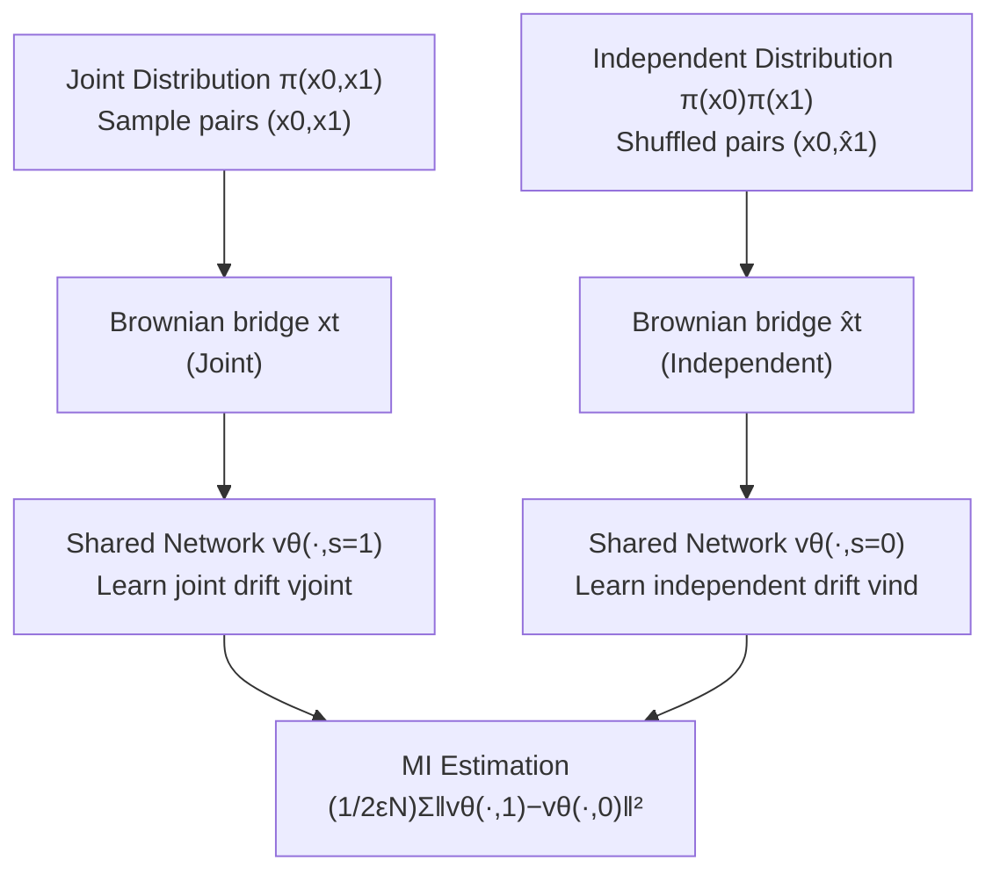

# InfoBridge: Mutual Information Estimation via Bridge Matching

**Conference**: ICLR 2026  
**OpenReview**: [https://openreview.net/forum?id=y8Kzu9SKpv](https://openreview.net/forum?id=y8Kzu9SKpv)  
**Code**: [https://github.com/SKholkin/infobridge](https://github.com/SKholkin/infobridge)  
**Area**: Learning Theory / Information Theory / Generative Models  
**Keywords**: Mutual Information Estimation, Diffusion Bridge Matching, Reciprocal Process, Girsanov Theorem, Unbiased Estimator  

## TL;DR
The paper **reformulates Mutual Information (MI) estimation** between two random variables as a "domain translation" problem: expressing MI as the difference between the drift terms of a pair of diffusion bridges (one connecting the joint distribution and one connecting the product of marginals), resulting in InfoBridge—an estimator that is theoretically unbiased and significantly outperforms existing methods in high-dimensional or high-MI scenarios.

## Background & Motivation
**Background**: Mutual Information is a core information-theoretic measure for non-linear dependencies between two random variables, widely used in self-supervised learning, generalization analysis, and generative model alignment. However, estimating MI from samples is extremely difficult—suffering from the curse of dimensionality, long-tail distributions, and high MI values that cause traditional estimators (KDE, kNN/KSG) to fail. Recent neural estimators fall into two categories: discriminative (MINE, InfoNCE, SMILE), which rely on variational lower bounds of KL and suffer from high variance or large batch requirements; and generative (Normalizing Flows, MINDE), which estimate MI by approximating the joint distribution and tend to be more stable on complex data.

**Limitations of Prior Work**: The current state-of-the-art generative diffusion method, MINDE, **frames MI estimation as a "data generation from noise" task**, using the difference between scores of two reverse diffusion models to estimate KL. However, its estimator contains a **bias term** $\mathrm{KL}(q_T^A\|q_T^B)$ that only vanishes as the number of diffusion steps approaches infinity. Furthermore, the learned trajectories (noise to data) are harder to train, leading to high variance in MI estimation.

**Key Challenge**: Choosing between discriminative methods (scalable but high variance/theoretically flawed) or generative diffusion methods (stable but inherently biased). Is it possible to maintain the high-dimensional capability of generative models while achieving a **structurally unbiased** estimator?

**Goal**: Construct an MI estimator that is theoretically unbiased and robust to high-dimensional and high-MI data.

**Core Idea**: **Shift the framing of MI estimation from "generative modeling" to "domain translation (data-to-data translation)"**. By utilizing diffusion bridge matching—a generative paradigm specifically designed for data-to-data transfer—the joint distribution $\pi(x_0,x_1)$ and the independent distribution $\pi(x_0)\pi(x_1)$ each induce a reciprocal process. Using the Girsanov Theorem, the authors prove that the KL divergence between these two processes equals the original MI and can be decomposed into the integrated squared difference of the drift terms of the two bridges. This data-to-data trajectory is easier to learn, has lower variance, and the decomposition **contains no residual bias term**.

## Method

### Overall Architecture
The core of InfoBridge is an equality chain: MI equals the KL divergence between the joint reciprocal process $Q_\pi$ and the independent reciprocal process $Q_\pi^{\mathrm{ind}}$, which in turn can be written as the integral of the difference between the drifts of the two bridges. In practice, a **shared neural network with a binary switch** $s\in\{0,1\}$ approximates both drifts ($s=1$ learns the joint drift, $s=0$ learns the independent drift). During training, bridge matching regression is performed on Brownian bridge trajectories for both "joint pairs" and "shuffled pairs." During estimation, trajectory points are sampled to calculate the mean squared difference between the two drifts. Both training and estimation are **simulation-free** (no need to simulate the entire SDE).

### Key Designs

**1. Reformulating MI as KL between two reciprocal processes (The theoretical foundation of the domain translation perspective)**: Given the joint distribution $\pi(x_0,x_1)$, the authors construct two reciprocal processes using a Brownian bridge $W^\epsilon_{|x0,x1}$ (a Wiener process with fixed endpoints and constant volatility $\epsilon$): the joint $Q_\pi=\int W^\epsilon_{|x_0,x_1}\,d\pi(x_0,x_1)$ and the independent $Q_\pi^{\mathrm{ind}}=\int W^\epsilon_{|x_0,x_1}\,d\pi(x_0)d\pi(x_1)$. The only difference lies in whether the endpoints are paired jointly or independently. The authors prove that $\mathrm{KL}(Q_\pi\|Q_\pi^{\mathrm{ind}})$ collapses exactly to $\mathrm{KL}(\pi(x_0,x_1)\|\pi(x_0)\pi(x_1))$ via disintegration theorems, which is the definition of MI $I(X_0;X_1)$. In other words, "determining if two variables are independent" is translated into "calculating the cost of transferring a data bridge from joint pairing to independent pairing," which is the language of domain translation and a fundamental departure from MINDE's generative modeling perspective.

**2. Decomposing KL into drift differences via Girsanov Theorem (Theorem 4.1)**: Both reciprocal processes can be represented as SDEs with drifts $dx_t=v(x_t,t,x_0)\,dt+\sqrt{\epsilon}\,dW_t$, sharing the same volatility $\sqrt{\epsilon}$ and initial distribution. For such diffusions, the Girsanov Theorem provide a closed-form for KL: $\mathrm{KL}(Q^A\|Q^B)=\frac{1}{2\epsilon}\int_0^1 \mathbb{E}_{q^A(x_t)}\|f^A-f^B\|^2\,dt$. Substituting these gives the core estimation formula:

$$I(X_0;X_1)=\frac{1}{2\epsilon}\int_0^1 \mathbb{E}_{q_\pi(x_t,x_0)}\big\|v_{\mathrm{joint}}(x_t,t,x_0)-v_{\mathrm{ind}}(x_t,t,x_0)\big\|^2\,dt,$$

where $v_{\mathrm{joint}}=\mathbb{E}_{q_\pi(x_1|x_t,x_0)}\big[\tfrac{x_1-x_t}{1-t}\big]$ and $v_{\mathrm{ind}}=\mathbb{E}_{q_\pi^{\mathrm{ind}}(x_1|x_t,x_0)}\big[\tfrac{x_1-x_t}{1-t}\big]$. Crucially, this equation **lacks the vanishing bias term found in MINDE**—it is unbiased under the assumption of ideally learnable drifts and full distribution access.

**3. Conditional Bridge Matching + Binary Switch Shared Network (Turning theory into a trainable algorithm)**: Neither drift $v_{\mathrm{joint}}$ nor $v_{\mathrm{ind}}$ can be calculated directly (due to the inability to sample from $\pi(x_1|x_t,x_0)$), but they can be recovered via the **conditional bridge matching** regression problem: $v=\arg\min_u \mathbb{E}\big\|\tfrac{x_1-x_t}{1-t}-u(x_t,t,x_0)\big\|^2$. Sampling $q_\pi(x_t,x_0)$ is simple: sample a pair from $\pi(x_0,x_1)$, then sample a time slice $x_t$ from the Brownian bridge. Instead of using two networks, the authors use a single network $v_\theta$ with a binary input $s$: $v_\theta(\cdot,1)\approx v_{\mathrm{joint}}$ and $v_\theta(\cdot,0)\approx v_{\mathrm{ind}}$. During training (Algorithm 1), a batch calculates two losses simultaneously: the joint loss using the original pair $(x_0,x_1)$ and the independent loss using a randomly **shuffled** pair $(x_0, \hat{x}_1)$. During estimation (Algorithm 2), samples are taken to compute $\frac{1}{2\epsilon N}\sum\|v_\theta(\cdot,1)-v_\theta(\cdot,0)\|^2$. The binary condition is more accurate than two independent networks (Appendix C.5), and the entire process is simulation-free.

**4. Natural extensions to KL / Differential Entropy / Multivariate Interaction Information / Heterogeneous Dimensions**: Since the framework essentially "writes the KL between any two distributions as a difference in drifts," it can do more than estimate MI. It can unbiasedly estimate general KL divergence between any two distributions (Theorem B.1), differential entropy, and can be extended to MI between variables of different dimensions and interaction information for three or more variables. Furthermore, the learned drifts define the conditional generative distribution $\pi_\theta(x_1|x_0)$ and marginal $\pi_\theta(x_1)$ as "free" generative by-products.

## Key Experimental Results

### Main Results: Four Benchmark Categories

| Benchmark | Setting | InfoBridge Performance |
|-----------|---------|-------------------------|
| Low Dimension (Czyż et al. 2023) | 40 distributions, including heavy-tail/manifold | Comparable to the strongest MINDE; outperforms classical/flow methods. |
| Image Data (16×16/32×32) | Low-dim distributions injected into image manifolds | MAE **0.38** (Best), lowest variance. |
| Protein Embeddings (ProtTrans5, 1024-dim) | A. thaliana / H. sapiens real-world data | MAE **0.04**, the only stable and accurate method. |
| High MI (d∈{20..160}, MI∈{10..80}) | High-dimensional, large MI | Closest to the ground truth; discriminative methods failed. |

### Image Benchmark Ablation (MAE ↓ / Mean Std ↓)

| Method | InfoBridge | MIENF | MINDE-C | MINDE-J | MINE | KSG | InfoNCE | NWJ |
|--------|-----------|-------|---------|---------|------|------|---------|-----|
| MAE ↓  | **0.38**  | 0.45  | 0.56    | 1.66    | 0.92 | 1.15 | 1.44    | 1.24|
| Mean std ↓ | **0.07** | 0.08 | 0.43    | 0.45    | 0.13 | 0.02 | 0.04    | 0.08|

### Key Findings
- **High Dimension + High MI is the watershed**: Performance is similar in low dimensions, but in high-dimensional or large MI settings, discriminative methods (MINE, InfoNCE, fDIME) and MINDE-C significantly underestimate or fail. InfoBridge remains close to the ground truth.
- **Significantly lower variance**: On image benchmarks, InfoBridge's standard deviation across seeds is much lower than MINDE's (0.07 vs 0.43/0.45), confirming that "data-to-data trajectories are easier to learn than noise-to-data."
- **Generational gap on real data**: In the protein embedding benchmark, MINDE-C severely overestimates (MAE 9.29), while InfoBridge results in an MAE of only 0.04.
- **Vulnerability with distribution without first moments**: Cauchy distributions (Student-t, dof=1) fail because they violate bridge matching assumptions (no first moment), but can be approximately recovered using an asinh tail-contraction transform.

## Highlights & Insights
- **Reframing leads to unbiasedness**: Shifting MI from "generative modeling" to "domain translation" seems like a simple perspective change, but it naturally removes the residual bias term in MINDE—a beautiful example of solving a theoretical flaw by re-expressing the problem.
- **Unified KL estimation backbone**: The core insight is "KL of any two distributions = integral of drift difference of two bridges with same volatility." MI is just a special case, allowing the framework to cover KL, Entropy, Interaction Information, and heterogeneous MI.
- **Simulation-free and engineerly elegant**: Both training and estimation do not require simulating the SDE. A single network with a binary switch is sufficient, providing precision higher than MINDE at a similar cost.

## Limitations & Future Work
- **Reliance on first-moment assumption**: If $\pi(x_0)$ or $\pi(x_1)$ lacks a first moment (e.g., Cauchy), regularity assumptions for bridge matching do not hold. Current work uses tail transforms like asinh, but a more general solution is needed.
- **Higher computational cost than discriminative methods**: As a diffusion bridge model, complexity is higher than discriminative estimators like MINE/InfoNCE (though comparable to MINDE).
- **Future directions**: Exploring other bridges (e.g., Variance Preserving SDE bridges) and introducing advanced techniques like temporal reweighting to further reduce variance and increase speed.

## Related Work & Insights
- **vs MINDE (Franzese et al. 2024)**: Both are diffusion-based generative MI estimators. MINDE views the problem as "generation from noise," uses score differences to estimate KL, and contains a non-removable bias. InfoBridge views it as "data-to-data translation," uses drift differences to estimate KL, is structurally unbiased, and has lower variance.
- **Bridge Matching / Reciprocal Process lineage**: Built upon Schrödinger Bridge, Reciprocal Processes, and Conditional Bridge Matching (Liu, Shi, Zhou, etc.), it transfers a generative paradigm used in image translation and biology/chemistry to information-theoretic estimation.
- **Insight**: For any "distribution discrepancy" estimation task (KL, JS, variants of Wasserstein), "expressing it as the drift difference of a pair of same-volatility diffusion bridges" may be a universal, low-bias path worth reusing in representation learning, alignment, and generalization bound analysis.

## Rating
- **Novelty**: ⭐⭐⭐⭐⭐ Reformulating MI estimation as domain translation and deriving an unbiased decomposition via reciprocal processes + Girsanov is a clean and original theoretical shift.
- **Experimental Thoroughness**: ⭐⭐⭐⭐ Covers low-dim, image, protein, and high-MI benchmarks with 9 baselines; however, primarily relies on synthetic/semi-synthetic data, with fewer real-world downstream applications.
- **Writing Quality**: ⭐⭐⭐⭐ Clear theoretical derivations, distinct motivation compared to MINDE, and complete pseudocode; though tables are slightly crowded due to PDF conversion.
- **Value**: ⭐⭐⭐⭐ Provides a reliable and low-variance estimator for high-dimensional/high-MI scenarios—a long-standing challenge—while naturally extending to other metrics like KL and Entropy.

<!-- RELATED:START -->

## Related Papers

- [\[ICLR 2026\] Information Estimation with Discrete Diffusion](information_estimation_with_discrete_diffusion.md)
- [\[ICLR 2026\] Curse of Slicing: Why Sliced Mutual Information is a Deceptive Measure of Statistical Dependence](curse_of_slicing_why_sliced_mutual_information_is_a_deceptive_measure_of_statist.md)
- [\[ICLR 2026\] Characterizing Pattern Matching and Its Limits on Compositional Task Structures](characterizing_pattern_matching_and_its_limits_on_compositional_task_structures.md)
- [\[ICLR 2026\] FlowNIB: An Information Bottleneck Analysis of Bidirectional vs. Unidirectional Language Models](flownib_an_information_bottleneck_analysis_of_bidirectional_vs_unidirectional_la.md)
- [\[ICLR 2026\] Score-Based Density Estimation from Pairwise Comparisons](score-based_density_estimation_from_pairwise_comparisons.md)

<!-- RELATED:END -->
