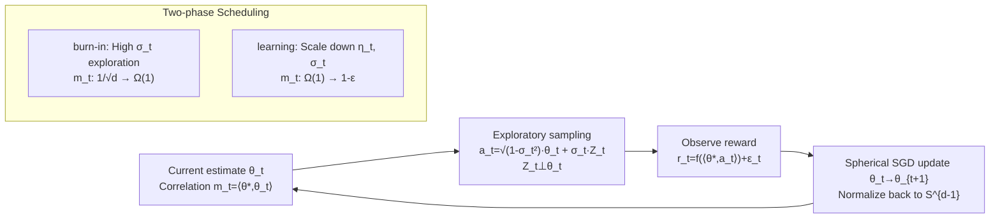

# Interactive Learning of Single-Index Models via Stochastic Gradient Descent

**Conference**: ICLR 2026  
**OpenReview**: [https://openreview.net/forum?id=lZY0uluCzl](https://openreview.net/forum?id=lZY0uluCzl)  
**Code**: Not available  
**Area**: Learning Theory / Bandit Theory  
**Keywords**: Single-index model, SGD, generalized linear bandit, ridge bandit, feature learning, burn-in, sample complexity, regret bound  

## TL;DR
This paper proves that when learning single-index models in an interactive (bandit) environment, a naive normalized SGD equipped with appropriate learning rate and exploration intensity schedules achieves near-optimal sample complexity and regret bounds in both "burn-in" and "learning" phases, without requiring zero-order exploration algorithms customized for specific link functions.

## Background & Motivation

**Background**: The single-index model $y=f(\langle\theta^\star,x\rangle)+\varepsilon$ is a core paradigm in high-dimensional feature learning theory. In the **non-interactive** setting (i.i.d. Gaussian features $x\sim N(0,I_d)$), Ben Arous et al. established a complete theory: SGD undergoes a "search phase" (where the correlation $m_t=\langle\theta_t, \theta^\star\rangle$ climbs from $O(d^{-1/2})$ to $\Omega(1)$) followed by a "descent phase" with rapid convergence. Its sample complexity is determined by the **information exponent** of the link function (i.e., the order of the first non-zero Hermite coefficient).

**Limitations of Prior Work**: When the single-index model is applied to **interactive decision-making** scenarios (generalized linear bandits / ridge bandits, where reward $r_t=f(\langle\theta^\star,a_t\rangle)+\varepsilon_t$ and action $a_t$ is chosen), the narrative changes. If $f'(x)$ is very small near $x\approx 0$ (e.g., $f(x)=x^p, p\ge 3$), a long **burn-in period** is required to find a good action where $\langle\theta^\star,a_t\rangle=\Omega(1)$. Classical UCB has been proven sub-optimal during this phase. Prior works (Lattimore-Hao; Huang et al.; Rajaraman et al. 2024) designed **tailored** exploration algorithms for burn-in for specific $f$ using **zeroth-order** gradient estimation, which are complex and fragmented.

**Key Challenge**: The intrinsic "search/descent" structure of SGD naturally corresponds to the "burn-in/learning" phases in bandits. Since SGD is simple and a first-order method, why design zero-order exploration algorithms for each link function? However, actions $a_t$ are no longer Gaussian in the interactive setting, causing the theory of non-interactive SGD (especially information exponents) to fail. The learning dynamics of SGD in this context remain largely unexplored.

**Goal**: Systematically characterize the dynamics of interactive SGD for learning single-index models and prove that a single SGD process can be near-optimal in both phases. **Core Idea (Unified Two-phase Optimality)**: By using action sampling with exploration intensity $\sigma_t$ plus spherical normalized SGD, and by matching learning rate/exploration schedules for the burn-in and learning phases, the optimal bounds of specialized algorithms can be replicated.

## Method

### Overall Architecture
The learner chooses actions on the unit sphere $\mathcal{A}=S^{d-1}$. The target parameter $\theta^\star\in S^{d-1}$ is unknown, and the reward is $r_t=f(\langle\theta^\star,a_t\rangle)+\varepsilon_t$ ($\varepsilon_t$ is zero-mean 1-subGaussian). The algorithm maintains a current estimate $\theta_t$. In each step, it samples an action by "exploiting the current estimate + exploring in orthogonal directions," updates $\theta_t$ via spherical SGD, and analyzes the evolution of the correlation $m_t=\langle\theta^\star,\theta_t\rangle$ through a three-term decomposition: drift, martingale, and normalization. The procedure has only two knobs: learning rate $\eta_t$ and exploration intensity $\sigma_t$.

### Key Designs

**1. Spherical SGD + Orthogonal Exploration Sampling: Unifying "Action Selection" and "Parameter Learning" into a First-order Update.** Unlike the non-interactive setting (where actions are Gaussian features), actions must be actively constructed within the unit sphere. Ours adopts $a_t=\sqrt{1-\sigma_t^2}\,\theta_t+\sigma_t Z_t$, where $Z_t$ is sampled uniformly from the unit sphere orthogonal to $\theta_t$. The hyperparameter $\sigma_t\in[0,1]$ manages the exploration-exploitation tradeoff: large $\sigma_t$ yields strong exploration, while small $\sigma_t$ focuses on the current optimal action. After receiving $r_t$, $\theta_{t+1/2}=\theta_t-\eta_t\big(f(\langle\theta_t,a_t\rangle)-r_t\big)f'(\langle\theta_t,a_t\rangle)\cdot(I-\theta_t\theta_t^\top)a_t$ is used for the update, followed by normalization $\theta_{t+1}=\theta_{t+1/2}/\lVert\theta_{t+1/2}\rVert$. The key observation is that this step provides an **unbiased** stochastic gradient of the population spherical loss $\theta\mapsto\frac12\mathbb{E}(f(\langle\theta,a\rangle)-r)^2$, converting the bandit exploration problem into a clean stochastic optimization problem—purely **first-order**, without zero-order gradient estimation.

**2. Three-term Decomposition of Correlation Evolution: Drift / Martingale Difference / Normalization Error.** The technical core of the proof involves tracking the increment $m_t\to m_{t+1}$ by decomposing it into: ① **Drift term** $\mathbb{E}[m_{t+1/2}|\mathcal{F}_t]-m_t$ (the average improvement of the descent step, proportional to $\eta_t\sigma_t^2$ and an expectation involving $f'$, which is **positive only if $f$ is monotonically increasing**—otherwise, SGD might stall forever, leading to Assumption 1 on monotonicity); ② **Martingale difference term** (zero-mean random noise for variance control); ③ **Normalization error** (second-order bias from projection back to the sphere). By providing general lemmas for these three terms and substituting different $(\eta_t, \sigma_t)$ schedules, quantitative analysis across phases is achieved. This decomposition serves as the bridge between "bandit regret" and "SGD convergence rate."

**3. Differential Scheduling for Two Phases: Achieving Optimality in burn-in and learning.** In the **learning phase** (starting with a warm start $m_1\ge 1-\gamma_0/4$, where the problem resembles a linear bandit locally): for pure exploration, setting $\eta_t=\tilde\Theta(\frac{d}{t}\wedge\frac1d), \sigma_t^2=\Theta(1)$ yields $T=\tilde O(d^2/\varepsilon)$ such that $m_T\ge 1-\varepsilon$; for regret minimization, setting $\eta_t=\tilde\Theta(\frac{1}{\sqrt t}\wedge\frac1d), \sigma_t^2=\tilde\Theta(\frac{d}{\sqrt t}\wedge 1)$ yields $\sum_t(f(1)-f(m_t))=\tilde O(d\sqrt T)$. Both match the lower bounds $\Omega(d^2/\varepsilon)$ and $\Omega(d\sqrt T)$ from Rajaraman et al. 2024. In the **burn-in phase** (satisfying $m_1\ge 1/\sqrt d$ with constant probability from random initialization): in the classical linear regime (Assumption 2, $f'\ge c_0$), setting $\eta_t=\tilde\Theta(1/d^2), \sigma_t^2=\Theta(1)$ reaches $m_T\ge 1-\gamma_0/4$ with $T=\tilde O(d^2)$; in the hard regime (Assumption 3, $f$ convex and $f'$ small near 0), a carefully designed learning rate schedule yields the burn-in complexity characterized by the integral:

$$T=\tilde O\!\left(d^2\int_{1/(2\sqrt d)}^{1-\gamma_0/4}\frac{m}{f'(m)^2}\,\mathrm{d}m\right),$$

which exactly matches the optimal bound achieved by the "Successive Hypothesis Testing + ETC" combined algorithm in Rajaraman et al. 2024—while ours uses only a single SGD.

## Key Experimental Results

This work is primarily theoretical; "experiments" consist of numerical simulations to verify the theory.

### Main Results (Theoretical Guarantees, Corollary 1)

| Setting | Pure Exploration Sample Complexity | Regret Bound | Near-optimal |
|------|------------------|--------|----------|
| Assumption 2 ($f'\ge c_0$, linear) | $\tilde O(d^2/\varepsilon)$ | $\tilde O(\min\{T,d\sqrt T\})$ | Yes (matches linear bandit) |
| Assumption 3 ($f$ convex, hard) | $\tilde O\big(d^2\!\int \tfrac{m}{f'(m)^2}\mathrm{d}m + d^2/\varepsilon\big)$ | Matches Rajaraman et al. 2024 | Yes |
| $f(x)=x^p$, odd $p\ge 3$ (special case) | burn-in $\tilde O(d^p)$ | $\tilde O(\min\{T, d^p+d\sqrt T\})$ | Yes (matches Huang/Rajaraman lower bounds) |

### Contrast: Interactive SGD vs Non-interactive/UCB ($f(x)=x^p$, odd $p\ge 3$)

| Method | burn-in Cost |
|------|--------------|
| **Interactive SGD (Ours)** | $\tilde O(d^p)$ |
| Non-interactive algorithms / UCB | $\tilde\Omega(d^{p+1})$ (off by a factor of $d$) |

### Numerical Simulation (Figure 1)
- Setup: $d=20$, cubic link $f(x)=x^3$, constant learning rate $\eta_t=0.002$. Exploration $\sigma_t=0.5$ until $m_t$ reaches 0.7, then switched to $\sigma_t=0.2$.
- Observations: Both average trajectories (over 100 runs) and single trajectories show that $m_t$ undergoes slow burn-in before rapid convergence to 1. Despite the non-convex loss landscape and non-monotonic progress in single runs, SGD stably traverses both phases.

### Key Findings
- **Failure of the Information Exponent in Interactive Settings**: In the interactive setting, monotonicity of $f$ implies that the information exponent is effectively 1 (per Chebyshev's sum inequality $\mathbb{E}[f(Z)H_1(Z)]\ge 0$), making it a loose predictor of complexity. For $f(x)=x^p$, Gaussian SGD requires $\tilde O(d^{p+1})$ whereas interactive SGD only requires $\tilde O(d^p)$. This is because active exploration with actions $a_t$ improves the effective signal-to-noise ratio by a factor of $d^p$.
- **Natural Two-phase Correspondence**: The search/descent of SGD and the burn-in/learning of bandits are not coincidental analogies but two stages of the same update rule under different $(\eta_t, \sigma_t)$ schedules. This explains why the same algorithm works throughout by only switching hyperparameters.
- **Low Warm Start Threshold**: Random initialization $\theta_1\sim\mathrm{Unif}(S^{d-1})$ satisfies $m_1\ge 1/\sqrt d$ with constant probability, which can be certified via a hypothesis testing sub-routine using $\tilde O((f(1/\sqrt d)-f(0))^{-2})$ samples, making the burn-in starting point easily attainable.

## Highlights & Insights
- **"Simple Algorithm Beats Custom Ones"**: Replaces fragmented burn-in exploration algorithms (tailored for specific $f$ and zero-order gradients) with a naive first-order SGD without performance degradation. This is appealing for both theory and practice.
- **Fundamental Difference between Interactive vs Non-interactive**: For the same SGD, the sample complexity characterization changes from the information exponent to the burn-in geometry driven by the integral $\int m/f'(m)^2$, purely based on "who controls the data distribution." Active exploration saves a dimension factor.
- **Reusable Analysis Template**: The drift/martingale/normalization decomposition simplifies the dynamics of non-convex spherical SGD into controllable recursions, which is valuable for future analyses of multi-index models or unknown links.
- **Monotonicity as a Watershed**: The drift term remains positive if and only if the population loss decreases along $m_t$, which holds when $f$ is monotonic (or even and non-decreasing on $[0,1]$, covering $|x|^p$). Proposition 1 characterizes exactly when naive SGD is destined to stall.

## Limitations & Future Work
- **Reliance on Convexity for Optimal Efficiency**: The optimal bound in the hard regime requires $f$ to be convex on $[0,1]$ (Assumption 3). Rajaraman et al. 2024 achieved finer bounds using only monotonicity. Ours faces obstacles in learning rate $\eta_t$ selection (requiring lower bounds on $f'$) and $\sigma_t$ tuning without knowing exact $m_t$.
- **Limited to Known Link Functions**: The reward function $f$ is assumed to be known. Interactive SGD for unknown links (requiring score function estimation) is not covered.
- **Small-scale Simulations**: Numerical experiments are limited to $d=20$ and a cubic link. Sensitivity to constants and schedules in higher dimensions or diverse link shapes remains to be systematically verified.
- **Schedule Dependence on Unknowns**: The scheduling in the burn-in hard regime implicitly depends on the local values of $m_t$ and $f'$. How to apply these adaptively without breaking the single-process nature of SGD is an open question.

## Related Work & Insights
- **Single-Index Models / Feature Learning**: Works like Dudeja-Hsu 2018 and Ben Arous et al. 2021 established the Hermite/Information Exponent framework. Ours supplements this by delineating its failure in interactive settings.
- **Generalized Linear / Ridge Bandits**: Ours recovers the optimal bounds of complex combined algorithms (like Rajaraman et al. 2024) using a single SGD, matching LinUCB/IDS performance in the linear regime.
- **Gradient Methods in Bandits**: Differing from adversarial settings (EXP3/FTRL) or zero-order stochastic optimization, ours emphasizes that SGD remains a first-order method in bandits but requires more granular dynamical analysis than standard online learning.

## Rating
- **Novelty**: ⭐⭐⭐⭐⭐ (Systematically characterizes interactive SGD dynamics for SIM and proves unified two-phase optimality).
- **Experimental Thoroughness**: ⭐⭐⭐ (Adequate numerical simulations to verify theory, though primarily a theoretical contribution).
- **Writing Quality**: ⭐⭐⭐⭐ (Logical flow from motivation to decomposition, with clear alignment between assumptions and results).
- **Value**: ⭐⭐⭐⭐ (Provides a reusable analysis template and simplifies complex bandit algorithms into basic SGD).

<!-- RELATED:START -->

## Related Papers

- [\[ICLR 2026\] Continuum Transformers Perform In-Context Learning by Operator Gradient Descent](continuum_transformers_perform_in-context_learning_by_operator_gradient_descent.md)
- [\[ICLR 2026\] Gradient Descent Dynamics of Rank-One Matrix Denoising](gradient_descent_dynamics_of_rank-one_matrix_denoising.md)
- [\[ICLR 2026\] Transformers Learn Latent Mixture Models In-Context via Mirror Descent](transformers_learn_latent_mixture_models_in-context_via_mirror_descent.md)
- [\[ICLR 2026\] Finite-Time Convergence Analysis of ODE-based Generative Models for Stochastic Interpolants](finite-time_convergence_analysis_of_ode-based_generative_models_for_stochastic_i.md)
- [\[ICLR 2026\] Improved High-Dimensional Estimation with Langevin Dynamics and Stochastic Weight Averaging](improved_high-dimensional_estimation_with_langevin_dynamics_and_stochastic_weigh.md)

<!-- RELATED:END -->
