# Intrinsic Entropy of Context Length Scaling in LLMs

**Conference**: ICLR 2026  
**OpenReview**: [https://openreview.net/forum?id=vnipyA8c9V](https://openreview.net/forum?id=vnipyA8c9V)  
**Code**: [https://github.com/JingzheShi/NLPCtlScalingAndBounds](https://github.com/JingzheShi/NLPCtlScalingAndBounds)  
**Area**: Language Modeling Theory / Context Length Scaling / Physics Perspective  
**Keywords**: Long Context, Intrinsic Entropy, Bayes Risk, Approximation Loss, Optimal Context Length, Scaling Law  

## TL;DR
This paper decomposes the total loss of language modeling into two terms: "Bayes risk, which decreases as context length increases" and "approximation loss, which increases as context length increases." By introducing **Intrinsic Entropy**, the Bayes risk is strictly linked to context length, explaining the counter-intuitive phenomenon that "longer context is not necessarily better" and deriving an **optimal context length** determined by the training data volume.

## Background & Motivation
- **Background**: Long-context language models are a recent research hotspot. Various positional encodings, linear attention, and state-space models strive to extend context windows. Regarding the impact of context on performance, existing works summarize the "loss reduction brought by relevant long context" into a scaling law, suggesting that longer is always better.
- **Limitations of Prior Work**: Another set of works observes the opposite phenomenon—irrelevant long contexts can harm performance, and even **relevant** long contexts can degrade models in fields like time-series. These conflicting conclusions indicate a lack of unified theoretical explanation for how context length affects language modeling.
- **Key Challenge**: Previous scaling law theories (Kaplan, Hoffmann, Bahri, etc.) only studied the effects of **data volume** and **model scale** on loss. Almost no one has incorporated **context length** into the scaling law framework, failing to directly answer why longer context can sometimes be worse.
- **Goal**: To establish a unified theory capable of explaining both "gain from long context" and "harm from long context," providing actionable conclusions (e.g., how the optimal context length changes with data volume).
- **Core Idea**: **[Loss Decomposition + Intrinsic Entropy]** The cross-entropy loss is decomposed into Bayes risk $R_{Bayes}$ (the loss of a theoretically optimal model, limited only by the visible context and monotonically decreasing with length) and approximation loss $L_{Approx}$ (the gap between the trained model and the optimal model, increasing with context length). "Intrinsic entropy" quantitatively links Bayes risk to context length. The trade-off between the two naturally produces a critical point.

## Method

### Overall Architecture
The paper follows a theoretical chain of "decomposition, then quantification, and finally inference." Step 1: Decompose cross-entropy loss $H(P,Q_l)$ into two components with opposing trends: Bayes risk and approximation loss. Step 2: Starting from first principles of information theory, introduce information entropy in the **Intrinsic Space**, proving a linear relationship between Bayes risk and intrinsic entropy to clarify how "longer context $\rightarrow$ more information $\rightarrow$ lower Bayes risk." Step 3: Argue from the perspective of **Intrinsic Dimension** that longer contexts lead to higher manifold dimensions, making the model harder to approximate, thus increasing approximation loss. The sum of the two causes the derivative of loss with respect to $l$ to turn from negative to positive, necessitating an optimal context length. Empirical validation is conducted across natural language, downstream tasks, and synthetic data.

```mermaid
flowchart TD
    A[Cross-Entropy Loss H&#40;P,Q_l&#41;] --> B[Bayes Risk R_Bayes]
    A --> C[Approximation Loss L_Approx]
    B -->|Intrinsic Entropy Perspective| D[Monotonically decreases with l<br/>∂R/∂l &lt; 0]
    C -->|Intrinsic Dimension Perspective| E[Increases with l<br/>∂L/∂l &gt; 0]
    D --> F[Total loss derivative turns from negative to positive]
    E --> F
    F --> G[Exists optimal context length l*<br/>Increases with data volume]
```

### Key Designs

**1. Loss Decomposition: Reducing the "Long Context Debate" to two opposing forces.** The authors employ the classic "Bayes Risk + Approximation Loss" decomposition, specifically applying it to context length for the first time. For cross-entropy loss: $H(P,Q_l)=R_{Bayes}+L_{Approx}=H(P,P_l)+D_{KL}(P_l,Q_l)$, where $P=p(x_0|x_{-\infty:0})$ is the true distribution of natural language, $P_l=p(x_0|x_{-l:0})$ is the optimal Bayes model with context length $l$, and $Q_l$ is the actual trained model. $R_{Bayes}=H(P,P_l)$ depends only on the language and visible context, decreasing as $l$ increases. $L_{Approx}=D_{KL}(P_l,Q_l)$ measures the ability of the trained model to approximate the optimal model, affected by data volume. This splits contradictory observations into a question of which curve dominates.

**2. Intrinsic Entropy Perspective: Pinning Bayes risk to context length via first principles.** The authors define information entropy $S(P_l)$ in the "Intrinsic Space" (the manifold space of hidden features in well-trained networks) and propose three hypotheses: ① Intrinsic entropy is finite as $l\to\infty$; ② Intrinsic entropy increases with context length; ③ **Linear Entropy Relationship**—the entropy corresponding to next-token prediction $S_{ntp}(P_l)=H(P_0)-H(P_l)$ is linearly related to the intrinsic space entropy: $S_{ntp}(P_l)=k\cdot S(P_l)+b$ ($0<k<1$). This derives a linear relationship between Bayes risk and intrinsic entropy:
$$R_{Bayes}=H(P,P_l)=-k\cdot S(P_l)+\text{Const}$$
This is verified on Llama-3.1-8B, Qwen3-8B-Base, and RecurrentGemma-9B using **Gaussian-KDE** to estimate the entropy of the last-layer hidden state distribution. The cross-entropy loss and measured intrinsic entropy show high linearity ($R$ between -0.98 and -0.99). Empirically, Bayes risk can also be fitted to a power-law form: $H(P,P_l)\approx C_0+C/l^\gamma$.

**3. Intrinsic Dimension Perspective: Explaining why approximation loss increases with context.** Using the existing scaling law conclusion $L_{Approx}(D)=C_0+A/D^\alpha$ where $\alpha\approx c/\dim$ ($\dim$ is the intrinsic dimension of the data/model manifold), the authors point out that longer contexts place data in a higher-dimensional intrinsic space. Thus, $L_{Approx}=C_0+A(l)/D^{\alpha(l)}$ and $\partial\alpha/\partial l<0$. As context length increases, a fixed-capacity model finds it harder to approximate the Bayes model, leading to higher approximation loss. This covers both **training scenarios** (where $D$ and $l$ jointly determine loss) and **inference scenarios** (where $\partial L_{Approx}/\partial l_{vis}>0$ for fixed models).

**4. Optimal Context Length Inference: Operational conclusions for balancing the two forces.** Combining both terms: $\text{Loss}(l,\theta_t,\theta_m)=R_{Bayes}(l,\theta_t)+L_{Approx}(l,\theta_m)$, where $\theta_t$ represents task parameters affecting Bayes risk (e.g., difficulty $\gamma$) and $\theta_m$ represents parameters affecting approximation loss (e.g., data volume $D$). Since $R_{Bayes}$ is a decreasing convex function of $l$ and $L_{Approx}$ is increasing, the derivative of total loss turns from negative to positive, yielding an **optimal context length $l^*$** where $\partial_l\text{Loss}=0$. Inferences: Higher data volume ($L_{Approx}$ decreases) $\rightarrow$ larger $l^*$; Tasks requiring more long-range information ($R_{Bayes}$ decreases slower, smaller $\gamma$) $\rightarrow$ larger $l^*$.

## Key Experimental Results

### Main Results (Theory Validation)

| Validation Point | Model/Data | Result |
|---|---|---|
| Bayes Risk ∝ Intrinsic Entropy (Linear) | Llama-3.1-8B / OpenWebText | $k=-0.0038$, $R=-0.9888$ |
| Same as above | Qwen3-8B-Base / OpenWebText | $k=-0.0026$, $R=-0.9960$ |
| Same as above | RecurrentGemma-9B / OpenWebText | $k=-0.0174$, $R=-0.9967$ (3 outliers removed) |
| Power-law fit of Bayes Risk | Multi-corpus | $H(P,P_l)\approx C_0+C/l^\gamma$ fits well |

### Optimal Context Length Experiments

| Scenario | Setting | Key Findings |
|---|---|---|
| Pre-training | GPT-2-124M (layers halved 12 $\to$ 6) on OpenWebText, 200M–750M tokens | An optimal context length exists for each data volume; exceeding it increases validation loss even with relevant context; **$l^*$ increases with data volume**. |
| Downstream Tasks | Qwen3 series on RULER sub-tasks (qa_1 / fwe / cwe) | Most models show clear critical points ($l^*$). |
| Position-Weighted Ruler-QA1 | Query probability $P(x)\propto(1-x/L)^\gamma$, varying $\gamma$ | Optimal context length exists for each $\gamma$; smaller $\gamma$ (needs more long-range capability) $\rightarrow$ larger $l^*$. |

### Synthetic Data Validation (Position-Weighted Multitask Sparse Parity)
- Constrained 60 context bits, 100–200 XOR sub-tasks with distance-based frequencies; theoretical min cross-entropy $R_{Bayes}(ctl)\approx A+B/(ctl+C)^\alpha$.
- Trained a 3-layer causal Transformer + RoPE. Context length and eigenvalues decay: longer context results in slower eigenvalue decay (more information). Cross-entropy loss and the log-sum of the top $N$ eigenvalues are linear when $N \ge 70$. **Both KDE and eigenvalue methods for measuring intrinsic entropy show linearity with CE loss**, validating Points 1 and 2.

### Key Findings
1. **"Longer is not always better" quantitatively explained**: Long context reduces Bayes risk but raises approximation loss; the balance point is the optimal context length.
2. **Optimal context length increases monotonically with training data volume**—providing a quantitative basis for determining training context length.
3. The linear relationship between intrinsic entropy and cross-entropy loss is robust across three different architectures (Dense Transformer, Qwen, RecurrentGemma).
4. **Insights from "Two Needles"**: In two-needle-in-haystack tasks, while both pieces of info are necessary, perplexity spikes only when the **first** piece is obscured—indicating unequal loss contributions from different context positions.
5. RecurrentGemma-9B shows outliers at extremely short contexts (CE loss significantly higher), suggesting recurrent models are poor approximations of Bayes models at short contexts, though linearity holds after removal.

## Highlights & Insights
- **Unified contradictory experimental observations**: Long context being "sometimes good, sometimes bad" is not mystical but the inevitable result of two curves competing for dominance.
- **Formally integrated context length into the scaling law framework**: While previous laws discussed data and model size, this work adds the context dimension and the practical inference that "data volume determines the optimal context length."
- **Intrinsic entropy as a measurable bridge**: Using Gaussian-KDE or eigenvalues, intrinsic entropy can be measured from real LLM hidden states and remains linear with loss.
- **Cross-scenario applicability**: The same decomposition explains both pre-training cross-entropy and critical points in downstream QA tasks.

## Limitations & Future Work
- The theory rests on several hypotheses in Section 2 (finite entropy, monotonicity, linear relationship). While supported by experiments, they require more fundamental theoretical explanations.
- The explanation biases toward "how the model represents data in intrinsic space" and is tightly coupled with specific LLMs. A more model-agnostic path may exist.
- Pre-training experiments were limited by compute to a modified GPT-2; behavior at larger scales or longer contexts remains to be verified.

## Related Work & Insights
- **Scaling Law Lineage**: Extends work from Kaplan, Hoffmann (Chinchilla), Bahri, and Sharma & Kaplan (intrinsic dimension explaining $\alpha\approx c/\dim$), but treats context length as a primary variable.
- **Long-context Debate**: Responds to conflicting findings from Xu/Levy (irrelevant context harms) vs. Xiong (relevant context helps) vs. Shi (time-series harm), subsuming them into a unified framework.
- **Intrinsic Space / Data Manifold**: Follows the tradition of Bahri and Aghajanyan in treating intermediate features as data manifolds.
- **Mutual Information Scaling**: Complementary to $L^2M$ (Chen et al.), which approaches the same problem via mutual information.
- **Insight**: For engineers, "estimating data volume before deciding context length" is a practical rule; for RAG/QA, the required context length can be estimated via long-range dependency strength ($\gamma$).

## Rating
- **Novelty**: ⭐⭐⭐⭐⭐ First to use "Bayes Risk + Approximation Loss + Intrinsic Entropy" to explain the bidirectional impact of context length and incorporate it into scaling laws.
- **Experimental Thoroughness**: ⭐⭐⭐⭐ Covers real LLMs, pre-training, RULER, and synthetic data; linearity and $l^*$ are well-replicated. Slightly limited by GPT-2 scale in pre-training.
- **Writing Quality**: ⭐⭐⭐⭐ Clear theoretical chain and intuitive diagrams (Figure 1). High math density might pose a barrier to non-theoretical readers.
- **Value**: ⭐⭐⭐⭐⭐ Provides both operational engineering guidelines and a measurable intrinsic entropy tool for "physics of language models."

<!-- RELATED:START -->

## Related Papers

- [\[ICLR 2026\] Theory of Scaling Laws for In-Context Regression: Depth, Width, Context and Time](theory_of_scaling_laws_for_in-context_regression_depth_width_context_and_time.md)
- [\[ICLR 2026\] Critical Attention Scaling in Long-Context Transformers](critical_attention_scaling_in_long-context_transformers.md)
- [\[ICLR 2026\] Quantitative Bounds for Length Generalization in Transformers](quantitative_bounds_for_length_generalization_in_transformers.md)
- [\[ICLR 2026\] Why We Need New Benchmarks for Local Intrinsic Dimension Estimation](why_we_need_new_benchmarks_for_local_intrinsic_dimension_estimation.md)
- [\[ICLR 2026\] Queue Length Regret Bounds for Contextual Queueing Bandits](queue_length_regret_bounds_for_contextual_queueing_bandits.md)

<!-- RELATED:END -->
