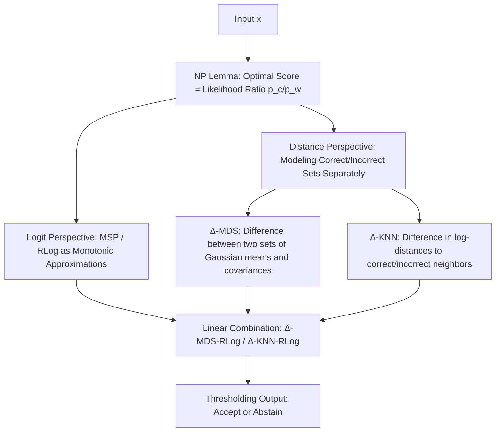

# Know When to Abstain: Optimal Selective Classification with Likelihood Ratios

**Conference**: ICLR 2026  
**OpenReview**: [https://openreview.net/forum?id=RsfaFXBFzM](https://openreview.net/forum?id=RsfaFXBFzM)  
**Code**: [https://github.com/clear-nus/sc-likelihood-ratios](https://github.com/clear-nus/sc-likelihood-ratios)  
**Area**: Selective Classification / Uncertainty Estimation / Learning Theory  
**Keywords**: Selective Classification, Neyman–Pearson Lemma, Likelihood Ratio, Covariate Shift, OOD Detection, VLM  

## TL;DR
This paper reframes the decision of "whether a model should abstain" as a likelihood ratio test using the classical Neyman–Pearson lemma. It proves that existing scorers such as MSP and RLog are essentially approximations of this likelihood ratio. Based on this, the authors design two distance-based scorers, $\Delta$-MDS and $\Delta$-KNN, which model "correct" and "incorrect" predictions separately, significantly reducing selective risk under covariate shift.

## Background & Motivation
**Background**: Selective classification allows a model to "abstain" on uncertain inputs, handing ambiguous samples over to human experts to enhance overall reliability. The mainstream approach involves post-hoc methods—fixing a strong classifier $f$ and designing a scoring function $s(x)$ to decide whether to accept or abstain via thresholding $g(x)=\mathbb{1}[s(x)>\gamma]$. Common scorers include Maximum Softmax Probability (MSP), Logit Margin (RLog), Mahalanobis Distance (MDS), and KNN distance, many of which are borrowed directly from OOD detection.

**Limitations of Prior Work**: Despite a variety of scorers, there is a lack of a unified theoretical framework to define "optimal scoring," with most methods relying on heuristics. Furthermore, most evaluations assume that test data is independent and identically distributed (i.i.d.) with training data. The few studies addressing distribution shifts focus primarily on **semantic shift** (introducing new categories) while ignoring **covariate shift** (changes in input appearance with a constant label space, e.g., photos $\rightarrow$ oil paintings of cats).

**Key Challenge**: Covariate shift is particularly prevalent in modern VLM deployments. Models like CLIP have vast and variable label sets, where most practical shifts are covariate in nature. However, existing SCOD (Selective Classification + OOD) methods, which model ID and OOD distributions separately, are designed for semantic shift and lack guarantees when applied to covariate shift.

**Goal**: To provide a unified definition of "optimality" for selective classification and derive new scorers robust to covariate shift. **Core Idea**: By viewing "classifier correct vs. incorrect" as two competing hypotheses $H_0:C$ (correct prediction) and $H_1:\neg C$ (incorrect prediction), the optimal abstention rule is the **likelihood ratio test** provided by the Neyman–Pearson lemma. Thus, the optimal score is the ratio of "correct density" to "incorrect density": $s(x)=p_c(x)/p_w(x)$.

## Method

### Overall Architecture
The framework centers on one core principle: to minimize the "false acceptance rate" (type II error) for a given abstention rate (type I error), the NP lemma identifies the unique optimal discriminant as the likelihood ratio $p_c(x)/p_w(x)$, where $p_c$ and $p_w$ are the input densities of correctly and incorrectly predicted samples, respectively. The paper achieves three objectives: (1) Proving that logit scorers like MSP and RLog are monotonic transformations of this likelihood ratio under specific assumptions, making them "NP-optimal"; (2) Since logit methods rely on classifier calibration, the authors explicitly estimate $p_c$ and $p_w$ in the feature space, proposing $\Delta$-MDS and $\Delta$-KNN; (3) Proving that a linear combination of logit and distance methods remains NP-optimal. The key insight is that $p_c/p_w$ naturally accounts for distribution shifts—whether a sample is ID or shifted, it is categorized into $p_c$ if predicted correctly and $p_w$ if incorrectly, eliminating the need to distinguish ID/OOD as in SCOD.

### Key Designs

**1. NP Lemma anchors Selective Classification as a Likelihood Ratio Test and unifies existing scorers**: The paper reformulates the abstention decision as a hypothesis test—accepting $H_0$ (correct prediction) or rejecting it for $H_1$ (incorrect prediction). Lemma 1 (NP Lemma) states that for a fixed type I error $\alpha_0$, the optimal acceptance region that minimizes type II error is $A^*=\{z: p_0(z)/p_1(z)\geq\gamma(\alpha_0)\}$. Thus, the optimal score is $s(x)=p_c(x)/p_w(x)$. Combined with Corollary 1—stating that any **monotonic transformation** (log, affine) of the likelihood ratio preserves ranking and the acceptance region—the paper defines operational "NP-optimality." Based on this, Theorem 1 proves that if a classifier is calibrated for top-1 accuracy ($P(C\mid x)=d_{(1)}(x)$), MSP is a monotonic transformation of $p_c/p_w$. If softmax mass is concentrated in the top two classes ($\sum_{i\geq3}d_{(i)}\ll d_{(2)}$), the logit margin RLog $=l_{(1)}-l_{(2)}$ is also NP-optimal. This explains why RLog often outperforms MSP empirically—it is invariant to temperature scaling and naturally resistant to miscalibration.

**2. $\Delta$-MDS: Modeling Correct and Incorrect Predictions via dual Gaussians and Mahalanobis difference**: Logit methods are vulnerable to poor classifier calibration. $\Delta$-MDS operates in the feature space by maintaining two sets of statistics for each class, $\{\mu_i^c,\Sigma^c\}$ and $\{\mu_i^w,\Sigma^w\}$, estimated from training samples predicted correctly and incorrectly by the classifier. The score is defined as the difference between two Mahalanobis distances: $s_{\Delta\text{-MDS}}(x)=D_{\text{MDS}}(x;\mu^c,\Sigma^c)-D_{\text{MDS}}(x;\mu^w,\Sigma^w)$. The intuition is that a higher score indicates the input is closer to the "correct zone" and further from the "incorrect zone." Theorem 2 proves this is a monotonic transformation of $p_c/p_w$ under the Gaussian assumptions $Z\mid C\sim\mathcal{N}(\mu_i^c,\Sigma^c)$ and $Z\mid\neg C\sim\mathcal{N}(\mu_i^w,\Sigma^w)$.

**3. $\Delta$-KNN: A non-parametric version using the difference in log-distances to correct/incorrect neighbors**: To avoid parametric assumptions, $\Delta$-KNN splits training features into a "correct set $A_c$" and an "incorrect set $A_w$." For a test point $z$, it calculates the Euclidean distances $u_k$ and $v_k$ to the $k$-th nearest neighbor in each set. The score is the difference of log-distances: $s_{\Delta\text{-KNN}}(x)=-\log u_k+\log v_k$. Theorem 3 proves its NP-optimality under asymptotic conditions ($k\to\infty$, $k/N_c\to0$, $k/N_w\to0$) **without requiring parametric forms for $p_c$ and $p_w$**. In practice, the average log-distance of top-$k$ neighbors is used for better empirical smoothness.

**4. Linear Combination: Adding logit and distance scores preserves NP-optimality**: Logit methods utilize the learned decision boundary, while distance methods utilize the geometry of the feature space. These are complementary. Lemma 2 shows that if $s_1$ and $s_2$ are each NP-optimal, then $t(x)=s_1(x)+\lambda s_2(x)$ for any $\lambda$ remains a monotonic transformation of a "tilted product" likelihood ratio, thereby maintaining optimality. Practically, distance scorers (e.g., $\Delta$-MDS) are combined with logit scorers (e.g., RLog) into $\Delta$-MDS-RLog.

## Key Experimental Results

### Main Results (DFN CLIP, ImageNet and Covariate Shift variants, AURC/NAURC, lower is better, AURC in $10^{-2}$ scale)

| Method | Avg(1K) AURC | Avg(1K) NAURC | Avg(all) AURC | Avg(all) NAURC |
|---|---|---|---|---|
| MSP | 11.5 | 0.479 | 8.43 | 0.387 |
| Energy | 24.8 | 1.09 | 21.5 | 1.15 |
| MDS | 13.9 | 0.619 | 11.3 | 0.569 |
| KNN | 13.1 | 0.567 | 9.83 | 0.474 |
| RLog | 7.39 | 0.239 | 5.67 | 0.200 |
| $\Delta$-MDS | 7.81 | 0.263 | 6.50 | 0.276 |
| $\Delta$-KNN | 7.32 | 0.235 | 5.89 | 0.225 |
| $\Delta$-MDS-RLog | 6.51 | 0.193 | 5.12 | 0.177 |
| **$\Delta$-KNN-RLog** | **6.43** | **0.187** | **5.01** | **0.163** |

### Main Results for Supervised Models (EVA, ImageNet-1K)

| Method | Avg(1K) AURC | Avg(1K) NAURC |
|---|---|---|
| MSP | 5.43 | 0.264 |
| MDS | 5.60 | 0.284 |
| KNN | 5.56 | 0.282 |
| RLog | 4.11 | 0.172 |
| $\Delta$-MDS | 4.18 | 0.180 |
| **$\Delta$-MDS-RLog** | **3.86** | **0.157** |
| $\Delta$-KNN-RLog | 4.00 | 0.166 |

### Key Findings
- **NP Assumptions Hold in Practice**: Upgrading from MDS/KNN to the NP-versions $\Delta$-MDS/$\Delta$-KNN leads to an approximately **50% reduction** in average AURC and NAURC on CLIP, validating the theory.
- **Linear Combinations are Most Effective**: $\Delta$-KNN-RLog achieves the best overall performance on CLIP, while $\Delta$-MDS-RLog is superior on EVA. RLog remains highly competitive as a standalone scorer.
- **NLP Tasks (Amazon Reviews + DistilBERT/LISA)**: $\Delta$-MDS-MSP and $\Delta$-KNN-MSP outperform baselines on both In-D and covariate shift data (e.g., In-D NAURC 0.354 vs. MSP 0.368), demonstrating cross-modal efficacy.
- Distance methods are weak on text tasks alone (MDS/KNN NAURC 0.7+), but significantly outperform baselines when combined with logit scores, confirming complementary signals.

## Highlights & Insights
- **Theoretical Unification**: The NP lemma unifies MSP, RLog, MDS, and KNN into a hierarchy of "likelihood ratio approximations," providing provably optimal extensions and elevating selective classification from a "collection of heuristics" to a principled framework.
- **Elegant $(p_c, p_w)$ Abstraction**: By integrating all shifts into "correct vs. incorrect density," the framework avoids the cumbersome ID/OOD distinction used in SCOD and is naturally suited for covariate shift.
- **Purely Post-hoc and Model-Agnostic**: It requires no architectural changes or retraining. By simply partitioning training data into "correct/incorrect" sets to estimate statistics, it is easy to deploy and compatible with zero-shot VLMs like CLIP.

## Limitations & Future Work
- **Strong Theoretical Assumptions**: $\Delta$-MDS relies on Gaussian features, and $\Delta$-KNN depends on asymptotic conditions for density estimation, which may not hold with finite samples.
- **Implementation vs. Theory**: The top-$k$ average log-distance version used in practice deviates slightly from the single $k$-th neighbor form in Theorem 3.
- **Calibration Issues**: The impact of logit calibration (e.g., temperature scaling) was excluded from the scope; logit-based branches in combinations may still be affected.
- **Focus on Covariate Shift**: While semantic shift was evaluated, the framework is primarily designed for covariate shift. Hyperparameters $\lambda$ and $k$ still require tuning on a validation set.

## Related Work & Insights
- **History of Reject Option**: Starting from Chow’s (1970) cost-based rejection to risk-coverage frameworks by El-Yaniv & Geifman, this paper completes the definition of "optimality" in this lineage.
- **OOD Detection Scorers**: This work reveals the optimality conditions of scorers like MSP and MDS when repurposed for selective classification.
- **Training-time Rejection**: Unlike SelectiveNet or Deep Gamblers which require joint training, this post-hoc approach is orthogonal and easier to deploy.
- **Relationship with RLog (Liang et al. 2024)**: The paper provides a "reverse explanation" for RLog's effectiveness under shift through the NP framework and extends it to new scorers.
- **Insights**: The approach of explicitly modeling "correct/incorrect" classes and unifying them via likelihood ratios can be extended to other abstention scenarios, such as LLM halluncination detection or RAG "to-retrieve-or-not" decisions.

## Rating
- **Novelty**: ⭐⭐⭐⭐ —— Unifies existing scorers via the NP lemma and derives new scorers with optimality guarantees; loss of a point as individual components (MDS/KNN differences) are not fundamentally transformative.
- **Experimental Thoroughness**: ⭐⭐⭐⭐ —— Covers CLIP, EVA, and DistilBERT across multiple covariate shifts and text tasks; NLP scale is relatively small and excludes larger LLMs.
- **Writing Quality**: ⭐⭐⭐⭐ —— Seamless transition between theory and method; clear progression from theorems to scorers. Formula-heavy content may be challenging for those without a statistical background.
- **Value**: ⭐⭐⭐⭐ —— Provides a unified, provably optimal framework and plug-and-play scorers that are highly practical for reliable VLM deployment.

<!-- RELATED:START -->

## Related Papers

- [\[ICLR 2026\] Practical Estimation of the Optimal Classification Error with Soft Labels and Calibration](practical_estimation_of_the_optimal_classification_error_with_soft_labels_and_ca.md)
- [\[ICLR 2026\] Preventing Model Collapse Under Overparametrization: Optimal Mixing Ratios for Interpolation Learning and Ridge Regression](preventing_model_collapse_under_overparametrization_optimal_mixing_ratios_for_in.md)
- [\[ICLR 2026\] An Efficient, Provably Optimal Algorithm for the 0-1 Loss Linear Classification Problem](an_efficient_provably_optimal_algorithm_for_the_0-1_loss_linear_classification_p.md)
- [\[ICLR 2026\] "Noisier" Noise Contrastive Estimation is (Almost) Maximum Likelihood](noisier_noise_contrastive_estimation_is_almost_maximum_likelihood.md)
- [\[ICLR 2026\] When Shift Happens - Confounding is to Blame](when_shift_happens_-_confounding_is_to_blame.md)

<!-- RELATED:END -->
