# Language Identification in the Limit with Computational Trace

**Conference**: ICLR 2026  
**OpenReview**: [https://openreview.net/forum?id=1OAGf7ntSE](https://openreview.net/forum?id=1OAGf7ntSE)  
**Code**: None (Purely theoretical work)  
**Area**: Learning Theory / Learnability / CoT Theory  
**Keywords**: identification in the limit, Gold model, chain-of-thought, computational trace, Chomsky hierarchy, robust learnability  

## TL;DR
This paper extends the classic Gold 1967 paradigm of "identification in the limit" to "identification in the limit with computational trace (CoT)". It proves that if the learner is provided with the machine execution trace for each positive example, **all Turing-recognizable languages can be identified in the limit** (contrasting sharply with Gold's famous negative result where even regular languages are unidentifiable). Furthermore, it characterizes the upper bounds of tolerable noise when traces are adversarially corrupted for DFA, DPDA, and TM language classes, establishing a clean "trichotomy".

## Background & Motivation

**Background**: Training LLMs with Chain-of-Thought (CoT) traces has been repeatedly proven to significantly enhance capabilities, but theoretical explanations for "why CoT works" remain weak. Existing theoretical works (Malach 2023, Joshi 2022, Altabaa 2025) primarily approach this from the perspective of **statistical learning**—treating CoT as an additional supervisory signal that reduces sample complexity.

**Limitations of Prior Work**: The statistical perspective answer "how many samples are needed" but fails to address a more fundamental question—whether CoT helps the model learn the **correct world model**, i.e., the true "rules" behind the environment. To formalize "learning the correct rules," the most natural tool is Gold's **identification in the limit**: viewing each language as a set of all "facts" in a world, where a learner observes a sequence of positive example enumerations and must converge to a correct description of the language after a finite number of errors.

**Key Challenge**: Under the Gold paradigm, almost all interesting language classes are **unidentifiable** (Angluin 1980). Even for regular languages identifiable by a DFA, since the learner only sees positive examples and never receives negative ones, an adversary can always construct an enumeration that causes infinite errors (classic hard instance $\mathcal{L}=\{\mathbb{N}, L_1, L_2, \dots\}$ where $L_i=\{1,\dots,i\}$).

**Goal**: To augment the Gold–Angluin model with a "CoT channel"—where the learner, besides seeing the positive example $x$, also observes the **complete execution trace** $c_M(x)$ (step-by-step changes in state sequences / stack contents / tape configurations) of a fixed machine $M$ that accepts $x$. The questions are: To what extent does this trace channel expand the identifiable language classes? And how much noise can it withstand when traces are adversarially corrupted?

**Key Insight**: **[Trace as Evidence]** Computational traces are upgraded from "step-by-step reconstruction of the transition function" to "evidence for the scale of the target machine." The number of observed states either grows continuously (which can only happen finitely many times) or, conversely, proves that the target machine's state count is bounded by the number of observed states, thereby collapsing the infinite hypothesis class into a **finite language class identification** problem.

## Method

### Overall Architecture

This is a purely theoretical work. Its structure consists of "two sets of model definitions + two categories of theorems": first, extending Gold's identification in the limit (Definition 1) to **identification with traces** (Definition 3), and further to **robust identification under edit-distance corruption** (Definitions 4–5, categorized by constant/vanishing/finite noise rates). It then proves positive results under noise-free conditions (Theorem 3.1: all TM-recognizable) and the trichotomy under noisy conditions (Theorems 4.1/4.3/4.5: noise boundaries for DFA/DPDA/TM). The two sets of theorems employ distinct algorithmic strategies—"machine reconstruction" for the noise-free case and "trace as scale evidence" for the noisy case.

```mermaid
flowchart TD
    A[Gold Identification in the Limit<br/>Positive examples only → Regular languages unidentifiable] --> B[Identification with Trace Def.3<br/>Positive x + Execution trace c_M&#40;x&#41;]
    B --> C["Thm 3.1 Noise-free<br/>Incremental reconstruction &#40;Subset Invariant&#41;<br/>All TM-recognizable"]
    B --> D[Robust Identification Def.4-5<br/>Trace corrupted by edit distance]
    D --> E["Technical Template: Trace as scale evidence<br/>Observed states grow OR target states bounded<br/>→ Collapse to identification of finite classes"]
    E --> F["Thm 4.1 DFA: Identifiable with constant noise rate"]
    E --> G["Thm 4.3 DPDA: Identifiable with vanishing rate / Not with constant"]
    E --> H["Thm 4.5 TM: Identifiable with finite errors / Not with vanishing"]
```

### Key Designs

**1. Identification Model with Trace: Formalizing CoT as machine execution traces.** The key to the model is not providing "more strings" to the learner, but providing **structured internal information**. For a machine $M$ and an accepted input $x\in L(M)$, the trace $c_M(x)$ is defined as the sequence of configurations at each timestep. For a DFA, this is the sequence of states visited (e.g., a DFA recognizing "even number of 1s" on input $1010$ has the trace $(q_{even},q_{odd},q_{odd},q_{even},q_{even})$); for a TM, it includes states, tape, and head positions. The enumeration seen by the learner becomes $E_{\text{trace}}=\big((x_1,c_M(x_1)),(x_2,c_M(x_2)),\dots\big)$. This paper deliberately provides only **acceptance traces for positive examples** (no negative examples), a critical difference from the closely related work by Papazov & Flammarion 2025—the latter includes negative examples, which trivializes identification (outputting the smallest consistent language). This design translates "CoT helps the model learn rules" into "traces help the learner identify languages."

**2. "Subset Invariant" for Machine Reconstruction under Noise-free Conditions.** In the warm-up proof for DFAs, the learner maintains an incrementally growing DFA $M_t$: initially starting with only a start state and a rejection trap $r$, where all unseen transitions point to $r$. For each $(x_t,c(x_t))$, new states from the trace are added to $Q_t$, the final acceptance state to $F_t$, and observed transitions $(q,a)\to q'$ are updated in $\delta_t$. This construction maintains two properties: the **subset invariant** $L(M_t)\subseteq K$ (since unseen edges always lead to the rejection trap, $M_t$ is always more conservative than the truth and never over-accepts), and **eventual completeness** (the states and edges of the true machine appearing on any acceptance computation are finite; each will be covered by some trace after finite steps, thus $M_t$ eventually matches the true machine $M^*$ on all acceptance edges). Extending this "conservative reconstruction" from finite control to Turing machines yields the main result Theorem 3.1: **All TM-recognizable languages are identifiable in the limit with traces**—a sharp contrast to Gold's negative results where even DFAs are unidentifiable without traces.

**3. Unified Template of "Trace as Scale Evidence" under Noise.** Once traces are adversarially corrupted by edit distance, the incremental reconstruction fails (noise introduces fake transitions). This paper switches to a different algorithmic template: instead of reconstructing the machine, it treats the set of observed states $Q_t$ as evidence for the target machine's scale. A key lemma proves that **either the number of observed states continues to grow (which occurs only finitely many times), or the graph distance from any "accepting state" to the observed state set $U=Q_{t'}$ is bounded by a value depending only on $|U|$**. For DFA, Lemma 4.2 gives for any accepting state $q$, $\mathrm{dist}_U(q)\le \max\big(\tfrac{2}{1-\alpha}|U|,\ \ell_\alpha\big)$. Since the alphabet size is 2 and out-degree is bounded, the total number of accepting states is bounded by $B_t=|Q_t|\cdot 2^{2|Q_t|/(1-\alpha)+\ell_\alpha}+1$. Consequently, from some point onwards, the hypothesis class collapses to a **fixed finite family of languages**, and Gold's finite class identification (Fact 2.1, outputting the smallest language consistent with history) can be directly applied to converge. This "bounded distance $\to$ finite class" argument forms the core of the trichotomy.

**4. Trichotomy across the Chomsky Hierarchy: Noise tolerance decreases with machine complexity.** Applying the same template to three classes of machines yields three distinct noise tolerance boundaries due to the varying difficulty of proving "bounded distance." **DFA (Regular)** is the most resilient: identifiable under a constant corruption rate, even if $0.999$ of the trace is corrupted (Theorem 4.1). **DPDA (Deterministic Context-Free)** is intermediate: unidentifiable under any constant rate, but identifiable under a vanishing corruption rate (Theorem 4.3)—the proof for its "bounded distance" is hardest, requiring the conversion of DPDA traces into Chomsky Normal Form (CNF) and bounding the CNF tree size. The impossibility direction uses languages like $L_i=\{a^nb^{2n/\alpha}:n\le i\}$ to allow an adversary to erase the first $n$ steps of the trace, reducing it to Fact 2.2's hard instance. **TM (Recursively Enumerable)** is the most fragile: it cannot even withstand vanishing corruption rates; it is identifiable only if **the total number of errors per trace is bounded by an absolute constant (finite errors)** (Theorem 4.5). The intuition is clear—as machines grow more powerful and traces carry more critical information, the adversary's ability to destroy information becomes more lethal.

## Key Experimental Results

This paper is purely theoretical and does not contain numerical experiments. The core "results" are a set of learnability theorems, summarized below.

### Main Results: Identification with Trace vs. Original Gold Setting

| Language Class | Recognizing Machine | Original Gold (No Trace) | Ours (Perfect Trace) |
|---|---|---|---|
| Regular | DFA | ❌ Unidentifiable (even the simplest) | ✅ Identifiable |
| Deterministic CFG | DPDA | ❌ Unidentifiable | ✅ Identifiable |
| Recursively Enumerable | TM | ❌ Unidentifiable | ✅ Identifiable (Theorem 3.1) |

### Trichotomy of Robust Identification: Tolerable Corruption Levels

| Machine Class | Constant Noise Rate $\alpha\in(0,1)$ | Vanishing Noise Rate $o(1)$ | Finite Errors (Abs. Constant $C$) |
|---|---|---|---|
| DFA (Regular) | ✅ Identifiable (even $\alpha=0.999$) | ✅ | ✅ |
| DPDA (DCFG) | ❌ Unidentifiable (any $\alpha>0$) | ✅ Identifiable | ✅ |
| TM (RE) | ❌ | ❌ Unidentifiable | ✅ Iff errors per example are bounded |

### Key Findings
- **Trace constitutes a "qualitative" change**: The jump from "even DFA is unidentifiable" to "all TM-recognizable are identifiable" shows that CoT does not just provide more samples; it provides the learner with structural information that was fundamentally inaccessible.
- **Noise resilience is negatively correlated with machine complexity**: More powerful machines (TM) rely more heavily on trace integrity, while weaker machines (DFA) can recover from highly fragmented traces—a clean and counter-intuitive hierarchical phenomenon.
- **Complementary algorithmic paradigms**: Noise-free scenarios rely on "conservative machine reconstruction + subset invariants," while noisy scenarios rely on "trace as scale evidence + collapse to finite classes." The latter is key to bypassing corruption.
- **Identifiable with positive examples only**: In a context where identification is often trivialized by negative examples, this paper's insistence on using only positive acceptance traces ensures the results characterize the information value of the "trace itself."

## Highlights & Insights
- **Connecting "Why CoT works" to the classical lineage of computability/learnability**: Unlike the mainstream statistical sample complexity perspective, this paper answers from the reachability of "learning the correct world model," aligning with Gold–Angluin and Kleinberg–Mullainathan's generation in the limit.
- **Clean results**: A single primary positive theorem (all TM identifiable) plus a trichotomy across the Chomsky hierarchy. The theorems are symmetric and intuitive, making for an exceptionally clear narrative in a theoretical work.
- **"Trace as evidence" technical insight**: Shifting the view of traces from "material for reconstruction" to "upper-bound evidence for machine size" is the technical core of the robust results and may serve as a reference for future work on noisy learning.
- **Edit distance corruption model reflects realistic CoT failure**: Modeling jumps, errors, or partial visibility as edit distance while distinguishing between constant, vanishing, and finite error regimes provides strong descriptive power.

## Limitations & Future Work
- **Asymptotic nature and lack of rates**: All conclusions are "in the limit," without specifying how much time or how many samples are required for identification. The authors identify this as the primary open problem—seeking quantitative bounds given CoT.
- **Idealized trace assumptions**: Traces are modeled as exact execution steps of a fixed machine, and the learner is assumed to know the error regime (and constants $\alpha, \ell_\alpha, C$), which differs significantly from real-world LLM CoTs (natural language, non-deterministic, potentially inherently wrong).
- **Positive-only and single machine**: The model is restricted to positive acceptance traces and a single target machine. It remains unknown how identification with traces behaves under unions or mixtures of language classes.
- **Unexplored intersection with generation in the limit**: The authors suggest introducing CoT into Kleinberg–Mullainathan's generation in the limit to see if it accelerates generation or alters the breadth/hallucination trade-off, but this was not covered.

## Related Work & Insights
- **Gold (1967) / Angluin (1979, 1980)**: The foundations of identification in the limit; the direct starting point and point of contrast for this paper.
- **Kleinberg & Mullainathan (2024) and subsequent (Li 2024, Kalavasis 2024, Charikar & Pabbaraju 2024)**: Generation in the limit paradigm—showing all countable language classes are generatable if the goal is relaxed; this paper is the "identification side + CoT" counterpart.
- **Papazov & Flammarion (2025)**: Closest work, studying identification with negative examples and side information (e.g., computation time). This paper emphasizes positive-only + traces, leading to fundamentally different conclusions.
- **Statistical CoT Theory (Malach 2023, Joshi 2022, Altabaa 2025)**: Explain CoT via sample complexity, length complexity, or information theory; this paper is orthogonal (computability vs. statistics).
- **Empirical World Models (Li 2023, Nanda 2023, Vafa 2024)**: Measuring whether LLMs learn world models via board games or city maps; provided the motivation for modeling "language as a set of world facts."
- **Insight**: This paper suggests that providing "verifiable intermediate computation traces" theoretically bridges learnability gaps that pure samples cannot. It provides a theoretical footnote for the importance of trace quality over quantity in practices like process rewards and verifiable reasoning.

## Rating
- **Novelty**: ⭐⭐⭐⭐⭐ First to formalize CoT within the Gold paradigm. Explains CoT via learnability, yielding a clean trichotomy across the Chomsky hierarchy. Highly original.
- **Experimental Thoroughness**: ⭐⭐⭐⭐ Theoretical work with no numerical experiments (reasonable). Theorems are comprehensive, covering both positive results and impossibility instances. Proof techniques are self-consistent, though quantitative rates are missing.
- **Writing Quality**: ⭐⭐⭐⭐⭐ Clear progression from motivation to definitions, using DFA as a warm-up before TM. Results are presented via informal theorems and summary tables, making it exceptionally readable for a theory paper.
- **Value**: ⭐⭐⭐⭐ Supplements the theoretical foundation of "why CoT works" from a computability perspective. Conceptually valuable for understanding process supervision; however, idealized assumptions and asymptotic focus leave a gap to practical guidance.

<!-- RELATED:START -->

## Related Papers

- [\[ICLR 2026\] Automata Learning and Identification of the Support of Language Models](automata_learning_and_identification_of_the_support_of_language_models.md)
- [\[ICLR 2026\] Computational Bottlenecks for Denoising Diffusions](computational_bottlenecks_for_denoising_diffusions.md)
- [\[ICLR 2026\] On the Computational Limits of AI4S-RL：A Unified $\varepsilon$-$N$ Analysis](on_the_computational_limits_of_ai4s-rl_a_unified_varepsilon-n_analysis.md)
- [\[ICLR 2026\] The Softmax Bottleneck Does Not Limit the Probabilities of the Most Likely Tokens](the_softmax_bottleneck_does_not_limit_the_probabilities_of_the_most_likely_token.md)
- [\[ICLR 2026\] Diffusion Language Models are Provably Optimal Parallel Samplers](diffusion_language_models_are_provably_optimal_parallel_samplers.md)

<!-- RELATED:END -->
