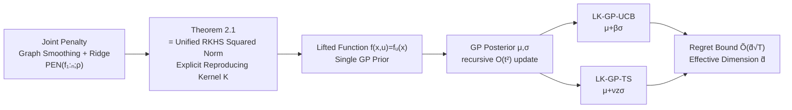

# Laplacian Kernelized Bandit

**Conference**: ICLR 2026  
**OpenReview**: [https://openreview.net/forum?id=5majEbTAZa](https://openreview.net/forum?id=5majEbTAZa)  
**Code**: Not publicly available  
**Area**: Learning Theory / Online Learning / Kernelized Bandits  
**Keywords**: Multi-user Contextual Bandits, Gang of Bandits, Graph Homophily, RKHS, Gaussian Process, Effective Dimension, Regret Bound  

## TL;DR
This paper reduces the multi-user, nonlinear reward Gang-of-Bandits problem on graphs to learning a single "lifted function" in a **unified multi-user RKHS**. The reproducing kernel elegantly fuses the graph Laplacian and the arm kernel as $K((x,u),(x',u'))=[L_\rho^{-1}]_{u,u'}K_x(x,x')$, leading to the design of LK-GP-UCB / LK-GP-TS algorithms with theoretical regret guarantees.

## Background & Motivation
- **Background**: Graph structures are ubiquitous in sequential decision-making (capturing similarities between users, items, or sensors). The classical paradigm for multi-user contextual bandits is the Gang of Bandits (GOB), which treats the reward functions $\{f_u\}$ of $n$ users as smooth signals on a graph. It utilizes the graph Laplacian to penalize "roughness" for information sharing, which is more efficient than independent learning for each user.
- **Limitations of Prior Work**: Foundational works like GoB.Lin **assume linear rewards** $f_u(x)=\theta_u^\top x$, and subsequent improvements mostly remain within this linear paradigm. However, rewards in real-world scenarios such as recommendation systems and personalized medicine are often **nonlinear**. While single-agent kernelized bandits can handle nonlinearity, previous attempts in the "multi-user + graph" setting only used **heuristic** products of user and arm kernels (e.g., COOP-KernelUCB), leaving a gap between modeling objectives and final algorithms.
- **Key Challenge**: How to simultaneously characterize the **nonlinear** structure of rewards relative to arm features and encode **graph homophily** (similar rewards for connected users), while ensuring this regularization derives a **theoretically guaranteed** and computationally feasible exploration algorithm—rather than an ad-hoc heuristic kernel.
- **Goal**: Starting from first principles, design a principled joint penalty for the "set of user reward functions" (graph smoothing + individual complexity) and prove it is equivalent to a norm in a unified space, thereby transforming multi-function learning into single-function learning to leverage mature GP bandit frameworks.
- **Core Idea**: **[Unified Kernel]** The joint penalty $\mathrm{PEN}(f_{1:n};\rho)$ is not a makeshift regularization term but is precisely the **squared norm of a single RKHS** defined on the product domain $\mathcal U\times\mathcal D$, where the reproducing kernel tensor-fuses the graph Green's function $L_\rho^{-1}$ with the arm kernel $K_x$.

## Method

### Overall Architecture
The framework consists of three steps: (1) Construct a joint penalty for the function set $\{f_u\}$ using a "graph smoothing term + ridge penalty"; (2) Prove that this penalty equals the squared RKHS norm of the lifted function $f(x,u):=f_u(x)$ on the product space $\mathcal H=\mathcal H_G\otimes\mathcal H_x$, and derive the reproducing kernel explicitly; (3) Place a Gaussian Process prior on this unified kernel, using GP posterior mean/variance to drive UCB and Thompson Sampling exploration, and provide regret bounds based on the "effective dimension."

### Key Designs

**1. Joint Penalty: Integrating "Graph Homophily + Individual Smoothness" into one objective.** The authors require an ideal set of reward functions to be smooth on the graph (homophily) and have low complexity individually within the RKHS $\mathcal H_x$. These are combined additively into a single penalty—the graph smoothing term measures differences between connected users via squared distance in the RKHS, while a standard ridge term constrains individual norms:
$$\mathrm{PEN}(f_{1:n};\rho)=\underbrace{\tfrac12\sum_{i,j}w_{ij}\|f_i-f_j\|_{\mathcal H_x}^2}_{\text{Graph Smoothing}}+\underbrace{\rho\sum_i\|f_i\|_{\mathcal H_x}^2}_{\text{Ridge}}=\sum_{i,j}[L_\rho]_{ij}\langle f_i,f_j\rangle_{\mathcal H_x},$$
where $L_\rho=L+\rho I$ is the regularized Laplacian. This form is crucial: it unifies graph structure (coupling users via off-diagonal terms of $L_\rho$) and individual regularization (diagonal $\rho$) into a quadratic form, setting the stage for proving it is a norm.

**2. Unified Multi-user Kernel: Tensor fusion of Laplacian and arm kernel (Core Contribution).** Theorem 2.1 proves that the penalty above is exactly the squared RKHS norm of the "lifted function" $f(x,u):=f_u(x)$ on the product space $\mathcal H=\mathcal H_G\otimes\mathcal H_x$, where the kernel of $\mathcal H_G$ is $K_G(u,u')=[L_\rho^{-1}]_{u,u'}$. This explicitly derives the multi-user reproducing kernel:
$$K((x,u),(x',u'))=[L_\rho^{-1}]_{u,u'}\,K_x(x,x').$$
Intuitively, $K_x$ measures similarity between arms, while $L_\rho^{-1}$ (the graph Green’s function) measures similarity between users—$[L_\rho^{-1}]_{u,u'}$ accumulates connection strength through all paths on the graph. The associated feature map is $\phi(x,u)=L_\rho^{-1/2}e_u\otimes\varphi(x)$. This step signifies that learning "$n$ correlated functions" can be rewritten as learning a "single function in a well-defined kernel space," removing heuristic guesswork and enabling the direct use of mature GP/Kernel bandit tools.

**3. GP Exploration on Unified Kernel: UCB and Thompson Sampling.** A zero-mean GP prior $f\sim\mathrm{GP}(0,K)$ is placed on the lifted function. Given history, the posterior for any $(x,u)$ is $\mathcal N(\mu_{u,t},\sigma_{u,t}^2)$, with mean and variance:
$$\mu_{u,t}(x)=k_t(x,u)^\top(K_t+\lambda I)^{-1}y_t,\quad \sigma_{u,t}^2(x)=K((x,u),(x,u))-k_t^\top(K_t+\lambda I)^{-1}k_t.$$
The posterior mean matches the solution of offline "Kernel Laplacian Regularized Regression (KLRR)," aligning online exploration with batch learning objectives. Two decision rules follow naturally: LK-GP-UCB selects $x_t=\arg\max_x\mu_{u_t,t-1}(x)+\beta_t\sigma_{u_t,t-1}(x)$ (optimism under uncertainty), and LK-GP-TS selects $x_t=\arg\max_x\mu+\nu_t z_t(x)\sigma$ (probability matching, $z_t\sim\mathcal N(0,1)$). To address the $O(t^3)$ cost of naive posterior updates, the authors use recurrence formulas to reduce mean/variance updates to $O(t^2)$, employing a hybrid strategy of exact inversion for small $t$ and recurrence for large $t$ to balance stability and efficiency.

**4. Effective Dimension Regret Bounds: Regret independent of user count, dependent on spectral structure.** The confidence bound (Theorem 4.1) maintains the precise $\log\det(I_t+\lambda^{-1}K_t)$ term (avoiding loosening via information-theoretic quantities) and does not require $\lambda\ge1$. The **effective dimension** is defined as $\tilde d=\frac{\log\det(I_T+K_T/\lambda)}{\log(1+TK_{\max}/\lambda)}$, a robust measure of the "dimensionality" explored by the algorithm. Both algorithms satisfy $R_T=\tilde O(\tilde d\sqrt T)$, where regret depends on $\tilde d$ rather than the user count $n$ or feature dimension. Spectral analysis reveals that since $K=K_G\otimes K_x$, its spectrum is the pairwise product of eigenvalues; under **strong homophily in a complete graph**, $L_\rho^{-1}$ is approximately rank-1. "Head+Tail" decomposition (Eq. 14) shows that for $T\le Cn$, $\gamma_T^{\text{clique}}=O(1)$, meaning $\tilde d=O(1/\log T)$ and regret is independent of $n$—a phenomenon absent in single-user settings. For $k$ clusters, $\tilde d=O(k/\log T)$, effectively "soft-counting" the number of user clusters.

## Key Experimental Results

Evaluated in synthetic environments with fixed noise $\sigma=0.1$ and $n=20$ users, across three difficulty levels (Easy: 10 arms/50% visibility/$T{=}1000$; Medium: 20 arms/25%/$T{=}3000$; Hard: 50 arms/10%/$T{=}5000$). User graphs were generated via Erdős–Rényi or RBF random graphs.

### Main Results

| Dimension | Setting |
|------|------|
| Ours | LK-GP-UCB, LK-GP-TS |
| Baselines | GraphUCB, GoB.Lin, COOP-KernelUCB, GP-UCB, Pooled LinUCB, Per-User LinUCB |
| Reward Regime | Linear-GOB (linear, $\Theta=(I+\eta L)^{-1}\Theta_0$); Laplacian-Kernel (nonlinear, generated via unified kernel GP draw / representer draw) |
| Evaluation Metrics | Cumulative regret across 9 data environments |

### Key Findings
- **Full Dominance in Nonlinear Regimes**: In both Laplacian-Kernel settings (GP draw / representer draw), LK-GP-UCB and LK-GP-TS remain the optimal choices, consistently ranking first in GP draw settings.
- **Only Sublinear Performance under Representer Draw**: In this setting, both algorithms from this work achieve sublinear regret, while **most baselines fail to reach sublinearity**, leading to a widening gap over time.
- **Competitive in Linear Regimes**: Even in Linear-GOB—the home turf of linear bandits—the proposed methods outperform most baselines by a significant margin, confirming that they do not sacrifice performance when rewards are actually linear.
- **Regret Independent of $n$ under Strong Homophily**: Figure 1 demonstrates that information gain $\gamma_T$ barely grows (or even slightly decreases) with $n$ under a complete graph, and $\tilde d$ grows much slower than $(\log T)^d$, corresponding to the "rank collapse" phenomenon.
- **Similarity Kernel Validation**: Five similarity kernels were tested for COOP-KernelUCB; experiments confirmed $L_\rho^{-1}$ as the optimal choice (empirical MMD closest to optimal). Even when provided with its best kernel, LK-GP-UCB remains consistently superior.

## Highlights & Insights
- **"Heuristic Kernel → First-Principles Kernel" Paradigm Shift**: Instead of arbitrarily choosing a "user kernel × arm kernel" product, the authors prove it is the unique reproducing kernel $L_\rho^{-1}K_x$ corresponding to the joint penalty, aligning the modeling objective perfectly with the algorithm.
- **Leveraging a Unified Perspective**: By compressing a multi-user problem into "single function + single kernel," the entire GP/Kernel bandit toolbox (posteriors, confidence bounds, SupKernelUCB improvements) becomes plug-and-play, reducing both theoretical and engineering overhead.
- **Insights into Spectral Collapse**: When strong homophily exists (complete graphs or few clusters), the kernel is approximately low-rank. The effective dimension $\tilde d$ degrades to "number of user clusters / $\log T$," directly explaining why sharing graph information allows regret to escape dependence on $n$.

## Limitations & Future Work
- **Synthetic Data Limitations**: Validation is limited to ER/RBF random graphs and synthetic rewards, lacking verification on real-world recommendation/medical datasets or actual user graphs.
- **Static and Known Graphs**: The method assumes the user graph $G$ is fully known and does not handle unknown, noisy, or time-evolving graphs.
- **Loose Regret Bound for Infinite Arms**: In the worst case (independent users), the $\tilde d\sqrt T$ bound is looser than the independent learning bound $\sqrt{nT}$ by a factor of $\sqrt n$. The authors suggest that SupKernelUCB-style techniques could recover $\sqrt{\tilde dT}$ in consistently finite arm spaces, but this was not implemented in the main algorithm.
- **Computation and Hyperparameters**: While updates are reduced to $O(t^2)$, they remain heavy for large-scale/long-term sequences. $\lambda$ uses spectral ratio scheduling, and $\beta, \nu$ require tuning, making robustness dependent on parameter selection.

## Related Work & Insights
- **Gang of Bandits Lineage**: GoB.Lin (Cesa-Bianchi 2013) and GraphUCB (Yang 2020) model user rewards as smooth linear signals on graphs; this work is a natural nonlinear and kernelized extension.
- **Kernelized/GP Bandits**: GP-UCB (Srinivas 2009), IGP-UCB (Chowdhury & Gopalan 2017), and SupKernelUCB (Valko 2013) provide the single-agent framework for confidence bounds and regret analysis, which this work elevates to multi-user product kernels.
- **Laplacian Regularization and Green's Function Kernels**: Smola & Kondor (2003) noted that kernels induced by Laplacian regularization in scalar cases are (regularized) graph Green's functions. This work proves the principle holds in contextual settings with arm features.
- **Insight**: Reducing "multi-task/multi-user + structural prior" problems to "single-function learning on product kernels" is a reusable reduction paradigm applicable to federated bandits, collaborative filtering, or Bayesian optimization on graphs.

## Rating
- **Novelty**: ⭐⭐⭐⭐ — Transforming "joint penalty = unified RKHS norm + explicit fusion kernel" elevates heuristic approaches to first principles. Spectral collapse analysis is insightful, though the blocks (Laplacian reg, GP-UCB, tensor kernels) are established.
- **Experimental Thoroughness**: ⭐⭐⭐ — 9 synthetic environments with baseline/kernel ablations are systematic, but the lack of real-world datasets and graphs limits the overall persuasiveness.
- **Writing Quality**: ⭐⭐⭐⭐ — The logical flow from penalty to kernel to algorithm to regret bound is smooth; theorems are clear, and the "Head+Tail" spectral analysis is intuitive.
- **Value**: ⭐⭐⭐⭐ — Provides a clean, scalable, and theoretically guaranteed unified framework for nonlinear multi-user bandits. This methodological contribution is solid for future research in structured sequential decision-making.

<!-- RELATED:START -->

## Related Papers

- [\[ICLR 2026\] Bandit Learning in Matching Markets Robust to Adversarial Corruptions](bandit_learning_in_matching_markets_robust_to_adversarial_corruptions.md)
- [\[ICLR 2026\] Online Conformal Prediction with Adversarial Semi-bandit Feedback via Regret Minimization](online_conformal_prediction_with_adversarial_semi-bandit_feedback_via_regret_min.md)
- [\[ICML 2026\] Bandit Social Learning with Exploration Episodes](../../ICML2026/learning_theory/bandit_social_learning_with_exploration_episodes.md)
- [\[ICML 2026\] Cutting LLM Evaluation Costs with SySRs: A Bandit Algorithm that Provably Exploits Model Similarity](../../ICML2026/learning_theory/cutting_llm_evaluation_costs_with_sysrs_a_bandit_algorithm_that_provably_exploit.md)
- [\[ICML 2025\] Learning-Augmented Algorithms for MTS with Bandit Access to Multiple Predictors](../../ICML2025/learning_theory/learning-augmented_algorithms_for_mts_with_bandit_access_to_multiple_predictors.md)

<!-- RELATED:END -->
