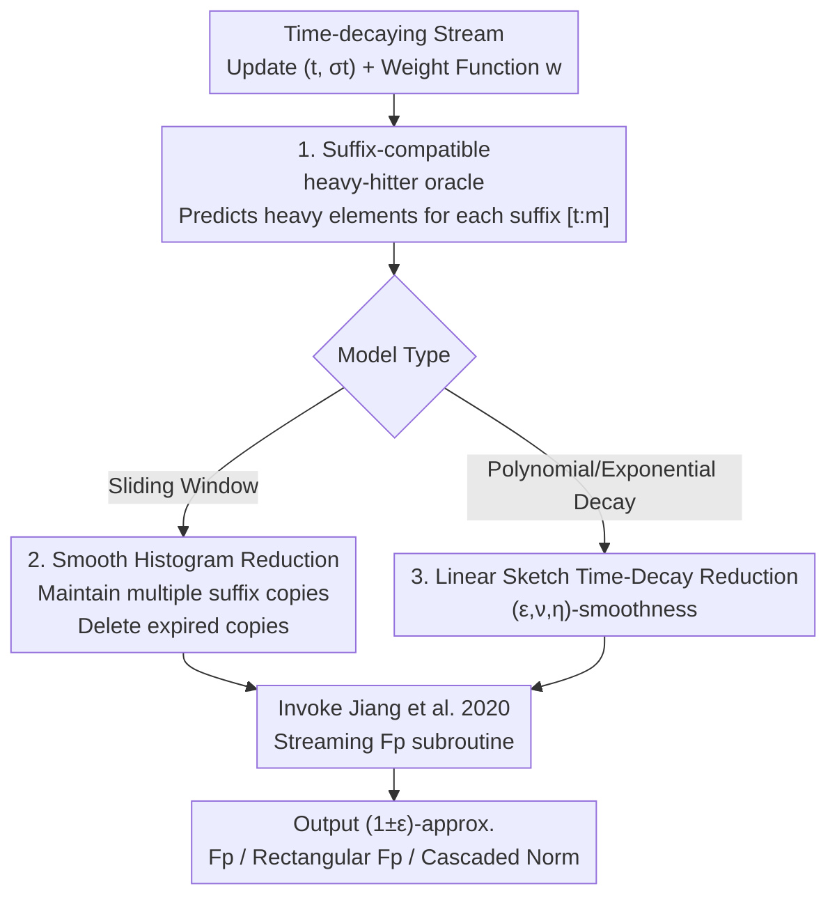

# Learning-Augmented Moment Estimation on Time-Decay Models

**Conference**: ICLR 2026  
**OpenReview**: [https://openreview.net/forum?id=x0xBJxrVTy](https://openreview.net/forum?id=x0xBJxrVTy)  
**Code**: https://github.com/ndsoham/learning-augmented-fp-time-decay  
**Area**: Learning Theory / Streaming Algorithms / Learning-Augmented Algorithms  
**Keywords**: Time-decaying streams, Moment estimation, Heavy-hitter oracle, Smooth histograms, Sliding windows

## TL;DR
This paper introduces "ML-predicted heavy-hitter oracles" into **time-decaying stream models** (including polynomial decay, exponential decay, and sliding windows). By employing a **suffix-compatible oracle** that only predicts heavy elements in "stream suffixes" combined with a **smoothness reduction**, existing learning-augmented streaming $F_p$ moment estimation algorithms are ported to time-decay scenarios almost losslessly, resulting in space-near-optimal, implementable, and formally guaranteed algorithms.

## Background & Motivation

**Background**: In data stream models, a frequency vector $x \in \mathbb{R}^n$ is incrementally updated. The goal is to estimate a function $f(x)$ using memory much smaller than the data size, with the most classical being the $F_p$ moment $\|x\|_p^p = \sum_i |x_i|^p$. For $p \geq 2$, the count-sketch framework can achieve a $(1\pm\varepsilon)$ approximation using $\tilde{O}(n^{1-2/p})$ space, a bound proven tight for worst-case scenarios—meaning as $p$ grows, space requirements approach $\tilde{\Omega}(n)$, leading to pessimistic conclusions.

**Limitations of Prior Work**: Recent learning-augmented algorithms leverage ML "hints" to bypass worst-case lower bounds. Jiang et al. (2020) demonstrated that with a heavy-hitter oracle, the space for $F_p$ moment estimation can be reduced to $\tilde{O}(n^{1/2-1/p})$—which is **provably impossible** without an oracle. However, almost all such works only estimate frequencies of the **entire stream**, ignoring data **recency**: in practice, new data is more important, and old data may even need to be discarded due to privacy regulations (e.g., GDPR requirements for deleting expired user data).

**Key Challenge**: Standard streaming algorithms **cannot be directly** ported to time-decay models. The only attempt at learning-augmented algorithms in sliding windows, Shahout et al. (2024) (WCSS algorithm), suffers from two major flaws: first, it provides **no formal space complexity guarantees**; second, for technical reasons, it uses a "next-appearance" oracle rather than a heavy-hitter oracle. Since streaming lower bound hard instances are specifically about identifying $L_p$ heavy hitters, this oracle is both unnatural and difficult to justify as a genuine improvement over sketch techniques, nor can it be generalized to general time-decay models.

**Goal**: To provide space-near-optimal, implementable, and formally guaranteed learning-augmented algorithms for fundamental problems including $F_p$ frequencies, rectangular $F_p$ frequencies, and $(k,p)$-cascaded norms under general time-decay models (polynomial decay, exponential decay, and sliding windows as a special case).

**Key Insight**: The authors observe that many algorithms in time-decaying stream literature are built upon the **smoothness** of functions—maintaining multiple copies of streaming algorithms running on different suffixes and deleting "expired" copies. If the function being estimated satisfies smoothness, correctness can be propagated. If this smoothness framework can be "white-box modified" to be oracle-compatible, the streaming algorithms of Jiang et al. can be reused directly.

**Core Idea**: Use a **suffix-compatible heavy-hitter oracle + smoothness reduction** to "translate" learning-augmented streaming algorithms as a whole into time-decay algorithms, rather than re-designing a set of complex differential estimators.

## Method

### Overall Architecture

The core of this paper is a **reduction framework**: instead of designing time-decay specific algorithms from scratch, existing learning-augmented **streaming** $F_p$ algorithms (Jiang et al. 2020) are used as black-box or white-box subroutines. These are wrapped in "copy management" logic based on smoothness, paired with an enhanced oracle to make the entire combination work in time-decay scenarios just as it does in standard streaming.

The pipeline follows two parallel routes: **Sliding Windows**, a clean special case, use the **smooth histogram** framework of Braverman-Ostrovsky (Lemma 3.1); **General Time-Decay** (polynomial/exponential) uses a more general smoothness condition based on linear sketches (Definition 5 + Theorem 3). Both routes share a key prerequisite: the oracle must be suffix-compatible, meaning it can answer heavy-hitter queries for every suffix stream $[t:m]$.

### Key Designs

**1. Suffix-compatible heavy-hitter oracle: Relaxing "whole stream" to "all suffixes"**

For the time-decay reduction to be correct, the key bottleneck is that every time an expired copy is deleted or the window moves, the processed data is actually a certain **suffix** $[t:m]$ of the stream. Thus, the oracle cannot only answer heavy-hitter queries for the whole stream; it must do so for all suffixes. This paper formalizes this requirement as a suffix-compatible oracle (Definition 2): for each $t \in (0, m-1]$ and the corresponding suffix frequency vector $x(t:m)$, the oracle can answer (with probability $\geq 1-\delta$) whether a coordinate is a heavy hitter. The heavy-hitter criterion follows Jiang et al.: for $F_p$, $x_i$ is a heavy hitter if and only if $|x_i|^p \geq \frac{1}{\sqrt{n}}\|x\|_p^p$.

The ingenuity of this design lies in "relaxation." Shahout et al. (2024) noted the difficulty of using bloom filters for predictions in **every window**, leading them to use the unnatural "next-appearance" oracle. This paper points out: suffix-compatibility does not require predictions for every window, but only for **suffixes of the stream**—there are only $m-W+1$ such suffixes, a much looser setting than "every window." Experiments also verify that such an oracle can be easily learned using a small portion of stream updates, bypassing prior implementation hurdles while retaining the "heavy-hitter oracle" form aligned with streaming lower bounds.

**2. Smooth histogram reduction: Directly converting streaming algorithms to sliding window algorithms**

For the special case of sliding windows, this paper adopts the smooth histogram framework of Braverman-Ostrovsky. A function $f$ is called $(\alpha,\beta)$-smooth (Definition 4): roughly, if two frequency vectors $x_A, x_B$ ($B$ is a suffix of $A$) have sufficiently close function values—$f(x_B) \geq (1-\beta)f(x_A)$—then after appending **any common suffix** $C$ to both, $f(x_{B\cup C}) \geq (1-\alpha)f(x_{A\cup C})$ still holds, meaning closeness is preserved under subsequent updates. The framework maintains multiple streaming algorithm copies on different suffixes and deletes older copies when estimates move close enough, covering the entire window with very few copies.

Lemma 3.1 converts this logic into a learning-augmented version: given a streaming algorithm ALG that uses space $g(\varepsilon,\delta)$, $h(\varepsilon,\delta)$ time per update, and queries a suffix-compatible oracle, one can obtain a sliding window algorithm ALG′ that outputs a $(1\pm(\alpha+\varepsilon))$-approximation in $O\!\left(\frac{(g(\varepsilon,\delta')+\log n)\log n}{\beta}\right)$ space. Combined with the known smoothness of $F_p$ (where $f$ is $(\varepsilon, \varepsilon^p/p^p)$-smooth, Lemma 3.3), substituting Jiang et al.'s streaming algorithm (Lemma 3.2, space $\tilde{O}(n^{1/2-1/p}/\varepsilon^4)$) and amplifying success probability via the median trick yields Theorem 1: the space for sliding window $F_p$ estimation is

$$O\!\left(\frac{n^{1/2-1/p}}{\varepsilon^{4+p}}\cdot p^{1+p}\cdot \log^4 n \cdot \log\tfrac{p}{\varepsilon}\right).$$

Notably, this bound is **independent of window size $W$**. For constant $p$ and $\varepsilon$, it degrades to $\tilde{O}(n^{1/2-1/p})$, matching the lower bound $\Omega(n^{1/2-1/p}/\varepsilon^{2/p})$ given by Jiang et al. in the exponent of $n$, making it near-optimal with respect to $n$.

**3. General time-decay reduction: Covering polynomial and exponential decay via linear sketch smoothness**

The sliding window weight function is binary (1 inside, 0 outside), whereas general time-decay weights $w$ are continuous—polynomial decay $w(\tau)=1/\tau^s$ or exponential decay $w(\tau)=s^\tau$. To cover these, this paper provides a set of smoothness conditions adapted for linear sketches (Definition 5): $w$ and the $G$-moment function $G$ are $(\varepsilon, \nu, \eta)$-smooth if (1) $G((1+\eta)x)-G(x)\leq \frac{\varepsilon}{4}G(x)$ (insensitivity to slight scaling); (2) there exists $m_\nu$ such that $\sum_{i\in[m_\nu,m]}w(i)\leq \nu$ and $G(x+\nu)-G(x)\leq\frac{\varepsilon}{4}G(1)$—essentially **all updates older than $m_\nu$ steps can be safely ignored**. This is a mathematical characterization of the "old data can be discarded" property in time-decay.

Theorem 3 states: any streaming algorithm using $k$ rows of linear sketches for a $(1+\varepsilon)$-approximate $G$-moment estimation can be converted into a general time-decay algorithm if $G,w$ satisfy this smoothness. The space is only $O\!\left(\frac{k}{\eta}\log n\log\frac{1}{\nu}\right)$, and this holds for learning-augmented algorithms given a suffix-compatible oracle. Applying this to $F_p$ estimation yields an $\tilde{O}(\Delta^{d(1/2-1/p)}/\varepsilon^{2+4/p})$ space bound for rectangular $F_p$ under polynomial decay (Theorem 4). Compared to generalizing Woodruff-Zhou differential estimators (which is better for $\varepsilon$ but extremely complex), the authors purposefully chose this **easier-to-implement** smoothness route—as the point of introducing ML advice is ease of implementation.

## Key Experimental Results

Experiments focus on the sliding window case, comparing non-augmented algorithms with their learning-augmented counterparts: AMS (Alon et al. 1999 for $\ell_2$) vs AMSA, and SS (subsampling from Indyk-Woodruff 2005 for $\ell_3$) vs SSA. Oracles used include Count-Sketch, LLMs (ChatGPT/Gemini), and an LSTM trained for heavy-hitter prediction. Datasets include synthetic binomial skewed distributions, real CAIDA IP traffic, and real AOL user queries.

### Main Results

| Dataset | Task | Algorithm | Est./Truth Ratio | Note |
|:---:|:---:|:---:|:---:|:---:|
| CAIDA | $\ell_2$ norm | AMSA (Augmented) | $\leq 1.2$ throughout | Error curve is flat; close to truth across window sizes |
| CAIDA | $\ell_2$ norm | AMS (Baseline) | ~ 1.25 - 2.3 | Larger error; fluctuates with window size |
| CAIDA | $\ell_3$ norm | SSA (3 Oracles) | Closer to 1 | All 3 oracles effectively enhance performance |
| AOL | $\ell_3$ norm | SSA vs SS | SSA better for $W>125\text{k}$ | SSA advantage most obvious at low sampling/memory |

### Ablation Study

| Configuration | Key Finding | Description |
|:---:|:---:|:---:|
| Variable Window Size | AMSA error curve is flat | Augmented algorithm is accurate across all window sizes |
| Variable Sampling Probability | SSA significantly beats SS at low prob | Gains are largest in low-space settings |
| Oracle Comparison | CS / LLM / LSTM all effective | Gains do not depend on one specific oracle type |
| Distribution Shift | Augmented methods are robust | Heuristic scaling degrades during update distribution drifts |

### Key Findings
- **The "flat error curve" of augmented algorithms is a core selling point**: AMSA/SSA are not just more accurate on average; their estimation/truth ratios fluctuate less across window sizes, indicating reliability across contexts rather than accidental alignment.
- **Gains are largest in low-memory scenarios**: As sampling probability decreases (saving more space), the advantage of SSA over SS increases—precisely the "space-saving" pain point learning-augmented algorithms aim to solve.
- **Data distribution impacts gain magnitude**: In more uniform datasets like AOL where heavy hitters are less prominent, the relative advantage of SSA is smaller than in skewed CAIDA data, though it remains more accurate.
- **Robustness to distribution shifts**: Unlike scaling heuristics that degrade during distribution drift, the proposed methods maintain performance when update distributions change.

## Highlights & Insights
- **"Relaxing Oracle Requirements" is the breakthrough**: Reducing the requirement from "predicting every window" to "predicting every suffix" bypasses implementation difficulties while keeping a natural heavy-hitter form aligned with lower bounds—a definitional relaxation that wins both implementability and provability.
- **Reduction instead of Reinvention**: Rather than designing complex time-decay specialized algorithms, the authors "white-box" the smoothness framework to be oracle-compatible, allowing an **entire class** of learning-augmented streaming algorithms to be ported to time-decay/sliding windows, covering $F_p$, rectangular $F_p$, and cascaded norms.
- **Intentionally avoiding $\varepsilon$-optimality**: The authors explicitly state that generalizing differential estimators would yield better $\varepsilon$ results but opted for the smoother, simpler-to-implement route—noting that "ML advice is introduced for the sake of implementability." This engineering rationality is rare in theoretical papers.
- **Transferable Idea**: Any sliding window/time-decay algorithm that "maintains multiple copies + deletes expired ones" can integrate ML oracles in this fashion, provided the target function is smooth and the oracle is suffix-compatible.

## Limitations & Future Work
- **Space bound not optimal in $\varepsilon$**: Choosing the smooth histogram route over differential estimators leads to a worse exponent for $\varepsilon$ (e.g., $1/\varepsilon^{4+p}$).
- **Constraints on cascaded norms**: Calculating $(k,p)$-cascaded norms under polynomial/exponential decay requires "row-wise arrival"; only sliding windows allow arbitrary point updates (Footnote 3).
- **Experimental coverage limited to sliding windows**: While theory covers general decay, empirical validation only addressed sliding window $\ell_2/\ell_3$; the efficiency of general decay and cascaded norms remains untested.
- **Dependency on oracle quality**: Analysis assumes oracle correctness with probability $1-\delta$. The reliability of LLM/LSTM oracles under significant distribution shifts or adversarial inputs remains an open question.

## Related Work & Insights
- **vs Jiang et al. (2020)**: They used heavy-hitter oracles for $F_p$ in **standard streams**. This paper uses the same natural oracle but extends the results to **time-decaying** streams via smoothness reduction, proving near-optimality for $n$. The advantage here is addressing recency and unifying multiple problems.
- **vs Shahout et al. (2024) WCSS**: They also did learning-augmented sliding windows but used a "next-appearance" oracle with no formal space guarantees and difficult generalization. This paper uses the more natural suffix-compatible heavy-hitter oracle, provides formal bounds, and generalizes to any time-decay—making it more rigorous and versatile.
- **vs Woodruff-Zhou (2021a) Differential Estimators**: This is a better reduction route for $\varepsilon$ dependency. This paper sacrificed $\varepsilon$ for the simpler, implementable smooth histogram route.

## Rating
- Novelty: ⭐⭐⭐⭐ Systematically introducing learning-augmentation to general time-decay models; the suffix-compatible oracle relaxation is clever.
- Experimental Thoroughness: ⭐⭐⭐ Validated sliding windows across multiple datasets/oracles, but lacks general decay/cascaded norm experimentation.
- Writing Quality: ⭐⭐⭐⭐ Clear progression of motivation, logical reduction compared with existing lower bounds.
- Value: ⭐⭐⭐⭐ Provides an implementable + guaranteed time-decay moment estimation framework, highly relevant for stream analysis under privacy regulations.

<!-- RELATED:START -->

## Related Papers

- [\[ICLR 2026\] Finite-Time Convergence Analysis of ODE-based Generative Models for Stochastic Interpolants](finite-time_convergence_analysis_of_ode-based_generative_models_for_stochastic_i.md)
- [\[ICLR 2026\] Expressive Power of Implicit Models: Rich Equilibria and Test-Time Scaling](expressive_power_of_implicit_models_rich_equilibria_and_test-time_scaling.md)
- [\[ICLR 2026\] Decision-Theoretic Approaches for Improved Learning-Augmented Algorithms](decision-theoretic_approaches_for_improved_learning-augmented_algorithms.md)
- [\[ICLR 2026\] Better Learning-Augmented Spanning Tree Algorithms via Metric Forest Completion](better_learning-augmented_spanning_tree_algorithms_via_metric_forest_completion.md)
- [\[ICLR 2026\] ATLAS: Alibaba Dataset and Benchmark for Learning-Augmented Scheduling](atlas_alibaba_dataset_and_benchmark_for_learning-augmented_scheduling.md)

<!-- RELATED:END -->
