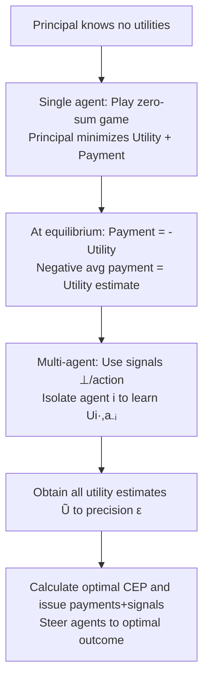

# Learning a Game by Paying the Agents

**Conference**: ICLR 2026  
**OpenReview**: [https://openreview.net/forum?id=8yRtP2n8OK](https://openreview.net/forum?id=8yRtP2n8OK)  
**Code**: TBD (Theoretical paper, no code)  
**Area**: Learning Theory / Algorithmic Game Theory  
**Keywords**: Inverse Game Theory, Utility Learning, No-Regret Learning, Payment Mechanism, Signal Design, Steering No-Regret Learners, Zero-Sum Games, Correlated Equilibrium  

## TL;DR
By observing only the behavior of no-regret learning agents in repeated games and actively intervening through "payments + signaling," a principal can learn all agents' utility functions (up to strategic equivalence) to any precision $\varepsilon$ within polynomial rounds. This enables the first implementation of "steering arbitrary no-regret learners to optimal equilibria" without prior knowledge of agent utilities.

## Background & Motivation
**Background**: A classic problem in game theory is "known utilities $\to$ predict behavior." Inverse game theory (or learning from revealed preferences) studies the reverse: "observed behavior $\to$ infer utilities."

**Limitations of Prior Work**: Previous inverse game theory work faced two major constraints. First, most assume observed behaviors are **Nash equilibrium behaviors**, but computing Nash equilibria is PPAD-hard, and agents in reality may not converge to it. Second, most are **passive** problems—inferring utilities from fixed behavioral data, which often leads to trivial impossibility results due to data scarcity. In Stackelberg games, if the principal can only modify their own strategy without offering payments, strong impossibility results exist: utilities cannot be learned without knowing the details of the agents' learning algorithms.

**Key Challenge**: To make "inverse games" provably solvable, one must (1) abandon the unrealistic assumption that "agents play equilibria" and allow arbitrary no-regret algorithms; (2) move from passive observation to **active intervention**. However, active intervention faces a difficult obstacle—the **non-forgetfulness** of no-regret algorithms: payments made by the principal in the past change the agents' future behavior. Furthermore, agents may accumulate negative regret, potentially providing "zero information" for many rounds, causing intuitive methods like binary search to fail.

**Goal**: Design a principal algorithm that, without knowing agent utilities or learning algorithm details, learns the game (up to strategic equivalence) to precision $\varepsilon$ for **arbitrary no-regret agents** in polynomial rounds and uses it as a subroutine to solve "steering no-regret learners to optimal outcomes under unknown utilities."

**Core Idea**: **[Empowering the principal with payment authority]** Frame the interaction between the principal and the agent as a **zero-sum game**—the principal chooses a payment function to **minimize** the agent's total profit (utility + payment), while the agent chooses a strategy to maximize it. The unique equilibrium of this zero-sum game occurs when the principal's payment exactly moves against the agent's utility; thus, the "negative average payment" naturally becomes an accurate estimate of utility. For the multi-agent case, **signals** are used to isolate each agent's learning problem, reducing it back to the single-agent case.

## Method

### Overall Architecture
Assume $n$ agents, where agent $i$ has $m_i$ actions and the total number of action profiles is $M=\prod_i m_i$. In each round, the principal first provides each agent with a payment function $P_i^t:A_i\to[0,B]$ (added to the agent's payoff, $U_i^t(a)=U_i(a)+P_i^t(a_i)$) and a signal $s_i^t$. After seeing the signal, agents choose mixed strategies $x_i^t$ using any (contextual) no-regret algorithm. The principal observes $x^t$. Since no-regret behavior only depends on relative utilities between actions, utilities can only be learned up to **strategic equivalence** (differing by a term $W_i(a_{-i})$ independent of its own action). The goal is to output $\tilde U_i$ such that $|U_i(a)+W_i(a_{-i})-\tilde U_i(a)|\le\varepsilon$. The pipeline follows a three-layer progression: "learning single-agent utility via zero-sum games $\to$ multi-agent isolation via signals $\to$ steering with no prior after utility learning."

### Key Designs

**1. Learning single-agent utility via zero-sum perspective: Letting "negative average payment" automatically approach utility.** View the single-agent utility as a vector $u\in[-1,1]^m$ (normalized such that $\langle 1,u\rangle=0$). The principal chooses $p$ from a restricted payment set $P=\{p\in[0,2]^m:\langle 1,p\rangle=m\}$ to minimize the agent's total profit $\langle u+p,x\rangle$, while the agent chooses $x\in\Delta(m)$ to maximize it—denote this zero-sum game as $\Gamma_0$. A key lemma proves that in any $\varepsilon$-Nash equilibrium of $\Gamma_0$, the principal's strategy must be $p=1-u+z$ (where $\|z\|_1\le 4m\varepsilon$): because choosing $p=1-u$ results in a profit of exactly 1 for any $x$, the agent's profit at equilibrium is $\le 1+\varepsilon$, forcing $p$ to stay close to $1-u$. The beauty is that the gradient of the principal's profit with respect to $p$ is $-x$ (**independent of the unknown $u$**), allowing the principal to run projected gradient descent **without knowing the utility**. Algorithm 1 performs $p^{t+1}\leftarrow\Pi_P[p^t-\eta x^t]$ each round and returns $-\frac1T\sum_t p^t$ as the utility estimate, circumventing non-forgetfulness: local response is not required; as long as both parties are no-regret, the average strategy converges to equilibrium.

**2. Convergence rate and round complexity: Translating regret bounds into learning precision.** Since no-regret learning in zero-sum games converges on average to Nash, the principal's regret is $R_0\le BG\sqrt T$ (where $B\lesssim\sqrt m,\ G=1$). Combined with the agent's $C\sqrt T$ regret, the average play is a $\frac{R_0+C\sqrt T}{T}$-Nash equilibrium. Substituting this into the lemma yields:
$$\varepsilon=\|\bar p+u-1\|_\infty\le\|\bar p+u-1\|_1\lesssim 4m\cdot\frac{R_0+C\sqrt T}{T}\lesssim\frac{m}{\sqrt T}(C+\sqrt m).$$
Solving for $T$ shows Algorithm 1 $\varepsilon$-learns a single-agent game within $T=O\!\big(\frac{m^3+C^2m^2}{\varepsilon^2}\big)$ rounds (Theorem 4.2). Notably, an alternative signaling approach requires $m\log(1/\varepsilon)$ signals and round complexity with a $\log(1/\varepsilon)$ factor; this design achieves a cleaner $1/\varepsilon^2$ dependence **without signals**.

**3. Decoupling multi-agent to single-agent using signals: The ⊥ marker for "who is being learned."** The difficulty in multi-agent settings is that agents' regrets can "contaminate" each other. The design uses signal sets $S_i=A_i\cup\{\bot\}$: to learn $U_i(\cdot,\bar a_{-i})$, the principal sends $\bot$ to agent $i$ (meaning "learning you now") and sends the target action $\bar a_j$ to every other agent $j$ with a large payment $2\cdot\mathbb I\{a_j=\bar a_j\}$ to induce compliance. From agent $i$'s perspective, others are almost always playing $\bar a_{-i}$, reducing the problem to the single-agent case for Algorithm 1. Algorithm 2 runs for each agent and each $\bar a_{-i}$, obtaining $\tilde U_i(\cdot,\bar a_{-i})=-\frac1L\sum_\ell p^\ell$, with total rounds $\frac{\mathrm{poly}(M,C)}{\varepsilon^2}$ (Theorem 4.3). Signals are **indispensable** here: without them, by the time the outer loop reaches agent $n$, it might have accumulated $\Omega(T)$ negative regret, rendering it uninformative for a long period; the signal-contingent no-regret guarantee (Eq. 1) isolates "being learned" regret from historical regret.

**4. Steering without priors: Learn the game, compute optimal CEP, then pay 2ε extra for safety.** The steering problem originally assumed the principal knows the game and the target outcome. Without known utilities, this becomes maximizing the principal's objective $F(T)=\frac1T\sum_t\mathbb E[U_0(\phi^t(s^t))-\sum_i P_i^t]$. A new solution concept, **Correlated Equilibrium with Payments (CEP)**, is introduced: $(\mu,P)$ satisfies the IC constraint $\mathbb E_{a\sim\mu}[U_i^P(a,\phi_i(a_i),a_{-i})-U_i^P(a,a)]\le\varepsilon$, with the optimal value denoted $F^*(\Gamma)$. The paper proves $F^*(\Gamma)$ is a **tight upper bound** (Theorem 5.2) and provides Algorithm 3: first use Algorithm 2 to learn utility to $\varepsilon$, then compute the optimal CEP on the estimated game $\tilde\Gamma$ and issue payments/signals accordingly—since utilities have $\varepsilon$ error, an additional $2\varepsilon$ payment is required to prevent deviation. This achieves $F(T)\ge F^*(\Gamma)-\mathrm{poly}(M,C)/T^{1/4}$ under **no utility priors** (Theorem 5.3).

## Key Experimental Results
This is a purely theoretical work; "experiments" consist of a series of upper and lower bound theorems. Core results are summarized below.

### Main Results: Complexity of Learning and Steering

| Problem | Result | Rounds / Rate |
|------|------|-------------|
| Single agent utility learning (Thm 4.2, Alg 1) | $\varepsilon$-learned | $O\big(\frac{m^3+C^2m^2}{\varepsilon^2}\big)$, no signals needed |
| Multi-agent utility learning (Thm 4.3, Alg 2) | $\varepsilon$-learn any game | $\mathrm{poly}(M,C)/\varepsilon^2$ |
| Steering (No prior, Thm 5.3, Alg 3) | $F(T)\ge F^*(\Gamma)-\mathrm{poly}(M,C)/T^{1/4}$ | Optimal CEP value, rate $T^{-1/4}$ |
| Bound Tightness (Thm 5.2) | Cannot exceed $F^*(\Gamma)$ even if game is known | $+o(1/\sqrt T)$ |

### Lower Bounds (Matching Upper Bounds)

| Lower Bound Object | Result (Thm 4.4) | Implication |
|----------|----------------|------|
| Rounds to $\varepsilon$-learn any game | $\max\{\tilde\Omega(nM)\log\frac1\varepsilon,\ \frac{C^2}{4\varepsilon^2}\}$ | Info-theoretic + regret bounds |
| Gap with Upper Bound | Only polynomial factor in $M$ | No exponential improvement possible for any parameter |

### Key Findings
- **Payments are the critical lever**: Learning agent utilities is impossible in Stackelberg settings without payments; introducing payments allows learning for arbitrary no-regret agents without knowing algorithm details, qualitatively breaking previous impossibilities.
- **Non-forgetfulness neutralized by zero-sum framework**: The principal's gradient $-x$ does not depend on unknown utilities, enabling gradient descent even without utility knowledge, and does not require agent algorithms to be forgetful.
- **Signals are necessary for multi-agent decoupling**: Without $\bot$/action signals, an agent's negative regret would cross-contaminate stages, stalling learning.
- **Reachability = Optimal CEP**: $F^*(\Gamma)$ is simultaneously the reachable value and a tight upper bound, providing the first precise characterization of the steering problem.

## Highlights & Insights
- **Inverse games reframed as solvable**: By replacing "passive observation of equilibrium" with "active payments + zero-sum games," the work bypasses PPAD-hardness and applies to arbitrary no-regret algorithms.
- **Elegant Core Mechanism**: The principal simply "shifts the payment vector slightly against the agent's strategy each round," and the final negative average payment is the utility—a gradient descent update carries the entire learning process.
- **First positive results**: This is the first positive result for utility learning of arbitrary no-regret agents and the first work to precisely characterize and achieve optimal steering without utility priors.
- **Near-matching bounds**: Except for polynomial factors in $M$, the complexity is constrained by both information-theoretic and regret-based lower bounds, making the conclusions robust.

## Limitations & Future Work
- **Unoptimized polynomial factors**: There is a polynomial gap in $M$ between upper and lower bounds; determining the optimal exponent remains an open problem.
- **Limited to Normal-Form Games**: The method relies on observing the full mixed strategy $x^t$ each round, which is not directly applicable to extensive-form games where only on-path actions are observed.
- **Mandatory signals for multi-agent**: While single-agent learning only requires payments, multi-agent learning still requires signals; whether multi-agent utilities can be learned "using only payments, without signals" is unknown.
- **Necessity of learning full utility**: Learning the complete utility requires $\tilde\Omega(nM)\log\frac1\varepsilon$ rounds; whether steering can be achieved without learning the full utility is a valuable direction.

## Related Work & Insights
- **Inverse Game Theory / Revealed Preferences** (Beigman & Vohra 2006; Kuleshov & Schrijvers 2015): This paper pushes this line from "passive + equilibrium assumption" to "active + arbitrary no-regret."
- **Steering No-Regret Learners** (Zhang et al. 2024): This work removes the "principal knows the game" premise and allows non-zero total payments at equilibrium (as long as the principal's utility gain is sufficient).
- **Adversarial No-Regret Buyers / Players** (Braverman et al. 2018; Deng et al. 2019; Lin & Chen 2025): These works usually assume known utilities, single agents, or no payments; this work treats multi-agent, with payments, and worst-case no-regret.
- **Information Design** (Kamenica & Gentzkow 2011) and learning utility with signals (Feng et al. 2022; Bacchiocchi et al. 2024): Previous works focused on myopic best-response agents; this work combines signaling and payments for arbitrary no-regret agents.
- **Insight**: Provides a provable paradigm for "how to infer preferences from learning agents" (e.g., in mechanism design, recommender systems, or AI Alignment)—**use the opposite direction of incentives as a probe**.

## Rating
- **Novelty**: ⭐⭐⭐⭐⭐ Recasts inverse games as principal-agent zero-sum games; first positive results for utility learning and steering without priors for arbitrary no-regret agents.
- **Experimental Thoroughness**: ⭐⭐⭐⭐ Purely theoretical work; upper bounds + tight lower bounds + steering characterization form a complete loop, though polynomial factors are not tight.
- **Writing Quality**: ⭐⭐⭐⭐⭐ Clear narrative, progressing from single-agent intuition to multi-agent signaling decoupling; explains key lemmas and obstacles (non-forgetfulness) thoroughly.
- **Value**: ⭐⭐⭐⭐ Establishes a provable foundation for learning preferences/steering behavior of learning agents, with strong extensibility to algorithmic game theory and multi-agent alignment.

<!-- RELATED:START -->

## Related Papers

- [\[ICLR 2026\] Transfer Learning in Infinite Width Feature Learning Networks](transfer_learning_in_infinite_width_feature_learning_networks.md)
- [\[ICLR 2026\] Learning to Adapt: In-Context Learning Beyond Stationarity](learning_to_adapt_in-context_learning_beyond_stationarity.md)
- [\[ICLR 2026\] Sharp Asymptotic Theory for Q-Learning with LD2Z Learning Rate and Its Generalization](sharp_asymptotic_theory_for_q-learning_with_textttld2z_learning_rate_and_its_gen.md)
- [\[ICLR 2026\] Online Decision-Focused Learning](online_decision-focused_learning.md)
- [\[ICLR 2026\] Learning to Answer from Correct Demonstrations](learning_to_answer_from_correct_demonstrations.md)

<!-- RELATED:END -->
