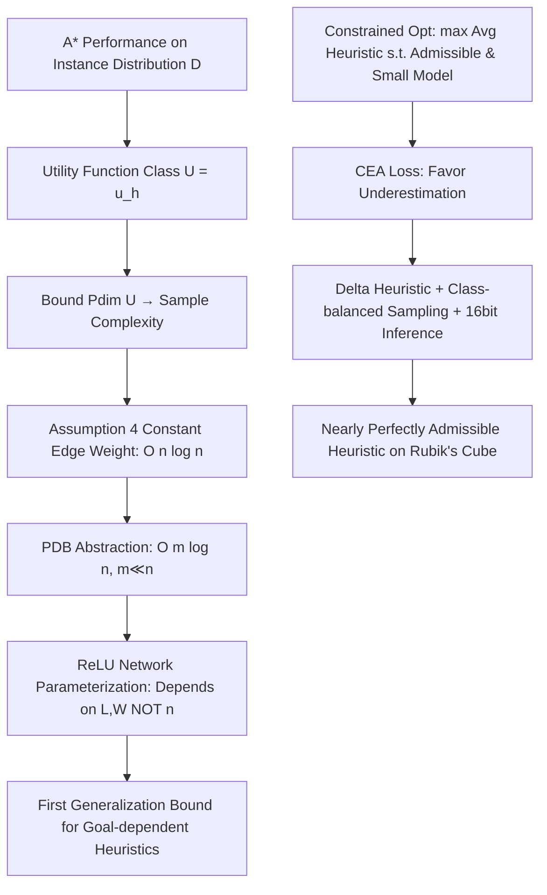

# Learning Admissible Heuristics for A*: Theory and Practice

**Conference**: ICLR 2026  
**OpenReview**: [https://openreview.net/forum?id=WAQIxi7ifb](https://openreview.net/forum?id=WAQIxi7ifb)  
**Code**: TBD (PDB data from HOG2 repository nathansttt/hog2)  
**Area**: Learning Theory / Heuristic Search (A* Learnable Heuristics)  
**Keywords**: admissible heuristic, A* search, sample complexity, pseudo-dimension, generalization bound, pattern database, Rubik's Cube  

## TL;DR
The paper formalizes "learning A* heuristic functions" as a constrained optimization problem. It proposes the Cross-Entropy Admissibility (CEA) loss to enforce admissibility (never overestimate) during training and provides a generalization sample complexity bound using pseudo-dimension that depends on network size rather than graph size. On Rubik's Cube, the learned heuristics are nearly perfectly admissible and stronger than compressed PDBs of the same size.

## Background & Motivation
- **Background**: Heuristic search algorithms like A* rely on a heuristic function $h$ to estimate the cost-to-go. A* guarantees an optimal solution only if $h$ is **admissible**—that is, $h(v) \le h^*(v)$ for all states, never overestimating the true shortest path cost. Traditional admissible heuristics are constructed using domain knowledge, with **Pattern Databases (PDBs)** being a typical representative: they abstract the problem into a smaller state space $\phi(V)$ and store the exact distances to the goal, which are naturally admissible.
- **Limitations of Prior Work**: Directly learning heuristics using deep learning has become popular due to its strength in complex domains. however, learned $h$ functions **almost always lose admissibility**, sacrificing optimality guarantees. Furthermore, such methods offer few theoretical guarantees on whether the learned heuristic generalizes to the entire graph beyond training data.
- **Key Challenge**: Search algorithms require "admissibility + theoretical generalization guarantees," while deep learning provides "empirical strength without admissibility or generalization bounds." Existing theoretical work (Sakaue & Oki 2022) only provides sample complexity bounds of $O(n^2 \log n)$ / $O(n \log(nW))$ for GBFS/A*, which depend on the **graph size $n$**, making them meaningless for graphs with $10^{19}$ states.
- **Goal**: To answer three fundamental questions: how many samples are needed to learn an admissible heuristic (sample complexity), what constitutes an effective training loss, and to what extent can the optimal heuristic be approximated in practice.
- **Key Insight**: **(Theoretical)** Use pseudo-dimension to characterize the complexity of A* performance function classes. Tighten the bound from graph size $n$ to abstract graph size $m$ using PDB abstractions, and then further tighten it to depend **only on network width/depth** using ReLU neural networks. **(Practical)** Propose the **CEA loss**, treating heuristic learning as an ordered classification task and explicitly favoring "underestimation over overestimation" through asymmetric probability mass redistribution to drive nearly admissible solutions during training.

## Method

### Overall Architecture
The paper adopts a dual-track structure: "a theoretical framework + a training framework." The theoretical track abstracts A* performance (node expansions, runtime, or suboptimality) on an instance distribution $\mathcal{D}$ into a utility function class $\mathcal{U}=\{u_h\}$, deriving generalization sample complexity by bounding $\mathrm{Pdim}(\mathcal{U})$ and progressively tightening the bound through four layers: "constant edge weight assumption → PDB abstraction → neural network parameterization → instance-dependent heuristics." The practical track solves the admissible heuristic learning as a constrained optimization problem (maximizing average heuristic value s.t. no overestimation and small model size) using CEA loss, delta heuristics, class-balanced sampling, and post-processing quantization.

### Key Designs

**1. CEA Loss: Encoding "Prefer Underestimation" into the Classification Objective.** Under the constant edge weight assumption, each integer heuristic value $0, 1, \dots, \ell$ constitutes a class, and heuristic learning reduces to ordered classification. Standard Cross-Entropy (CE) only optimizes accuracy and treats overestimation and underestimation equally, failing to produce admissible heuristics. CEA modifies the loss to an asymmetric form:
$$\mathrm{CEA}=-\frac1N\sum_{i=1}^N\Big[\log\sum_{k=1}^{h^*_i}\big(\tfrac{k}{h^*_i}\big)^{\beta}p^{(i)}_k\Big]+\eta\big(-\log p^{(i)}_{h^*_i}\big).$$
The first term redistributes probability mass only to **classes not exceeding the true value** ($k \le h^*_i$), where weights $(k/h^*_i)^\beta$ decay as $k$ moves away from the truth—smaller $\beta$ favors admissibility (pushing mass toward lower classes), while larger $\beta$ increases heuristic strength (concentrating mass near the true value). The second term is a CE penalty with a small scale factor $\eta \ll 1$ to sharpen the distribution toward the true class, preventing the model from assigning high probability to an overestimating class even if most mass is in admissible classes. It is proven that the **unique global optimum** is achieved at $p^{(i)}_{h^*_i}=1$, satisfying both admissibility and maximum average heuristic value.

**2. Tightening Sample Complexity from Graph Size to Network Size via Pseudo-dimension.** The key observation is that A* performance is determined solely by the selection of nodes based on $f(v)=g(v)+h(v)$ in the OPEN list. Thus, the heuristic space $\mathbb{R}^n$ can be partitioned into finite "constant performance regions." Lemma 1 states that as long as the heuristic difference between any two points remains the same ($h(v_i)-h(v_j)=h'(v_i)-h'(v_j)$), the A* behavior is invariant. Combined with the fact that $g$ takes at most $n$ values under constant edge weights, Theorem 1 yields $\mathrm{Pdim}(\mathcal{U})=O(n \log n)$. With PDB abstraction (abstract graph size $m \ll n$), Theorem 2 tightens this to $O(m \log n)$. By implementing $h$ as a ReLU network and defining a representation function $\mathrm{Rep}(I)$ containing only necessary states, Theorem 6 gives $\mathrm{Pdim}(\mathcal{U})=O\big(LW \log(U+\ell)+W \log(\ell|B|(L+1))\big)$—the bound is dominated by the number of layers $L$, parameters $W$, and scale $U$, **no longer exploding with graph size**. Theorem 7 further provides the **first generalization bound for goal-dependent heuristics**.

**3. Anchoring Generalization Error to Computable Quantities via "Suboptimality Bound with Reopening."** Instead of bounding general performance directly, the paper focuses on **expected suboptimality** $u_h(x)=C_h(x)-C^*(x)$. Theorem 3 proves that when A* allows reopening nodes from CLOSED, the suboptimality is bounded by the maximum overestimation along the optimal path:
$$C_h(x)-C^*(x) \le \max_{v \in P_{\mathrm{opt}}} \big[h(v)-h^*(v)\big] := \Psi_h(x),$$
which is tighter than previous bounds accumulating inconsistency. By calculating $\mathrm{Pdim}(\hat{\mathcal{U}})=O(n \log n)$ for the inadmissible function class $\hat{\mathcal{U}}=\{\Psi_h\}$, the expected suboptimality is bounded by "empirical in-admissibility + $\tilde O(\hat H \sqrt{(n+\log\frac1\delta)/N})$," providing a link to control generalization via observable training quantities.

**4. Delta Heuristic + Class-balanced Sampling + Quantization.** To address severe class imbalance (e.g., in a 6-edge PDB, 86% of states fall into classes 7 and 8), the paper uses a **delta heuristic** $h_\Delta$: rather than storing a large PDB directly, it stores a small base PDB plus the difference $\Delta=h_{\mathrm{large}}-h_{\mathrm{base}}$. At inference, $h_{\mathrm{large}}(s)=h_{\mathrm{base}}(s)+\Delta(s)$, which flattens the class distribution. During training, mini-batches are sampled uniformly within classes and proportionally across classes based on size, preventing overfitting to dense classes. 16-bit precision is used for post-processing compression to reduce query latency.

## Key Experimental Results

Setup: 3×3 Rubik's Cube, four PDBs (8-Corner, $\Delta(6,4)$-Edge, 6-Edge, 7-Edge from HOG2), ResNet-style networks. Comparison: CEA loss vs. CE loss vs. min-compression PDB, all using equal memory. The primary metric is the **overestimation rate** (approaching 0 signifies admissibility).

### Main Results (Learned Heuristic vs. Compressed PDB)

| Heuristic Type | Pattern | Avg Heuristic | Overestimation Rate | Model Size (MB) | Compression Ratio |
|---|---|---|---|---|---|
| NN + CEA | 7-edge | 7.45 | $2 \times 10^{-5}$ | 3.75 | 68.12× |
| NN + CE | 7-edge | 8.44 | $1.4 \times 10^{-2}$ | 3.75 | 68.12× |
| Compressed PDB | 7-edge | 6.83 | 0 | 3.65 | 70× |
| NN + CEA | 8-corner | 8.76 | $3 \times 10^{-7}$ | 1.89 | 23.32× |
| NN + CE | 8-corner | 8.76 | $2 \times 10^{-3}$ | 1.89 | 23.32× |
| Compressed PDB | 8-corner | 6.84 | 0 | 1.91 | 23× |
| NN + CEA | 6-edge | 6.92 | $9 \times 10^{-5}$ | 1.95 | 10.91× |
| NN + CE | 6-edge | 7.46 | $9 \times 10^{-2}$ | 1.95 | 10.91× |
| Compressed PDB | 6-edge | 6.68 | 0 | 1.93 | 11.03× |

### Ablation Study

| Dimension | Result |
|---|---|
| 8-corner limit compression | Achieves **51× compression** (relative to original PDB) while maintaining admissibility and accuracy. |
| 8-corner search intensity | The learned model expands **less than half** the nodes of the compressed PDB heuristic of the same size. |
| CEA vs CE Overestimation | CEA's overestimation rate is approximately **$10^4$ times smaller** than CE across all PDBs. |
| Gen. Error vs N | Expected suboptimality decreases monotonically as training instances $N$ (millions) increase, matching the theoretical trend. |

### Key Findings
- CEA learned **perfectly admissible** heuristics on the 8-corner PDB with an average value equal to the original PDB (lossless), and nearly perfectly for $\Delta(6,4)$-Edge. For 6/7-edge, only a few thousand overestimating states remain.
- Given the same memory, the average heuristic value (proxy for search guidance) of CEA is significantly higher than min-compression PDBs, indicating learned compression preserves more info.
- CE loss is fundamentally unsuitable for learning admissible heuristics as it treats over-/under-estimation equally.

## Highlights & Insights
- Connects a seemingly engineering problem (learning heuristics) with **optimization (CEA loss)** and **statistical learning theory (pseudo-dimension complexity)**.
- Leverages the structural fact that A* performance depends only on the ranking induced by the heuristic, tightening bounds from graph size $n$ to network size $L, W$.
- Theorem 3's result—suboptimality is bounded by the maximum overestimation on the optimal path when reopening is allowed—anchors abstract generalization error to a measurable training quantity $\Psi_h$.
- The combination of delta heuristics and class-balanced sampling practically solves the PDB class imbalance that would otherwise destroy admissibility.

## Limitations & Future Work
- Many theoretical results rely on **Assumption 4 (constant edge weights $c_0$)**, which reduces heuristic learning to ordered classification. Analysis for non-uniform edge weights (e.g., general path planning) is needed.
- Experiments are restricted to **Rubik's Cube**. Evidence from other domains (sliding puzzles, planning benchmarks, real maps) is missing; goal-dependent heuristics lack extensive empirical validation.
- CEA introduces hyperparameters $\beta, \eta$ that require tuning; the trade-off between admissibility and strength still requires manual oversight.
- The 6/7-edge results still show a few thousand overestimating states ("near-admissibility"), requiring extra handling for strict optimality guarantees.

## Related Work & Insights
- Extends the pseudo-dimension analysis of **Sakaue & Oki (2022)** to admissible heuristics, PDB abstraction, neural networks, and goal-dependency, tightening the bounds.
- Contrasts with deep heuristics (Agostinelli's DeepCubeA, Neural A*) that prioritize empirical performance over theoretical optimality guarantees.
- Insight: When a model acts as a "lossy compressor of a large dataset," **asymmetric loss design** (favoring underestimation) is an effective way to inject hard constraints (admissibility) into learning.

## Rating
- **Novelty**: ⭐⭐⭐⭐⭐ First systematic link between admissible heuristic learning, optimization, and complexity bounds.
- **Experimental Thoroughness**: ⭐⭐⭐ Strong results on Rubik's Cube, but limited to a single domain and lacks empirical proof for goal-dependent bounds.
- **Writing Quality**: ⭐⭐⭐⭐ Logical progression with clear assumptions; however, high formula density makes it challenging for non-specialists.
- **Value**: ⭐⭐⭐⭐ Provides both admissibility and generalization frameworks for learning heuristics, relevant to planning and neuro-symbolic AI.

<!-- RELATED:START -->

## Related Papers

- [\[ICML 2026\] Performative Learning Theory](../../ICML2026/learning_theory/performative_learning_theory.md)
- [\[ICLR 2026\] Sharp Asymptotic Theory for Q-Learning with LD2Z Learning Rate and Its Generalization](sharp_asymptotic_theory_for_q-learning_with_textttld2z_learning_rate_and_its_gen.md)
- [\[ICLR 2026\] Does the Data Processing Inequality Reflect Practice? On the Utility of Low-Level Tasks](does_the_data_processing_inequality_reflect_practice_on_the_utility_of_low-level.md)
- [\[ICLR 2026\] Why Less is More (Sometimes): A Theory of Data Curation](why_less_is_more_sometimes_a_theory_of_data_curation.md)
- [\[ICLR 2026\] Theory of Scaling Laws for In-Context Regression: Depth, Width, Context and Time](theory_of_scaling_laws_for_in-context_regression_depth_width_context_and_time.md)

<!-- RELATED:END -->
