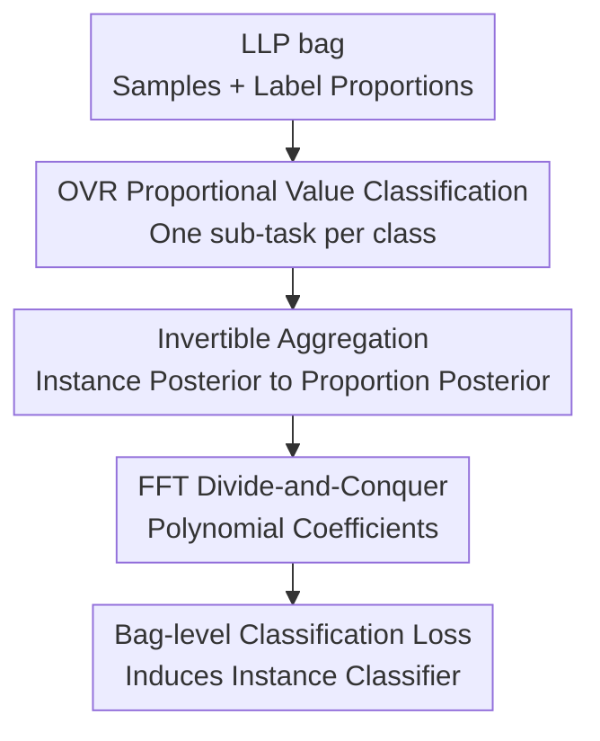

# Learning from Label Proportions via Proportional Value Classification

**Conference**: ICLR2026  
**OpenReview**: [https://openreview.net/forum?id=JkFBc9anLi](https://openreview.net/forum?id=JkFBc9anLi)  
**Paper**: OpenReview conference paper  
**Code**: https://github.com/TianhaoMa5/ICLR2026_LLP-PVC  
**Area**: Weakly Supervised Learning / Learning from Label Proportions / Learning Theory  
**Keywords**: Learning from label proportions, weakly supervised learning, proportional value classification, over-smoothing, FFT aggregation

## TL;DR
This paper reformulates the "bag-level mean prediction matching" in Learning from Label Proportions (LLP) as a proportional value classification task. Through invertible instance posterior aggregation and FFT-accelerated computation, the model learns sharper instance-level classifiers using only label proportions, significantly outperforming existing LLP methods across various bag construction strategies.

## Background & Motivation
**Background**: Learning from Label Proportions (LLP) investigates a typical weakly supervised scenario: training data consists of bags rather than individual sample labels, where each bag only provides the proportions of each class. Examples include voting ratios in a region, disease proportions in a medical cohort, or category counts in a batch of images. The objective remains training a standard instance-level classifier for individual sample prediction at test time.

**Limitations of Prior Work**: Mainstream LLP methods commonly utilize proportion matching (PM). This approach aligns the mean of all instance outputs in a bag with the given label proportions. while simple and theoretically supported, this loss does not strictly require discriminative instance-level predictions. As long as the mean is correct, the model may predict similar soft distributions for all samples within the same bag.

**Key Challenge**: The supervision signal in LLP is inherently aggregated, while the final task is instance-level. Since proportion matching only constrains the first-order mean, it frequently suffers from "over-smoothing," where predictions are accurate on average but ambiguous for individuals. Training curves in the paper indicate that PM maintains high average normalized entropy for training instances, which significantly damages test accuracy.

**Goal**: The authors aim to retain the LLP setting (using only bag-level proportion labels) while introducing training objectives that more directly constrain instance-level posterior distributions. Specifically, the method must address three sub-problems: constructing a more discriminative supervision task from proportion labels; linking bag-level proportional posteriors to instance-level classifier outputs; and avoiding exponential enumeration of label sequences for large bag sizes.

**Key Insight**: A key observation is that for a given class $k$, the number of positive instances in a bag is a discrete proportional value. Rather than regressing the mean proportion, it is more effective to treat "how many class $k$ samples are in this bag" as an $(m+1)$-class classification problem. This bag-level posterior is induced by aggregating the posterior probabilities of each instance belonging to class $k$.

**Core Idea**: Replace direct proportion matching with Proportional Value Classification (PVC), transforming label proportions into a bag-level discrete classification target. An instance-level classifier is then trained through an invertible aggregation layer induced by instance posteriors.

## Method

### Overall Architecture
The input for LLP-PVC remains an LLP dataset $D=\{(B_i,\alpha_i)\}_{i=1}^n$, where $B_i=[x_1,\ldots,x_m]$ is a bag and $\alpha_i$ is its category proportion. The method employs a one-versus-rest (OVR) decomposition, converting multi-class LLP into $q$ binary classification sub-problems. For class $k$, $\alpha_k$ represents the positive proportion, corresponding to $m\alpha_k$ positive samples.

Instead of fitting the mean prediction to $\alpha_k$, the authors construct proportional value labels $\tilde{\alpha}_k=m\alpha_k+1\in\{1,2,\ldots,m+1\}$. The model outputs $f_k(x_j)$ for each instance, representing the probability of belonging to class $k$. An aggregation function $g_k(B)$ calculates the probability of the bag for each proportional value, and the instance classifier is trained using cross-entropy or MSE to classify $g_k(B)$ into the true proportional value $\tilde{\alpha}_k$.

### Key Designs
**1. OVR Proportional Value Classification: Transforming Proportions into Discrete Bag-level Classification**

In multi-class LLP, the number of possible proportion vectors is $\binom{m+q-1}{q-1}$, and each vector corresponds to numerous potential label sequences. Directly modeling the complete proportion vector is computationally expensive. LLP-PVC uses OVR to treat class $k$ as the positive class and others as negative, reducing hidden instance labels to $\tilde{y}^k_j\in\{0,1\}$, where $\alpha_k$ is the positive proportion.

In this binary sub-problem, there are only $m+1$ possible proportional values (number of positives can be $0,1,\ldots,m$). The paper sets the true target as $\tilde{\alpha}_k=m\alpha_k+1$ and trains a bag-level classifier $g_k(B)=[g_{k,1}(B),\ldots,g_{k,m+1}(B)]$ to predict this value. This ensures the supervision signal is richer than a single point mean, requiring the model to position the entire distribution of positive counts correctly.

**2. Instance Posterior to Proportion Posterior: Preserving Instance-level Discrimination via Polynomial Coefficients**

The core of PVC is defining $g_k(B)$ explicitly as the aggregation of the instance-level classifier $f_k$. For a bag of length $m$, there are $2^m$ binary label sequences. The probability of a sequence is the product of individual instance posteriors. The probability of a proportional value $l$ is the sum of probabilities of all sequences with Hamming weight $l-1$.

The paper formulates this relationship as:

$$
g_{k,l}(B)=\sum_{r=1}^{2^m} q_{r,l}\prod_{j=1}^{m} f_k(x_j)^{b_j^{(r-1)}}(1-f_k(x_j))^{1-b_j^{(r-1)}}.
$$

Equivalently, each instance contributes a first-order polynomial $F_{k,j}(z)=f_k(x_j)z+(1-f_k(x_j))$. Multiplying $m$ such polynomials yields:

$$
G_k(z)=\prod_{j=1}^m F_{k,j}(z)=\sum_{t=0}^m c_{k,t}z^t.
$$

The coefficients $c_{k,t}$ represent the probability of having exactly $t$ positives in the bag, which is $g_{k,t+1}(B)$. This design is superior to proportion matching because $g_k(B)$ contains the entire shape of the distribution rather than just the mean. The paper proves this aggregation is invertible in a set sense: given $g_k(B)$, the set of instance outputs $\{f_k(x_j)\}_{j=1}^m$ is uniquely determined, preventing the loss of instance variance common in mean pooling.

**3. Over-smoothing Mitigation Theory: Optimal PVC Induces Sharp Instance Predictions**

Using proper losses like cross-entropy or MSE, the optimal bag-level classifier $g_k^*$ recovers the true proportion posterior $p(\tilde{\alpha}_k\mid B)$. Combined with the invertible aggregation theorem, the paper proves that the instance-level classifier induced by $g_k^*$ satisfies $\{f_k^*(x_j)\}_{j=1}^m=\{p(\tilde{y}^k_j=1\mid x_j)\}_{j=1}^m$. If instance labels are deterministic, these outputs fall on $\{0,1\}$.

This directly addresses the failure mode of PM, which allows all instances to output the same soft proportion (e.g., each sample outputting $0.3$ in a bag with $30\%$ positives). PVC requires the entire distribution of positive counts to match, and because the aggregation is invertible, the optimal solution favors more discriminative, low-entropy predictions. The paper also provides an estimation error bound of $\bar{O}(q\sqrt{dm^3/n})$, where $d$ is the pseudo-dimension of the function class and $n$ is the number of bags.

**4. FFT Divide-and-Conquer Aggregation: Transforming Exponential Enumeration into $O(m\log m)$ Computation**

Naive calculation of $g_k(B)$ requires $2^m$ operations. The authors leverage polynomial multiplication to find coefficients of $\prod_j F_{k,j}(z)$. Each polynomial is zero-padded to length $m+1$ as $[1-f_k(x_j), f_k(x_j), 0, \ldots, 0]$ and processed via Discrete Fourier Transform (DFT).

The divide-and-conquer process performs element-wise multiplication of frequency-domain vectors layer by layer. After $\lceil\log_2(m+1)\rceil$ layers, the final frequency representation is obtained, and coefficients $c_{k,0},\ldots,c_{k,m}$ are recovered via inverse DFT. While dynamic programming count loss takes $O(m^2)$, this GPU-friendly frequency-domain approach has a wall-clock complexity of $O(m\log m)$ and is highly parallelizable across bags and batches.

### Mechanism Example
Consider a bag with $m=2$ samples. For class $k$, the model predicts $f_k(x_1)=0.8$ and $f_k(x_2)=0.3$. The proportional values are: 0, 1, or 2 positives, corresponding to $\tilde{\alpha}_k=1,2,3$.

LLP-PVC calculates three probabilities: 0 positives is $(1-0.8)(1-0.3)=0.14$; 1 positive is $(1-0.8)0.3+0.8(1-0.3)=0.62$; 2 positives is $0.8\times0.3=0.24$. Thus $g_k(B)=[0.14, 0.62, 0.24]$. If the true proportion $\alpha_k=1/2$, the target is the second proportional value. Training increases the probability of having "exactly one positive" rather than just requiring the mean of the two outputs to be $0.5$.

This example illustrates why PVC is finer-grained than PM. PM only observes $(0.8+0.3)/2=0.55$, which is close to $0.5$. PVC observes the full distribution and shapes the instance posteriors through it, encouraging one high-confidence and one low-confidence prediction rather than pushing both to the mean.

### Loss & Training
During training, the network shares a representation layer and uses independent OVR classification heads $f_1,\ldots,f_q$. After the forward pass of a mini-batch of bags, binary outputs for each class are aggregated via the FFT algorithm to obtain $g_k(B)$ for every category. The total loss is the sum of PVC losses across all classes:

$$
\frac{1}{n}\sum_{k=1}^{q}\sum_{i=1}^{n} L(g_k(B_i),\tilde{\alpha}_{i,k}).
$$

The paper primarily discusses cross-entropy and MSE losses. For numerical stability, probabilities are clipped with a candidate minimum of $10^{-12}$, $10^{-30}$, $10^{-80}$, or $10^{-200}$. Experiments use SGD with a cosine scheduler, LeNet-5 for K-MNIST/F-MNIST, and ImageNet pre-trained ResNet-18 for SVHN/CIFAR-10.

## Key Experimental Results

### Main Results
The paper evaluates performance on K-MNIST, F-MNIST, SVHN, and CIFAR-10 across three bag construction strategies: Random Bag, Cluster Bag, and $\alpha$-First Bag. The table below highlights results for Random Bag with $m=128$, where over-smoothing is most prominent.

| Dataset | Metric | LLP-PVC | Prev. SOTA | Gain |
|--------|------|---------|--------------|------|
| K-MNIST, Random Bag, $m=128$ | Accuracy | 96.36 ± 0.16 | EasyLLP-flood 63.87 ± 1.26 | +32.49 |
| F-MNIST, Random Bag, $m=128$ | Accuracy | 87.17 ± 0.16 | DSQ 75.82 ± 0.82 | +11.35 |
| SVHN, Random Bag, $m=128$ | Accuracy | 93.60 ± 0.76 | ROT 50.88 ± 1.45 | +42.72 |
| CIFAR-10, Random Bag, $m=128$ | Accuracy | 76.01 ± 0.97 | DSQ 51.35 ± 0.64 | +24.66 |

LLP-PVC remains stable under Cluster Bag. For CIFAR-10 at $m=128$, Ours reaches 78.36 ± 0.50, compared to ROT (61.14 ± 0.92) and PM (58.67 ± 0.53). For SVHN at $m=128$, Ours reaches 93.89 ± 0.65, significantly higher than ROT's 58.33 ± 1.17.

Under $\alpha$-First Bag, the advantage persists. For K-MNIST at $m=128$, LLP-PVC achieves 96.03 ± 0.11 versus EasyLLP-flood at 64.41 ± 2.03. For CIFAR-10 at $m=128$, LLP-PVC achieves 76.36 ± 0.34 versus ROT at 57.28 ± 0.69.

### Ablation Study
The paper analyzes execution time, dynamic programming comparisons, and large-scale bag results to evaluate computational design and stability.

| Configuration | Key Metric | Description |
|------|----------|------|
| LLP-PVC + FFT | K-MNIST $m=32$: 1.80s/epoch; CIFAR-10 $m=32$: 2.93s/epoch | Runtime close to $O(1)$ baselines like PM/DSQ/EasyLLP |
| LLP-PVC (DP) | Slowed significantly as $m$ increased; $>10\times$ slower than FFT at $m=512$ | Confirms $O(m^2)$ DP is unsuitable for large bags |
| UUM / Count Loss | Failed on K-MNIST at $m \geq 16$ due to time constraints; Count Loss took 172.34s at $m=8$ | Factorial or combinatorial complexity is not scalable |
| LLP-PVC Large Bag | CIFAR-10 Random Bag $m=256$: 69.21 ± 1.65; SVHN $m=256$: 90.74 ± 2.32 | Remains more resistant to degradation than most baselines in large bags |

### Key Findings
- The advantage of LLP-PVC grows with bag size, as proportion matching tends to average out instance predictions in large bags, while PVC's distribution constraint preserves variance.
- Effectiveness across all three bag strategies suggests the method does not rely on the strong "i.i.d. within bag" assumption; it only requires bags themselves to be i.i.d.
- Runtime is comparable to standard PM due to parallelized frequency-domain GPU operations instead of serial enumeration.
- EasyLLP often collapses or performs near-random on Cluster Bags, reflecting the fragility of negative risk terms and i.i.d. assumptions under non-random bag construction.

## Highlights & Insights
- The primary highlight is transforming "label proportions" from a regression target to a classification label. This shifts the supervision granularity from a mean vector to a full posterior distribution of positive counts.
- The polynomial coefficient perspective is elegant, compressing the sum over $2^m$ sequences into polynomial multiplication, aligning theory, implementation, and intuition.
- The over-smoothing analysis identifies the core pain point of LLP. Unlike other methods that rely on regularization or pseudo-labels, this work explains why mean constraints discard instance differences and provides an invertibility guarantee.
- FFT divide-and-conquer turns a theoretically strong concept into a practical training method, overcoming the $2^m$ sequence space bottleneck.
- This approach is transferable to other aggregate supervision tasks, such as learning from counts, histograms, or group statistics. Any aggregation that can be expressed as a structured combination of instance posteriors can potentially benefit from similar designs.

## Limitations & Future Work
- Theoretical recovery conclusions depend on flexible model classes, proper losses, and certain probability boundary assumptions. Actual deep network optimization might still be affected by local optima and initialization.
- FFT aggregation is optimized for one-dimensional proportional values (positive counts). Without OVR decomposition, multi-class joint proportion vectors still face a large combinatorial space. 
- Experiments focus on image classification benchmarks and synthetic bags. Real-world bags may involve complex selection mechanisms or noisy proportions, which were not systematically evaluated.
- Performance still degrades on CIFAR-10 for massive bag sizes (e.g., $m=512, 1024$), indicating that when supervision is too coarse, PVC alone may not fully recover instance-level structures.
- Future work could integrate PVC with differential privacy, proportion noise modeling, or category correlation structures.

## Related Work & Insights
- **vs PM**: PM matches mean predictions to proportions. While simple and scalable, it suffers from over-smoothing. LLP-PVC constrains the discrete proportional value distribution, imposing stronger instance-level shaping.
- **vs DSQ**: DSQ is a PM variant with optimistic convergence rates but is limited to MSE-like targets. LLP-PVC supports various proper losses and focuses on count posteriors rather than mean errors.
- **vs EasyLLP / GeneralUPM**: These methods use unbiased risk estimators but may suffer from instability due to negative risk terms. LLP-PVC avoids these risks and shows better stability in non-random bags.
- **vs Count Loss**: Count Loss focuses on counting-based weak supervision but is computationally prohibitive for large bags. LLP-PVC preserves the count posterior concept while achieving scalability through OVR and FFT.
- **Insight**: For weakly supervised learning, the key is not just whether a risk estimator is unbiased, but whether the supervision signal survives aggregation without losing instance identity. Designing losses that are invertible or preserve information is more reliable than matching low-order statistics.

## Rating
- Novelty: ⭐⭐⭐⭐⭐ Reframing LLP as PVC and using polynomial invertibility to explain over-smoothing is highly innovative.
- Experimental Thoroughness: ⭐⭐⭐⭐⭐ Covers four datasets, three bag strategies, and multiple sizes, with runtime and scalability analysis.
- Writing Quality: ⭐⭐⭐⭐ Solid theoretical chain and clear algorithms, though the long proof appendix and complexity discussions may be dense for some.
- Value: ⭐⭐⭐⭐⭐ A practical loss improvement for LLP with strong theoretical motivation and easy integration into existing neural network pipelines.

<!-- RELATED:START -->

## Related Papers

- [\[ICLR 2026\] Conformal Prediction for Long-Tailed Classification](conformal_prediction_for_long-tailed_classification.md)
- [\[ICLR 2026\] Softmax is not Enough (for Adaptive Conformal Classification)](softmax_is_not_enough_for_adaptive_conformal_classification.md)
- [\[ICLR 2026\] A Statistical Theory of Overfitting for Imbalanced Classification](a_statistical_theory_of_overfitting_for_imbalanced_classification.md)
- [\[ICLR 2026\] Random Label Prediction Heads for Studying Memorization in Deep Neural Networks](random_label_prediction_heads_for_studying_memorization_in_deep_neural_networks.md)
- [\[ICLR 2026\] Resurfacing the Instance-only Dependent Label Noise Model through Loss Correction](resurfacing_the_instance-only_dependent_label_noise_model_through_loss_correctio.md)

<!-- RELATED:END -->
