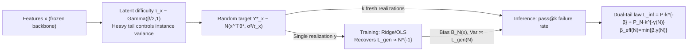

# Learning Shrinks the Hard Tail: Training-Dependent Inference Scaling in a Solvable Linear Model

**Conference**: ICLR 2026  
**OpenReview**: [https://openreview.net/forum?id=KUNywR7nQx](https://openreview.net/forum?id=KUNywR7nQx)  
**Code**: To be confirmed  
**Area**: learning theory  
**Keywords**: neural scaling laws, inference-time compute, pass@k, instance difficulty heterogeneity, solvable linear model, compute allocation  

## TL;DR
This paper uses an analytically solvable "Latent Instance Difficulty (LID)" linear fine-tuning model to prove that the power-law exponent $\beta_{\text{eff}}(N)$ of the pass@k failure rate is **training-dependent**. It increases with the training sample size $N$ and eventually saturates at an intrinsic upper bound $\beta$ determined by the tail of the difficulty distribution, thereby unifying training-side and inference-side scaling laws within a closed-form framework.

## Background & Motivation
- **Background**: Research on neural scaling laws is largely divided into two disjoint lines. The training side uses spectral decay and ridge regression to characterize the power-law decrease of generalization loss $L_{\text{gen}}$ with respect to $N$ and the number of parameters $P$. The inference side (test-time compute) focuses on the gains from best-of-N, repeated sampling, and pass@k as a function of sampling frequency $k$ for a fixed model.
- **Limitations of Prior Work**: These two lines remain disconnected. Current theoretical models for inference usually analyze the process in isolation, treating the model as a "pre-trained black box" without explicitly coupling "training progress" (the decrease in $L_{\text{gen}}$) with "inference scaling" (the slope of the pass@k curve). A fundamental question remains: **To what extent does training change the returns on test-time compute?**
- **Key Challenge**: Real-world data exhibits **instance-level difficulty heterogeneity**—some image labels are inherently ambiguous (high annotator disagreement), and some reasoning problems are naturally harder (high output variance). Homogeneous noise assumptions ignore this fact, yet this heterogeneity dominates both stages: during training, only one noisy realization is observed per input, while during inference, model predictions must match multiple fresh realizations.
- **Goal**: Construct a "deliberately simple yet solvable" minimal model that explicitly connects training and inference via the "instance difficulty" axis, providing falsifiable closed-form predictions and identifying when test-time compute is useful, how far it can go, and its dependence on training.
- **Core Idea**: **[Difficulty Heterogeneity + Single Tail → Double Tail]** Assign each instance a latent precision $\tau_x$ ("easiness") drawn from a heavy-tailed distribution to control its target variance. Training observes only a single realization, degenerating into ridge/OLS regression to recover classical generalization scaling. Meanwhile, the single-success probability distribution at inference acquires **two regulatory tails**: an intrinsic tail (exponent $\beta$) determined by the difficulty distribution, and a finite tail (exponent $\gamma(N) \propto 1/L_{\text{gen}}(N)$) determined by finite-$N$ model bias. The mixture yields $\beta_{\text{eff}}(N) = \min\{\beta, \gamma(N)\}$.

## Method

### Overall Architecture
The paper revolves around a solvable model of "last-layer linear fine-tuning + random labels": a pre-trained backbone is frozen to provide features $x \in \mathbb{R}^d$, and only a linear head $x^\top\theta$ is learned. Each instance carries a latent precision $\tau_x$ that controls the variance of the target around the mean $x^\top\theta^*$. In the training phase, only one realization $y$ is observed for each input, reducing the problem to ridge/OLS regression and recovering the classic $L_{\text{gen}}$-$N$ scaling. In the inference phase, pass@k is performed with a "perfect verifier": $k$ fresh realizations are sampled for each test input to determine if at least one falls within a tolerance $\delta$ of the prediction. Feeding the training-side bias distribution into the inference-side failure probability yields a "dual-tail mixture law" connecting both ends.

### Key Designs

**1. Latent Instance Difficulty (LID) generation process: Modeling "difficulty" as an analytical heavy-tailed prior.** The core of the model is drawing a latent precision $\tau_x \sim \mathrm{Gamma}(\beta/2, 1)$ independently for each instance $x$, and setting the target $Y^*_x \sim \mathcal{N}(x^\top\theta^*, \sigma_\eta^2/\tau_x)$. Smaller $\tau_x$ results in larger variance, making the instance "harder." The parameter $\beta$ controls the mass of $\tau_x$ near zero: $\Pr(\tau_x \le t) \asymp t^{\beta/2}$. The authors emphasize that the inference scaling conclusions depend only on this **near-zero tail exponent**. Feature spectra are set to a power law $\sigma_j^2 \propto j^{-(1+\alpha)}$ to align with the benign overfitting regime.

**2. Training side degenerates to ridge/OLS, recovering classic dual-regime scaling.** Since training sees only one realization per input, the ridge objective $L_{\text{train}}(\hat\theta) = \frac1N \sum_i (y_i - x_i^\top\hat\theta)^2 + \lambda \|\hat\theta\|_2^2$ leads to the standard closed-form solution $\hat\theta_\lambda = (N^{-1}X^\top X + \lambda I_d)^{-1} N^{-1}X^\top y$. Under the assumption of finite average target variance ($\beta > 2$), high-dimensional ridge/OLS tools apply: in the over-parameterized regime ($N < d$), $L_{\text{gen}}(N) \propto P_N N^{-\alpha}$ is dominated by the spectral exponent; in the under-parameterized regime ($N \gg d$), $L_{\text{gen}}(N) \propto \sigma_\eta^2 \mathbb{E}[1/\tau_x] d/N$ returns to the classic $1/N$ rate. Crucially, $L_{\text{gen}}(N)$ determines the variance of the instance bias $B_N(x) := x^\top\hat\theta_\lambda - x^\top\theta^*$, acting as the bridge between both stages.

**3. Dual-tail mixture law: Training bias creates an "artificial hard tail".** During inference, the failure probability for a single trial $p(x, \tau_x)$ is expanded for small tolerance $\delta$: $1-p = \frac{\sqrt2}{\sqrt\pi} \frac{\delta}{\sigma_\eta} \sqrt{\tau_x} \exp\left(-\frac{B_N(x)^2\tau_x}{2\sigma_\eta^2}\right)$. Analyzing the Gamma prior for $\tau_x$ and the Gaussian distribution of $B_N(x)$ via Tauberian/Laplace–Stieltjes transforms yields the core theorem:

$$L_{\text{inf}}(k;N) = \tilde P k^{-\beta} + \tilde P_N(N) k^{-\gamma(N)}(1+o(1)), \qquad \gamma(N) = \Theta\left(\frac{1}{\mathrm{Var}[B_N(x)]}\right) = \Theta\left(\frac{1}{L_{\text{gen}}(N)}\right).$$

The first term is the intrinsic tail determined by $\beta$, which cannot be reduced by further training; the second term is a correction from finite-$N$ bias—when model error is high, many points that are not inherently hard appear as "hard instances," creating an **artificial hard tail**. This is the mechanism where "learning shrinks the hard tail": training drives $L_{\text{gen}}(N) \downarrow$, causing $\gamma(N) \uparrow$ and the artificial hard tail to vanish.

**4. Training-dependent effective exponent and compute allocation rules.** Taking the local log-slope over a fixed $k$ window yields the corollary $\beta_{\text{eff}}(N) = \min\{\beta, \gamma(N)\} + o(1)$. The observed pass@k slope monotonically approaches the intrinsic $\beta$ as $N$ increases. For a fixed compute budget $C = Nc_N + kc_k$, minimizing $L_{\text{tot}} = R L_{\text{gen}}(N) + L_{\text{inf}}(k;N)$ introduces a logarithmic correction term $-\beta'_{\text{eff}}(N) \ln((C-\tilde N)/c_k)$. When $\beta_{\text{eff}}(N)$ is still rising ($\beta'_{\text{eff}} > 0$), this term **increases the marginal return of training**, pushing the optimal allocation toward larger $N$. This gives the rule: **invest in training until $\beta_{\text{eff}}(N)$ is near saturation, then shift compute to inference.**

## Key Experimental Results

### Main Results (Synthetic LID Simulation)

| Phenomenon | Prediction | Simulation Validation |
|------|------|----------|
| Training Generalization $L_{\text{gen}}(N)$ | $\propto N^{-1}$ for $N \gg d$, with double descent | Matches $N^{-1}$ reference line; peak at $N \approx d$ |
| Inference $L_{\text{inf}}(k;N)$ | Asymptotic slope $-\beta$ | Exponent steepens with $N$, approaching $k^{-2.5}$ ($\beta=2.5$) |
| Effective Exponent $\beta_{\text{eff}}(N)$ | Rises with $N$ and saturates at $\beta$ | Fits $\nu=1.62$, plateauing at $\beta=2.5$ |

(Parameters: $\lambda=10^{-9}$, $\sigma_\eta=10^{-3}$.)

### Real-world Proxy Experiments

| Experiment | Setup | Key Observation |
|------|------|----------|
| CIFAR-10H | Frozen ResNet-18, linear head fine-tuning; label disagreement as instance noise | $L_{\text{gen}} \sim 1/N$ after $N \approx d$; $\beta_{\text{eff}}(N)$ rises from ~0.16 to saturate at $\beta \approx 0.27$ |
| GSM8K Distillation | Flan-T5-XL teacher → Flan-T5-small student, LoRA(r=8), $N\in[10,6309]$ | Greedy training loss decreases slowly; $L_{\text{inf}}(k;N)$ steepens; $\hat\beta_{\text{eff}}(N)$ rises and saturates |

### Key Findings
- **Distinct roles of exponents**: $\beta$ is a "ceiling" inherent to the difficulty distribution; $\gamma(N)$ is a finite-$N$ penalty that vanishes with training.
- **Dynamic compute allocation**: In the finite-$N$ region where $\beta_{\text{eff}}$ is still rising, the optimal strategy favors training more than a constant-$\beta$ baseline.
- **Robustness**: The mechanism holds even when ideal assumptions are violated (e.g., CIFAR-10H, where $\tau_x$ is not strictly Gamma and may depend on $x$).

## Highlights & Insights
- **Unification of two scaling laws**: By using "instance difficulty heterogeneity," the model explicitly couples training $L_{\text{gen}}$ and inference pass@k, filling the theoretical gap regarding how training progress shapes inference scaling.
- **Falsifiable closed-form predictions**: The dual-tail mixture law, the crossover on the $(N,k)$ surface, and the saturation of the $\beta_{\text{eff}}(N)$ curve provide quantitative conclusions for empirical verification.
- **"Hard tail shrinkage" as a physical intuition**: Training squeeze the error mass away from "seemingly hard" instances, leaving only the truly intrinsic hard instances until irreducible stochasticity takes over and the inference exponent saturates.
- **Boundaries for test-time compute**: It explicitly shows that returns on inference compute have a ceiling (capped by $\beta$), and the speed of approaching this ceiling depends on training.

## Limitations & Future Work
- **Intentional simplification**: Linear regression on fixed features is distant from the pass@k of autoregressive LLMs. While the authors argue the stochasticity equivalence in the appendix, it is an asymptotic equivalence.
- **Assumptions**: Independence between $\tau_x$ and $x$, and the Gamma prior, are chosen for analytical convenience. Real-world distribution shapes require more systematic validation.
- **Small-scale proxies**: CIFAR-10H and student distillation are controlled "toy" setups; extension to large-scale LLMs is necessary.
- **Future Work**: Generalizing the analysis to non-linear layers, replacing the "perfect verifier" with noisy verifiers, and testing allocation rules on real LLM best-of-N scenarios.

## Related Work & Insights
- **Generalization Scaling Laws** (Kaplan 2020; Hestness 2017; Maloney 2022; Bahri 2021) provide the training-side $L_{\text{gen}}$-$N$ foundation.
- **Inference-time Scaling** (Snell 2024; Brown 2024) established the empirical gains of pass@k/best-of-N.
- **Label Heterogeneity** (Peterson 2019; Northcutt 2021) provides the real-world counterpart for "instance difficulty."
- **Insight**: For engineering practices in test-time scaling, this provides a mental model—the pass@k slope is not a model constant but steepens as the model is better trained.

## Rating
- **Novelty**: ⭐⭐⭐⭐⭐ First analytical model connecting training progress to inference scaling.
- **Experimental Thoroughness**: ⭐⭐⭐ Synthetic verification is precise, but real-world proxies are small-scale.
- **Writing Quality**: ⭐⭐⭐⭐ Clear chain from motivation to theorems; physical intuition is well-conveyed.
- **Value**: ⭐⭐⭐⭐ Provides principled rules for train-vs-inference compute allocation.

<!-- RELATED:START -->

## Related Papers

- [\[ICLR 2026\] Resurfacing the Instance-only Dependent Label Noise Model through Loss Correction](resurfacing_the_instance-only_dependent_label_noise_model_through_loss_correctio.md)
- [\[ICLR 2026\] Best-of-Majority: Minimax-Optimal Strategy for Pass@k Inference Scaling](best-of-majority_minimax-optimal_strategy_for_passk_inference_scaling.md)
- [\[ICLR 2026\] Variational Inference for Cyclic Learning](variational_inference_for_cyclic_learning.md)
- [\[ICLR 2026\] Tokenisation over Bounded Alphabets is Hard](tokenisation_over_bounded_alphabets_is_hard.md)
- [\[ICLR 2026\] How hard is learning to cut? Trade-offs and sample complexity](how_hard_is_learning_to_cut_trade-offs_and_sample_complexity.md)

<!-- RELATED:END -->
