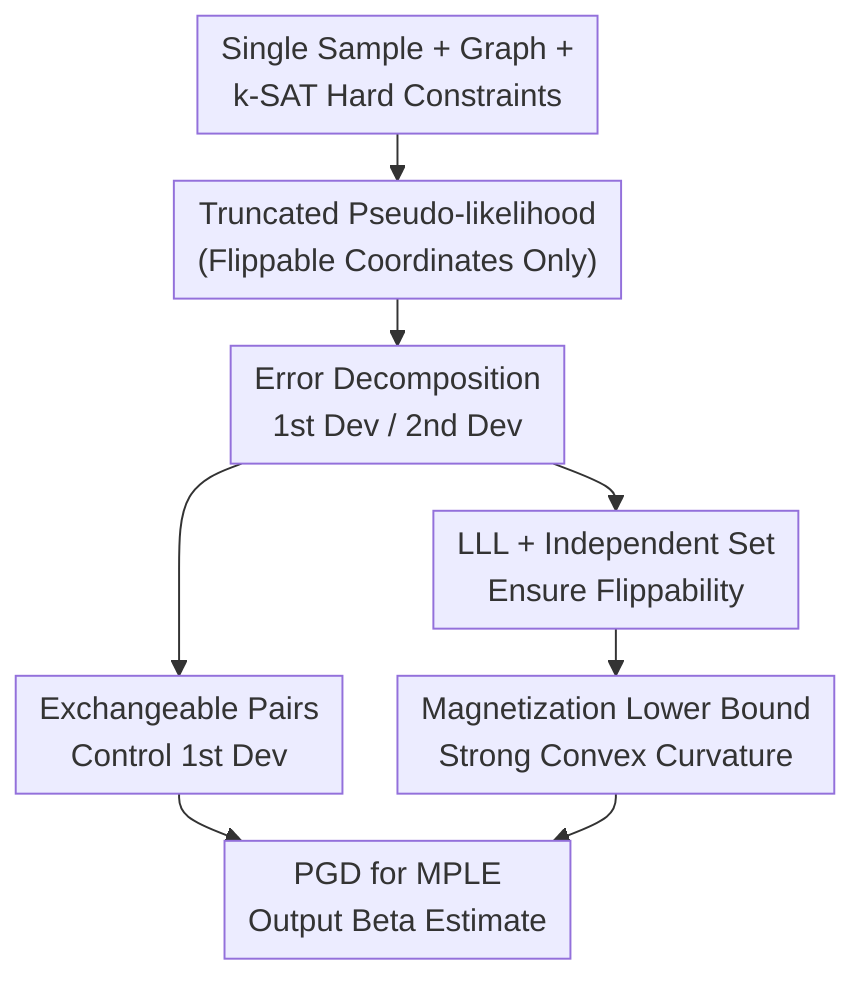

# Learning the Inverse Temperature of Ising Models under Hard Constraints using One Sample

**Conference**: ICLR2026  
**OpenReview**: [https://openreview.net/forum?id=DyDTtBUBEd](https://openreview.net/forum?id=DyDTtBUBEd)  
**Paper**: [OpenReview](https://openreview.net/forum?id=DyDTtBUBEd)  
**Code**: None  
**Area**: Learning Theory / Graphical Models / Statistical Learning  
**Keywords**: Ising model, inverse temperature estimation, hard constraints, pseudo-likelihood, single-sample learning  

## TL;DR
This paper investigates how to estimate the inverse temperature parameter of an Ising model using only a single sample under a known bounded-degree graph and a k-SAT hard constraint truncated set. It proves that a projected gradient algorithm based on Maximum Pseudo-Likelihood Estimation (MPLE) achieves a consistency error of $O(\Delta^3 / \sqrt{n})$ in near-linear time.

## Background & Motivation
**Background**: The Ising model is a classic Markov Random Field that uses a graph $G=(V,E)$ to describe pairwise interactions between variables, with the inverse temperature $\beta$ controlling the correlation strength of spin configurations. Previous research on single-sample estimation has established a clear path: given a graph and a configuration $\sigma$ from an Ising distribution, the MPLE can recover $\beta$, providing a consistent estimate in un-truncated cases with full support.

**Limitations of Prior Work**: Real-world systems often do not allow "all configurations." In scenarios such as spatial transcriptomics, communication channel allocation, and network multicasting, certain combinations are prohibited by hard rules, restricting the distribution to a feasible set $S \subseteq \{\pm 1\}^n$. Such truncation cuts the hypercube into many disconnected islands. Standard concentration tools relying on Glauber dynamics, log-Sobolev inequalities, or Dobrushin conditions no longer apply. Even with a single sample, it is difficult to determine if there are enough flippable neighbors near the sample to support pseudo-likelihood curvature.

**Key Challenge**: Single-sample estimation requires extracting global parameter information from a local configuration, yet hard constraints break local mobility. If a coordinate cannot be flipped without violating constraints, it contributes nothing to the conditional likelihood. If a large number of coordinates are non-flippable, the pseudo-likelihood objective may lack curvature, making it impossible to stably locate the true $\beta^*$.

**Goal**: The authors represent the truncation set as the satisfying assignments of a k-SAT formula $\Phi$ with bounded variable degree. They study the conditions under which the inverse temperature can be consistently estimated from a single sample, given the maximum graph degree $\Delta$, variable degree $d$, and clause length $k$. Specifically, the paper addresses three questions: whether the pseudo-likelihood gradient is sufficiently small at the true parameter, whether the pseudo-likelihood Hessian is sufficiently large, and whether maximization can be achieved via a polynomial (preferably near-linear) algorithm.

**Key Insight**: The paper observes that hard constraints hinder estimation not by their mere existence, but by reducing the number of one-step Hamming neighbors near the sample. If it can be proven that under a sufficiently "wide" k-SAT formula, a typical sample still possesses a linear number of flippable coordinates and their local magnetizations $m_i(\sigma)$ do not collectively collapse, then the second derivative of the pseudo-likelihood can be preserved.

**Core Idea**: The authors transform single-sample inverse temperature estimation into a one-dimensional convex optimization using MPLE. They employ the Lovász Local Lemma (LLL), independent set construction, and exchangeable pairs to simultaneously control coordinate flippability and pseudo-likelihood derivatives under hard constraints.

## Method

### Overall Architecture
The paper addresses a parameter estimation problem with a known graph structure. Inputs include a single sample $\sigma \in S$, the adjacency matrix $A$ of graph $G$, and a k-SAT formula $\Phi$ representing the truncation set $S$; the output is an estimate $\hat{\beta}$ for the inverse temperature $\beta^*$. The method involves identifying flippable coordinates, formulating the negative log-pseudolikelihood, and finding its minimum within the interval $[-B, B]$. The core contribution lies in proving that this objective remains informative on a truncated support.

Formally, the truncated Ising model is defined as:

$$
\Pr_{\beta,S}(\sigma)=\frac{1}{Z_{\beta,S}}\exp(\beta \sigma^\top A\sigma)\mathbf{1}\{\sigma \in S\}.
$$

A coordinate $i$ is called "flippable" if both $(\sigma_i,\sigma_{-i})$ and $(-\sigma_i,\sigma_{-i})$ are in $S$. Only these coordinates contribute to the pseudo-likelihood, as the conditional probability of non-flippable coordinates degenerates to 1. Let $F(\sigma)$ be the set of flippable coordinates and $m_i(\sigma)=\sum_j A_{ij}\sigma_j$ be the local magnetization. The negative log-pseudolikelihood is:

$$
\phi(\beta;\sigma)=\sum_{i\in F(\sigma)}\left[\log\left(\exp(-\beta m_i(\sigma))+\exp(\beta m_i(\sigma))\right)-\beta m_i(\sigma)\sigma_i\right].
$$

Algorithmically, the paper uses Projected Gradient Descent (PGD) on $[-B,B]$ to optimize the normalized objective $n^{-1}\phi(\beta;\sigma)$. Theoretically, the authors prove that the estimation error is bounded by the ratio of the first and second derivatives. They show that $\phi_1(\beta^*;\sigma)$ is $O(\sqrt{n})$ while $\phi_2(\beta;\sigma)$ is at least $\Omega(n/\Delta^3)$ across the parameter interval. Combining these yields $|\hat{\beta}-\beta^*|=O(\Delta^3/\sqrt{n})$.

### Key Designs
**1. Truncated Pseudo-likelihood: Information from Flippable Coordinates**

A common pitfall under hard constraints is to multiply all single-point conditional probabilities as in a standard Ising model. This paper explicitly distinguishes between flippable and non-flippable coordinates. If flipping $i$ satisfies the k-SAT formula, its conditional probability maintains a standard logistic form. If flipping violates the constraint, the probability is fixed by the truncation, offering no curvature for estimating $\beta$. This aligns the objective with the local geometry of the truncated support.

**2. Derivative Sandwiching: Consistency as a Ratio of Derivatives**

The paper utilizes a clean step from 1D convex optimization: since $\hat{\beta}$ is the MPLE, the first derivative at $\hat{\beta}$ is zero. Integrating from $\beta^*$ to $\hat{\beta}$ yields:

$$
|\hat{\beta}-\beta^*|\leq \frac{|\phi_1(\beta^*;\sigma)|}{\min_{\beta\in(-B,B)}\phi_2(\beta;\sigma)}.
$$

This decomposes the statistical estimation problem into two verifiable local properties. The numerator represents the stochastic fluctuation of the gradient at the true parameter, while the denominator ensures the objective is sufficiently curved.

**3. LLL and Independent Sets: Finding Neighbors in Fragmented Supports**

To prevent Hessian degeneracy, the authors prove that typical samples have many flippable coordinates. Because long-range correlations and fragmented supports make standard tools inapplicable, the authors construct an independent set $I$ on the graph that covers a linear proportion of variables in each k-SAT clause. By using the symmetric Lovász Local Lemma, they prove that under the condition:

$$
k>10\Delta^3(1+\log(dk\Delta^2))
$$

there exists an independent set $I$ such that conditioning on $V\setminus I$ leaves a formula with sufficiently long clauses, ensuring coordinate flippability.

**4. Strong Curvature and PGD: Near-Linear Estimation Algorithm**

Beyond flippability, the Hessian terms involve $m_i(\sigma)^2$. If magnetizations were near zero, curvature would be weak. The authors use coupling arguments to show that the squared magnetization contributes a positive lower bound, leading to a high-probability Hessian lower bound of:

$$
\phi_2(\beta;\sigma)\geq \frac{n\exp(-B)}{\Delta^3(8kd)^2}.
$$

The PGD algorithm runs on $[-B, B]$ with $O(\Delta^3 n \log n)$ complexity, achieving near-linear time on bounded-degree graphs.

## Key Experimental Results

### Main Results
As this is a theoretical paper, the "main results" correspond to the conditions for estimability and error rates proven in the theorems.

| Setting | Condition / Assumption | Conclusion | Meaning |
|------|-------------|------|------|
| Truncated Ising Estimation | Known $G$, $\Delta=o(n^{1/6})$, $A_{ij}=\pm 1/\Delta$, $\beta^*\in(-B,B)$ | MPLE estimator $\hat{\beta}$ exists | Known structure, estimate $\beta$ only |
| k-SAT Hard Constraint | $S$ satisfies k-SAT with variable degree $d$, $k = \Omega(\Delta^3\log(d^2k))$ | Consistent estimation possible | Local flippability preserved for long clauses |
| Statistical Error | Single sample $\sigma\sim \mu_{G,\beta^*,S}$ | $|\hat{\beta}-\beta^*|\leq c\Delta^3/\sqrt{n}$ | Error vanishes with $n$ for fixed $\Delta$ |
| Complexity | PGD optimization | $O(\Delta^3 n\log n)$ | Near-linear time complexity |

### Ablation Study
The theoretical proof consists of several necessary modules:

| Proof Module | Key Target | Consequence of Removal |
|----------|-----------------|--------------------|
| Derivative Decomposition | $|\hat{\beta}-\beta^*|\leq |\phi_1|/\min\phi_2$ | Cannot link consistency to local derivatives |
| Exchangeable Pairs | $|\phi_1(\beta^*;\sigma)|=O(\sqrt{n})$ | Gradient might deviate too far from zero |
| LLL + Independent Sets | Linear number of flippable coordinates | Hessian support may vanish, objective degenerates |
| Magnetization Lower Bound | $\phi_2(\beta;\sigma)=\Omega(n/\Delta^3)$ | Insufficient curvature to distinguish different $\beta$ |
| PGD Analysis | $O(\Delta^3 n\log n)$ to reach accuracy | Lacks an actionable algorithm |

### Key Findings
- Hard constraints are not an absolute barrier; what matters is that a configuration has enough "one-step" feasible neighbors. Longer k-SAT clauses ensure that coordinates are not "locked" by constraints.
- Pseudo-likelihood is advantageous here as it bypasses the partition function $Z_{\beta,S}$ and only requires local flip checks.
- $\Delta$ is the most significant factor, appearing in the estimability condition, curvature bound, and error rate. The authors require $\Delta=o(n^{1/6})$.

## Highlights & Insights
- The primary highlight is proving "local mobility" in truncated distributions. Coordinate flippability is a natural concept, but proving its existence in non-product, low-temperature, truncated Ising models requires a novel combination of k-SAT structure, independent sets, and the LLL.
- The paper avoids the trap of using standard Ising conditional probabilities, correctly redefining them for the truncated support.
- Technically, it shifts the perspective from "global sampling is hard" (due to non-mixing chains) to "local statistical information still exists."

## Limitations & Future Work
- The results rely on strong structural assumptions: $\Delta=o(n^{1/6})$, specific edge weights, and k-SAT representations. Heterogeneous weights and more general constraints are not yet covered.
- The k-SAT clause length condition is quite stringent, especially with dependencies on $\Delta^3$, $d$, and $B$. This may limit applicability in very tightly constrained systems.
- There are no empirical simulations to demonstrate finite-sample constants.
- The current work only estimates a single $\beta$. Learning the graph structure or interaction matrix under truncation remains much more difficult.

## Related Work & Insights
- **vs. Chatterjee / Besag**: Extends standard MPLE for Ising models to truncated supports by redefining conditional probabilities and proving curvature persistence.
- **vs. Dagan et al.**: While Dagan et al. leverage full-support concentration/mixing properties, this work uses LLL and local independent sets to handle fragmented supports.
- **vs. Galanis et al.**: Galanis et al. handle truncated product distributions; this paper adds Ising interactions, necessitating the management of both k-SAT and Ising-driven correlations.

## Rating
- Novelty: ⭐⭐⭐⭐☆
- Experimental Thoroughness: ⭐⭐☆☆☆
- Writing Quality: ⭐⭐⭐⭐☆
- Value: ⭐⭐⭐⭐☆

<!-- RELATED:START -->

## Related Papers

- [\[ICLR 2026\] How hard is learning to cut? Trade-offs and sample complexity](how_hard_is_learning_to_cut_trade-offs_and_sample_complexity.md)
- [\[ICLR 2026\] A Sharp KL Convergence Analysis for Diffusion Models under Minimal Assumptions](a_sharp_kl_convergence_analysis_for_diffusion_models_under_minimal_assumptions.md)
- [\[ICLR 2026\] Tokenisation over Bounded Alphabets is Hard](tokenisation_over_bounded_alphabets_is_hard.md)
- [\[ICLR 2026\] Subquadratic Algorithms and Hardness for Attention with Any Temperature](subquadratic_algorithms_and_hardness_for_attention_with_any_temperature.md)
- [\[ICLR 2026\] Physics-informed learning under mixing: How physical knowledge speeds up learning](physics-informed_learning_under_mixing_how_physical_knowledge_speeds_up_learning.md)

<!-- RELATED:END -->
