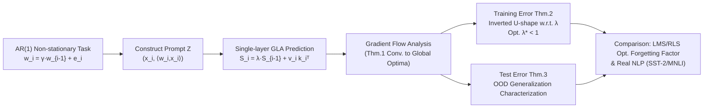

# Learning to Adapt: In-Context Learning Beyond Stationarity

**Conference**: ICLR 2026  
**OpenReview**: [https://openreview.net/forum?id=giA3v1Lo0G](https://openreview.net/forum?id=giA3v1Lo0G)  
**Code**: TBD  
**Area**: learning_theory  
**Keywords**: in-context learning, gated linear attention, non-stationarity, recency bias, gradient flow, linear regression  

## TL;DR
This paper provides the first theoretical characterization of In-Context Learning (ICL) under **non-stationary (time-varying) regression**. It proves that Gated Linear Attention (GLA) implements a "learnable recency bias" through a forgetting factor $\lambda$. When regression weights drift according to a first-order autoregressive process, both training and test errors are strictly lower than standard linear attention, with the optimal $\lambda < 1$.

## Background & Motivation

**Background**: Recent theoretical works have begun to demystify the mechanisms of ICL. A mainstream conclusion is that linear attention can implicitly simulate "one-step gradient descent" during forward computation, thereby achieving ICL on supervised regression tasks (Akyürek 2022, von Oswald 2023, Zhang 2024, etc.). This line of research matches "architectural components" with the "learning algorithms" they implicitly execute.

**Limitations of Prior Work**: Almost all existing analyses rely on a strong assumption: **the task distribution is stationary**, meaning all samples in the prompt and the query share a fixed regression weight $w$. However, real-world time-series forecasting, streaming data, and natural language are **non-stationary**: the target function evolves over time, and more recent samples are more relevant (recency bias). In such scenarios, standard linear attention often fails. Consequently, variants like GLA, RetNet, and Mamba-2 with gating or state decay have been proposed and shown better performance, but **there is a lack of rigorous ICL theoretical explanation for why gating is effective**.

**Key Challenge**: The elegant conclusion of "linear attention $\approx$ one-step GD" under the stationarity assumption cannot explain the empirical advantage of gating mechanisms on non-stationary sequences—a gap exists between theory and practice.

**Goal**: To characterize the advantage of GLA over standard linear attention under a rigorously analyzable non-stationary regression model and interpret it as an endogenous, learnable adaptive capability.

**Core Idea**: **Modeling non-stationarity with a first-order autoregressive process**—allowing regression weights $w_i = \gamma w_{i-1} + e_i$ to drift slowly with tokens. On this model, it is proved that the forgetting factor $\lambda$ in GLA acts as a **learnable memory decay**, equivalent to the optimal forgetting factor in adaptive filtering. This translates "gating is useful" into "recency bias can approximate the time-varying optimal predictor."

## Method

### Overall Architecture
The paper does not propose a new model but builds a "tractable toy world" to analyze existing architectures. It uses an AR(1) process to generate time-varying linear regression tasks (weights drift per token), expresses a single-layer GLA as an exponentially weighted accumulation of historical token outer products, and analyzes its training dynamics, training error, and test error using gradient flow. Finally, the conclusions are compared with classical adaptive filtering (LMS/RLS) and real-world NLP tasks. The analysis framework is shown below.

### Key Designs

**1. First-order Autoregressive Non-stationary Task Model: Making "time-varying" a tractable object.** Existing ICL theories assume a fixed weight $w$ within a prompt. Ours lets each position's label be generated by its own weight $y_i = \langle w_i, x_i \rangle$, where weights evolve via a random walk $w_i = \gamma w_{i-1} + e_i$. Here $0 < \gamma \le 1$ is the autoregressive coefficient (controlling temporal correlation) and $e_i \sim \mathcal{N}(0, \sigma_e^2 I)$ is drift noise. $\gamma \to 1$ degenerates to the classical stationary setting; smaller $\gamma$ indicates more drastic task drift. Combined with Gaussian assumptions $x_i \sim \mathcal{N}(0, \Lambda)$ and $w_0 \sim \mathcal{N}(0, \sigma_w^2 I)$, this model preserves the essence of non-stationarity while allowing for **exact closed-form** training/test errors rather than loose upper bounds.

**2. GLA = Exponentially Weighted Accumulation = Learnable Recency Bias.** Expanding the single-layer GLA state recurrence $S_i = \lambda S_{i-1} + v_i k_i^\top$, the output at the query position can be written as an **exponentially weighted sum** of historical token outer products:
$$o_{n+1}=W_V\Big(\sum_{i=1}^{n+1}\lambda^{\,n+1-i} z_i z_i^\top\Big)W_K^\top W_Q\, z_{n+1}.$$
The key observation: when $\lambda = 1$, the weights degenerate to a uniform accumulation $\sum z_i z_i^\top = ZZ^\top$, and GLA **degenerates precisely into standard linear attention**. $\lambda < 1$ allows more distant tokens to be "forgotten" geometrically by $\lambda^{n+1-i}$. Thus, the entire incremental value of GLA over linear attention is concentrated in this one **learnable memory decay/recency bias**—the exact inductive bias needed for non-stationary sequences. For tractability, the authors use a single global $\lambda$ and merge $W_Q, W_K$ into $W_{KQ}$.

**3. Gradient Flow Convergence to Closed-form Global Optima.** Under Assumption 1 regarding initialization ($W_V, W_{KQ}$ having specific low-rank structures and small scale $\sigma$), Theorem 1 proves that gradient flow on the population loss **converges to a global minimum** even if the task is non-stationary. The optimal solution has an explicit expression $\lim_{t\to\infty}W_{KQ} \propto \tilde\Lambda^{-1}$, where $\tilde\Lambda$ is the "effective covariance" determined by $\lambda, \gamma$ and noise statistics. This closed-form solution parameterizes the optimal position as a function of $\lambda, \gamma$.

**4. Training Error follows an Inverted U-shape w.r.t. $\lambda \to$ Optimal $\lambda^* < 1$.** Substituting the global optimum back, Theorem 2 provides the exact expression for training error. In the special case $\Lambda = I$ and large $d$, it reduces to $\xi(\lambda) = D_1^2/D_2$. The authors prove $\xi(\lambda)$ is monotonically increasing on $(0, \gamma)$ and decreasing on $(\gamma, 1)$—meaning the error follows an **inverted U-shape** with respect to $\lambda$, with the optimal forgetting factor at $\lambda^* < 1$ rather than $\lambda = 1$. This provides a quantitative answer to "why forget and how much": faster drift (smaller $\gamma$) requires more forgetting. Theorem 3 extends this to generalization error under distribution shifts (varying sequence length, dynamics, and distributions).

## Key Experimental Results

### Main Results: Synthetic AR(1) Regression + Real NLP

| Setting | Comparison | Key Findings |
|------|------|----------|
| Single-layer GLA, varying $\gamma, \lambda$ ($d{=}10, n{=}100$) | Different $\lambda$ | Training/test loss follows an inverted U-shape w.r.t. $\lambda$; optimal $\lambda^* < 1$. Smaller $\gamma$ and larger noise require appropriate $\lambda$ (validating Thm. 2/3). |
| Single-layer GLA vs LMS / RLS (Length 1000, 10k MC) | Classical Adaptive Filters | GLA yields lower training error. E.g., at $\gamma{=}0.8$, LMS=0.264, RLS=0.256, GLA is lower; weights are shared across sequences without retraining per sequence. |
| GatedLinearGPT2 vs LinearGPT2 (SST-2 Sentiment, $K{\in}\{1,5,10,15,20\}$ demos) | Linear Attention | GLA with $\lambda{=}0.9$ significantly outperforms LA in both accuracy and confidence. |
| GatedLinearGPT2 vs LinearGPT2 (MNLI NLI, $K{\in}\{1,3,5,7,10\}$) | Linear Attention | GLA consistently achieves higher accuracy and confidence. |

### Ablation Study: Network Depth

| Variable | Phenomenon | Conclusion |
|------|------|------|
| GLA Layers ($\gamma{=}0.95$) | Performance continues to improve as layers increase. | Multi-layer GLA acts like a stack of adaptive filters at different time scales, capturing both short-term fluctuations and long-term trends. |
| Convergence (Single-layer opt $\lambda$ / Multi-layer $\lambda{=}0.85$) | Both single and multi-layer show linear convergence. | Gating mechanisms stabilize gradient propagation across layers. |

### Key Findings
- **There is an optimal amount of forgetting**: The optimal $\lambda^*$ is significantly less than 1 and decreases as task drift intensifies (as $\gamma$ decreases), aligning theory and experiment.
- **Gating = Implicit Adaptive Filtering**: Single-layer GLA behavior on AR(1) corresponds to an adaptive filter, but with lower error than LMS/RLS due to cross-sequence weight sharing and higher expressivity.
- **Drift intensifies the gap**: As $\gamma$ increases from 0.8 to 0.975, LMS/RLS errors worsen rapidly, while GLA maintains lower error via cross-sequence sharing and gating, showing robustness under strong non-stationarity.
- **Transferability to real NLP**: Replacing softmax attention in GPT-2 with GLA outperforms linear attention on SST-2/MNLI, suggesting the "non-stationarity $\to$ recency gating" insight holds beyond toy models.
- **Irreducible lower bound for test error**: Task evolution noise makes $\mathbb{E}[(\tilde y_{m+1}-y_{m+1})^2]$ naturally non-zero, explaining why soft gating is needed to approximate rather than seek zero error.

## Highlights & Insights
- **Proving "Why Gating Works"**: Gating $=$ learnable memory decay $=$ recency bias, which is the optimal inductive bias for non-stationary sequences. GLA degenerates to linear attention at $\lambda=1$, making the comparison clean and solvable.
- **The Inverted U-shape Error Curve**: This provides a beautiful quantitative conclusion: "You can't not forget ($\lambda{=}1$), but you can't forget too much." The optimum is determined by the task drift speed, aligning with classical signal processing intuition.
- **Bridging ICL and Adaptive Signal Processing**: GLA performs "implicit adaptation" via forward pass, while LMS/RLS rely on explicit updates. Same optimal forgetting phenomenon, two different implementations.
- **Multi-time-scale Interpretation**: Each GLA layer is an adaptive filter at a specific time scale. Stacking them models short-term and long-term trends simultaneously, providing a verifiable explanation for deep GLA gains.

## Limitations & Future Work
- **Narrow Non-stationarity Model**: Only analyzed first-order autoregressive drift; does not cover higher-order dynamics or adversarial slow changes.
- **Lack of Multi-layer Theory**: Experimental evidence shows multi-layer is better and converges linearly, but "how multi-layers capture multi-scale drift" lacks rigorous characterization.
- **Simplified Gating**: Used a single global $\lambda$ instead of the original per-token data-dependent gating for analytical simplicity.
- **Optimization Landscape**: Convergence to global optima with random Gaussian initialization (even violating theoretical conditions) suggests a benign landscape, but proof is missing.
- **No Direct Comparison with SSMs**: Analysis focused on GLA vs Linear Attention; did not unify similar decay mechanisms (Mamba-2, RetNet) into one theoretical framework.

## Related Work & Insights
- **Stationary ICL Theory** (Garg 2022, Akyürek 2022, von Oswald 2023, Zhang 2024, etc.): Established the "linear attention $\approx$ one-step GD" paradigm. Ours generalizes this from $\gamma{=}1$ to $\gamma<1$.
- **GLA Optimization Perspective** (Li 2024b/2025): Interpreted GLA as weighted preconditioned GD but still limited to stationary regression. This paper fills the non-stationary gap.
- **Adaptive Filtering** (Sayed 2011, etc.): Classical theory notes an optimal forgetting factor exists for fixed $\gamma$. Ours proves GLA's $\lambda$ plays the same role.
- **Key Insight**: When designing long-sequence/streaming architectures, "how much history to keep" is not "the more the better." It should adapt to data non-stationarity—providing theoretical intuition for gating/decay models (RetNet, Mamba-2, RWKV).

## Rating
- Novelty: ⭐⭐⭐⭐
- Experimental Thoroughness: ⭐⭐⭐
- Writing Quality: ⭐⭐⭐⭐
- Value: ⭐⭐⭐⭐

<!-- RELATED:START -->

## Related Papers

- [\[ICLR 2026\] Transformers with Endogenous In-Context Learning: Bias Characterization and Mitigation](transformers_with_endogenous_in-context_learning_bias_characterization_and_mitig.md)
- [\[ICLR 2026\] Towards a Theoretical Understanding of In-Context Learning: Stability and Non-i.i.d. Generalisation](towards_a_theoretical_understanding_of_in-context_learning_stability_and_non-iid.md)
- [\[ICLR 2026\] On learning linear dynamical systems in context with attention layers](on_learning_linear_dynamical_systems_in_context_with_attention_layers.md)
- [\[ICLR 2026\] Pretrain–Test Task Alignment Governs Generalization in In-Context Learning](pretraintest_task_alignment_governs_generalization_in_in-context_learning.md)
- [\[ICLR 2026\] Quantum Machine Learning Advantages Beyond Hardness of Evaluation](quantum_machine_learning_advantages_beyond_hardness_of_evaluation.md)

<!-- RELATED:END -->
