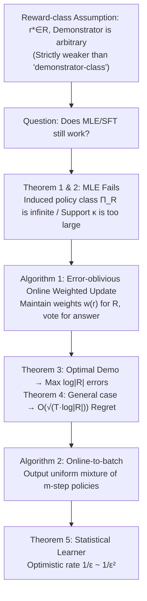

# Learning to Answer from Correct Demonstrations

**Conference**: ICLR 2026  
**arXiv**: [2510.15464](https://arxiv.org/abs/2510.15464)  
**OpenReview**: [https://openreview.net/forum?id=69fIHgLjyH](https://openreview.net/forum?id=69fIHgLjyH)  
**Code**: None (Theoretical paper)  
**Area**: Learning Theory / Imitation Learning / Contextual Bandits  
**Keywords**: Imitation Learning, Apprenticeship Learning, Contextual Bandits, SFT, Maximum Likelihood, Reward-class Assumption  

## TL;DR
This paper formalizes SFT for LLMs as "imitation learning from optimal demonstrations in contextual bandits." It proves that it is sufficient for the **reward model** (which answers are correct) to belong to a low-complexity class, rather than the demonstrator's strategy—a much weaker assumption. The authors demonstrate that Maximum Likelihood Estimation (MLE)/SFT fails under this assumption and propose a single-pass online algorithm with sample complexity logarithmic in the reward class size, achieving an "optimistic rate" of $1/\varepsilon$ when demonstrations are optimal.

## Background & Motivation

**Background**: Many real-world tasks (mathematics, coding, recommendation) have a structure where a problem has a vast number of equivalent correct answers, and providing any one is sufficient. This can be formalized as a contextual bandit: context $x$ is the question, action $y$ is the answer, and reward $r^\star(x,y)\in\{0,1\}$ labels correctness. Supervised Fine-Tuning (SFT) for LLMs precisely fits this setting—training on "question + expert answer" pairs with the goal of performing as well as the expert.

**Limitations of Prior Work**: The mainstream approach in "learning from demonstrations" assumes the **demonstrator strategy** $\tilde\pi$ falls within a low-capacity policy class $\Pi$, allowing for Maximum Likelihood Estimation (MLE, equivalent to log-loss minimization, which is what SFT performs). This approach requires $\log|\Pi|$ to be small and the demonstrator to fall exactly within the class, implying one must **model how a specific student writes a solution**, rather than just "what constitutes a correct solution." This assumption is overly strong and unnatural.

**Key Challenge**: The authors argue that what should truly be modeled is the **reward** (what counts as correct) rather than the **demonstrator's style**. The set of correct solutions $\sigma^\star(x)$ for an IMO gold medal problem is unimaginably large (varying in method, phrasing, spacing, punctuation). Matching the generation distribution of a specific expert is neither possible nor necessary—producing **any** correct solution suffices. Thus, the goal should be pure reward-driven value competition rather than distribution matching:
$$V_{r^\star}(\hat\pi)\ \ge\ V_{r^\star}(\tilde\pi)-\varepsilon,\qquad V_r(\pi)=\mathbb{E}_{x\sim D}\mathbb{E}_{y\sim\pi(\cdot|x)}[r(x,y)].$$

**Goal**: Replace the "demonstrator-class assumption" with a weaker "**reward-class assumption**" ($r^\star\in\mathcal R$, while $\tilde\pi$ is arbitrary) and ask: Does MLE still work? If not, what algorithm should be used, and what is its sample complexity?

**Core Idea**: **(1) Abandon distribution matching and adopt reward hedging**—guaranteeing good performance across the entire reward class $\mathcal R$ simultaneously ensures performance on the true $r^\star$. **(2) Use a single-pass online "error-oblivious" update rule** instead of log-loss minimization, allowing sample complexity to transition smoothly between $O(\log|\mathcal R|/\varepsilon)$ (optimal demonstrations) and $O(\log|\mathcal R|/\varepsilon^2)$ (arbitrary demonstrations).

## Method

### Overall Architecture
The paper first theoretically compares the "reward-class assumption" with the "demonstrator-class assumption" (proving the former is strictly weaker under optimal demonstrations). It then proves that MLE fails under the reward-class assumption. Finally, it provides an online weighted voting algorithm + online-to-batch conversion to derive a statistical learner. The core algorithm maintains weights for all reward functions, outputs answers based on "majority vote," and updates weights based on the demonstration and its own prediction—critically, it **does not need to know whether its own prediction was incorrect** (error-oblivious).

### Key Designs

**1. Reward-class assumption is strictly weaker than demonstrator-class: Decoupling "modeling correctness" from "modeling style."** The conceptual cornerstone is distinguishing two types of realizability: the reward-class assumption requires the unknown reward $r^\star\in\mathcal R\subseteq[0,1]^{X\times Y}$ (arbitrary $\tilde\pi$), while the demonstrator-class assumption requires $\tilde\pi\in\Pi$ (arbitrary reward). When the demonstrator is optimal, the reward-class assumption **induces** a demonstrator class $\Pi_{\mathcal R} = \{\text{all policies supported on } \sigma_r(x)\}$, but even if $|\mathcal R|$ is small, $|\Pi_{\mathcal R}|$ can be infinite as long as each context has $\ge 2$ correct answers. Intuitively, $\log|\mathcal R|$ corresponds to the "parameter count of the reward model" (e.g., $N$ 32-bit parameters yields $\log|\mathcal R|\le 32N$). Modeling "which answers are right" with a transformer is far more natural than modeling "how a specific expert writes an answer"—this is key to stripping breadth (infinite correct answers) from the assumptions.

**2. Why MLE/SFT fails: Distribution matching is impossible under the reward-class assumption.** The power of MLE comes from its ability to clone the demonstrator distribution in Hellinger distance at a rate of $O(\log|\Pi|/m)$ (Proposition 1), which is exactly what the reward-class assumption refuses to provide. The paper constructs a minimal counterexample: binary answers $Y=\{0,1\}$, reward class $\mathcal R=\{r_0,r_{01}\}$, where $r_0$ only accepts $0$, and $r_{01}$ accepts both $0$ and $1$. If the ground truth $r^\star=r_0$, the demonstrator always gives $0$, but $r_{01}$ is also consistent with the data. Consequently, MLE might output $1$ on unseen contexts and fail completely (Theorem 1, even for $|\mathcal R|=|Y|=2$). Even using a cardinality-matched policy class $\Pi_{\mathcal R}=\{\pi_r=\mathrm{Unif}(\sigma_r(x))\}$, because the correct answer support $\kappa$ can be exponentially large, MLE only guarantees $1/\kappa$ hit probability, and the value can be arbitrarily close to $0$ (Theorem 2). Conclusion: Distribution matching is impossible under the reward-class assumption; any method seeking low value suboptimality must **bypass** distribution matching.

**3. Error-oblivious Online Weighted Update (Algorithm 1): Reward hedging without knowing "if I was wrong."** This is the core algorithm. For each $r\in\mathcal R$, it maintains a weight $w^{(t)}(r)$ (initially $1$). Upon receiving $x_t$, it outputs a weighted majority answer:
$$\hat y_t:=\arg\max_{y\in Y}\sum_{r\in\mathcal R}w^{(t)}(r)\,r(x_t,y),$$
and then receives a demonstration $y_t$ (guaranteed correct but potentially unrelated to $\hat y_t$). The update rule for binary optimal demonstrations ($\gamma=1$) is: zero out weights of $r$ that contradict the demonstration ($r(x_t,y_t)\ne 1$); if $r$ agrees with the demonstration but **did not vote** for $\hat y_t$ ($r(x_t,\hat y_t)\ne 1$), double its weight; others remain unchanged. The elegance lies in the fact that even if the learner never knows if $\hat y_t$ was correct, this "weighting up $r$ that failed to help" ensures the number of errors decays exponentially—every error implies that the total weight of dissenting votes (at least half) was doubled, while the total weight is non-increasing. Thus, errors $\le\log|\mathcal R|$ (Theorem 3).

**4. Softened updates + online-to-batch: Upgrading "max log|R| errors" to statistical guarantees with optimistic rates.** To handle real-valued rewards and **suboptimal** demonstrators, the hard update is replaced with a soft one:
$$w^{(t+1)}(r)\leftarrow w^{(t)}(r)\,(1+\gamma)^{r(x_t,\ast)-r(x_t,\hat y_t)}\,(1-\gamma)^{r(x_t,\ast)-r(x_t,y_t)},$$
adjusting weights continuously based on the degree of suboptimality, yielding a regret bound $J_r^\star(T)-\hat J_r(T)\le(1+2\gamma)(J_r^\star(T)-\tilde J_r(T))+\log|\mathcal R|/\gamma$ (Theorem 4). Using online-to-batch conversion (Algorithm 2: outputting a uniform mixture of $m$-step policies $\hat\pi_t$) provides the statistical learner. The final "optimistic rate" (Theorem 5) is a major selling point: with $\Delta$ as demonstrator suboptimality, the value suboptimality is approximately:
$$V_r(\tilde\pi)-V_r(\hat\pi_{o2b})\lesssim\sqrt{\frac{\Delta\,\log|\mathcal R|}{m}}+\frac{\log|\mathcal R|}{m},$$
meaning optimal demonstrations ($\Delta=0$) enjoy a fast $1/\varepsilon$ sample complexity, while the worst case gracefully degrades to $1/\varepsilon^2$. Crucially, this **does not depend** on $|Y|$ or the size of the correct set $|\sigma^\star(x)|$. In contrast, adapting Syed & Schapire (2007) to contextual bandits yields only $1/\varepsilon^2$. This method is single-pass, self-contained in analysis, and allows for adaptive demonstrations.

## Key Experimental Results

As this is a purely theoretical paper, "Key Experimental Results" refers to the comparison and guarantees of theoretical sample complexity.

### Main Results: Complexity Comparison between MLE and Ours under different assumptions

| Learning Rule | Low-cardinality $\Pi$ Assumption | Low-cardinality $\mathcal R$ Assumption |
|---|---|---|
| **MLE** | $\sqrt{\Delta\log|\Pi|/m}+\log|\Pi|/m$ (Optimal, Prop 1) | **May fail to learn** (Theorem 1, 2) |
| **Ours** | $\log|\Pi|/m$ (Corollary 2) | $\sqrt{\Delta\log|\mathcal R|/m}+\log|\mathcal R|/m$ (Theorem 5) |

The grayed-out slow term interpolates between $1/\sqrt m$ (worst case) and $1/m$ (optimal case) based on demonstrator suboptimality $\Delta$. Core conclusion: Under optimal demonstrations, **low-cardinality $\mathcal R$ is a strictly weaker assumption than low-cardinality $\Pi$**.

### Core Theorems Summary

| Theorem | Content | Rate |
|---|---|---|
| Theorem 1/2 | MLE fails on simple binary reward classes (on $\Pi_{\mathcal R}$ or $\bar\Pi_{\mathcal R}$) | $V_{r^\star}(\hat\pi_{mle})\le\epsilon$, for any $m$ |
| Theorem 3 | Online error bound for Algorithm 1 ($\gamma=1$, optimal demo) | $\le\log|\mathcal R|$ errors |
| Theorem 4 | Regret bound for Algorithm 1 (General real reward + arbitrary demo) | $O(\sqrt{T\log|\mathcal R|})$ |
| Theorem 5 | Online-to-batch statistical guarantee (Optimistic Rate) | $1/\varepsilon$ (Optimal) ~ $1/\varepsilon^2$ (Arbitrary) |

### Key Findings
- **Learning with invisible errors**: Even if the learner never knows if its single-step answer was correct, as long as a "correct demonstration" is provided, the total errors are bounded by $\log|\mathcal R|$.
- **Independent of answer space**: Sample complexity does not contain $|Y|$ or $|\sigma^\star(x)|$, making it suitable for real-world scenarios where the number of correct answers is exponential.
- **Optimistic Rates**: The closer the demonstration is to optimal (smaller $\Delta$), the faster the transition from $1/\varepsilon^2$ to $1/\varepsilon$.

## Highlights & Insights
- **Repositioning SFT Assumptions**: Replacing "modeling demonstrator style" with "modeling reward/correctness criteria" clarifies why distribution matching in LLM post-training is neither necessary nor achievable.
- **The "Error-oblivious Online Learning" Setting**: Unlike traditional contextual bandits, the learner does not see its own reward but only receives an unrelated correct demonstration. The fact that it can still guarantee few errors is elegant.
- **Unifying Optimal/Suboptimal Demos**: Relying on a single step-size $\gamma$ allow the theory to bridge both ends of the spectrum.
- **Broad Applicability**: By treating entire token sequences as single actions, the conclusions generalize to MDPs with deterministic transitions and auto-regressive language generation.

## Limitations & Future Work
- **Finite Reward Classes Only**: All bounds are expressed in terms of $\log|\mathcal R|$. Many natural reward classes (generalized linear, low-rank bilinear, transformer scoring) are continuous parameterized infinite classes; characterizing their learnability and sample complexity remains an open problem.
- **Computational Infeasibility**: While sample complexity is logarithmic, the naive implementation's time/space is linear in $|\mathcal R|$, which is exponential in the number of parameters. Heuristic simplifications for practical use are missing.
- **Gap to Practical SFT**: In practice, which reward class $\mathcal R$ to use, how to construct $\mathcal R$ using pre-trained $\pi_\theta$, and when reward-hedging truly outperforms behavior cloning are still open questions.

## Related Work & Insights
- **Apprenticeship/Imitation Learning**: Abbeel & Ng (2004) and Syed & Schapire (2007) are direct precursors. This work adapts Syed & Schapire to single-step contextual bandits, improving it to be single-pass and optimistic with adaptive demonstrations.
- **Density Estimation/MLE from Demos**: Foster et al. (2024) provide tight rates for MLE under the demonstrator-class assumption, serving as the basis for Proposition 1.
- **LLM Post-training Perspective**: Viewing SFT as imitation learning in contextual bandits aligns with work like DPO (Rafailov et al., 2023), which treats whole responses as single actions. The pass@k extension (Appendix F) is minimax optimal under optimal demos.
- **Insight**: For those working on LLM alignment/SFT, this paper offers a counter-intuitive but vital perspective: when the "correct answer set" is massive, stop trying to clone the expert distribution and instead perform reward hedging around the "correctness criteria." This could lead to new post-training paradigms distinct from behavior cloning.

## Rating
- **Novelty**: ⭐⭐⭐⭐⭐ Thoroughly explains the distinction between reward-class and demonstrator-class assumptions, proving the former is strictly weaker and MLE fails under it—a substantial restructuring of SFT's theoretical foundation.
- **Experimental Thoroughness**: ⭐⭐⭐ Purely theoretical with no numerical experiments; however, the theorem system is complete, counterexamples are clever, and rates are tight.
- **Writing Quality**: ⭐⭐⭐⭐⭐ The narrative from motivation to counterexample to algorithm to guarantee is exceptionally clear. Table 1 and Figure 1 make abstract settings intuitive.
- **Value**: ⭐⭐⭐⭐ Provides a new theoretical framework and algorithmic prototype for understanding and improving LLM SFT. Long-term inspiration is high, though current algorithms are computationally impractical and limited to finite classes.

<!-- RELATED:START -->

## Related Papers

- [\[ICLR 2026\] Transfer Learning in Infinite Width Feature Learning Networks](transfer_learning_in_infinite_width_feature_learning_networks.md)
- [\[ICLR 2026\] Learning to Adapt: In-Context Learning Beyond Stationarity](learning_to_adapt_in-context_learning_beyond_stationarity.md)
- [\[ICLR 2026\] Sharp Asymptotic Theory for Q-Learning with LD2Z Learning Rate and Its Generalization](sharp_asymptotic_theory_for_q-learning_with_textttld2z_learning_rate_and_its_gen.md)
- [\[ICLR 2026\] How Reinforcement Learning after Next-Token Prediction Facilitates Learning](how_reinforcement_learning_after_next-token_prediction_facilitates_learning.md)
- [\[ICLR 2026\] Online Decision-Focused Learning](online_decision-focused_learning.md)

<!-- RELATED:END -->
