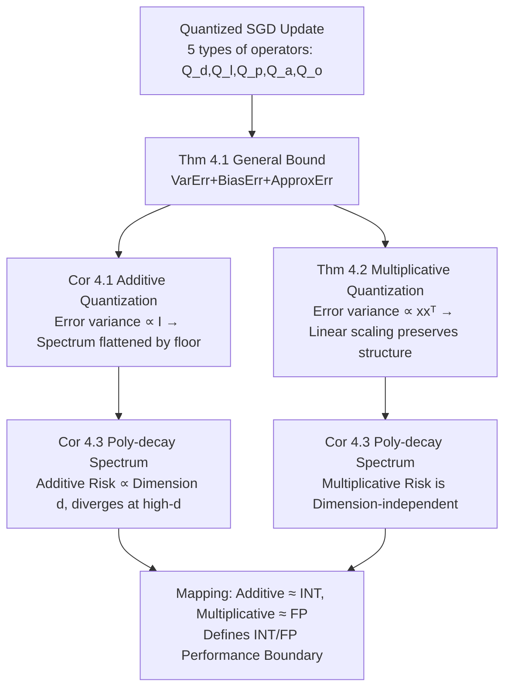

# Learning under Quantization for High-Dimensional Linear Regression

**Conference**: ICLR 2026  
**OpenReview**: [https://openreview.net/forum?id=eUjUReZoYR](https://openreview.net/forum?id=eUjUReZoYR)  
**Code**: To be confirmed  
**Area**: Learning Theory / Quantized Training  
**Keywords**: Low-bit quantization, high-dimensional linear regression, SGD, excess risk bound, additive quantization, multiplicative quantization  

## TL;DR
This paper provides the first systematic theoretical framework characterizing "how quantization affects learning performance." Under high-dimensional linear regression and finite-step SGD, the authors derive precise excess risk upper bounds for five quantization targets: data, labels, parameters, activations, and gradients. They demonstrate that additive quantization (corresponding to INT) contaminates the data spectrum, whereas multiplicative quantization (corresponding to FP) preserves spectral structure, thus performing better in high-dimensional settings.

## Background & Motivation

**Background**: Low-bit quantization is essential for training large models. Emerging "quantization scaling law" studies attempt to characterize the trade-off between model scale, data volume, and bit-width (Kumar 2024 treats bit-width as a discrete precision measure, Sun 2025 models FP exponent/mantissa separately, and Chen 2025 provides a unified scaling law).

**Limitations of Prior Work**: Theory lags significantly behind practice. Most theoretical works on quantized optimizers (De Sa 2015, QSGD by Alistarh 2017, Markov 2023) focus solely on the **convergence of training loss** while ignoring the fundamental question: how does quantization affect the **learning/generalization performance** of the model? The most relevant work, Zhang et al. (2022), analyzed the generalization of quantized two-layer networks using NTK, but with three constraints: it only considered parameter quantization, was limited to the lazy-training regime, and failed to provide explicit generalization bounds regarding sample size, dimension, and quantization error.

**Key Challenge**: The coupling of quantization error, model dimensionality, and data volume and their joint effect on **population risk** remains poorly characterized. Furthermore, while hardware uses distinct error structures for INT and FP formats, no theory clearly delineates their respective performance boundaries.

**Goal**: Using high-dimensional linear regression as an analytic testbed, this paper aims to unify the modeling of five quantization targets and derive precise excess risk bounds $\mathcal{E}(w_N)=L(w_N)-L(w^*)$ with respect to spectral eigenvalues, sample size, and quantization error, thereby comparing INT and FP across different dimensions and batch sizes.

**Key Insight**: **"Distinguishing two classes of quantization error models"**—categorizing quantization errors by the structure of their conditional second moments into *additive* (error variance $\propto I$, corresponding to fixed-bin-length INT) and *multiplicative* (error variance $\propto xx^\top$, scaling with signal magnitude, corresponding to value-aware FP). This reveals their fundamentally different impacts on the data spectrum.

## Method

### Overall Architecture
The paper analyzes the excess risk theory for "quantized SGD." Each step updates a batch $(X_t, y_t)$ as follows:
$$w_t = w_{t-1} + \gamma \tfrac{1}{B} Q_d(X_t)^\top Q_o\!\big(Q_l(y_t) - Q_a(Q_d(X_t)Q_p(w_{t-1}))\big),$$
where $Q_d, Q_l, Q_p, Q_a, Q_o$ are independent quantization operators for data features, labels, parameters, activations, and output gradients, respectively. The output is the iterate average $\bar w_N$. The analysis first decomposes the excess risk under general quantization into **variance error + bias error + approximation error** (Theorem 4.1), then substitutes additive/multiplicative error structures to obtain interpretable bounds (Corollary 4.1 / Theorem 4.2), and finally compares them under polynomial decay spectra (Corollary 4.3).

### Key Designs

**1. Definitions of Additive vs. Multiplicative Error Structures.** Beyond the unbiased assumption $\mathbb{E}[Q_i(u)|u]=u$, the paper categorizes quantization by the structure of their conditional second moments. Multiplicative quantization satisfies $\mathbb{E}[(Q(x)-x)(Q(x)-x)^\top|x]=\epsilon\,xx^\top$, where the error scales with the signal magnitude. Additive quantization satisfies $\mathbb{E}[(Q(x)-x)(Q(x)-x)^\top|x]=\epsilon I$, where the error variance remains constant across coordinates. This distinction aligns with hardware: INT8/INT16 use fixed bin lengths (additive), while FP8 (e.g., E4M3) uses exponent/mantissa bits for value-aware bin lengths (multiplicative).

**2. Three-part Excess Risk Bound: Separating "Spectral Distortion" and "Noise Amplification."** Theorem 4.1 defines the bound via the quantized data covariance $H^{(q)}=\mathbb{E}[Q_d(x)Q_d(x)^\top]$ and effective dimension $k^*=\max\{k:\lambda_k^{(q)}\ge \tfrac{1}{N\gamma}\}$. **Data quantization** primarily affects variance/bias by distorting the spectrum of $H^{(q)}$ and introduces an extra ApproxErr. **Parameter/activation/gradient quantization** collectively amplify the effective noise variance $\sigma_G^{(q)2}$:
$$\sigma_G^{(q)2}=\tfrac{\sigma^2+\sup_t\mathbb{E}[\epsilon_t^{(o)}\epsilon_t^{(o)\top}]+\mathbb{E}[\epsilon_t^{(a)}\epsilon_t^{(a)\top}]}{B}+\alpha_B\sup_t\mathbb{E}\,\mathrm{tr}(H^{(q)}\epsilon_{t-1}^{(p)}\epsilon_{t-1}^{(p)\top}).$$
The framework is consistent with classical full-precision theory (Zou et al., 2023) as errors approach zero.

**3. Additive Quantization: Batch Averaging vs. "Noise Floor."** Corollary 4.1 shows that additive activation/gradient errors ($\epsilon_a, \epsilon_o$) are suppressed by the $1/B$ factor, similar to label noise. However, data quantization adds a constant $\epsilon_d$ across the entire spectrum, creating a **noise floor** that prevents tail eigenvalues from decaying. This causes high-dimensional tail subspaces to accumulate significant risk. Parameter quantization $\epsilon_p$ is amplified proportional to $\mathrm{tr}(H)$ regardless of batch size.

**4. Multiplicative Quantization: Spectral Preservation and Dimension-Independence.** Multiplicative error acts as a linear transformation $(1+\epsilon_d)$ on the spectrum, preserving relative distributions and decay properties, resulting in ApproxErr being only $\tfrac{\epsilon_d}{1+\epsilon_d}\|w^*\|_H^2$. Crucially, for polynomial decay spectra $\lambda_i\asymp i^{-a}$, multiplicative risk is **dimension-independent**, making it viable for infinite-dimensional settings. Conversely, additive risk explicitly depends on dimension $d$ and diverges as $d\to\infty$. Mapping back to hardware, FP is shown to be superior when $md \ge bd - \frac{a}{2} \log_2 d$, highlighting FP's advantage in high dimensions even with fewer mantissa bits than INT.

## Key Experimental Results

Experiments used a synthetic Gaussian least squares model: covariance spectrum $\lambda_i=i^{-2}$, true $w^*[i]=1$, noise $\sigma^2=1$, constant-stepsize SGD with iterate averaging.

### Main Results (Q1: Quantization Level Impact, d=200, B=1)

| Scheme | Quantization Level $\varepsilon$ | Excess Risk Performance |
|---|---|---|
| Multiplicative (FP-like) | 0 / 1e-3 / 5e-3 / 1e-2 | **Maintains** generalization across all levels |
| Additive (INT-like) | 0 / 1e-3 / 5e-3 / 1e-2 | **Degrades** gradually as $\varepsilon$ increases |

### Ablation Study (Q2: Dimension Impact, $\varepsilon$=0.01, B=1)

| Scheme | Dimension $d\in\{50,100,200,400\}$ | Excess Risk Performance |
|---|---|---|
| Multiplicative (FP-like) | 50→400 | Performance is **preserved** in high dimensions |
| Additive (INT-like) | 50→400 | Performance **deteriorates significantly** as $d$ increases |

### Key Findings
- For $B=1$, additive quantization requires much stricter precision to match full-precision performance, verifying the spectral dependency constraints.
- Additive is dimension-sensitive, whereas multiplicative is dimension-independent, matching the divergence analysis in high-d settings.
- Multiplicative (FP) curves overlap with the full-precision baseline, demonstrating "lossless" learning due to spectral preservation.

## Highlights & Insights
- **The first theoretical work to subdivide "quantization targets" into five categories** and provide explicit excess risk bounds, filling the gap in generalization analysis.
- The **additive vs. multiplicative dichotomy** provides a simple structure to explain all performance divergence between INT and FP, offering quantitative guidance for bit-width selection.
- Reveals a counter-intuitive insight: batch averaging acts as a "cure" for additive activation/gradient noise but has minimal effect on multiplicative noise because the latter is entangled with the signal.

## Limitations & Future Work
- Restricted to **linear regression + unbiased quantization** assumptions; real-world प्रशिक्षण involves biased quantization (clipping/saturation).
- Assumes matrix updates occur in full precision, differing from hardware where accumulation might be low-precision.
- The mapping from $\epsilon$ to bit-width is a rough approximation that ignores dynamic range and overflows.
- Experimental verification is limited to synthetic Gaussian data.

## Related Work & Insights
- **High-dimensional SGD Theory**: Built on the dimension-free finite-sample analysis of Zou et al. (2023) and excess risk characterization of ridge regression (Bartlett 2020).
- **Quantization Theory**: Complements "convergence" works (De Sa 2015, Alistarh 2017) by shifting focus from training loss to generalization.
- **Insight**: Treating "error structure" rather than just "error magnitude" as the core driver for quantization performance can be extended to complex models like Transformers.

## Rating
- **Novelty**: ⭐⭐⭐⭐⭐ First to provide explicit generalization bounds for five quantization targets and explain INT/FP differences via error structure.
- **Experimental Thoroughness**: ⭐⭐⭐ Synthetic experiments cleanly verify core conclusions, though real-world data/networks are missing.
- **Writing Quality**: ⭐⭐⭐⭐ Logic is clear, with strong interpretability, though equation density is high.
- **Value**: ⭐⭐⭐⭐ Provides the first theoretical basis for selecting between INT and FP and their respective bit-widths.

<!-- RELATED:START -->

## Related Papers

- [\[NeurIPS 2025\] Transfer Learning for Benign Overfitting in High-Dimensional Linear Regression](../../NeurIPS2025/learning_theory/transfer_learning_for_benign_overfitting_in_high-dimensional_linear_regression.md)
- [\[ICLR 2026\] High-dimensional Analysis of Synthetic Data Selection](high-dimensional_analysis_of_synthetic_data_selection.md)
- [\[ICLR 2026\] Improved High-Dimensional Estimation with Langevin Dynamics and Stochastic Weight Averaging](improved_high-dimensional_estimation_with_langevin_dynamics_and_stochastic_weigh.md)
- [\[ICLR 2026\] Larger Datasets Can Be Repeated More: A Theoretical Analysis of Multi-Epoch Scaling in Linear Regression](larger_datasets_can_be_repeated_more_a_theoretical_analysis_of_multi-epoch_scali.md)
- [\[ICLR 2026\] Physics-informed learning under mixing: How physical knowledge speeds up learning](physics-informed_learning_under_mixing_how_physical_knowledge_speeds_up_learning.md)

<!-- RELATED:END -->
