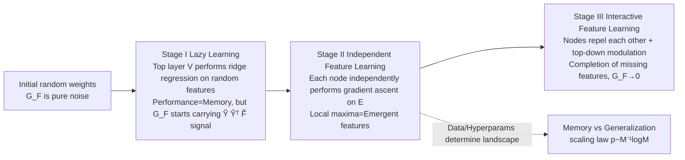

# $\mathbf{Li_2}$: A Theoretical Framework Characterizing Feature Emergence and Delayed Generalization Dynamics

**Conference**: ICLR 2026  
**OpenReview**: [https://openreview.net/forum?id=ceIBRhJpUr](https://openreview.net/forum?id=ceIBRhJpUr)  
**Code**: [github.com/yuandong-tian/understanding](https://github.com/yuandong-tian/understanding/tree/main/ssl/real-dataset/cogo)  
**Area**: Learning Theory / Optimization Dynamics  
**Keywords**: grokking, delayed generalization, feature learning, gradient dynamics, energy function, group representation theory, scaling law  

## TL;DR
This paper proposes the $\mathbf{Li_2}$ framework. Starting from the first principles of gradient dynamics in two-layer nonlinear networks, it decomposes grokking (delayed generalization) into three stages: "lazy learning → independent feature learning → interactive feature learning." It proves that the independent stage is precisely a gradient ascent on an energy function $E$, where local maxima correspond to emergent features, thereby deriving provable scaling laws for the memory/generalization boundary.

## Background & Motivation
- **Background**: The grokking phenomenon (where a model first overfits the training set and then suddenly generalizes after further training) has been extensively studied empirically. Existing explanations include effective theory, memory/generalization circuit efficiency, and viewing weight decay as a Bayesian prior.
- **Limitations of Prior Work**: Most of these works remain at the level of "post-hoc descriptions" of empirical phenomena. They either rely on extremely wide networks (NTK / mean-field regimes, where hidden weights barely move) or rely on heuristic stage divisions (e.g., the three stages in Nanda et al. are purely empirical). **Few have explained how grokking happens from the details of gradient dynamics on weights**.
- **Key Challenge**: Explaining generalization requires substantial updates to hidden layer weights (moving out of the NTK regime), which makes the analysis non-convex and difficult to characterize. Furthermore, three lingering questions remain: what features emerge, under what conditions they emerge, and how they link to training gradients.
- **Goal**: To establish a mathematical framework that **characterizes both the types and conditions of feature emergence while remaining closely tied to gradient dynamics**, providing provable feature structures and scaling laws for structured inputs (group arithmetic tasks).
- **Core Idea**: **The "leaked" structure of the backpropagated gradient $G_F$ is the root cause of groking.** In the lazy learning stage, the top layer fits random features (manifesting as memory), but the gradient $G_F$ backpropagated to the hidden layer simultaneously carries target label information. Its specific structure ($G_F\propto\tilde Y\tilde Y^\top\tilde F$) allows each hidden node to **independently** perform gradient ascent according to an energy function $E$, leading to the emergence of generalizable features.

## Method

### Overall Architecture
The study focuses on 2-layer networks $\hat Y=\sigma(XW)V$ with $\ell_2$ loss. The core quantity is the gradient backpropagated to the hidden layer activations $F=\sigma(XW)$, denoted as $G_F=-\partial J/\partial F=P^\perp_1(Y-FV)V^\top$ ($P^\perp_1$ is the projection that removes the mean along the sample dimension). The entire paper revolves around the structural evolution of $G_F$, dividing training into three stages and providing theorems for each.

### Key Designs

**1. Lazy Learning Stage: The dual-phase structure of the leaked gradient $G_F$ (Stage I).** Early in training, $W$ and $V$ are zero-mean random variables, and $G_F$ is pure noise. Since hidden activations $F$ remain largely unchanged while only the top layer $V$ learns, $F$ can be analyzed as a constant. Proposition 1 proves that under small initialization (top-layer scale $\alpha\ll1$), early $G_F(t)=t\,\tilde Y\tilde Y^\top\tilde F+O(\alpha)+O(\alpha t)+O(t^2)$, meaning it is **dominated by the signal term $\tilde Y\tilde Y^\top\tilde F$ carrying label information**. When $V$ converges to the ridge regression solution $V_{\text{ridge}}=(\tilde F^\top\tilde F+\eta I)^{-1}\tilde F^\top\tilde Y$, $G_F$ converges exponentially to a fixed point determined by the weight decay $\eta$. Lemma 1 further simplifies this in the wide network limit to $G_F(+\infty)\propto\eta\,\tilde Y\tilde Y^\top\tilde F$. This consistently appearing $\tilde Y\tilde Y^\top\tilde F$ term serves as the engine for subsequent feature learning. This also yields a practical corollary: **zero-initializing** (zero-init) the top layer $V$ can isolate the signal term in $G_F$ from the start, accelerating feature learning (up to $10\times$ acceleration in deep networks or data-scarce settings).

**2. Independent feature learning is precisely gradient ascent on the energy function $E$ (Stage II).** Since the $j$-th column of $G_F\propto\tilde Y\tilde Y^\top\tilde F$ only depends on the $j$-th node $w_j$, the dynamics of the $K$ nodes are **completely decoupled**: $\dot w_j=X^\top D_j g_j,\ g_j\propto\tilde Y\tilde Y^\top\sigma(Xw_j)$. Theorem 1 proves this is exactly the gradient ascent of the energy function:
$$E(w_j)=\tfrac12\big\|\tilde Y^\top\sigma(Xw_j)\big\|_2^2$$
which is essentially a **nonlinear Canonical Correlation Analysis (CCA)** between the input $X$ and target $\tilde Y$. Thus, the "features learned by each node" are characterized as local maxima of $E$. Key Insight: If $\sigma$ is linear, $E$ has only one global maximum (collapsing to LDA, which fails on group tasks due to identical class means); it is the **nonlinearity that creates multiple local maxima in $E$, each corresponding to a meaningful, generalizable feature**.

**3. Characterizing local maxima and generalizability using group representation theory.** For group arithmetic tasks (predicting $h_1h_2$ given $h_1, h_2$, e.g., modular addition $\bmod M$), using the irreducible decomposition of the regular representation $R_h=Q(\bigoplus_k\bigoplus_r C_k(h))Q^*$, Theorem 2 **completely characterizes** all local maxima of $E$: they take the form $w^*=[u;\pm Pu]$ (where $P$ is the group inversion operator), reside within some $d_k$-dimensional real/complex irreducible representation subspace, have energy values $E^*=M/8d_k$ or $M/16d_k$, are disconnected from each other, and "there are no other local maxima." For modular addition (Abelian groups), this collapses to **single-frequency Fourier bases** (Corollary 2), consistent with empirical observations of Fourier representations in grokking. Theorem 3 further proves these features can fully reconstruct $\tilde Y$ using only $K=2M-2$ nodes, far more efficient than the $M^2$ nodes required for pure memory.

**4. Provable scaling law for the memory/generalization boundary.** It is not necessary to use all $M^2$ samples—Theorem 4 proves by checking the **stability** of local maxima: as long as $n\gtrsim d_k^2 M\log(M/\delta)$ samples are uniformly collected, the empirical energy $\hat E$ preserves the generalizable local maxima. Thus, the ratio of training data required for generalization $p:=n/M^2=O(M^{-1}\log M)$, providing a clear phase transition boundary (almost perfectly matching experimental Fig. 5). Conversely (Theorem 5), when data only covers a single target, the global maximum of $E$ collapses to a memory solution (power activation → focused memory, ReLU/SiLU etc. → spreading memory). This explains empirical phenomena like "memory/generalization circuits," critical data ratios, and ungrokking from first principles: **data distribution changes the landscape of $E$, determining whether weights fall into the generalization or memory basin**.

**5. Interactive Phase: Repulsion, Top-down Modulation, and Muon (Stage III).** Once $W$ deviates from random initialization and the approximation $B:=(\tilde F^\top\tilde F+\eta I)^{-1}\propto I$ fails, nodes become coupled. Theorem 6 proves that two nodes with similar activations will **repel each other** (encouraging diversity). Theorem 7 (top-down modulation) proves that if the hidden layer has only learned a subset of irreducible representations $S$, $G_F$ automatically alters the landscape so that $E_S$ only retains local maxima for the **missing** features, forcing the model to complete the set. Theorem 8 proves that the **Muon optimizer** (which takes $U V^\top$ after SVD of the gradient) rebalances updates in all directions—discounting directions of already occupied local maxima—thereby forcing exploration of new directions and reducing the number of nodes required to learn all local maxima from $T_0$ to approximately $L$. This is the first analysis explaining why Muon is effective from a feature learning perspective.

## Key Experimental Results

### Main Results: Scaling Law Validation

| Task | Setting | Theoretical Prediction | Empirical Result |
|------|------|----------|----------|
| Mod-add Generalization/Memory Phase Transition | $M=23\sim127$, $K=2048$, lr=5e-4, wd=2e-4 | $p\sim M^{-1}\log M$ | Phase transition boundary aligns perfectly with the dashed line (sharp jump in test acc 0→1) |
| Nodes required for reconstruction | Abelian Group | $K=2M-2$ | Significantly less than $M^2$ needed for memory |
| Sample size threshold | $d_k$-dim Irreducible | $n\gtrsim d_k^2M\log M$ | Matches Fig. 5 for both composite/prime $M$ |

### Key Findings (Ablation Study)

| Control Group | Phenomenon | Corresponding Theory |
|------|------|----------|
| With/Without weight decay ($\eta$=2e-4 vs 0) | With wd, $\|G_F\|$ increases at epoch≈100 and triggers grokking; $\eta=0$ does not grok | Lemma 1: $G_F\propto\eta$ |
| Cosine distance of weight update $\Delta W$ | $V$ (output layer) updates first, followed by $W$ (hidden layer) | Two-stage: Lazy → Independent |
| $\tilde F^\top\tilde F$, $P^\perp_1FF^\top$ | Remains approximately diagonal throughout (error ≤8%) | Independent feature learning assumption holds |
| Learning rate (Small vs Large) | Small lr stays in generalization basin → gsol; Large lr converges to higher $E$ ngsol (memory) | Semi-grokking boundary |
| zero-init vs Normal Init | Acceleration across all $M=41/89/127$; up to $10\times$ in data-scarce deep settings | Signal term in Eqn. 3 |

### Key Findings
- Weight decay, learning rate, and sample size jointly shape grokking by altering the landscape of $G_F$ and $E$.
- The framework extends to multi-layer networks and inherently explains **why residual connections are useful**: in $G_{\text{res},1}=\sum_l G_l$, $G_L$ provides a much cleaner signal, preventing the bottom-layer gradient from being diluted by repeated random re-weighting or pruning.

## Highlights & Insights
- **Upgrade from "empirical three stages" to "provable three stages"**: While Nanda et al. observed three stages, this work provides a first-principles characterization using the structural evolution of $G_F$.
- **Energy function $E$ is the central pivot**: The statement "independent dynamics = gradient ascent on $E$" converts the question of "what features emerge" into "what are the local maxima of $E$," which is solved completely using group representation theory.
- **The scaling law is derived, not fitted**, from landscape stability and matches experiments.
- **Unified explanation for empirical puzzles**: Memory/generalization circuits, critical data ratios, ungrokking, task diversity, Muon effectiveness, and the utility of residuals all emerge as natural consequences of landscape changes.

## Limitations & Future Work
- **Strong group structure assumption**: while the derivation of energy $E$ holds for arbitrary inputs, the **complete characterization of local maxima relies on group structure** in inputs (group arithmetic tasks), which has not yet been provided for general structured inputs (e.g., natural language, images).
- **Lack of transition time analysis**: The three stages are characterized individually, but the duration of transitions between stages is not modeled.
- **Multi-layer Stage III left for future work**: Top-down modulation in deep networks is currently treated with qualitative directions only.
- The impact of different activations on focused vs. spreading memory in large-scale settings remains to be verified.

## Related Work & Insights
- **Grokking Explanation Spectrum**: Effective theory (Liu 2022), memory/generalization circuit efficiency (Varma 2023), Bayesian prior perspective (Millidge 2022), wide network analysis (Barak/Rubin)—this paper provides a unified explanation at the gradient dynamics level.
- **Feature Learning Theory**: Echoes the contrastive loss energy function of Tian (2023), but provides a clearer, solvable local maxima structure for $E$.
- **Group Representation Theory × Mod-add Grokking**: Continues the observations of Fourier representations by Nanda/Gromov/Power, providing a proof for "why it must be Fourier bases."
- **Beyond NTK / Mean-field**: Explicitly notes that as $K\to\infty$, $G_F\to0$ (no feature learning in the NTK regime); this paper investigates the feature learning regime where $K$ is large but finite.
- **Insights**: The energy function perspective + representation theory decomposition may serve as a general paradigm for analyzing emergent features in other structured tasks (permutations, matrix groups, product groups). Theoretical support for zero-init and Muon also suggests practical means for training acceleration.

## Rating
- **Novelty**: ⭐⭐⭐⭐⭐ The first to prove the three stages of grokking from gradient dynamics first principles and fully characterize emergent features using energy functions + group representation theory. High theoretical originality.
- **Experimental Thoroughness**: ⭐⭐⭐⭐ Validates scaling law phase transitions and stage-specific phenomena across multiple $M$ and group types, matching theory well; however, limited to synthetic group arithmetic tasks without verification on real-world large-scale data.
- **Writing Quality**: ⭐⭐⭐⭐ The three-stage narrative is clear, theorems are tightly linked, and Figures 1/2 are intuitive. However, the density of theorems and the group representation theory section pose a high barrier for non-theoretical readers.
- **Value**: ⭐⭐⭐⭐⭐ Unifies numerous empirical grokking puzzles as consequences of landscape changes and provides theoretical explanations for Muon/residual/zero-init, holding foundational significance for understanding deep network generalization.

<!-- RELATED:START -->

## Related Papers

- [\[ICLR 2026\] Robustness of Probabilistic Models to Low-Quality Data: A Multi-Perspective Analysis](robustness_of_probabilistic_models_to_low-quality_data_a_multi-perspective_analy.md)
- [\[ICLR 2026\] Transfer Learning in Infinite Width Feature Learning Networks](transfer_learning_in_infinite_width_feature_learning_networks.md)
- [\[ICLR 2026\] Mitigating the Curse of Detail: Scaling Arguments for Feature Learning and Sample Complexity](mitigating_the_curse_of_detail_scaling_arguments_for_feature_learning_and_sample.md)
- [\[ICLR 2026\] FACT: a first-principles alternative to the Neural Feature Ansatz for how networks learn representations](fact_a_first-principles_alternative_to_the_neural_feature_ansatz_for_how_network.md)
- [\[ICLR 2026\] Two-Layer Convolutional Autoencoders Trained on Normal Data Provably Detect Unseen Anomalies](two-layer_convolutional_autoencoders_trained_on_normal_data_provably_detect_unse.md)

<!-- RELATED:END -->
