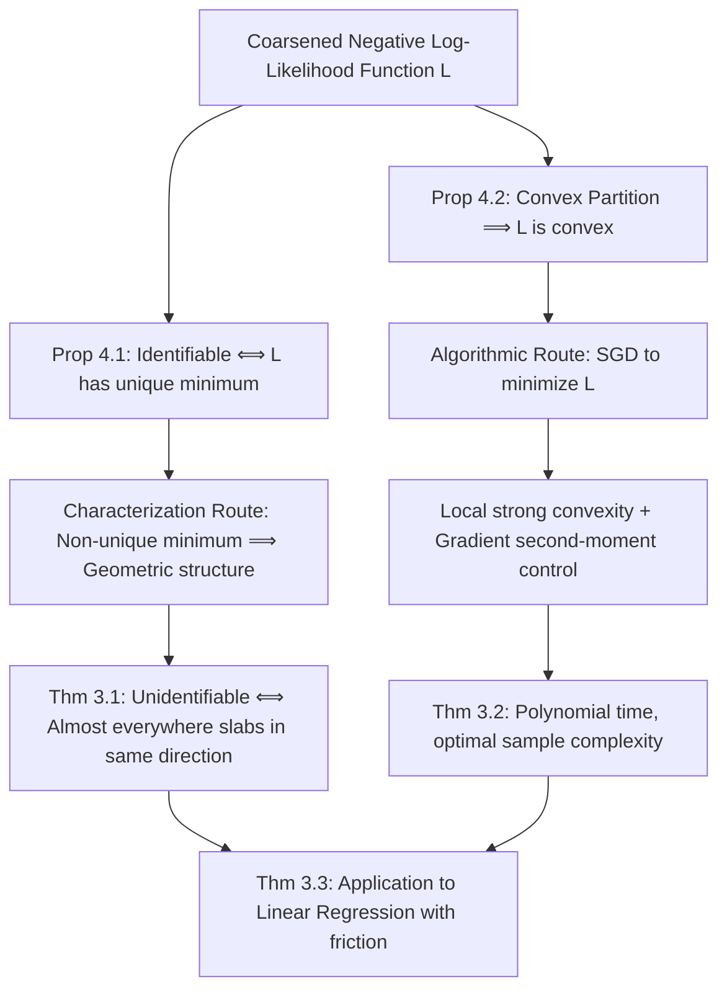

# Mean Estimation from Coarse Data: Characterizations and Efficient Algorithms

**Conference**: ICLR 2026  
**OpenReview**: [https://openreview.net/forum?id=XV8hoBrPJ6](https://openreview.net/forum?id=XV8hoBrPJ6)  
**Code**: TBD  
**Area**: Learning Theory / Statistical Estimation  
**Keywords**: Coarsened data, Gaussian mean estimation, identifiability, convex partition, SGD, log-likelihood  

## TL;DR
The paper resolves two open problems regarding "coarsened Gaussian mean estimation" under convex partitions—providing a geometric characterization of identifiability (unidentifiable $\Longleftrightarrow$ almost all partition sets are "slabs" in the same direction) and offering the first polynomial-time algorithm that matches the optimal sample complexity.

## Background & Motivation

**Background**: In many real-world scenarios, data is neither "fully missing" nor "precisely observed," but rather **coarsened**—the observer only sees a set containing the true value rather than the value itself. This arises from measurement rounding (e.g., a score of 4.7 recorded as 5, knowing only the truth lies in $[4.5, 5.5)$), sensor precision limits, and market frictions in economic systems (where prices do not adjust within an "inertia zone"). Statistics (Heitjan & Rubin, etc.) has established rich modeling theories for "coarsened data," but **computationally efficient algorithms have long been missing**.

**Limitations of Prior Work**: This work focuses on the fundamental task of estimating the Gaussian mean $\mu^\star$ (with identity covariance) from coarsened samples. The prior key work, Fotakis et al. (2021), proved: if the partition contains non-convex sets, estimation is NP-hard, thus requiring a restriction to **convex partitions**. Under the assumption of convexity and identifiability, sample-efficient methods (using $\tilde O(d/\varepsilon^2)$ samples) exist; however, these methods rely on brute-force searches over an $\varepsilon$-net of size $\exp(d/\varepsilon)$, making them **computationally infeasible**. This leaves two open questions.

**Key Challenge**: (Q1) Exactly **which convex partitions** are identifiable (i.e., where $\mu^\star$ can be uniquely recovered)? This is a purely information-theoretic question for which only scattered examples existed without a unified characterization. (Q2) Under identifiable convex partitions, does a **polynomial-time** algorithm exist, or is there a statistical-to-computational gap?

**Goal**: Concurrently answer Q1 and Q2 to clarify the computational complexity boundaries of coarsened Gaussian mean estimation under convex partitions.

**Key Insight**: **[Geometric Characterization + Convex Optimization]** The authors reduce identifiability to whether the coarsened negative log-likelihood $L(\cdot)$ has a unique minimum. They then use optimal transport and variance reduction inequalities to prove that "unidentifiability $\Longleftrightarrow$ almost all sets are slabs in the same direction." Simultaneously, by leveraging the convexity of $L$, they replace brute-force search with Stochastic Gradient Descent (SGD) on the log-likelihood, supported by two key techniques: local strong convexity and gradient second-moment control, resulting in the first polynomial-time algorithm.

## Method

### Overall Architecture
Both paths utilize the **coarsened negative log-likelihood** as the pivot: $L(\mu) := \mathbb{E}_{P\sim N_{\mathcal P}(\mu^\star, I)}[-\log N_{\mathcal P}(\mu, I; P)]$, where $N_{\mathcal P}(\mu, I; P)=\int_P N(\mu, I; x)\,dx$ is the probability that the true value falls into set $P$. Two foundational propositions drive the work: **Prop 4.1** — a partition is identifiable $\Longleftrightarrow$ $L(\cdot)$ has a unique minimum (which is always $\mu^\star$); **Prop 4.2** (Fotakis et al. 2021) — convex partitions make $L(\cdot)$ convex. Thus, "characterizing identifiability" is equivalent to "characterizing when $L$ has a unique minimum," and "efficient estimation" is equivalent to "efficiently finding the minimum of the convex function $L$."

### Key Designs

**1. Identifiability Equivalence from a Likelihood Perspective: From Information Theory to Optimization Geometry.** The starting point is a concise equality: for any $\mu\neq\mu^\star$, $L(\mu)-L(\mu^\star)=\mathrm{KL}(N_{\mathcal P}(\mu^\star)\,\|\,N_{\mathcal P}(\mu))\ge 2\,d_{\mathrm{TV}}(N_{\mathcal P}(\mu^\star), N_{\mathcal P}(\mu))^2$ (utilizing standard log-likelihood properties and Pinsker’s inequality). This implies that $L$ has a second minimum outside $\mu^\star$ if and only if there exists $\mu\neq\mu^\star$ such that the coarsened distributions overlap perfectly (i.e., TV distance is 0, implying unidentifiability). This step translates the pure information-theoretic question of "distinguishability of $\mu^\star$ under infinite samples" into an optimization geometry question of "uniqueness of the minimum of convex function $L$," providing a common language for both research routes.

**2. Slabs in the Same Direction as the Necessary and Sufficient Geometric Feature of Unidentifiability (Thm 3.1).** The authors provide a complete geometric characterization of identifiability: a convex partition $\mathcal P$ is **unidentifiable** with respect to $\mu^\star$ if and only if there exists a unit vector $v$ such that **almost every** $P\in\mathcal P$ is a **slab** in direction $v$—specifically, an unbounded set invariant under translation along $v$ ($x\in P\Rightarrow x+tv\in P,\ \forall t$). Intuitively, "parallel slabs" are clearly unidentifiable (shifting the mean along $v$ does not change the coarsened distribution); the difficult direction is proving **necessity**. The proof follows two steps: first, the convexity of $L$ implies there exists a unit vector $u$ such that $u^\top\nabla^2 L(\mu^\star)u=0$. Substituting into the Hessian formula yields $\mathbb{E}_{P}[\mathrm{Var}_{x\mid x\in P}(u^\top x)]=1$. **Step I** uses the Gaussian variance reduction inequality (Hargé 2004) to show each conditional variance is $\le 1$, so an expectation of 1 forces almost all $P$ to satisfy $\mathrm{Var}_{x\mid x\in P}(\langle u,x\rangle)=1$. **Step II** combines variance reduction (Vempala 2010) to prove that the projection $y=u^\top x$ remains Gaussian after truncation, and then uses the **Prékopa–Leindler inequality** to conclude this only occurs if $P$ is of the form $\{t\cdot u\}\times C_P$ (a slab in direction $u$). The "almost every" restriction is essential—sets with zero volume that are not slabs do not affect the TV distance. This characterization also implies that identifiability is **independent of $\mu^\star$** (it is either identifiable for all $\mu^\star$ or none) and that axis-aligned grids from rounding are naturally identifiable because every box is bounded.

**3. Local Strong Convexity: Translating "Function Optimality" to "Parameter Proximity."** SGD only guarantees finding a $\hat\mu$ such that $L(\hat\mu)\le L(\mu^\star)+\varepsilon$. If $L$ is not strongly convex, $\hat\mu$ could still be far from $\mu^\star$; $L$ is not globally strongly convex in this setting. The paper proves $L$ is **locally strongly convex in a small neighborhood** of $\mu^\star$: leveraging a quantitative version of information preservation ($\alpha$-information preservation, requiring $d_{\mathrm{TV}}(N_{\mathcal P}(\mu^\star), N_{\mathcal P}(\mu))\ge\alpha\, d_{\mathrm{TV}}(N(\mu^\star), N(\mu))$) and a lower bound on the TV distance between two Gaussians, they obtain $L(\mu)-L(\mu^\star)\ge 2\alpha^2 d_{\mathrm{TV}}(N(\mu), N(\mu^\star))^2\ge\min\{\Omega(\alpha^2),\ \Omega(\alpha^2\|\mu-\mu^\star\|_2^2)\}$. This ensures that sub-optimality in function value near $\mu^\star$ translates directly to proximity in parameter space, making the SGD output a valid estimator. Note that projected SGD cannot be run directly because $\mu^\star$ is unknown, so there is no starting point within that small ball.

**4. Gradient Second-Moment Control: Taming Unbounded Sets via Gaussian Concentration.** Implementing SGD also requires bounding the second moment of the stochastic gradient. The gradient is $\nabla L(\mu)=\mu-\mathbb{E}_{P\sim N_{\mathcal P}(\mu^\star)}\mathbb{E}_{N(\mu, I, P)}[x]$, where the inner and outer expectations utilize different means. When the partition includes unbounded sets, these means can be far apart, causing the gradient norm to explode. The key solution utilizes the strong concentration of high-dimensional Gaussians: $m$ i.i.d. standard Gaussian samples fall into an $L_\infty$ box of radius $O(1)$ with extremely high probability. Thus, for each observed set $P$, by taking $R=D+O(\log(md/\delta))$, one can assert with $1-\delta$ confidence that the true value lies in $P\cap B_\infty(0,R)$. Under this high-probability event, each $P$ is replaced by its intersection with the box to construct a **"local partition" of bounded radius** (Appendix B.1). The gradient moment is bounded on this partition to derive the algorithm, and it is finally proven that any convex partition can be **reduced** to this special case (Appendix B.4/B.5). This represents the core algorithmic innovation compared to the brute-force search of Fotakis et al.

## Key Experimental Results

This is a purely theoretical work with no empirical experiments; core theoretical results are summarized below.

### Main Results: Complexity Comparison

| Method | Sample Complexity | Computational Complexity | Scope |
|------|-----------|-----------|---------|
| Fotakis et al. (2021) | $\tilde O(d/\varepsilon^2)$ (when $\alpha=\Omega(1)$) | $\exp(d/\varepsilon)$ brute-force search, **inefficient** | Convex + $\alpha$-identifiable |
| **Ours (Thm 3.2)** | $\tilde O\!\big(\tfrac{dD^2}{\alpha^4}+\tfrac{d}{\alpha^4\varepsilon^2}\big)$ | **Polynomial time** (w.r.t. $m$ and number of bits) | Convex + $\alpha$-identifiable |

When $\alpha=\Omega(1)$ and given a warm start $D=O(1)$, this work achieves an $\varepsilon$-accurate estimate in $\tilde O(d/\varepsilon^2)$ time. The **sample complexity is on par with Fotakis et al. and is computationally efficient**, proving no statistical-to-computational gap exists for this problem.

### Theoretical Contribution List

| Result | Content | Open Problem Solved |
|------|------|---------------|
| Thm 3.1 | Convex partition unidentifiable $\Longleftrightarrow$ almost everywhere slabs in same direction | Q1 (Identifiability characterization) |
| Thm 3.2 | First polynomial-time algorithm matching optimal sample complexity | Q2 (Computational efficiency) |
| Thm 3.3 | Linear regression with market friction: $\|\hat w-w^\star\|_2^2\le\tilde O(d/(\alpha^4 n))$ | Economic application of the algorithm |

### Key Findings
- **Identifiability = Geometric Absence of Slabs**: Determining if a convex partition is identifiable reduces to checking if a uniform direction exists such that almost all sets are translation-invariant along that direction; axis-aligned grids (rounding) are naturally identifiable.
- **Identifiability is Mean-Independent**: The difficulty stems purely from the coarsening structure rather than the specific Gaussian distribution.
- **Identifiable $\neq$ Sample Efficient**: Pure identifiability is only an information-theoretic guarantee; quantitative estimation requires the stronger $\alpha$-information preservation condition.
- **Extensibility**: The algorithm generalizes directly to the "mixtures of partitions" model with unchanged complexity.

## Highlights & Insights
- **Complete Closure**: Resolves the two major open problems (Q1 characterization + Q2 efficiency) left by Fotakis et al. (2021) in one go, establishing the complexity boundaries for convex partitions.
- **Transferable Methodology**: The identifiability proof combines **optimal transport + variance reduction inequalities (Hargé/Vempala) + Prékopa–Leindler inequality**. The authors suggest this toolset can be generalized to other coarsened estimation problems.
- **Unified Perspective**: Identifiability and convex optimization are unified through the log-likelihood function ("Unique minimum $\Longleftrightarrow$ Identifiable"), an elegant structural contribution.
- **Modern Extension of Classic Problems**: Generalizes the 1D Sheppard’s correction (1897) to high-dimensional, non-uniform convex partitions and completes the statistical limit characterization of identifiability.
- **Practical Application**: Formulates "linear regression under market friction" proposed by Rosett in 1959 as a coarsening problem, providing sample- and computationally-efficient algorithms that bridge machine learning and econometrics.

## Limitations & Future Work
- **Restricted to Identity Covariance and Convex Partitions**: The algorithm only covers $N(\mu^\star, I)$ and convex partitions; non-convex partitions are known to be NP-hard, while efficient estimation for unknown covariance or general Gaussian families remains unexplored.
- **Dependence on Warm Start and $\alpha$**: Complexity scales with $1/\alpha^4$ and requires a prior bound $\|\mu^\star\|_\infty\le D$; overhead may be significant when $\alpha$ is tiny or no warm start is available.
- **Purely Theoretical**: No experimental validation on synthetic or real data is provided; the actual performance and numerical stability of the algorithm under finite samples remain unknown.
- **Limited to Mean Estimation**: Only addresses first-order moments; coarsened estimation for covariance, higher-order moments, or parameters of general distributions remains an open direction. The authors' "optimal transport + variance reduction" toolchain serves as a starting point.

## Related Work & Insights
- **Learning from Coarsened Data**: Inherits from classical statistics (Heitjan & Rubin) and directly addresses Fotakis et al. (2021). Diakonikolas et al. (2025) provide SQ lower bounds under coarse labels. Kalavasis et al. (2025) frame the Roy (1951) model as a non-convex but structured coarsening problem.
- **Sheppard’s Correction**: This work is a modern extension to high-dimensional, non-uniform convex partitions.
- **Missing vs. Coarsened Data**: Coarsening is an intermediate state between "fully observed" and "fully missing"; this paper clearly defines the inherent differences.
- **Inspiration**: For any task where one only observes a set containing the truth (rounding, binning, inertia zones), one can use the paradigm: "Unique minimum of log-likelihood $\Longleftrightarrow$ Identifiable + SGD Solver + Gaussian Concentration for gradient bounds." Geometrically, the existence of a uniform translation-invariant direction is a quick intuition for parameter recoverability.

## Rating
- **Novelty**: ⭐⭐⭐⭐⭐ Completely solves two recognized open problems; the geometric characterization of identifiability and the "optimal transport + variance reduction + Prékopa–Leindler" toolset are highly original.
- **Experimental Thoroughness**: ⭐⭐⭐ Purely theoretical; theorems and complexity analyses are rigorous and complete, but lack empirical validation.
- **Writing Quality**: ⭐⭐⭐⭐⭐ Clear motivation, natural transition from information theory to optimization geometry, and a well-structured/readable proof overview.
- **Value**: ⭐⭐⭐⭐ Establishes complexity boundaries for a fundamental statistical problem. The toolchain is transferable and connects ML to practical econometric applications, offering lasting value to the learning theory community.

<!-- RELATED:START -->

## Related Papers

- [\[ICLR 2026\] Revisiting Active Sequential Prediction-Powered Mean Estimation](revisiting_active_sequential_prediction-powered_mean_estimation.md)
- [\[ICLR 2026\] Efficient Testing for Correlation Clustering: Improved Algorithms and Optimal Bounds](efficient_testing_for_correlation_clustering_improved_algorithms_and_optimal_bou.md)
- [\[ICLR 2026\] Efficient Best-of-Both-Worlds Algorithms for Contextual Combinatorial Semi-Bandits](efficient_best-of-both-worlds_algorithms_for_contextual_combinatorial_semi-bandi.md)
- [\[ICLR 2026\] Tight Bounds for Schrödinger Potential Estimation in Unpaired Data Translation](tight_bounds_for_schrodinger_potential_estimation_in_unpaired_data_translation.md)
- [\[ICLR 2026\] Efficient Turing Machine Simulation with Transformers](efficient_turing_machine_simulation_with_transformers.md)

<!-- RELATED:END -->
