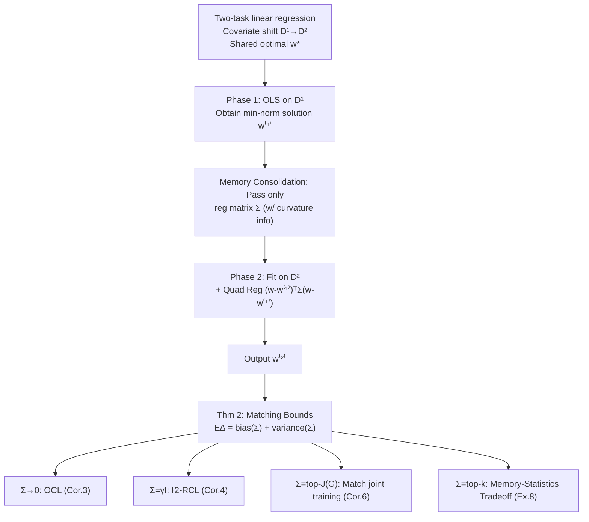

# Memory-Statistics Tradeoff in Continual Learning with Structural Regularization

**Conference**: ICLR 2026  
**OpenReview**: [https://openreview.net/forum?id=qfEqXJnlB4](https://openreview.net/forum?id=qfEqXJnlB4)  
**Code**: To be confirmed  
**Area**: Learning Theory / Continual Learning  
**Keywords**: Continual Learning, Catastrophic Forgetting, Structural Regularization, Linear Regression, Random Design, Excess Risk, Memory-Statistics Tradeoff

## TL;DR
Under a random design for two-task linear regression, this paper provides matching upper and lower bounds for excess risk for the "generalized $\ell_2$ structural regularization based on previous task Hessian" algorithm. It reveals for the first time theoretically that a provable tradeoff exists in continual learning between **memory complexity (rank/number of vectors of the regularization matrix)** and statistical efficiency: using more vectors to remember the old task curvature allows approaching joint training accuracy, while using fewer leads to catastrophic forgetting.

## Background & Motivation

**Background**: Continual Learning (CL) allows models to learn a sequence of tasks sequentially. However, limited by long-term memory, an agent cannot store all old data for joint training. Structural regularization (EWC, MAS, SI, etc.) is a mainstream category of methods to mitigate catastrophic forgetting: it stores a PSD importance matrix (approximating the Hessian/Fisher of old task parameters) and uses a quadratic regularization term to constrain "important parameters" from deviating too much when learning new tasks.

**Limitations of Prior Work**: Storing a full importance matrix is $O(d^2)$, which is unaffordable for neural networks. Thus, practical applications use diagonal approximations, K-FAC, or sketching for compression. Empirically, it is observed that "more accurate approximation (more memory) $\to$ better CL performance," but this is only an empirical rule—**mathematically, no one has explicitly linked "memory overhead" to "statistical performance."** Existing CL theories (Evron 2022, Li 2023, Zhao 2024) either analyze specific regularizers with fixed memory or remain at the optimization level, or make overly strong assumptions (fixed design) about input data, failing to characterize the randomness of input distributions.

**Key Challenge**: Remembering more is more accurate, but memory is expensive. Is this "memory-statistics" tradeoff an empirical coincidence or a provable quantitative bound? Existing theories cannot answer this.

**Goal**: Under two-task linear regression with covariate shift and random design (one-hot / Gaussian), provide **matching upper and lower bounds** for the excess risk of structural regularization CL algorithms, incorporating memory size as an explicit variable in the risk formula.

**Core Idea**: **[Random Design + Generalized Regularizer]** The paper proposes a unified Generalized $\ell_2$ Regularized Continual Learning (GRCL), using a user-specified PSD matrix $\Sigma$ that commutes with the data covariance as a regularizer. When $\Sigma \to 0$, it reduces to Ordinary CL (OCL); when $\Sigma = \gamma I$, it reduces to $\ell_2$-RCL. By defining the "number of distinct eigenvectors" of $\Sigma$ as the memory complexity, the risk bound becomes a function of $\Sigma$, and the tradeoff naturally emerges.

## Method

### Overall Architecture
The paper does not propose a new algorithm but builds a theoretical analysis framework: setting up a random design for two-task linear regression under covariate shift, unifying OCL / $\ell_2$-RCL / joint training as special cases of "Generalized $\ell_2$ Regularized CL (GRCL)". It then provides matching upper and lower bounds for both bias and variance terms of the joint excess risk $\Delta(w^{(2)}) = R(w^{(2)}) - \min R$ for GRCL. From these bounds, it derives three things: when OCL/$\ell_2$-RCL suffer catastrophic forgetting, when GRCL can match joint training, and the quantitative tradeoff curve between memory and risk.

### Key Designs

**1. Problem Setting: Random design under covariate shift + shared optima to include "input randomness" in forgetting analysis.** Each task has $n$ data points from distributions $D^{(1)}, D^{(2)}$ with covariance matrices $G = \mathbb{E}_{D^{(1)}}[xx^\top]$ and $H = \mathbb{E}_{D^{(2)}}[xx^\top]$, assuming they are commutable (diagonal without loss of generality). A key realistic assumption is replacing the fixed design of previous work with a **random design** (stochastic sampling of input vectors)—this allows the "randomness of input distribution" to be included in the characterization of forgetting. It further assumes both tasks share an optimal parameter $w^*$ (a mild assumption as over-parameterized networks can solve multiple tasks simultaneously), focusing analysis on covariate shift rather than label conflict. The metric is the joint excess risk $\Delta(w^{(2)}) = R_1(w^{(2)}) + R_2(w^{(2)}) - \min R$.

**2. GRCL: Unifying all regularized CL with an adjustable PSD matrix $\Sigma$ to parameterize "memory".** A two-phase process: Phase 1 performs ordinary least squares on $D^{(1)}$ to get the min-norm estimate $w^{(1)}$; memory consolidation phase passes only the regularization matrix $\Sigma$ (with curvature info); Phase 2 fits $D^{(2)}$ while adding quadratic regularization $(w - w^{(1)})^\top \Sigma (w - w^{(1)})$ to constrain the model from deviating from the old solution. The beauty is that $\Sigma$ acts as both a regularizer and a "memory ledger": **memory complexity is defined as the number of distinct eigenvectors in $\Sigma$** (i.e., the rank $k$ of $\Sigma$). When $\Sigma \to 0$, it degrades to OCL passing one vector $w^{(1)}$; when $\Sigma = \gamma I$, it degrades to $\ell_2$-RCL passing one additional scalar $\gamma$. Thus, the entire "low memory $\to$ high memory" spectrum is covered by one formula.

**3. Matching Upper and Lower Bounds (Theorem 2): Writing bias/variance as explicit functions of $\Sigma$ and $(G, H, \sigma^2, n)$.** Under a one-hot design (inputs sampled from natural basis, $P(x^{(1)} = e_i) = \mu_i$, $P(x^{(2)} = e_i) = \lambda_i$), it proves $\mathbb{E}\Delta(w^{(2)}) \asymp \text{bias} + \text{variance}$, where
$$\text{bias} \asymp \big\langle (G+H)(I-G)^n\big(\Sigma^2(\Sigma+H)^{-2}+(I-H)^n\big),\, w^*w^{*\top}\big\rangle,$$
and the variance term is also written as an inner product involving $\Sigma^2(\Sigma+H)^{-2}$. "Matching upper and lower bounds" means this is not a loose estimate but a characterization tight up to constant factors—exactly how serious forgetting is and how much a regularizer can recover are fixed by this formula. This is the master theorem for all subsequent corollaries.

**4. Three corollaries to explain the tradeoff: Failure, Matching, and the Middle Ground.** ① **Catastrophic Forgetting (Cor. 3/4 + Ex. 5)**: OCL has $o(n)$ error only if $\sum_{i\in K}\mu_i/\lambda_i + n^2\sum_{i\in J\cap K^c}\mu_i\lambda_i = o(n)$; when eigenvalues of $G, H$ are mismatched on dominant features (e.g., $\mu_1 = 1, \lambda_1 = 1/n$), $\mathbb{E}\Delta = \Omega(1)$ level constant forgetting occurs, and counterexamples exist that $\ell_2$-RCL cannot solve. ② **Matching Joint Training (Cor. 6)**: By taking $\Sigma = \mathrm{diag}(\gamma_i)$ with $\gamma_i = \mu_i$ for $\mu_i \ge 1/n$ and 0 otherwise (using a regularizer of size $|J|$ to capture all top features of $G$ greater than $1/n$), one obtains $\mathbb{E}\Delta(w^{(2)}) \lesssim \mathbb{E}\Delta(w_{\text{joint}})$, completely eliminating forgetting. ③ **Memory-Statistics Tradeoff (Ex. 8)**: When the spectrum of $G$ follows a power law $\mu_i = i^{-\alpha}$, using top-$k$ regularization yields:
$$\mathbb{E}\Delta(w^{(2)}) \lesssim \mathbb{E}\Delta(w_{\text{joint}}) \cdot \Big(1 + \frac{n}{k^\alpha}\Big),$$
meaning the risk ratio decreases with memory $k$ at a rate of $n/k^\alpha$, matching joint training when $k = \sqrt[\alpha]{n}$—this is the provable quantitative curve of "remembering more curvature reduces forgetting."

## Key Experimental Results

Numerical experiments validate the theory under a Gaussian design ($x^{(1)} = G^{1/2}z^{(1)}$, $z \sim \mathcal{N}(0, I)$). Tasks are taken from Wu 2022 / Li 2023, dimension $d = 200$, with empirical means from 20 independent runs per point.

### Main Results: Convergence with Sample Size (Figure 1a)

| Algorithm | Memory | Excess Risk with Increasing $n$ |
| :--- | :--- | :--- |
| Joint Training (JL) | Full | Decreases continuously with $n$ (Lower bound benchmark) |
| OCL | Only 1 vector $w^{(1)}$ | **Stuck at constant** (Catastrophic forgetting) |
| GRCL, $k=1$ | 1 eigenvector | Partially mitigated, still higher than JL |
| GRCL, $k=5$ | 5 eigenvectors | **Matches JL convergence rate** |

### Ablation Study: Variation with Memory Size (Figure 1b, fixed $n=5000$)

| Memory Size $k$ | GRCL Excess Risk |
| :--- | :--- |
| Small (near OCL) | High, near constant forgetting of OCL |
| Medium | Monotonically decreases with $k$ |
| $k \le 15$ | **Reaches joint training performance** |

### Key Findings
- **Forgetting is a direct consequence of "insufficient memory"**: OCL only passes one vector and suffers constant-level forgetting when dominant features mismatch; this aligns perfectly with theoretical Ex. 5/Ex. 7.
- **A provable tradeoff curve exists**: Larger memory $k$ leads to lower risk, and the decay rate $n/k^\alpha$ is determined by the power-law index $\alpha$ of the data spectrum—the faster the spectrum decays (larger $\alpha$), the less memory is needed to match joint training.
- **Structural regularization can approach the "cheating upper bound"**: GRCL matches joint training (which has access to both tasks) using memory $k \le 15$ (far less than $d = 200$), proving that curvature-aware regularization is key for CL.

## Highlights & Insights
- **First theoretical work to put "memory" into the CL risk formula**: Previous CL theories analyzed specific regularizers with fixed memory; this paper uses the rank $k$ of $\Sigma$ as an explicit variable, upgrading the "memory-statistics tradeoff" from empirical observation to provable law.
- **Matching upper and lower bounds rather than one-sided estimates**: Since both bias and variance are given tight bounds up to constants, it can strictly distinguish between "OCL must fail" and "GRCL can be saved," rather than vaguely saying "regularization helps."
- **Unified Perspective**: OCL, $\ell_2$-RCL, and joint training are all special cases of GRCL under different $\Sigma$, covering the entire memory spectrum with one theory.
- **Actionable Design Insights**: The theory directly suggests "which directions to remember"—capturing top features in $G$ larger than $1/n$ (i.e., $|J|$ principal curvature directions) eliminates forgetting, providing principled guidance for where to spend memory in practice.
- **Additional Gaussian Design Insight**: Extending non-regularized results to Gaussian designs reveals that forgetting stems not only from dominant feature differences but also that **slight differences in tail features can trigger catastrophic forgetting**, a phenomenon not visible in one-hot settings.

## Limitations & Future Work
- **Limited to two-task linear regression**: The core theorem (matching bounds for GRCL in Thm 2) only holds for two-task linear regression under one-hot design; full bounds for GRCL under multi-task and Gaussian designs were not provided due to technical barriers (only OCL bounds were added).
- **Strong Structural Assumptions**: Requires $G, H$ to commute, shared optima $w^*$, and well-specified Gaussian noise with homoscedasticity—while the authors argue these are mild and extensible, they remain far from real-world neural networks.
- **Link to Neural Networks via NTK**: Extensions to general neural networks remain in the NTK regime, without touching the forgetting during feature learning stages.
- **Future Work**: Generalizing the memory-statistics tradeoff to other CL paradigms like replay (episodic memory size) and projection (rank of GPM subspace); the authors identify this as an exciting open direction, along with tightening bounds for Gaussian / multi-task / real non-linear networks.

## Related Work & Insights
- **Structural Regularization CL**: EWC (Kirkpatrick 2017), MAS (Aljundi 2018), SI, K-FAC (Ritter 2018), sketching (Li 2023)—this paper provides a unified theoretical explanation for this class of methods and explains the empirical rule "more accurate approximation is better" as a memory-statistical efficiency tradeoff.
- **CL Theory**: Evron 2022 (Fixed design, only optimization level), Li 2023 (Fixed design, two-task $\ell_2$-RCL), Zhao 2024 (Fixed design statistical performance)—this paper advances this line by using random design to include input randomness and explicitly characterizing the memory-performance relationship.
- **Benign Overfitting / Random Design Regression**: Analysis tools from Hsu 2012, Bartlett 2020, Zou 2021, and Wu 2022 are borrowed to characterize CL bias-variance; the insight is that "forgetting in CL" can be expressed precisely in the language of spectral analysis for over-parameterized linear regression.
- **Insights**: For practitioners, the principle "memory should be spent on the top principal curvature directions of data covariance" is directly transferable; for theorists, explicitly parameterizing "memory" as the rank of the regularizer is a reusable paradigm for studying tradeoffs in other CL settings.

## Rating
- **Novelty**: ⭐⭐⭐⭐⭐ First to include memory complexity in the CL excess risk formula and provide matching bounds, elevating an empirical observation to a provable law.
- **Experimental Thoroughness**: ⭐⭐⭐ As a theory paper, the numerical experiments (Fig. 1a/b) cleanly validate the two main conclusions (convergence and tradeoff), but the scale is small ($d = 200$, synthetic data); real CL dataset results are relegated to the appendix and have limited persuasiveness.
- **Writing Quality**: ⭐⭐⭐⭐ The logical chain from definitions to theorems to corollaries to counterexamples is clear; the unified perspective of OCL/RCL/GRCL is well-organized. However, the density of formulas and symbols creates a high barrier for non-theoretical readers.
- **Value**: ⭐⭐⭐⭐ Provides a principled explanation and design guidance for structural regularization CL methods and opens up the "memory-performance tradeoff" paradigm for other CL approaches like replay/projection. Theoretical value is high.

<!-- RELATED:START -->

## Related Papers

- [\[ICLR 2026\] Variational Deep Learning via Implicit Regularization](variational_deep_learning_via_implicit_regularization.md)
- [\[ICLR 2026\] Understanding the Dynamics of Forgetting and Generalization in Continual Learning via the Neural Tangent Kernel](understanding_the_dynamics_of_forgetting_and_generalization_in_continual_learnin.md)
- [\[ICLR 2026\] PAC-Bayes Bounds for Cumulative Loss in Continual Learning](pac-bayes_bounds_for_cumulative_loss_in_continual_learning.md)
- [\[ICLR 2026\] Statistical and Structural Identifiability in Representation Learning](statistical_and_structural_identifiability_in_representation_learning.md)
- [\[ICLR 2026\] Multi-Synaptic Cooperation: A Bio-Inspired Framework for Robust and Scalable Continual Learning](multi-synaptic_cooperation_a_bio-inspired_framework_for_robust_and_scalable_cont.md)

<!-- RELATED:END -->
