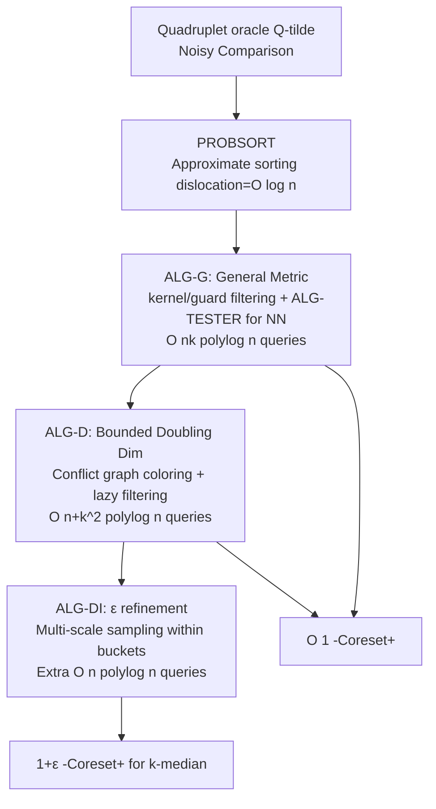

# Metric $k$-Clustering using only Weak Comparison Oracles

**Conference**: ICLR 2026  
**OpenReview**: [https://openreview.net/forum?id=KmMEQOtXAy](https://openreview.net/forum?id=KmMEQOtXAy)  
**Code**: To be confirmed  
**Area**: learning theory  
**Keywords**: clustering, k-median/k-means, coreset, quadruplet comparison oracle, noisy comparison, doubling dimension, query complexity  

## TL;DR
Using only a noisy "quadruplet comparison oracle" (answering "is A closer to B, or C closer to D?") without any real distances, this work constructs a constant-approximation Coreset+ for $k$-median/$k$-means with $O(nk\,\mathrm{polylog}\,n)$ queries. The approximation ratio is further improved to $1+\varepsilon$ under bounded doubling dimension.

## Background & Motivation
**Background**: Classic $k$-clustering ($k$-center / $k$-median / $k$-means) assumes precise distance calculations between any two points. However, for complex data like images or text, designing a distance function that reflects "semantic similarity" is difficult, and even if it exists, pairwise evaluation can be computationally expensive. This led to research using **oracles as distance substitutes**: oracles abstract machine learning models or human feedback, providing only partial information about relative distances.

**Limitations of Prior Work**: Under the pure comparison model (R-model, only quadruplet oracles), Galhotra et al. (2024) proved that even if the oracle is noise-free, $k$-median/$k$-means cannot achieve any $o(n)$ approximation—comparison information alone is insufficient. To bypass this impossibility, subsequent works (Galhotra 2024, Raychaudhury 2025) introduced the **RM-model**, which allows an additional "strong oracle" that returns exact distances.

**Key Challenge**: In practice, a strong distance oracle often **does not exist** or is prohibitively expensive (calculating exact distance itself might be NP-hard), and existing algorithms must **interleave** distance and comparison queries, creating a computational bottleneck.

**Goal**: To completely eliminate the distance oracle and ask, "with only a noisy quadruplet oracle, what is the best possible clustering performance?". The authors first prove a lower bound in the appendix—any $o(n)$ approximation algorithm in the R-model requires at least $2k-1$ centers, implying that "exactly $k$ centers" is impossible, necessitating a relaxation of the number of centers.

**Key Insight**: **Bridging "comparison" and "distance" via approximate sorting**. Since a quadruplet oracle is essentially a noisy comparator, the authors integrate noisy sorting (dislocation $O(\log n)$) with a recursive sampling coreset framework. This outputs $O(k\,\mathrm{polylog}\,n)$ centers + a mapping (defined as **Coreset+**) such that the total clustering cost is within a constant factor of the optimum, using only quadruplet comparisons throughout.

The difficulty lies in the fact that in the R-model, one cannot even directly determine "which sample is closest to $v$." Noisy sorting only ensures rank is roughly correct, with no guarantee on the ratio of true distances for misaligned pairs. This paper replaces every distance dependency in the classic coreset framework with reliable comparison primitives under extremely weak information.

## Method

### Overall Architecture
The goal is to construct a **Coreset+**: a center set $C\subseteq V$ ($|C|=O(k\,\mathrm{polylog}\,n)$) and a mapping $M:V\to C$ such that $\sum_{v\in V} d(v,M(v))\le O(1)\cdot \mathrm{OPT}^p_k$. The skeleton is a classic recursive sampling process: each round samples $\Theta(k\,\mathrm{polylog}\,n)$ points $S$, sorts points based on "nearest neighbor distance to $S$," discards a constant fraction of the closest points, and recurses on the remainder. The difficulty is that in the R-model, one can neither compute nearest neighbors nor sort precisely. The authors utilize three progressive algorithms to execute this flow using only noisy comparisons.

### Key Designs

**1. PROBSORT and ALG-TESTER: Converting Noisy Comparisons to Usable "Distance Discrimination."** Sorting directly with a quadruplet oracle only yields an approximate order with **maximum dislocation $O(\log n)$** (Lemma 2.1, derived from Geissmann et al. 2025; $O(n\log n)$ queries when $\phi<1/4$). This ensures ranks are roughly correct but provides no guarantee on which of two misaligned edges is actually shorter. The key observation is that when specific structural conditions are met (both edges are longer than their respective kernel radii $r_s$, and the smaller kernel is known), one can design ALG-TESTER. This uses several comparisons against the smaller kernel to determine if $d(s_1,v_1)<d(s_2,v_2)$, which is correct with high probability when distances differ by more than 2x. This effectively **simulates a quadruplet oracle with adversarial noise $\mu=1$**—which can then be used by ADVSORT (a QuickSort variant) to get an $O(1)$-sorted sequence. ALG-TESTER thus becomes the core mechanism for upgrading "weak probabilistic comparisons" into "strong constant-approximation sorting."

**2. KERNEL/GUARD Dual-Sampling Filtering: Locating "Neighbor Anchors" Without Distances.** ALG-G samples two sets in each round: $S^{(1)}_i$ (size $\Theta(k\log^2 n)$) and $S^{(2)}_i$ (size $\Theta(k\log^3 n)$). For each $s \in S^{(1)}_i$, PROBSORT is used to sort $E(S^{(1)}_i,S^{(2)}_i)$, and two sets of $\Theta(\log n)$ points are extracted: **kernel** $\mathrm{KERNEL}_i(s)$ and **guard** $\mathrm{GUARD}_i(s)$. These satisfy the condition that the kernel is strictly closer to $s$ than the guard, and both are rank-adjacent to $s$. Then, for each point $v$ to be processed, a "proximity count" is calculated: $\mathrm{PCOUNT}_s(v)=\sum_{g\in\mathrm{GUARD}_i(s)}\mathbf{1}\{\tilde Q(\{s,v\},\{s,g\})\text{ judges }d(s,v)\le d(s,g)\}$. Points that are too close to any sample (count $> 1/2$) are filtered. This filtering ensures that at least $\tfrac35|V_i|$ points are retained with high probability, and all remaining points are further than the kernel radius $r_s$. This satisfies the trigger conditions for ALG-TESTER, allowing ANN (Approximate Nearest Neighbor) search to work like an adversarial oracle, finding a 4-approximate nearest neighbor for each point. ALG-G achieves an $O(1)$-Coreset+ with $O(nk\,\mathrm{polylog}\,n)$ queries (Theorem 3.1).

**3. Conflict Graph Coloring + Lazy Filtering: Reducing Queries from $nk$ to $n+k^2$ in Low Dimensions.** ALG-D targets bounded doubling dimension. Instead of global filtering and NN search for all points (which costs $O(nk)$), it constructs a conflict graph $G_i$ for $S^{(1)}_i$ where edges represent points being "too close." Since $G_i$ is proven to be $O(\log n)$-degenerate, greedy coloring splits $S^{(1)}_i$ into $\chi_i$ color classes where intra-class points are far apart. The NN data structure from Raychaudhury et al. (2025) is reused for each color class, with the oracle simulated by ALG-TESTER. To avoid misjudging "too close" points, **lazy filtering** is employed: proximity is calculated only when ALG-TESTER is invoked, and points are discarded if found to be too close, saving expensive global filtering. This requires only $O((n+k^2)\,\mathrm{polylog}\,n)$ queries (Theorem 3.2).

**4. Multi-scale Bucket Sampling: Refining Constant Approximation to $1+\varepsilon$.** ALG-DI takes the Coreset+ from ALG-G/ALG-D. For each center $s$ and its mapped set $U_s$, points are geometrically bucketed by distance to $s$ (outer radius doubling each time, $O(\log n)$ buckets). In low dimensions, hitting every bucket improves the approximation, but precise bucketing is impossible without distances. The authors instead use **multi-step suffix sampling** on an $O(1)$-sorted sequence (extracted from ANN sorting without extra queries): sampling from $U_s$, then the last half, then the last quarter, and so on. This hits all relevant distance scales with high probability, followed by reconstructing the mapping $M^+$ via PROBSORT. With an additional $O(n\,\mathrm{polylog}\,n)$ queries, an $\varepsilon$-Coreset+ for $k$-median is obtained (Theorem 3.3).

## Key Experimental Results
This is a theoretical paper; experiments serve as a "proof of concept" in Python. Probabilistic noise $\phi=0.15$ is simulated (oracle is correct with 0.85 probability). The algorithm and baseline can only access data through the oracle. Baseline = applying the generic algorithm but **unconditionally trusting** every oracle answer.

### Main Results: Synthetic Data ($k=5$, $10^4$ points)

| Method | $k$-means Cost |
|------|---------------|
| Optimal (k-means++ on ground truth) | $2.9\times10^4$ |
| **Ours** | $3.1\times10^4$ (approx. 7% deviation from optimal) |
| Baseline | $4\times10^5$ (>1200% over optimal) |

The constructed coreset contains only **187 points**, a compression of approximately 98% from the original $10^4$ points.

### Main Results: Real Data (Adult ~50k→2k sample; Credit ~30k→2k sample)

| Setting | Ours | Baseline |
|------|------|----------|
| Varying $k\in\{4,...,8\}$ | Consistently close to optimal | 2.5–4x higher than Ours |
| Varying noise $\phi\in\{0.05,...,0.25\}$ | Cost is nearly independent of $\phi$ | Cost increases significantly with $\phi$ |

### Key Findings
- **Robustness to Noise**: The cost of the proposed method remains stable regardless of $\phi$, consistent with theoretical guarantees; the baseline fails rapidly under high noise due to blind trust in the oracle.
- **Mapping Quality is Central**: Experiments verify the "point-to-center" mapping of Coreset+. Once the mapping is correct, the NP-hard clustering burden is transferred to a few hundred representative points.
- **Intuitive Visualization**: Centers found by Ours nearly overlap with true centers on synthetic data, while the baseline misses clusters due to incorrect mapping.
- **Significant Compression**: Reducing $10^4$ points to 187 coreset points (~98% reduction) allows subsequent clustering to run solely on this small set.

## Highlights & Insights
- **Removing the Distance Oracle**: Previously, it was believed that $k$-median/$k$-means in the R-model required an exact distance oracle. This work proves for the first time that constant approximation is possible using only noisy quad-comparisons (by relaxing to $O(k\,\mathrm{polylog}\,n)$ centers, justified by a $2k-1$ lower bound).
- **Bridge between Approximate Sorting and Adversarial Oracles**: ALG-TESTER uses kernel/guard structures to locally "upgrade" weak probabilistic comparisons into adversarial noise oracles, which are then used by ADVSORT to obtain constant-approximation sorting—a highly transferable strategy.
- **Alignment with LLM Interfaces**: Quadruplet queries ("Is A more like B or C more like D?") are naturally suited for LLMs, embedding services, or crowdsourcing. This paper provides a paradigm for integrating low-cost noisy oracles into scalable clustering.
- **Near-Optimal Query Complexity**: $O(nk\,\mathrm{polylog}\,n)$ for general metrics and $O((n+k^2)\,\mathrm{polylog}\,n)$ for low dimensions are within logarithmic factors of the best RM-model results that require distance oracles.

## Limitations & Future Work
- **Not Exactly $k$ Centers**: The output is $O(k\,\mathrm{polylog}\,n)$ centers + mapping. Obtaining exactly $k$ centers still requires running k-means++ on the weighted coreset (which assumed distance availability in experiments).
- **Weak Experimental Validation**: Experiments are proof-of-concept level, lacking real LLM oracles or large-scale/high-dimensional tests. The impact of constant factors in $\mathrm{polylog}\,n$ was not evaluated.
- **Strong Assumptions on Persistence**: The oracle assumes independent noise and fixed answers for specific edges (persistence) with $\phi<1/4$, which might not hold for real LLMs.
- **Dimensionality and Constant Factors**: Improvement in doubling dimension assumes the dimension is constant. Large constants hidden in $\mathrm{polylog}\,n$ might overwhelm theoretical gains in high dimensions.
- **Future Work**: Generalizing to hierarchical clustering, sum-of-radii, MST, and extending to triplet oracles or other error models.

## Related Work & Insights
- **R-model Origins**: Addanki et al. (2021) first studied $k$-center under pure comparisons (requiring optimal cluster size $\Omega(\sqrt n)$).
- **Impossibility and RM-model**: Galhotra et al. (2024) proved the impossibility of $O(1)$ approximation without distances, introducing the weak-strong oracle framework. Raychaudhury et al. (2025) reduced strong oracle calls to $O(\mathrm{polylog}\,n)$ with $O((n+k^2)\,\mathrm{polylog}\,n)$ comparisons—this work completes the transition by removing the strong oracle entirely.
- **Noisy Sorting**: Works by Braverman-Mossel and Geissmann provide the foundation for PROBSORT ($O(\log n)$ dislocation with $O(n \log n)$ queries for $\phi < 1/4$).
- **Insight**: When downstream tasks (clustering, sorting, retrieval) only require "relative order" rather than absolute values, using noisy comparison oracles + approximate sorting primitives provides a general template for connecting expensive LLMs/human feedback to classical algorithms.

## Rating
- **Novelty**: ⭐⭐⭐⭐⭐ First constant approximation for $k$-median/$k$-means in the pure noisy comparison model, eliminating the distance oracle previously thought necessary.
- **Experimental Thoroughness**: ⭐⭐ Proof-of-concept only; lacks real-world oracles and large-scale validation.
- **Writing Quality**: ⭐⭐⭐⭐ Technical overview clearly explains the three-layer algorithm flow; notation is rigorous.
- **Value**: ⭐⭐⭐⭐ Provides a guaranteed algorithmic paradigm for "low-cost noisy comparisons $\rightarrow$ scalable clustering," applicable to various order-based tasks.

<!-- RELATED:START -->

## Related Papers

- [\[ICLR 2026\] Does Weak-to-strong Generalization Happen under Spurious Correlations?](does_weak-to-strong_generalization_happen_under_spurious_correlations.md)
- [\[ICLR 2026\] Bi-Criteria Metric Distortion](bi-criteria_metric_distortion.md)
- [\[ICLR 2026\] Strong Correlations Induce Cause Only Predictions in Transformer Training](strong_correlations_induce_cause_only_predictions_in_transformer_training.md)
- [\[ICLR 2026\] Sublinear Spectral Clustering Oracle with Little Memory](sublinear_spectral_clustering_oracle_with_little_memory.md)
- [\[ICML 2026\] Matroid Algorithms Under Size-Sensitive Independence Oracles](../../ICML2026/learning_theory/matroid_algorithms_under_size-sensitive_independence_oracles.md)

<!-- RELATED:END -->
