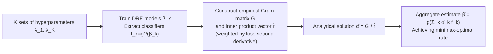

# Minimax-Optimal Aggregation for Density Ratio Estimation

**Conference**: ICLR 2026  
**OpenReview**: [https://openreview.net/forum?id=gDxJK8yvZU](https://openreview.net/forum?id=gDxJK8yvZU)  
**Code**: To be confirmed  
**Area**: Learning Theory / Density Ratio Estimation  
**Keywords**: density ratio estimation, model aggregation, minimax-optimal rates, hyperparameter selection, RKHS, self-concordant loss, domain adaptation  

## TL;DR
Addressing the extreme sensitivity of Density Ratio Estimation (DRE) to hyperparameters, this paper proposes an algorithm that **linearly aggregates** models trained with various hyperparameters. By minimizing an analytical upper bound of the Bregman divergence, the method achieves minimax-optimal convergence rates **without prior knowledge of the density ratio smoothness**, outperforming cross-validation and model averaging in DRE benchmarks and large-scale domain adaptation tasks.

## Background & Motivation
- **Background**: The density ratio $\beta(x):=p(x)/q(x)$ is a fundamental quantity in statistics and machine learning. Based on the Neyman–Pearson lemma, optimal statistical tests are essentially threshold decisions on the density ratio. Thus, DRE is widely used in distribution shift detection, divergence estimation, anomaly detection, energy-based models, generative models, and domain adaptation. A large class of DRE methods can be unified as risk minimization under a certain Bregman divergence $B_F(\beta, g(f))$.
- **Limitations of Prior Work**: The accuracy of DRE is extremely sensitive to hyperparameters (especially the regularization parameter $\lambda$ and kernel bandwidth); incorrect selections significantly degrade convergence rates and empirical performance. Furthermore, methods like Kernel Mean Matching (KMM) **cannot be tuned using direct cross-validation (CV)**. In practice, practitioners often obtain a sequence of models trained with different hyperparameters but can only "select one."
- **Key Challenge**: Existing theory (Zellinger et al. 2023; Gruber et al. 2024) proves that fast convergence rates are achieved **only when hyperparameters are exactly at the optimal configuration**. However, "how to select the optimal hyperparameter without the ground truth $\beta$" remains an unsolved problem. Neither model selection (select-the-best) nor existing model averaging/ensembling can guarantee that an aggregation of suboptimal models achieves fast rates even as the sample size $M+N\to\infty$.
- **Goal**: Instead of "selecting one," the goal is to **optimally aggregate** the entire sequence of models such that the result theoretically reaches minimax-optimal rates and is adaptive to unknown smoothness without prior information.
- **Core Idea**: **[Aggregation instead of Selection]** After training $\bigl\{f_k\bigr\}$, solve for an aggregation $\sum_k\alpha_k f_k$ that targets the minimization of an **analytically solvable upper bound** of the Bregman divergence between the aggregate estimate and the ground truth. This allows the result to surpass the best single model in the sequence while inheriting optimal rates from self-concordant loss theory.

## Method

### Overall Architecture
DRE is reformulated as a binary classification problem (where samples are labeled $y\in\{-1,1\}$ to indicate whether they originate from $p$ or $q$). The density ratio estimator $\beta=g(f)$ is recovered from the classifier $f$ via a monotonic link function $g$. The method proceeds in two steps: first, $K$ DRE models $\beta_k$ are trained using different hyperparameters, and the corresponding classifiers $f_k=g^{-1}(\beta_k)$ are extracted; second, within the linear space spanned by these $K$ classifiers, the aggregation weights are obtained in **analytical form** $\hat\alpha=\hat G^{-1}\hat r$ by minimizing the distance to the true classifier $f_H$ under an appropriate norm.

### Key Designs

**1. Transforming "aggregation error" into an optimizable norm upper bound.** The objective is to minimize the Bregman divergence $B_F(\beta,\hat\beta)$ between the aggregate estimate $\hat\beta$ and the truth $\beta$, which is not directly optimizable. Following Menon & Ong (2016) and Marteau-Ferey et al. (2019), the excess risk over the optimal model is bounded by a squared norm: $B_F(\beta,\hat\beta)-B_F(\beta,g(f_H))\le 2\,\|g^{-1}(\hat\beta)-f_H\|^2$, where the norm depends on $F$ and $g$. The problem reduces to finding the point in the subspace spanned by $\{f_k\}$ closest to $f_H$: $\min_{\alpha\in\mathbb R^K}\bigl\|\sum_k\alpha_k f_k-f_H\bigr\|^2$. This leads to an analytical solution, computational advantages over $n$-fold CV, and minimax-optimal rates.

**2. Analytical solution $\alpha=G^{-1}r$ for the quadratic objective.** The objective is a convex quadratic form in $\alpha$: $L(\alpha)=\sum_{k,j}\alpha_k\alpha_j\langle f_k,f_j\rangle-2\sum_k\alpha_k\langle f_k,f_H\rangle+\langle f_H,f_H\rangle$. Setting $\partial L/\partial\alpha=0$ yields the closed-form solution $\alpha=G^{-1}r$, where $G=(\langle f_k,f_j\rangle)$ is the Gram matrix and $r=(\langle f_k,f_H\rangle)$. Since the true classifier $f_H$ corresponds to labels $y\in\{-1,1\}$, discretizing the inner products into empirical sums yields Algorithm 1: both $\hat G$ and $\hat r$ are weighted by the second derivative of the loss $\nabla^2\ell(y,f(x))$ averaged over samples. The Hessian terms are **analytically computable without additional overhead**. A key safety property is that aggregation is at least as good as selection: $\min_{\alpha\in\mathbb R}\|\sum_k\alpha_kf_k-f_H\|^2\le\min_{\alpha\in\{0,1\}}\|\cdots\|^2\le\min_k\|f_k-f_H\|^2$.

**3. Minimax-optimal rates under self-concordant loss + source/capacity conditions.** The theoretical core lies in the convergence proof under RKHS and Tikhonov regularization $f^\lambda=\arg\min_f\{B_F(\beta,g(f))+\tfrac\lambda2\|f\|_H^2\}$. Using standard learning theory assumptions—source condition (parameter $r\in(0,\tfrac12]$), capacity condition (parameter $\alpha\ge1$), and **pseudo self-concordance** of the loss ($|\ell'''_y|\le\ell''_y$, satisfied by KuLSIF/Exp/SQ/LR)—Theorem 1 proves that aggregating models trained with a sequence $\{\lambda_k\}$ yields $B_F(\beta,\hat\beta)-B_F(\beta,g(f_H))\le C(M+N)^{-\frac{2r\alpha+\alpha}{2r\alpha+\alpha+1}}$. This is the minimax-optimal rate for this problem and is **adaptive to unknown smoothness**. This is claimed to be the **first provably minimax-optimal result** for DRE parameter selection.

**4. Estimating invisible norms with empirical Hessians.** The norm $\|f\|_{H_\lambda(f_H)}=\|H_\lambda(f_H)^{1/2}f\|_H$ in the upper bound depends on the expected Hessian $H(f)=\mathbb E[\nabla^2\ell(y,f(x))]$, which is inaccessible. The method approximates this using the empirical Hessian $\hat H_\lambda(f)=\tfrac1{M+N}\sum\nabla^2\ell+\lambda I$ and the empirical risk minimizer $\hat f^l$. This justifies the second-derivative weighting in $\hat G$ and $\hat r$. This design makes the method applicable to both RKHS methods and neural networks, as well as scenarios where CV fails.

## Key Experimental Results

### Main Results: Geometric Datasets (Known ratio, 2x Bregman error, lower is better)
Comparing "CV Selection" vs. "Ours (Aggregation)" on 10 datasets constructed from 50D Gaussian mixtures across 4 DRE methods:

| Method | Cross-Validation | Aggregation (Ours) |
|---|---|---|
| KuLSIF | 11.205 | **10.683** |
| Exp | 13.392 | **11.529** |
| LR | 11.400 | **11.002** |
| SQ | 11.810 | **11.348** |

Aggregation consistently outperforms CV-based selection across all methods and datasets.

### Comparison with Model Averaging/Ensembles (KuLSIF, average over datasets)

| Method | KuLSIF | Exp | LR | SQ |
|---|---|---|---|---|
| Cross Validation | 11.205 | 13.392 | 11.400 | 11.810 |
| Bayesian Model Averaging | 11.119 | 12.972 | 11.397 | 11.785 |
| Super Learner | 11.009 | 12.386 | 11.320 | 11.658 |
| **Aggregation (Ours)** | **10.683** | **11.529** | **11.002** | **11.348** |

### Ablation Study

| Setting | Configuration | Conclusion |
|---|---|---|
| Ablation 1 | DeepLR (Neural Nets), tuning non-reg. hyperparams | Aggregation outperforms CV baseline on all datasets. |
| Ablation 2 | KMM tuning kernel bandwidth (CV unavailable) | Aggregation consistently beats median heuristic (error reduction ~17–21 to ~13–18). |
| Ablation 3/4 | Comparison with other ensembling & scaling model count | Baselines degrade or become unstable as model count increases; Ours remains robust. |
| Ablation 5 | Increasing Gaussian mixture dimensionality | CV performance drops with dimensionality; Ours remains stable. |

### Key Findings
- **Domain Adaptation (MiniDomainNet / Amazon Reviews / Time Series)**: Trained 9000+ neural networks across ~500 selection tasks. Integrating DRE aggregation into 7 DA methods (MMDA/CoDATS/DANN/CDAN/DSAN/DIRT/AdvSKM) resulted in performance gains over CV and **new SOTA results** on MiniDomainNet and Amazon Reviews (surpassing Dinu et al. 2023).
- **Efficiency**: Compared to 10-fold CV, it requires fewer trained models by a factor of $n$.
- **Interpretability**: More accurate estimators (e.g., KuLSIF) are assigned higher weights.

## Highlights & Insights
- **Paradigm Shift from Selection to Aggregation**: The aggregation at least matches the best single model and can construct density ratios that no single candidate can approximate well—effectively turning "suboptimal models" into assets.
- **Theory-Algorithm Synergy**: The minimax-optimal rate proof leads directly to an algorithm with an analytical solution and zero additional overhead, rather than remaining a theoretical bound.
- **Adaptivity**: Achieving optimal rates without prior knowledge of density ratio smoothness is a significant advancement over prior work that relied on heuristic constants.
- **Addressing CV Failures**: Enables tuning for methods like KMM where CV is not applicable, broadening the scope of DRE applications.

## Limitations & Future Work
- **Strong Theoretical Assumptions**: Minimax-optimal rates rely on standard learning theory assumptions (RKHS, source/capacity conditions, pseudo self-concordance); empirical success in deep learning is not yet theoretically covered.
- **Well-specified Assumption**: Analysis assumes the problem is well-specified ($f_H=\arg\min_f R(f)$); the impact of model misspecification is not fully characterized theoretically.
- **Subspace Dependency**: Aggregation is limited to the subspace spanned by the $K$ candidates. If all candidates are biased, the aggregate bound is also limited.
- **Gram Matrix Inversion**: Numerical stability and scalability of $\hat G^{-1}$ for very large $K$ require further investigation.

## Related Work & Insights
- **Unified DRE Framework**: Built upon Sugiyama et al. (2012b) and Menon & Ong (2016), who unified KuLSIF/Exp/SQ/LR as Bregman divergence risk minimization.
- **Fast Rates for Self-Concordant Loss**: Leverages learning theory tools from Bach (2010), Marteau-Ferey et al. (2019), and Beugnot et al. (2021). It improves upon Zellinger et al. (2023) by removing dependence on heuristic constants.
- **Ensemble Comparison**: Unlike Bayesian Model Averaging or Super Learner, which do not guarantee fast rates for suboptimal model sequences, this method provides such a guarantee.
- **Insight**: Reformulating "hyperparameter selection" as an "optimal projection in a candidate-spanned space" is a powerful idea that could be generalized to other unsupervised estimation problems lacking supervision signals for validation.

## Rating
- **Novelty**: ⭐⭐⭐⭐ — First provably minimax-optimal aggregation for DRE parameter selection.
- **Experimental Thoroughness**: ⭐⭐⭐⭐ — Large-scale evaluation (9000+ networks) and SOTA results on DA benchmarks.
- **Writing Quality**: ⭐⭐⭐⭐ — Logical progression from motivation and bounds to analytical solutions and rates.
- **Value**: ⭐⭐⭐⭐ — Solves a practical pain point (tuning) with a zero-overhead, plug-and-play method.

<!-- RELATED:START -->

## Related Papers

- [\[ICLR 2026\] A Minimum Variance Path Principle for Accurate and Stable Score-Based Density Ratio Estimation](a_minimum_variance_path_principle_for_accurate_and_stable_score-based_density_ra.md)
- [\[ICLR 2026\] Score-Based Density Estimation from Pairwise Comparisons](score-based_density_estimation_from_pairwise_comparisons.md)
- [\[ICLR 2026\] Best-of-Majority: Minimax-Optimal Strategy for Pass@k Inference Scaling](best-of-majority_minimax-optimal_strategy_for_passk_inference_scaling.md)
- [\[ICLR 2026\] Practical Estimation of the Optimal Classification Error with Soft Labels and Calibration](practical_estimation_of_the_optimal_classification_error_with_soft_labels_and_ca.md)
- [\[ICLR 2026\] Decision Aggregation under Quantal Response](decision_aggregation_under_quantal_response.md)

<!-- RELATED:END -->
