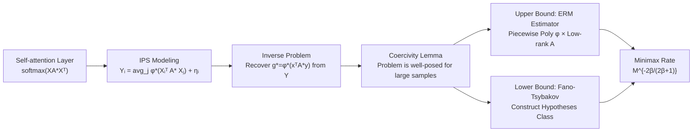

# Minimax Rates for Learning Pairwise Interactions in Attention-Style Models

**Conference**: ICLR 2026  
**OpenReview**: [https://openreview.net/forum?id=7Gfheg6seM](https://openreview.net/forum?id=7Gfheg6seM)  
**Code**: To be confirmed  
**Area**: learning_theory  
**Keywords**: Attention Mechanism, Minimax Rates, Non-parametric Estimation, Interacting Particle Systems, Sample Complexity, Curse of Dimensionality

## TL;DR
This paper models single-layer attention as an inverse problem for Interacting Particle Systems (IPS). It proves that the minimax rate for learning the pairwise interaction function $g^\star(x,y)=\phi^\star(x^\top A^\star y)$ from aggregated outputs is $M^{-\frac{2\beta}{2\beta+1}}$. Under low-rank conditions, this rate is independent of the embedding dimension $d$, the number of tokens $N$, and the matrix rank $r$, providing a statistical explanation for how attention mechanisms avoid the curse of dimensionality.

## Background & Motivation
**Background**: Attention in Transformers essentially computes a weighted average of pairwise similarities between tokens. However, theoretically, only the aggregated output is observed, while the underlying interaction structure remains hidden. Existing theoretical works are mostly limited to simplified settings—linear/random feature attention, the high-dimensional limit of softmax attention, or the assumption of independent and isotropic tokens—without addressing the core problem of "recovering general nonlinear interaction functions from aggregated observations."

**Limitations of Prior Work**: The attention mechanism composes an activation function (softmax/ReLU/sigmoid, etc.) with a weight matrix $W_QW_K^\top$. These components are not separately identifiable and jointly determine the output. The "extreme token phenomenon" (where certain tokens receive disproportionately high weights) has led to various alternatives to softmax, suggesting that no single optimal activation exists. Therefore, analyzing **general interaction functions** is crucial. However, this inverse problem is neither local (the output is an average over all particles) nor convex (simultaneous estimation of matrices and functions), making standard non-parametric estimation tools difficult to apply directly.

**Key Challenge**: On one hand, it is desirable to know how many samples are needed to learn token-level interactions and how the convergence rate depends on dimensionality, token count, and smoothness. On the other hand, the interaction function resides in a $2d$-dimensional space, where naive non-parametric estimation would suffer from the curse of dimensionality, contradicting the empirical efficiency of attention.

**Goal**: To provide the optimal (matching upper/lower) minimax convergence rate for estimating $g^\star$ from aggregated observations and to precisely characterize its dependence on $d$, $r$, and $N$.

**Core Idea**: **Viewing attention as an inverse problem for Interacting Particle Systems (IPS)**—where tokens are "particles" and self-attention aggregates pairwise interactions. The interaction function $g^\star(x,y)=\phi^\star(\langle x,y\rangle_{A^\star})$ is a composition of an unknown activation $\phi^\star$ and an unknown matrix $A^\star$. This perspective does not require tokens to be independent or isotropic, allowing for dependent and anisotropic data.

## Method

### Overall Architecture
The paper revolves around a statistical model: **Single-layer Attention = $N$ Interacting Particles**. Observations are given by $Y_i=\frac{1}{N-1}\sum_{j\ne i}\phi^\star(X_i^\top A^\star X_j)+\eta_i$. The objective is to recover the pairwise interaction function $g^\star$ from $M$ groups of i.i.d. samples $\{(X^m,Y^m)\}$. The analytical pipeline follows: "Modeling → Proving well-posedness (coercivity) → Upper bound (ERM achieving $M^{-2\beta/(2\beta+1)}$) → Lower bound (matching rate via Fano-Tsybakov) → Numerical verification."

### Key Designs

**1. Bridging Attention and IPS: Bundling unidentifiable unknowns into one interaction function.** Instead of separately estimating the query/key matrices and the activation, the paper notes that $\mathrm{softmax}(QK^\top/\sqrt{d_k})=\mathrm{softmax}(XA^\star X^\top)$ where $A^\star=W_QW_K^\top/\sqrt{d_k}$. Thus, the "activation + matrix" are composed into a single scalar kernel $g^\star(x,y)=\phi^\star(x^\top A^\star y)$. This step bypasses the non-identifiability of $\phi^\star$ and $A^\star$ individually—only the recovery of their composition $g^\star$ is required. By defining the forward operator $R_g[X]_i=\frac{1}{N-1}\sum_{j\ne i}g(X_i,X_j)$, the model becomes $Y_i=R_{g^\star}[X]_i+\eta_i$, an inverse problem with **non-local** dependence on $g^\star$: the output is an average of all token pairs, and no single point value of $g^\star$ is directly observed.

**2. Coercivity Condition: Leveraging token exchangeability to make the non-local inverse problem well-posed.** The primary obstacle in the inverse problem is non-locality—whether $g^\star$ can be uniquely and stably recovered from averages. The authors introduce and prove a coercivity lemma (Lemma 3.4): under token exchangeability (Assumption A1), $\frac{1}{N-1}\|g-g^\star\|_{L^2_\rho}^2\le \mathcal{E}_\infty(g)-\mathcal{E}_\infty(g^\star)$, meaning the risk difference can lower-bound the function error. This ensures the inverse problem is well-posed in the large-sample limit. The exploration measure $\rho$ is defined over token pairs $(x,y)$, measuring coverage over the parameter space. Unlike previous IPS literature estimating translation-invariant radial kernels, the interaction here is **not translation-invariant** due to matrix $A^\star$, making it a true $2d$-dimensional function.

**3. ERM Estimator Achieving the Upper Bound: Dual parameterization with piecewise polynomials and low-rank matrices.** The estimator is defined as $\hat g_M=\hat\phi(\langle x,y\rangle_{\hat A})$, performing empirical risk minimization over a function class $\mathcal{G}^s_{r,K_M}$. Here, $\phi$ is represented by piecewise polynomials $\Phi^s_{K_M}$ of degree $s$ on $K_M$ intervals, and $A$ is restricted to a class of matrices with rank $\le r$, $\mathcal{A}_d(r,\bar a)$. Theorem 3.1 proves that when $rd\le (M/\log M)^{1/(2\beta+1)}$, the error satisfies $\mathbb{E}\|\hat g_M-g^\star\|_{L^2_\rho}^2\lesssim M^{-\frac{2\beta}{2\beta+1}}$. The proof extends techniques developed for multi-index projection pursuit by Györfi et al. and overcomes three difficulties: non-local dependence, relaxing noise from bounded to sub-Gaussian, and estimating the covering number for the rank $\le r$ matrix class (Lemma B.3).

**4. Decomposition into "Parametric + Non-parametric" Errors: Dimension only enters low-order terms.** The core insight is that the total error consists of two parts: a **non-parametric term** $M^{-\frac{2\beta}{2\beta+1}}$ from estimating $\phi^\star$ (depending only on smoothness $\beta$), and a **parametric term** from estimating $A^\star$ (depending on $d, r$). When the low-rank condition $rd\le(M/\log M)^{1/(2\beta+1)}$ holds, the parametric term is suppressed by the non-parametric term. Thus, the dominant term is independent of $d$, which is the statistical source of avoiding the curse of dimensionality.

**5. Fano-Tsybakov Lower Bound: Reducing the problem by fixing $A^\star$.** To obtain a matching lower bound, the authors first use Lemma 4.1 to reduce the supremum over all $g^\star=\phi^\star(x^\top A^\star y)$ to a supremum over $\phi^\star$ with a fixed $A^\star$. This is done by lower-bounding $\|\hat g-g^\star\|^2_{L^2_\rho}$ with $\|\hat\psi-\phi^\star\|^2_{L^2_{p_U}}$, where $U_{ij}=X_i^\top A^\star X_j$. Then, a family of hypothesis functions $\{\phi_{k,M}\}$ is constructed using the Fano-Tsybakov framework (Lemma 4.2), which are $2s_{N,M}$-separated in $L^2_{p_U}$ while their induced KL divergence grows slowly. Finally, Theorem 4.4 gives $\inf_{\hat g}\sup_{g^\star}\mathbb{E}\|\hat g-g^\star\|^2_{L^2_\rho}\gtrsim c_0 N^{-\frac{2\beta}{2\beta+1}}M^{-\frac{2\beta}{2\beta+1}}$, which matches the upper bound (up to a logarithmic factor), establishing the minimax rate.

## Key Experimental Results

### Main Results (Verification of Dimension Independence)
The authors used B-splines to represent the ground truth activation $\phi^\star$ (a degree $p$ B-spline is $C^{p-1}$, where degree directly controls smoothness). $\phi^\star$ is first fitted via least squares, then approximated by an MLP to support backpropagation for $A^\star$.

| Setting | Observation | Theoretical Expectation |
| :--- | :--- | :--- |
| Embedding Dim $d\in\{1,5,30\}$ | log-log convergence slopes are nearly parallel, all close to $-2\beta/(2\beta+1)$ | Convergence rate is independent of $d$ |

### Ablation Study (Rate vs. Smoothness)

| B-spline degree $P$ | Empirical Slope | Theoretical Slope |
| :--- | :--- | :--- |
| $P=3$ | $\approx -0.81$ | $-0.80$ |
| $P=8$ | $\approx -0.899$ | $-0.933$ |

### Key Findings
- The convergence slopes for $d\in\{1,5,30\}$ almost overlap, directly confirming that the dominant error term does not depend on the embedding dimension; the attention model indeed avoids the curse of dimensionality.
- As smoothness $\beta$ increases (higher B-spline degree), the log-log slope becomes steeper. Empirical values match the theoretical $-2\beta/(2\beta+1)$ to two decimal places, indicating the minimax rate is entirely determined by the Hölder smoothness of the activation function.

## Highlights & Insights
- **Statistical Explanation of Attention Efficiency**: This work is the first to attribute "why attention is not afraid of high dimensions" to the minimax rate—not just an intuition regarding optimization or expressivity, but a rigorous non-parametric conclusion: the dominant error depends only on activation smoothness.
- **Bundling Unidentifiable Quantities**: By not obsessing over the individual non-identifiability of $\phi^\star$ and $A^\star$, and instead estimating their composition $g^\star$, the paper elegantly bypasses the non-convex identification challenge.
- **Relaxed Data Assumptions**: The study moves beyond common restrictions of independent, isotropic tokens, allowing for dependent and anisotropic data, which better aligns with the strong correlations found in real-world sequences.
- **Parametric/Non-parametric Error Decomposition**: The dependence on dimension is clearly isolated into the parametric term, with precise conditions provided for its suppression ($rd\le(M/\log M)^{1/(2\beta+1)}$), offering a statistical explanation for why low-rank KQ matrices are beneficial.

## Limitations & Future Work
- **Log Factor Gap**: There is a gap of $(\log M)^{\frac{2\beta}{2\beta+1}+4\max(2\beta,1)}$ between the upper and lower bounds. The authors acknowledge this limitation—while removable in standard regression or cases where $A$ is constant, the simultaneous non-convex optimization over $A$ and $\phi$ makes existing log-shaving techniques difficult to apply.
- **Single Layer & Single Head**: The analysis is restricted to pairwise interactions in single-layer attention. Multi-layer (cross-layer dynamics), multi-head architectures, and the role of the Value matrix are not included.
- **Idealized Estimator**: The upper bound is derived from an ERM estimator over specific classes (piecewise polynomials + low-rank matrices), representing a statistical limit rather than a computationally efficient algorithm. Numerical experiments also require B-spline fitting followed by MLP approximation, which differs from actual training workflows.
- **Static vs. Training Dynamics**: The work characterizes sample complexity/learnability but does not directly address whether optimization methods like SGD can actually reach this optimal estimator.

## Related Work & Insights
- **Neural Networks as Dynamical Systems / IPS**: Works like Neural ODE (Chen et al. 2018) and Geshkovski et al. (2023/2025) view tokens as interacting particles and study clustering phenomena. However, these focus on token dynamics across depth and do not address the learning theory of pairwise interactions. This paper fills that gap.
- **Attention Learnability**: Previous studies on linear/random feature attention (Wang/Lu/Marion et al.), the high-dimensional limit of softmax (Troiani/Cui et al.), and shallow ViT training (Li et al. 2023) often fix architectures or assume independent tokens. This paper shifts towards general interaction functions and dependent data.
- **Classical Non-parametric Estimation**: Builds on single-index models $f(w^\top x)$ (Gaïffas & Lecué 2007), projection pursuit (Györfi et al. 2006), and near-optimal rates for deep ReLU networks (Schmidt-Hieber 2020), extending projection pursuit to the "non-local + mixed parametric/non-parametric" attention setting.
- **Key Insight**: Mapping a "black-box" mechanism like attention to a framework with mature tools (IPS inverse problems + non-parametric statistics) is a powerful paradigm for analyzing modern architectures. The idea of "isolating dimension dependence through error decomposition" can be transferred to other structured models suspected of avoiding the curse of dimensionality.

## Rating
- **Novelty**: ⭐⭐⭐⭐⭐ First to provide tight minimax rates for learning pairwise interactions in attention via IPS inverse problems and prove dimension independence.
- **Experimental Thoroughness**: ⭐⭐⭐ Numerical experiments cleanly verify the core predictions of "independence from $d$" and "dependence on $\beta$," though they are limited to synthetic rate validation.
- **Writing Quality**: ⭐⭐⭐⭐ Clear motivation, bridging, and argument structure. Proof details are heavy, posing a barrier to non-experts.
- **Value**: ⭐⭐⭐⭐ Provides a solid statistical explanation for attention's efficiency, with theoretical implications for understanding attention and guiding training (e.g., low-rank KQ).

<!-- RELATED:START -->

## Related Papers

- [\[ICLR 2026\] Score-Based Density Estimation from Pairwise Comparisons](score-based_density_estimation_from_pairwise_comparisons.md)
- [\[ICLR 2026\] Understanding In-Context Learning on Structured Manifolds: Bridging Attention to Kernel Methods](understanding_in-context_learning_on_structured_manifolds_bridging_attention_to_.md)
- [\[ICLR 2026\] On learning linear dynamical systems in context with attention layers](on_learning_linear_dynamical_systems_in_context_with_attention_layers.md)
- [\[ICLR 2026\] Poly-attention: a general scheme for higher-order self-attention](poly-attention_a_general_scheme_for_higher-order_self-attention.md)
- [\[ICLR 2026\] Subquadratic Algorithms and Hardness for Attention with Any Temperature](subquadratic_algorithms_and_hardness_for_attention_with_any_temperature.md)

<!-- RELATED:END -->
