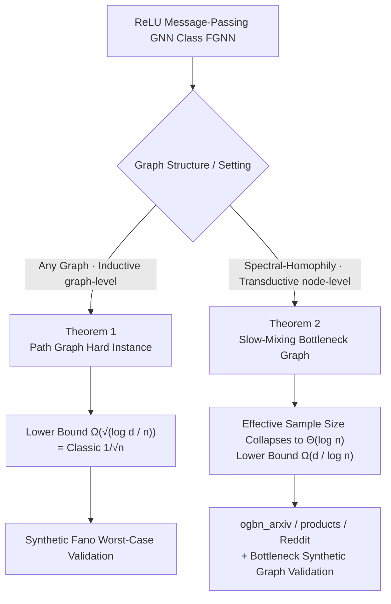

# Minimax Sample Complexity of Graph Neural Networks: Lower Bounds and Structural Effects

**Conference**: ICLR 2026  
**OpenReview**: [https://openreview.net/forum?id=P2GIT8LpV2](https://openreview.net/forum?id=P2GIT8LpV2)  
**Code**: TBD  
**Area**: learning theory  
**Keywords**: GNN, minimax lower bounds, sample complexity, spectral-homophily, Fano’s inequality, effective sample size  

## TL;DR
This paper establishes two minimax lower bounds for ReLU message-passing GNNs: on arbitrary graphs, the error is no faster than the classic $\sqrt{\log d / n}$. However, under "strong homophily + weak spectral expansion" (spectral-homophily), the transductive node prediction error is as slow as $d/\log n$—revealing that the sample complexity of real-world graph tasks is primarily dictated by graph topology rather than neural architecture.

## Background & Motivation
**Background**: Minimax analysis for feedforward and convolutional networks is mature, with ReLU network generalization errors decaying at the classic $1/\sqrt{n}$ rate. Non-parametric regression also has convergence guarantees under smoothness assumptions. However, the statistical foundation of GNNs remains weak—prior works mostly focus on VC dimension (which explodes with depth/width), PAC-Bayes stability bounds, or expressivity upper bounds. **Lower bounds for generalization are almost non-existent.**

**Limitations of Prior Work**: GNNs break the independence assumptions that feedforward theories rely on—node samples are correlated via edges, and message passing couples regions far apart on the graph. Consequently, the "statistically independent effective observations" might be much smaller than the number of labeled nodes. This means GNN sample complexity cannot be directly derived from standard deep learning theory.

**Key Challenge**: Most existing theories only cover the **inductive (graph-level)** setting, where each training sample is an independent graph. However, widely used benchmarks like ogbn_arxiv, ogbn_products, and Reddit are **transductive (node-level)**—observing one fixed graph with a subset of labeled nodes and requiring the model to generalize on the same structure. Node labels collected on slow-mixing graphs may be highly redundant, leading to vastly different statistical difficulties between the two settings.

**Goal**: To provide rigorous minimax lower bounds for both inductive and transductive settings, answering when GNNs follow the classic $1/\sqrt{n}$ rate and when they are limited by graph structural properties.

**Core Idea**: **[Information-theoretic lower bounds]** Use Fano’s inequality + packing sets to construct hard instance families, proving statistical barriers that no estimator can overcome. **[Spectral-homophily]** Introduce a structural condition—small Laplacian spectral gap $\lambda_2 \le \kappa/\log n$ plus strong label homophily—to collapse the effective sample size from $n$ to $\Theta(\log n)$, resulting in a $d/\log n$ rate slower than $1/\sqrt{n}$.

## Method

### Overall Architecture
The paper is purely theoretical with confirmatory experiments: it first proves two lower bounds using information theory tools (Theorem 1 for inductive, Theorem 2 for transductive), then validates whether real/synthetic tasks fall into these regimes. The two theorems cover complementary graph structures and architectural assumptions.

### Key Designs
**1. Hypothesis Class Definition: Constraints on GNNs and Graphs.** The study focuses on $L$-layer ReLU message-passing networks where each layer updates as $h_i^{(\ell+1)} = \phi\big(W^{(\ell)}\,\mathrm{Agg}_{j\in N(i)} h_j^{(\ell)} + B^{(\ell)} h_i^{(\ell)}\big)$ with $\phi=\max\{0,\cdot\}$. The function class $F_{\text{GNN}}(v_s, L)$ is constrained by: (A1) input-independent, 1-hop permutation-invariant aggregation (SUM/MEAN/normalized adjacency), and (A2) layer-wise Lipschitz/variation budget $\sum_\ell (\|W^{(\ell)}\|_1 + \|B^{(\ell)}\|_1) \le v_s$ ($\ell_1$ norm encourages sparsity). Theorem 1 relies on (A1) and thus **excludes attention-based models** (GAT, graph transformers where weights depend on features); Theorem 2 only requires adjacency locality and bounded operators, extending to adjacency-masked attention.

**2. Inductive Worst-case Lower Bound (Theorem 1): Path Graphs as the Information Bottleneck.** In the inductive graph-level setting on arbitrary graphs, the authors prove $R^{\text{graph}}_n(F_{\text{GNN}}) \ge K_{\text{new}}\,\frac{\sigma v_s}{L}\sqrt{\frac{\log d}{n}}$. The proof follows a classic Fano route: constructing a constant-weight Varshamov–Gilbert code by varying the first-layer weights $W^{(0)}$ on a **path (chain) graph**. The log-cardinality of the packing set satisfies $\log M \ge C_A v_s^2 \log d / (L^2 \epsilon^2)$. Under Gaussian regression, the KL divergence is controlled by $2\epsilon^2/\sigma^2$. Path graphs are effective because the degree $\le 2$ creates a bottleneck, making message passing slowest and depth the dominant factor. Proving hardness on the sparsest structure establishes a universal worst-case rate.

**3. Spectral-homophily Condition: Characterizing "Effective Sample Size Collapse".** Let the normalized Laplacian be $\mathcal{L} = I - D^{-1/2}AD^{-1/2}$, where the second smallest eigenvalue $\lambda_2(\mathcal{L})$ measures expansion. The condition $\lambda_2(\mathcal{L}) \le \kappa/\log n$ signifies weak expansion and slow mixing. Small spectral gaps imply sparse cuts separating dense communities. Strong homophily (tight intra-community connections) combined with weak expansion (few inter-community edges) keeps messages "trapped" within communities. In transductive settings, this is amplified: all features are visible but labels are sparse. Slow mixing causes labeled nodes to be highly correlated with overlapping message-passing neighborhoods, such that **every $O(\log n)$ labels contribute only one piece of truly new information**.

**4. Transductive Structure-aware Lower Bound (Theorem 2): Effective Sample Size Dictates the $d/\log n$ Rate.** On graphs satisfying spectral-homophily, the node-level transductive risk satisfies $R^{\text{node}}_{(n,G)}(F_{\text{GNN}}) \ge \frac{\sigma^2 v_s^2}{\Gamma L^2}\cdot\frac{d}{\log n}$. The proof identifies $K=\Theta(\log n)$ "well-separated" nodes with nearly non-overlapping receptive fields. A packing set is constructed using codewords across these $K$ nodes. The resulting sample size requirement is $n \ge \exp(\sigma^2 v_s^2 d / (\Gamma L^2 \epsilon^2))$, which is **exponential** in $1/\epsilon^2$, far worse than polynomial rates. If spectral-homophily fails (large $\lambda_2$, strong expansion), the analysis reverts to the $\sqrt{\log d/n}$ rate.

## Key Experimental Results

### Main Results
The experiments serve as "proof-of-concept." The core evidence is **ratio diagnostics**: if $\mathrm{Err}(n)/\text{rate}(n)$ is approximately constant as $n$ varies, the empirical error matches the theoretical rate.

**Structure Validation (Theorem 2 Conditions)**:
Each dataset's $\lambda_2$, homophily, and a unified certificate constant $\kappa_0 := \max_{n\in N}\lambda_2(\mathcal{L})\log n$ are calculated to verify $\lambda_2 \le \kappa_0/\log n$.

| Dataset | Spectral Gap $\lambda_2$ | $\kappa_0$ | Homophily |
|---|---|---|---|
| ogbn_arxiv | 0.2112 | 2.5428 | 0.6551 |
| ogbn_products_50k | 0.9201 | 9.9557 | 0.7956 |
| Reddit_50k | 0.9683 | 10.4769 | 0.7748 |
| WorstCase_Bottleneck_20k | 1.0359 | 10.2586 | 0.3164 |

The three real-world graphs fall into the structural regime of Theorem 2.

### Ratio Diagnostics
- **Synthetic Fano Worst-case**: $\mathrm{Ratio}_1(n)=\mathrm{Err}/\sqrt{\log d/n}$ is mostly constant, while $\mathrm{Ratio}_2(n)=\mathrm{Err}/(d/\log n)$ decreases, confirming the $1/\sqrt{n}$ rate.
- **Real Datasets (GCN/GAT/GraphSAGE)**: $\mathrm{Ratio}_2(n)$ remains nearly flat across 2–3 orders of magnitude of $n$, while $\mathrm{Ratio}_1(n)$ increases sharply, indicating that real GNN tasks follow the $d/\log n$ rate of Theorem 2.
- **Bottleneck Synthetic Graph**: $\mathrm{Ratio}_2$ is stable and $\mathrm{Ratio}_1$ rises sharply, mirroring real-world data and proving the $d/\log n$ rate is tight under spectral-homophily.

### Key Findings
- **Stable Empirical Constant $C^\star$**: The value of $\mathrm{Err}/(d/\log n)$ plateaus around 15–25 for ogbn_arxiv and 10–20 for Reddit_50k, suggesting the error is proportional to $d/\log n$ within a controlled constant factor.
- **Unreliable Curve Fitting**: $1/\log n$ was the best fit in only a few cases, justifying the authors' decision to use ratio diagnostics as primary evidence.

## Highlights & Insights
- **Filling the Gap in GNN Lower Bounds**: While prior GNN theory focused on upper bounds (VC, PAC-Bayes), this work provides rigorous minimax lower bounds that no architecture can circumvent.
- **Quantifying Effective Sample Size Collapse**: Uses the spectral gap $\lambda_2$ to quantify the physical intuition: "slow mixing → neighborhood overlap → label redundancy → one new piece of info per $\log n$ labels."
- **Theory Aligns with Practice**: Real-world benchmarks are diagnosed to fall into the $d/\log n$ structural regime rather than the textbook $1/\sqrt{n}$, supporting the claim that graph topology dominates sample complexity.

## Limitations & Future Work
- **Absence of Matching Upper Bounds**: The paper proves errors are "no faster than" a certain rate but does not provide an algorithm that achieves that rate.
- **Architectural Assumptions**: The requirement for input-independent aggregation (A1) excludes standard GAT. While Theorem 2 generalizes, it requires additional norm conditions.
- **Scaling of Experiments**: Real-world datasets were sub-sampled (e.g., 50k nodes), and the reliability of identifying the exact structural regime across all real graphs needs further validation.

## Related Work & Insights
- **Extension of Feedforward Minimax Framework**: Generalizes the $1/\sqrt{n}$ analysis of ReLU networks (e.g., Golestaneh et al., 2024) to graph inputs without assuming strong smoothness or independence.
- **Complementary to Expressivity**: While other works characterize what GNNs *can* represent (upper bounds), this work characterizes what they *cannot* avoid statistically (lower bounds).
- **Inspiration**: The "bottleneck as spectral gap" perspective suggests that GNN benchmarks or sampling strategies should explicitly consider mixing times and homophily rather than assuming labeled nodes provide independent information.

## Rating
- **Novelty**: ⭐⭐⭐⭐ Establishes the first transductive minimax lower bound for ReLU MPNNs.
- **Experimental Thoroughness**: ⭐⭐⭐ Clever ratio diagnostics, though matching upper bounds and larger scale tests are missing.
- **Writing Quality**: ⭐⭐⭐⭐ Clear progression from motivation to theorems and physical intuition.
- **Value**: ⭐⭐⭐⭐ Significant for understanding why certain graph tasks require more data and how topology dictates statistical difficulty.

<!-- RELATED:START -->

## Related Papers

- [\[ICLR 2026\] Near-Optimal Sample Complexity Bounds for Constrained Average-Reward MDPs](near-optimal_sample_complexity_bounds_for_constrained_average-reward_mdps.md)
- [\[ICLR 2026\] Tractability via Low Dimensionality: The Parameterized Complexity of Training Quantized Neural Networks](tractability_via_low_dimensionality_the_parameterized_complexity_of_training_qua.md)
- [\[ICLR 2026\] Sample Complexity and Representation Ability of Test-time Scaling Paradigms](sample_complexity_and_representation_ability_of_test-time_scaling_paradigms.md)
- [\[ICLR 2026\] Variance-Dependent Regret Lower Bounds for Contextual Bandits](variance-dependent_regret_lower_bounds_for_contextual_bandits.md)
- [\[ICLR 2026\] Mitigating the Curse of Detail: Scaling Arguments for Feature Learning and Sample Complexity](mitigating_the_curse_of_detail_scaling_arguments_for_feature_learning_and_sample.md)

<!-- RELATED:END -->
