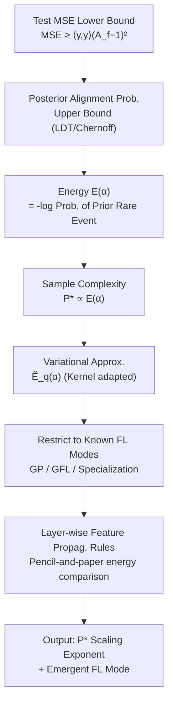

# Mitigating the Curse of Detail: Scaling Arguments for Feature Learning and Sample Complexity

**Conference**: ICLR 2026  
**OpenReview**: [https://openreview.net/forum?id=Lexn2TAw59](https://openreview.net/forum?id=Lexn2TAw59)  
**Code**: To be confirmed  
**Area**: Learning Theory / Feature Learning  
**Keywords**: Feature Learning, Sample Complexity, Bayesian Neural Networks, Scaling Laws, Large Deviation Theory, Variational Approximation  

## TL;DR
This paper employs the "scaling analysis" approach from statistical physics to approximate Bayesian Neural Networks (BNNs)—no longer solving exact high-dimensional nonlinear equations, but instead using pencil-and-paper level energy comparisons. It predicts what feature learning (FL) modes (Specialization, GFL, etc.) emerge at specific data/width scales and determines the scaling exponent of the minimum learnable sample size $P^*$.

## Background & Motivation

**Background**: Two major challenges in deep learning theory involve understanding the mechanisms of feature learning (FL) and characterizing the implicit bias of networks in the rich regime. Currently, mainstream theories of rich FL (Kernel methods, Saad-Solla-type teacher-student models, Bayesian statistical mechanics) formulate problems as high-dimensional nonlinear self-consistent equations, requiring computationally intensive numerical solvers to obtain results.

**Limitations of Prior Work**: The authors refer to this as the "curse of detail." Every choice of architecture, activation function, data distribution, and training protocol affects the outcome, making it almost impossible to have a theory that simultaneously accounts for all details precisely while maintaining true predictive power. The alternative path of "solvable toy models" results in a fragility where solvability is tied to fine-tuned properties, leaving a significant interpretability gap between toy models and complex real-world settings. Even when extending existing FL frameworks to deep networks, the computational complexity prevents the derivation of intuitive scaling laws, let alone unified cross-architecture comparisons.

**Key Challenge**: Exact solutions = Computational infeasibility + lack of transferability across settings; whereas what researchers truly desire are often **scaling exponents** rather than exact values. Drawing an analogy from statistical physics: in the integral $\int_{-\infty}^{\infty} g(x/P)\,dx$, $g(\cdot)$ must be finely tuned to calculate an exact value, but a simple variable substitution reveals it scales linearly with $P$ for any $g$. Predicting "how it changes with scale" is far easier and more robust than predicting "what the exact value is."

**Goal**: To establish a **heuristic** framework that uses only pencil-and-paper calculations to predict the scaling of sample complexity $P^*$ in BNNs from first principles, and to determine which FL mode emerges under different architectures and scales.

**Core Idea**: **Transform the sample complexity problem into the "energy of the rare event where strong alignment occurs in the prior."** Test MSE is lower-bounded via alignment. Using Large Deviation Theory (LDT), the rate function $E(\alpha)$ quantifies the "probability of a random network from the prior happening to learn well" as an energy. Since the exact $E(\alpha)$ is intractable, variational approximation is used with several known FL modes as candidates. By comparing the energy of each mode and selecting the minimum, both the $P^*$ scaling and the emergent FL mode are obtained.

## Method

### Overall Architecture

The logic follows a three-step progression: "Bound → Approximation → Heuristics." First, test error is lower-bounded by Cauchy–Schwarz into alignment $A_f$. Second, the "probability of learning well in the posterior" is upper-bounded by the negative log-probability of a rare event in the prior (energy $E(\alpha)$), such that minimum sample size $P^* \propto E(\alpha)$. Third, since $E(\alpha)$ is not exactly computable, a variational approximation $\tilde E_q(\alpha)$ is introduced. Finally, variational candidates are restricted to known FL modes in the literature using pencil-and-paper scaling rules to compare energies.

### Key Designs

**1. Alignment Lower Bound + Energizing Sample Complexity: Translating "Learnability" into Rare Event Probability.** The paper defines alignment $A_f := \langle f, y\rangle / \langle y, y\rangle$ to measure how proportional the network function is to the target. Cauchy–Schwarz gives $\int (f-y)^2 d\mu_x \ge \langle y,y\rangle (A_f-1)^2$, making $A_f \approx 1$ a necessary condition for successful learning. A key step shows $\log \Pr_\pi[A_f \ge \alpha] < Pk/(2\kappa) + \log \Pr_{p_0}[A_f \ge \alpha]$, where $k$ is an $O(1)$ quantity dependent on the training set. Since strong alignment is nearly impossible in the prior, $\log \Pr_{p_0}[A_f \ge \alpha]$ is extremely negative for large $\alpha$, requiring a sufficiently large data term to compensate, hence $P \gtrsim -2\kappa \log \Pr_{p_0}[A_f \ge \alpha]/k$. Using the Chernoff inequality to define **energy** $E(\alpha) = -\log \inf_{t>0} e^{-t\alpha}\mathbb{E}_{p_0}[e^{tA_f}]$, we get $P^* \propto E(\alpha)$. The physical intuition is that a strongly aligned network in the prior is a statistical outlier because it possesses an emergent structure mimicking FL.

**2. Variational Approximation to Reduce Intractable Energy: Feynman–Bogoliubov Inequality + Gaussian Ansatz.** Exact calculation of $E(\alpha)$ is mostly infeasible. The paper relates the cumulative distribution to density, showing $E(\alpha) \approx -\log p_{A_f}(\alpha)$ at large alignment. Statistical physics techniques express $p_{A_f}(\alpha)$ as a path integral over pre-activations $h$, where kernels $\tilde K_{l-1}$ depend on previous layers. Using the Feynman–Bogoliubov inequality, $E(\alpha)$ is upper-bounded: $E(\alpha) \approx \min_{q_\alpha}(\mathbb{E}_{h\sim q_\alpha}[\log(Z_{A_f}/Z_{q,\alpha})] + \tilde E_q(\alpha))$. For $\alpha \approx 1$, the log term is subdominant, so $E(\alpha) \approx \tilde E_{q^*}(\alpha)$. A layer-wise decoupled Gaussian ansatz $q(h) = \prod_l \prod_i q_{l,i}(h^l_i)$ is used, leading to $\tilde E_q \propto \sum_l \sum_i \Delta_{l,i} + a_y$.

**3. Three FL Modes as Variational Candidates: Compressing Diverse FL into Discrete Options.** While any $q$ is allowed, the paper restricts candidates to three layer-wise/neuron-wise modes: (1) **GP (Gaussian Process/Lazy)**: $h_{l,i} \sim N(0, K_{l-1})$; (2) **GFL (Gaussian Feature Learning)**: Covariance is amplified by factor $D$ along a feature $\Phi^l_*$; (3) **Specialization**: A neuron locks onto feature $\Phi^l_*$, and the distribution collapses to $\delta[\langle h^l_i, \Phi^l_*\rangle - \mu_{l,i}]$. Comparing combinations identifies the mode that minimizes $\tilde E_q$ as the emergent FL.

**4. Pencil-and-Paper Rules for Layer-wise Feature Propagation.** To make energy comparison practical, the paper proposes three heuristic claims: (i) **Neuron specialization creates spectral spikes**—the RKHS norm is amplified by $O(N_l/M)$ when $M$ neurons specialize; (ii) **Amplifying features amplifies high-order features**—if eigenvalue $\lambda_* \to \lambda_* D$, its $m$-th power $(\Phi^l_*)^m$ is boosted by $D^m$ downstream; (iii) **Lazy layers maintain relative scales**. For FCNs, specialization layers provide $\langle\Phi, K_l^{-1}, \Phi\rangle \propto [\sum_i \mu^2_{i,l}/N_l]^{-1}$, and GFL layers provide $\langle(\Phi^l_*)^m, K_l^{-1}, (\Phi^l_*)^m\rangle \propto (D\lambda_*)^{-m}$.

## Key Experimental Results

The paper verifies if predicted scaling exponents match exact theory (LDT) and numerical experiments across FCNs, Attention heads, and CNNs.

### Main Results: Energy Table for 3-layer FCN (Table 1, Target $y=\mathrm{He}_3(w_*\cdot x)$)

| Feature Mode (Layer 1/Layer 2) | $\Delta_1$ | $\Delta_2$ | $a_y$ | Minimizing Parameter | Variational Energy $\tilde E$ |
|---|---|---|---|---|---|
| GP-GP | 0 | 0 | $d^3$ | — | $d^3$ |
| GP-Specialization | 0 | $M_2 d$ | $N_2/M_2$ | $M_2=\sqrt{N_2/d}$ | $\sqrt{N_2 d}$ |
| Specialization-Magnetization | $M_1 d$ | $N_1\beta/M_1$ | $N_2/\beta$ | $\beta=(N_2^2/N_1 d)^{1/3}$, $M_1=(N_2 N_1/d^2)^{1/3}$ | $(N_1 N_2 d)^{1/3}$ |

Key conclusion: Non-GP modes yield $P^*/\kappa \propto d$ in the proportional limit ($N_1 \propto N_2 \propto d$), but GP-Specialization is superior because its complexity does not grow with $N_1$.

### Scaling Verification

| Architecture | Target | Predicted $P^*$ Scaling | Results |
|---|---|---|---|
| 2-layer Erf FCN | $\mathrm{He}_3$ | $P^* \propto d$ | Matches experiments; specialized neurons $\propto \sqrt{N/d}$ (Fig. 2c) |
| 2-layer CNN | — | $P^* = d^{3/4}$ | Reproduces Ringel et al. (2025) exponent |
| 3-layer Erf FCN | $\mathrm{He}_3$ | $P^* \propto d$ | Alignment curves collapse when scaled by $P/d$ (Fig. 3a) |
| Softmax Attention | Cubic target | $P^* \propto \sqrt{L d^3}$ | Alignment collapses with $P/\sqrt{Ld^3}$ (Fig. 3b), $L$ is context length |

### Key Findings
- **Alignment Curve Collapse**: Rescaling the x-axis by $P/P^*_{\text{predicted}}$ causes alignment curves for different $d$ to collapse into one, confirming the scaling prediction.
- **Predictable FL Mode Transitions**: Increasing $N_1$ triggers a shift from Sp.-Mag. to GP-Specialization.
- **Surpassing Existing Analysis**: The $P^*\propto\sqrt{L}$ prediction for attention heads reportedly goes beyond the reach of current exact theories.

## Highlights & Insights
- **Heuristic Scaling over Exact Calculation**: Systematizes the intuition that predicting scaling is easier than predicting values, lowering the barrier for first-principles analysis.
- **Unified Energy Minimization**: Both the "mode" and "sample complexity" are captured by minimizing the same variational energy.
- **Rare Event Perspective**: Viewing successful learning as a statistical outlier in the prior naturally binds the bound to FL structures.
- **Cross-architecture Comparability**: Provides a unified language to compare FCNs, CNNs, and Transformers.

## Limitations & Future Work
- **Heuristic Nature**: Layer-wise propagation claims are empirical rationalizations rather than rigorous proofs.
- **Architecture Constraints**: General CNNs and full Transformers (especially superposition) are not yet handled.
- **Equilibrium Focus**: Based on Bayesian (equilibrium) networks, not accounting for training dynamics; early-stage FL emergence might differ.
- **Ridge/Mean-field Issues**: The bound may become vacuous or require an "effective ridge" at $\kappa \to 0$.

## Related Work & Insights
- **Statistical Mechanics of FL**: Builds on work by Li & Sompolinsky, Seroussi et al., and Barbier et al. regarding kernel updates.
- **Neural Scaling Laws**: Fits into the methodology of Kaplan et al. (2020) and μP, but derives exponents from first principles.
- **Connection to Grokking**: Specialization as a first-order phase transition relates to mechanistic insights into grokking.

## Rating
- **Novelty**: ⭐⭐⭐⭐⭐ Highly original transition from exact solvers to variational energy scaling analysis.
- **Experimental Thoroughness**: ⭐⭐⭐⭐ Strong verification of curve collapses across architectures, though limited to synthetic targets.
- **Writing Quality**: ⭐⭐⭐⭐ Clear logic; however, the density of statistical mechanics notation presents a barrier.
- **Value**: ⭐⭐⭐⭐ A low-cost tool for first-principles scaling analysis that bridges mechanistic interpretability and theory.

<!-- RELATED:START -->

## Related Papers

- [\[ICLR 2026\] Scaling Laws and Spectra of Shallow Neural Networks in the Feature Learning Regime](scaling_laws_and_spectra_of_shallow_neural_networks_in_the_feature_learning_regi.md)
- [\[ICLR 2026\] How hard is learning to cut? Trade-offs and sample complexity](how_hard_is_learning_to_cut_trade-offs_and_sample_complexity.md)
- [\[ICLR 2026\] Near-Optimal Sample Complexity Bounds for Constrained Average-Reward MDPs](near-optimal_sample_complexity_bounds_for_constrained_average-reward_mdps.md)
- [\[ICLR 2026\] Transfer Learning in Infinite Width Feature Learning Networks](transfer_learning_in_infinite_width_feature_learning_networks.md)
- [\[ICLR 2026\] Minimax Sample Complexity of Graph Neural Networks: Lower Bounds and Structural Effects](minimax_sample_complexity_of_graph_neural_networks_lower_bounds_and_structural_e.md)

<!-- RELATED:END -->
