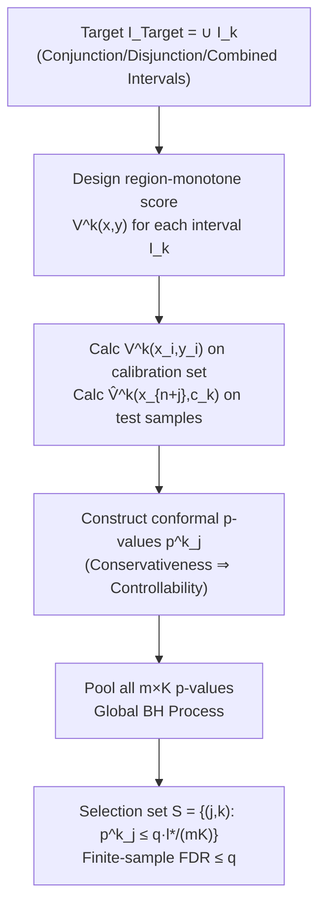

# Multi-Condition Conformal Selection

**Conference**: ICLR 2026  
**OpenReview**: [https://openreview.net/forum?id=giL8Q1V26J](https://openreview.net/forum?id=giL8Q1V26J)  
**Code**: [https://github.com/hqy-new/mccs-iclr26](https://github.com/hqy-new/mccs-iclr26)  
**Area**: Learning Theory / Conformal Prediction / Multiple Hypothesis Testing  
**Keywords**: Conformal Selection, FDR Control, Conformal p-value, Benjamini–Hochberg, Multi-Condition Selection  

## TL;DR
The authors generalize conformal selection, which originally handled only single-threshold conditions `y > c`, to multi-condition scenarios such as "conjunctions $c_1 < y < c_2$" and "disjunctions $y < c_1 \text{ or } y > c_2$". By designing **region-monotone** non-conformity scores and a **global BH procedure**, they achieve strict FDR control under finite samples.

## Background & Motivation
- **Background**: In resource-constrained scenarios like drug screening, precision medicine, and LLM output alignment, it is necessary to select subsets from massive candidates that meet specific criteria while controlling the False Discovery Rate (FDR) under finite samples. cfBH (Jin & Candès, 2023) models this selection as multiple hypothesis testing: using conformal p-values to characterize the evidence strength of each test sample meeting the criteria, and then applying the Benjamini–Hochberg (BH) procedure to control FDR.
- **Limitations of Prior Work**: cfBH and its successors (WCS for covariate shift, mCS for multivariate responses) restrict hypotheses to a **single condition** `y > c`. However, real-world needs are often multi-conditional—"drug-likeness" requires compounds to fall within a **middle logP range** (conjunction $c_1 < y < c_2$), and early warning systems trigger when indicators are **either too high or too low** (disjunction $y < c_1 \text{ or } y > c_2$).
- **Key Challenge**: A seemingly natural approach is to run cfBH separately for each boundary and then combine the results via **set intersection/union** (Inter-cfBH / Union-cfBH). However, this paper proves (Corollary 3.1) that this destroys FDR control due to **error accumulation**: in intersection selection, a false discovery requires two processes to fail simultaneously, a multiplicative structure that inflates FDR as the selection set shrinks; in union selection, errors accumulate additively where false discoveries are double-counted while the denominator fails to grow proportionally due to the correlation between $S_1$ and $S_2$.
- **Goal**: To establish a conformal selection framework with **strictly controllable finite-sample FDR** under conjunctions, disjunctions, and arbitrary combinations thereof (including multiple intervals and multivariate responses).
- **Core Idea**: **"Design a region-monotone non-conformity score for each target interval and pool p-values of all (sample, condition) pairs into a single global BH procedure."**—interval-specific scoring ensures the conservativeness of p-values, while the globally ranked BH procedure unifies multiple conditions into a single testing framework, fundamentally avoiding the error accumulation of stitching-based methods.

## Method

### Overall Architecture
MCCS (Multi-Condition Conformal Selection) represents the target as a union of intervals $I_{Target}=\bigcup_{k=1}^{K} I_k$, where each $I_k$ is a half-bounded or bounded open interval. The algorithm proceeds in three steps: (1) design a non-conformity score $V^k(x,y)$ satisfying **regional monotonicity** for each target interval $I_k$; (2) calculate $V^k(x_i,y_i)$ on the calibration set and $\hat V^k_{n+j}$ on test samples using thresholds to obtain conformal p-values $p^k_j$ for each (sample $j$, condition $k$) pair; (3) aggregate all $m \times K$ p-values for **one global BH procedure**, outputting the selection set $S=\{(j,k): p^k_j \le q\cdot l^*/(mK)\}$.

### Key Designs

> **Construction of Conformal p-values (The shared foundation for all three designs)**: When responses are observable, the oracle p-value is:
> $$p^*_j=\frac{\sum_{i=1}^n \mathbf 1\{V_i<V_{n+j}\}+U_j\big(1+\sum_{i=1}^n\mathbf 1\{V_i=V_{n+j}\}\big)}{n+1}$$
> Since the test response $y_{n+j}$ is unobservable, $V_{n+j}$ is replaced by $\hat V_{n+j}=V(x_{n+j},c_k)$ computed using the threshold. As long as the score is region-monotone, $p_j$ is conservative, and BH can control the FDR.

**1. Region-Monotone Non-Conformity Scores: Ensuring Conservativeness for Conjunctions.** The key to FDR control in conformal selection is the **conservativeness** of p-values $P(p_j\le\alpha,\ j\in H_0)\le\alpha$, which requires **regional monotonicity**: $V(x,y')\le V(x,y)$ for $y'$ outside the target region. This is trivial for single thresholds but fails for conjunctions $I_k=(c_{kL},c_{kR})$ due to the "two-sided squeeze." The proposed score assigns **low scores** to samples within the interval to promote selection—taking $M-\min(\hat\mu(x)-c_{kL},\ c_{kR}-\hat\mu(x))$ when $y\in(c_{kL},c_{kR})$, and $\max(c_{kL}-\hat\mu(x),\ \hat\mu(x)-c_{kR})$ otherwise, where $\hat\mu$ is the predictor and $M$ is a large constant. This $M$ not only ensures monotonicity by widening the gap but also (Proposition 4.1 + Appendix A.2) allows the algorithm to **tighten the BH threshold inequality** in asymptotic FDR expressions, pushing the actual FDP closer to the nominal level $q$.

**2. Global BH Procedure: A Unified Framework for Disjunctions.** The key for disjunctions like `y < c1 or y > c2` is not the score, but **how BH is applied**. A naive approach of running BH for each boundary separately and taking the union leads to error accumulation. Ours uses a **global** approach: all $m \times K$ p-values $\mathcal P=\{p^k_j\}$ are pooled and sorted $p_{(1)}\le\cdots\le p_{(NUM)}$, defining $l^*$ as the largest index such that $p_{(l^*)}\le q\cdot l^*/NUM$. Since all hypotheses are placed into **a single** multiple testing framework, FDR control is guaranteed by the finite-sample theorem of cfBH, completely avoiding the error inflation of stitching methods.

**3. Generalization to Arbitrary Combinations and Multivariate Responses.** Half-bounded intervals are treated as special cases of conjunctions (e.g., $I_k=(-\infty,c_{kR})$ uses $V^k(x,y)=M\cdot\mathbf 1\{y<c_{kR}\}+\hat\mu(x)$). Thus, combining conjunctions (custom scores) and disjunctions (global BH) covers any multi-interval combination. Crucially, **Corollary 4.1** proves that **overlapping target intervals do not break FDR control**—users can specify multiple intervals without explicit intersection checks. For multivariate responses, conjunction targets become annular regions between boundaries $\partial R_{inner}$ and $\partial R_{outer}$, applying distance-based scores $dis(\cdot)$ (Algorithm 4).

## Key Experimental Results

### Main Results: Comparison with Baselines (Nominal FDR = 0.3)
An ideal method should keep the measured FDR close to but **under** 0.3 while maintaining high Power.

| Method | Conj.-Univar FDR | Conj.-Univar Power | Disj.-Univar FDR | Disj.-Univar Power |
|------|------|------|------|------|
| Int / Uni (Inter/Union) | 0.3766 ❌ Failed | 0.9397 | 0.3766 ❌ Failed | 0.9720 |
| Int-B / Uni-B (Bonferroni) | 0.1081 (Over-cons.) | 0.6005 | 0.1569 (Over-cons.) | 0.9224 |
| Ind (Indicator) | 0.2013 | 0.2126 (Very Low) | 0.2290 | 0.0000 |
| **MCCS (Ours)** | **0.2874** | **0.9756** | **0.2848** | **0.9515** |

Naive set operations (Int/Uni) consistently exceed the nominal level, validating Corollary 3.1. Bonferroni versions are overly conservative with significantly lower Power. MCCS keeps FDR within nominal levels while maintaining the highest Power.

### Ablation Study

| Experiment | Setting | Conclusion |
|------|------|------|
| 6 Combined Tasks | Tasks 1–6, $q$ from 0.05 to 0.5 | FDR is precisely controlled; overlapping intervals do not break control (validates Cor. 4.1). |
| Noise Robustness | Task 5, $N_s$=0.1/0.5/0.9 | Power decreases slightly with noise but remains robust; FDR stays near 0.3. |
| Large Number of Intervals $K$ | $K$=10/20/40 | Power decreases slightly as $K$ increases (0.99→0.90) as the BH threshold shrinks, as expected. |

### Main Results on Real Data (Nominal FDR 0.3)

| Task | Modality | FDR | Power |
|------|------|------|------|
| nlp-A / nlp-B (Toxicity Selection) | Text | 0.291 / 0.289 | 0.575 / 0.512 |
| cv-A / cv-B (NYU Depth Estimation) | Vision | 0.261 / 0.293 | 0.892 / 0.814 |
| vqa-A / vqa-B (VQA Consistency Conf.) | Multi-modal | 0.263 / 0.285 | 0.589 / 0.726 |

### Key Findings
- Stitching-based (Inter/Union) methods **inevitably** exceed the FDR, while Bonferroni is too conservative, highlighting the necessity of multi-condition tailoring.
- MCCS maintains FDR near nominal levels across text, vision, multi-modal, and multi-class tasks, proving the framework’s versatility.
- Interval contribution analysis shows that any selection bias toward specific intervals reflects the statistical evidence (data distribution) rather than algorithmic bias.

## Highlights & Insights
- **Accurate Diagnosis**: The paper clarifies why "intersection = multiplicative error" and "union = additive error" via Corollary 3.1, providing a strong logical foundation.
- **Modular Components**: Conjunctions are handled by "custom region-monotone scores," while disjunctions are handled by "global BH." This reduction is elegant and provides finite-sample guarantees at each step.
- **User-Friendly**: The property that **overlapping intervals need no checks** (Corollary 4.1) is highly practical for engineering applications.

## Limitations & Future Work
- **Low Power in Multivariate Conjunctions**: Power in multivariate conjunctions reached only 0.5348, suggesting room for improvement in selection efficiency for high-dimensional ring-shaped targets.
- **Conservativeness at Large $K$**: As $K$ increases, the BH threshold $q\cdot l/(mK)$ shrinks, leading to a drop in Power.
- **Dependence on Exchangeability**: Like all conformal methods, the theoretical guarantees rely on i.i.d. or exchangeability; distribution shifts require integration with weighting (e.g., WCS).
- **Reliance on Predictor Quality**: Efficiency depends on the predictor $\hat\mu(x)$; while FDR control is decoupled from model accuracy, Power will be limited by poor models.
- **Empirical Constant $M$**: Choosing $M$ requires it to be greater than a predictor-dependent bound; a more adaptive strategy for selecting $M$ is currently missing.

## Related Work & Insights
- **Conformal Prediction (CP)**: Vovk et al.'s CP provides finite-sample coverage guarantees but only constructs prediction sets and does not control FDR directly.
- **cfBH (Jin & Candès, 2023)**: The foundational work that combines CP principles with BH for selection; MCCS's single-condition special case builds upon this.
- **WCS / mCS (Bai et al., 2025b)**: WCS handles covariate shift; mCS handles multivariate responses with region-monotone scores. MCCS inherits these definitions but upgrades the criteria from single conditions to conjunctions.
- **Insight**: Reducing "multi-conditions" to a "union of intervals + global BH" is a reusable paradigm for any selection task on structured targets with FDR requirements.

## Rating
- **Novelty**: ⭐⭐⭐⭐ Systematically generalizes conformal selection to multi-condition scenarios. The score design + global BH is a clear contribution.
- **Experimental Thoroughness**: ⭐⭐⭐⭐ Simulation and real-world coverage are comprehensive; both FDR and Power are clearly analyzed.
- **Writing Quality**: ⭐⭐⭐⭐ Logical flow from motivation to diagnosis, method, and theory is smooth.
- **Value**: ⭐⭐⭐⭐ Highly practical for resource-constrained tasks like drug screening and LLM filtering.

---

<!-- RELATED:START -->

## Related Papers

- [\[ICLR 2026\] Singleton-Optimized Conformal Prediction](singleton-optimized_conformal_prediction.md)
- [\[ICLR 2026\] High-dimensional Analysis of Synthetic Data Selection](high-dimensional_analysis_of_synthetic_data_selection.md)
- [\[ICLR 2026\] Conformal Prediction for Long-Tailed Classification](conformal_prediction_for_long-tailed_classification.md)
- [\[ICLR 2026\] Distribution-informed Online Conformal Prediction](distribution-informed_online_conformal_prediction.md)
- [\[ICLR 2026\] Optimizing Data Augmentation through Bayesian Model Selection](optimizing_data_augmentation_through_bayesian_model_selection.md)

<!-- RELATED:END -->
