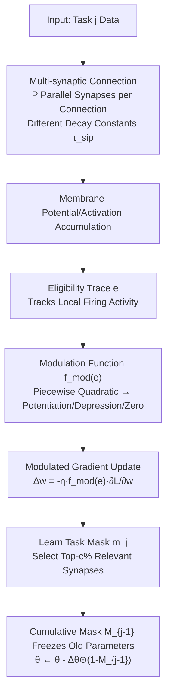

# Multi-Synaptic Cooperation: A Bio-Inspired Framework for Robust and Scalable Continual Learning

**Conference**: ICLR 2026  
**OpenReview**: [https://openreview.net/forum?id=KjxS4AgFol](https://openreview.net/forum?id=KjxS4AgFol)  
**Code**: To be confirmed  
**Area**: Continual Learning / Brain-inspired Computing / Catastrophic Forgetting  
**Keywords**: Continual Learning, Multi-Synaptic Cooperation, Eligibility Trace, Synaptic Plasticity, SNN, Catastrophic Forgetting, Task Order Robustness  

## TL;DR
Inspired by the biological observation that multiple parallel synapses exist between a single axon-dendrite pair, this paper proposes MSCN. It enhances representation capacity within a **fixed network structure** by using multiple parallel synapses and modulates synaptic plasticity via local activity based on eligibility traces. This approach alleviates catastrophic forgetting without dynamic expansion and significantly improves robustness to task order.

## Background & Motivation
**Background**: Continual learning requires models to learn multiple tasks sequentially without forgetting old knowledge. Mainstream methods include rehearsal, regularization, and architecture-based approaches. Architecture-based methods are prominent for achieving "zero forgetting" by allocating sub-networks to tasks, typically through dynamic expansion or pruning/masking dense models (e.g., PackNet, SupSup, WSN).

**Limitations of Prior Work**: Architecture-based methods face two major issues: (i) Dynamic expansion requires the network to grow with the number of tasks, which is hardware-unfriendly and capacity-limited over long sequences; (ii) Both expansion and pruning are **highly sensitive to task order**, with performance fluctuating significantly based on the arrival sequence of tasks.

**Key Challenge**: The human brain performs lifelong learning **without structural growth**. Biological observations show **multi-synaptic connectivity** (redundant synaptic connections between neuron pairs) and that synaptic changes follow "three-factor learning rules"—controlled not only by global neuromodulatory signals but also by **local synaptic activity**. Existing ML methods utilize neither the capacity provided by multi-synaptic redundancy nor the plasticity modulation driven by local activity.

**Goal**: To simultaneously improve capacity and task order robustness through "Multi-Synaptic Cooperation + Local Activity Modulation" without increasing network depth/width or relying on dynamic expansion.

**Core Idea**: **[Multi-synaptic Parallelism]** Expand a single connection into $P$ parallel synapses with different time constants for capacity expansion; **[Local Activity Modulation]** Use a shared eligibility trace to track recent firing activity, which is mapped via a nonlinear modulation function to control the intensity and direction (potentiation/suppression) of each weight update, achieving selective activation of task-related synapses and suppression of irrelevant ones.

## Method

### Overall Architecture
MSCN consists of two components: (1) **Multi-synaptic connection structure**—replacing the traditional "one connection, one synapse" with $P$ parallel synapses per connection, each having an independent decay time constant to expand capacity within a fixed topology; (2) **Eligibility trace-based plasticity modulation**—$P$ parallel synapses share an eligibility trace tracking local firing, which a piecewise quadratic modulation function maps to "potentiation/depression/invariant" factors to scale gradient updates. These are integrated into the classic architecture-based continual learning paradigm (learning binary masks + freezing old task parameters via cumulative masks), applicable to both SNNs and ANNs.

### Key Designs

**1. Multi-synaptic Parallel Neuron Modeling: Expanding capacity in fixed topologies using heterogeneous time constants.** The premise is that biological neurons have multiple synaptic contacts per axon-dendrite pair, providing redundancy and adaptability. In SNNs, traditional LIF neurons assume one synapse per connection ($\tau_m \frac{dV}{dt} = -(V-V_{rest}) + I(t)$), limiting representation diversity. MSCN expands the connection from pre-synaptic neuron $i$ to post-synaptic neuron into $P \geq 1$ parallel synaptic pathways. The membrane potential becomes $V(t)=\sum_{i=1}^{N}\sum_{p=1}^{P} w_{ip}\,\mathrm{PSP}_{ip}(t) - \vartheta\sum_j e^{-(t-t_s^j)/\tau_m}$, where $w_{ip}$ is the weight of the $p$-th parallel synapse. Crucially, **each parallel synapse is assigned a different, non-trainable decay time constant** $\tau_{sip}$ (synaptic kernel $K_{ip}(t)=e^{-t/\tau_{sip}}$). This preserves synaptic heterogeneity, allowing multiple channels with different timescales and weights to shape spatio-temporal representations, effectively expanding the "synaptic dimension" without adding width or depth. The ANN version is a direct non-spiking equivalent.

**2. Eligibility Trace-driven Local Plasticity Modulation: Letting "recent activity" determine weight changes.** This is the source of robustness. $P$ parallel synapses on a connection **share one eligibility trace** $\tilde e$. In continuous time, $\frac{d\tilde e}{dt}=-\frac{\tilde e}{\tau}+\sum_f \delta(t-t^f)$, implemented discretely as $\tilde e[t+1]=\tilde e[t]-\frac{\tilde e[t]}{\tau}+S[t+1]$ (where $S \in \{0, 1\}$ denotes firing)—accumulating recent spikes and decaying exponentially. After normalizing $\tilde e$ to $[-1, 1]$, it enters a piecewise quadratic modulation function $f_{mod}(\tilde e)$: it rises linearly to $\theta_{max}$, crosses zero at $e_{inv}$, and reverses. This leads to potentiation when $|f_{mod}| \geq 1$, depression when $0 < |f_{mod}| < 1$, and full suppression when $f_{mod}=0$. The final weight update is scaled: $\Delta w=-\eta \cdot f_{mod}(\tilde e) \cdot \frac{\partial L}{\partial w}$. The intuition is to dynamically decide whether to strengthen or weaken each synapse based on recent local activity, simulating "activity-dependent robust learning" where task-relevant synapses are amplified and irrelevant ones suppressed, making the model insensitive to task order perturbations.

**3. Integration with Architecture-based Paradigms: Zero forgetting via masking and freezing.** Multi-synapsis and modulation provide the underlying mechanism, while the outer layer follows the sub-network paradigm. In a multi-head setting (task ID known during training/inference), a binary mask $m_j^*$ is learned for task $j$ to activate relevant synapses, targeting $\theta^*, m_j^* = \arg\min \frac{1}{n_j} \sum [L(F(x; \theta \odot m_j), y) - L(F(x; \theta), y)]$. A relevance score $r$ (per synapse) is maintained to select top-weighted $c\%$ synapses. To preserve old knowledge, a cumulative mask $M_{j-1} = \bigvee_{i=1}^{j-1} m_i$ is used: $\theta \leftarrow \theta - \Delta \theta \odot (1 - M_{j-1})$. This **allows only unassigned synapses to be trainable**, while parameters allocated to previous tasks are frozen—ensuring structural zero forgetting (BWT=0) while the two proposed mechanisms optimize the use of fixed capacity and ensure order robustness.

## Key Experimental Results

Setup: Task-incremental multi-head, four benchmarks (PMNIST, 10-split CIFAR-100, TinyImageNet, 5-Datasets), SNN and ANN architectures, metrics include Average Accuracy (ACC↑) and Backward Transfer (BWT↑, where 0 means no forgetting), default $P=3$.

### Main Results (ACC %, Selected)

| Architecture | Method | PMNIST | CIFAR-100 | TinyImageNet | 5-Datasets |
| :--- | :--- | :--- | :--- | :--- | :--- |
| SNN | HLOP (ICLR24) | 95.15 | 78.58 | 71.40 | 88.65 |
| SNN | **MSCN** | **96.34** | **79.54** | **73.22** | **88.84** |
| ANN | WSN (ICML22) | 96.41 | 76.38 | 71.96 | 93.41 |
| ANN | SPG (ICML23) | 96.35 | 74.82 | 73.26 | 93.32 |
| ANN | Bayesian (ICML24) | 96.74 | 75.57 | 73.93 | 93.36 |
| ANN | **MSCN** | **97.53** | **77.37** | **75.03** | **93.69** |

- On ANN/TinyImageNet, MSCN outperforms the second-best Bayesian by **1.10%**. MSCN consistently ranks first or tied for first across both architectures and all datasets, maintaining BWT=0 (zero forgetting).

### Ablation Study (ACC %, ANN)

| Multi-Synapse | Modulation | PMNIST | CIFAR-100 | TinyImageNet | 5-Datasets |
| :--- | :--- | :--- | :--- | :--- | :--- |
| ✓ | ✓ | **97.53** | **77.37** | **75.03** | **93.69** |
| ✗ | ✓ | 96.79 | 77.03 | 73.81 | 93.47 |
| ✓ | ✗ | 96.53 | 76.81 | 73.78 | 93.51 |
| ✗ | ✗ | 96.34 | 76.34 | 72.59 | 93.32 |

- Removing modulation significantly decreases performance on TinyImageNet/PMNIST, while removing multi-synapsis impacts CIFAR-100/5-Datasets. The **cooperation** of both mechanisms is essential.

### Key Findings
- **Task Order Robustness**: Across three different task sequences on CIFAR-100 Split, EWC/GPM show high variance, and WSN tends to overfit specific sequences. MSCN exhibits the smallest per-task variance and maintains stable accuracy (Fig. 3).
- **Optimal Synaptic Range**: Increasing the number of synapses $P$ per connection improves per-task accuracy, but simultaneous expansion of synapses and neurons leads to **saturation**—capacity exceeds task complexity. Excessive connectivity can impair learning efficiency, suggesting an optimal trade-off in "synaptic richness vs. learning efficiency," echoing biological brain distributions.

## Highlights & Insights
- **Expansion via New Dimension**: Moves beyond "deeper/wider/dynamic" expansion by expanding in the **batch/synaptic dimension**. Using parallel heterogeneous synapses in a fixed topology is much more hardware-friendly.
- **Tractable Robustness**: Attributes the task-order sensitivity of architecture-based methods to a lack of local activity modulation and provides a computable modulation function via eligibility traces, significantly reducing experimental variance.
- **Bio-plausible and Generic**: Mechanisms are defined at the synaptic level, applicable to both SNNs and ANNs. The observed "optimal synaptic interval" aligns with neuroscientific findings, enhancing credibility.
- **Balance of Zero Forgetting and High Accuracy**: Compared to other BWT=0 methods like PackNet/SupSup/WSN, MSCN achieves higher ACC while maintaining zero forgetting.

## Limitations & Future Work
- **Dependency on Task IDs**: Both training and inference assume known task identities (task-incremental), which is a relatively relaxed scenario. Class-incremental or task-agnostic settings remain unverified.
- **Non-trainable Time Constants**: $\tau_{sip}$ values are manually initialized and fixed. The optimal $P$ varies with task difficulty and lacks an adaptive selection mechanism.
- **Heuristic Modulation Function**: The piecewise quadratic $f_{mod}$ follows existing work; sensitivity to hyperparameters ($\theta_{max}, e_{inv}$) and its theoretical basis require further analysis.
- **Benchmark Scale**: Experiments focus on small-to-medium scale vision benchmarks; they do not involve large-scale sequences, LLMs, or cross-modal continual learning.

## Related Work & Insights
- **Architecture-based Continual Learning**: Methods like PackNet, SupSup, WSN, and HAT use masks/pruning to allocate sub-networks. MSCN adopts this outer paradigm but replaces dynamic expansion with multi-synapsis and modulation.
- **Brain-inspired Plasticity**: Three-factor learning rules and eligibility traces (Frémaux & Gerstner) form the biological basis of the modulation. Recent work (e.g., Zenke & Laborieux 2024) indicates that multi-synaptic/redundant connections enhance computational capacity; this paper applies "cooperation between multiple synapses" to continual learning.
- **Insights**: Using structural redundancy and local activity gating as a trade-off for capacity and stability is valuable for resource-constrained edge learning and SNN neuromorphic hardware. Eligibility traces could serve as differentiable signals in other scenarios requiring "activity-dependent learning rates."

## Rating
- **Novelty**: ⭐⭐⭐⭐ — Introduces "multi-synaptic parallelism + eligibility trace modulation" to continual learning, expanding capacity in the synaptic rather than network dimension with strong biological motivation.
- **Experimental Thoroughness**: ⭐⭐⭐⭐ — Covers four datasets, SNN/ANN architectures, 5 seeds, ablations, and robustness/saturation analyses; however, it remains restricted to task-incremental multi-head scenarios and medium benchmarks.
- **Writing Quality**: ⭐⭐⭐⭐ — Clear logical chain from motivation to mechanism to experiment. Formulas and visualizations (modulation function, heatmap) are well-integrated.
- **Value**: ⭐⭐⭐⭐ — Provides a hardware-friendly, robust mechanism for continual learning without expansion, particularly relevant for the neuromorphic computing community.

<!-- RELATED:START -->

## Related Papers

- [\[ICLR 2026\] Memory-Statistics Tradeoff in Continual Learning with Structural Regularization](memory-statistics_tradeoff_in_continual_learning_with_structural_regularization.md)
- [\[ICLR 2026\] Understanding the Dynamics of Forgetting and Generalization in Continual Learning via the Neural Tangent Kernel](understanding_the_dynamics_of_forgetting_and_generalization_in_continual_learnin.md)
- [\[ICLR 2026\] PAC-Bayes Bounds for Cumulative Loss in Continual Learning](pac-bayes_bounds_for_cumulative_loss_in_continual_learning.md)
- [\[ICLR 2026\] A Generalized Geometric Theoretical Framework of Centroid Discriminant Analysis for Linear Classification of Multi-dimensional Data](a_generalized_geometric_theoretical_framework_of_centroid_discriminant_analysis_.md)
- [\[ICLR 2026\] Noise Tolerance of Distributionally Robust Learning](noise_tolerance_of_distributionally_robust_learning.md)

<!-- RELATED:END -->
