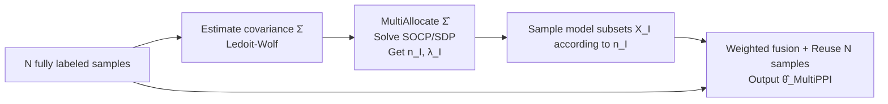

# Multiple-Prediction-Powered Inference

**Conference**: ICLR 2026  
**OpenReview**: [https://openreview.net/forum?id=gJZ5rf2bS4](https://openreview.net/forum?id=gJZ5rf2bS4)  
**Code**: TBD  
**Area**: Statistical Inference / Learning Theory (Prediction-Powered Inference, Budget Allocation)  
**Keywords**: Prediction-Powered Inference, Optimal Budget Allocation, Minimax Optimality, Second-Order Cone Programming, LLM Evaluation, Autorater  

## TL;DR
MultiPPI formalizes the task of "efficiently estimating a mean using multiple predictors of varying costs/qualities under a fixed budget" as a convex optimization problem (specifically, a Second-Order Cone Program (SOCP) under a single constraint). It automatically determines which subsets of models to query, the number of queries for each, and their corresponding weights. Theoretically, it is minimax optimal when the covariance is known. Experimentally, it consistently achieves lower error than existing PPI baselines across three types of LLM evaluation tasks.

## Background & Motivation

**Background**. In scientific measurement and AI model evaluation, there is often an expensive but high-quality metric (e.g., human annotation, a powerful proprietary model as an autorater) alongside multiple cheap but noisy proxies (small model autoraters, rule-based systems). Prediction-Powered Inference (PPI) and its efficient variant PPI++ (Angelopoulos et al.) combine a small number of "gold labels" with a large number of cheap model predictions to provide unbiased, low-variance estimates of population quantities.

**Limitations of Prior Work**. Existing PPI frameworks either assume a **single** predictor or a **fixed set of predictors queried together** (e.g., Vector PPI++ by Miao et al., which concatenates all predictions into a vector). However, in reality, multiple autoraters have distinct cost-performance curves: the best models are often the most expensive. If certain proxies are costly, the number of times they can be sampled is limited; tethering them to cheap models in every query is suboptimal. Conversely, "manually selecting one cost-effective model for PPI" lacks guidance on selection and may perform worse than a combination of cheap subsets.

**Key Challenge**. This is a **budget allocation problem**: under a hard budget constraint, deciding which model subsets to query (individually, jointly, or any arbitrary subset), how many times to query each, and how to combine these measurements to achieve the minimum variance estimate. Joint observations can reduce variance by leveraging correlations but incur a joint sampling cost. Furthermore, cost structures may be non-additive (e.g., parallel autoraters where latency cost $\approx$ the slowest model, whereas in medical testing, additional tests increase aggregate difficulty).

**Goal**. Given a random vector $X=(X_1,\dots,X_k)$ and a cost structure, estimate any linear functional $\theta^* = a^\top \mathbb{E}[X]$ (e.g., $a=(1,0,\dots)$ to estimate $\mathbb{E}[X_1]$, or $a=(1,-1,0,\dots)$ to estimate the difference in means) under a total budget $B$, while providing minimax optimality, finite-sample bounds, and asymptotic normality.

**Key Insight**. **Budget-adaptive subset allocation**. Instead of a binary choice between "single model" or "all models," the framework allows flexible sampling of any index subset $I\subseteq\{1,\dots,k\}$. By unifying the "allocation of sample counts $n_I$" and "selection of weights $\lambda_I$" into a single convex optimization, the method automatically transitions from relying on cheap proxies to incorporating expensive, precise models as the budget increases.

## Method

### Overall Architecture
MultiPPI expresses the estimator as a weighted sum of sample means from each subset: $\hat\theta(n,\lambda)=\sum_{I:n_I>0}\frac{1}{n_I}\sum_j \lambda_I^\top X_I^{(j)}$. It minimizes the MSE by solving for optimal sampling allocations $\{n_I\}$ and weights $\{\lambda_I\}$ subject to unbiasedness and budget constraints. The process consists of two layers: first, proving this estimator is minimax optimal under the ideal condition of "known covariance $\Sigma$" (the theoretical anchor); second, replacing $\Sigma$ with an estimated $\hat\Sigma$ to provide a practical algorithm with stability bounds.

### Key Designs

**1. Transforming budget allocation into convex optimization (SOCP/SDP).** Since the estimator is linear with respect to $X$, the optimal $(n, \lambda)$ depends only on the covariance matrix $\Sigma = \mathrm{Cov}(X)$. The unbiasedness constraint $\mathbb{E}[\hat\theta] = \theta^*$ simplifies to a linear constraint on $\lambda$. The optimal MSE can then be written as $V_B = \min_{n: B \text{ holds}} a^\top S(n) a$, where $S(n) = \big(\sum_{I\in\mathcal{I}} n_I \Sigma_I^\dagger\big)^\dagger$ ($\Sigma_I$ is the principal submatrix of $\Sigma$ for subset $I$ embedded back into $\mathbb{R}^{k\times k}$, and $\dagger$ denotes the Moore-Penrose pseudoinverse). After relaxing the integer constraint on $n_I$, the problem becomes a **Second-Order Cone Program (SOCP)** under a single budget constraint, or a **Semidefinite Program (SDP)** under multiple constraints, both solvable via tools like cvxpy. Notably, Vector PPI++ and Cascaded PPI are special cases within this unified search space where certain $\lambda_I$ are restricted to zero.

**2. Minimax optimality with known covariance.** The authors show that if $\Sigma$ is known, the minimum variance linear unbiased estimator is equivalent to the minimax optimal estimator for MSE (Theorem 2). Specifically, for the set of all full-budget estimators $\Theta_B$ (not restricted to linear or unbiased classes), $\inf_{\hat\theta\in\Theta_B}\sup_{P\in\mathcal{P}_\Sigma}\mathbb{E}[(\hat\theta-\theta^*)^2]=\mathrm{Var}(\hat\theta_{\text{MultiPPI}}(\Sigma))=V_B$, where $\mathcal{P}_\Sigma$ is the family of all distributions with covariance $\Sigma$. This implies the MSE achieved is a lower bound that cannot be outperformed within the covariance family, decoupling resource allocation from correlation structure estimation.

**3. Practical algorithm and stability bounds with unknown covariance.** In practice, $\Sigma$ is estimated from data. Theorem 3 proves that as long as $\hat\Sigma \xrightarrow{p} \Sigma$ (as budget $B \to \infty$), $\hat\theta_{\text{MultiPPI}}(\hat\Sigma)$ is asymptotically normal and achieves the optimal variance $V^*$. Crucially, even if $\hat\Sigma$ is misspecified, the estimator remains unbiased and satisfies budget constraints. Theorem 4 (Stability) provides a finite-sample error sensitivity bound: $\mathbb{E}[(\hat\theta_{\text{MultiPPI}}(\hat\Sigma)-\theta^*)^2]\le V_B + \frac{4\sigma^2_{\text{classical}}}{\gamma_{\min}}\|\hat\Sigma-\Sigma\|_F$. Because the error is controlled by the Frobenius norm $\|\hat\Sigma-\Sigma\|_F$, the authors utilize the **Ledoit-Wolf estimator**, which minimizes this norm. The workflow involves using $N$ fully labeled samples to estimate $\hat\Sigma$, solving the optimization for $n_I, \lambda_I$, and sampling additional data while **reusing** the original $N$ samples (which introduces slight finite-sample bias but maintains consistency).

## Key Experimental Results

Evaluation Setup: Estimating $\theta^* = \mathbb{E}[X_1]$ with budgets ranging from 0 to 2k units (1 unit = one query to the most expensive model). 500k random trials were conducted with 250 initial labels. Reported metrics: coverage, 95% CI width, and MSE (the latter two as ratios relative to classical sampling; lower is better).

### Main Results (Three LLM Evaluation Tasks)

| Experiment | Task / Goal | Model Family ($X_2 \dots X_k$) | Cost Structure | Conclusion |
|------------|-------------|--------------------------------|----------------|------------|
| Exp 1 Chatbot Arena | Est. win rate: Claude-2.1 vs GPT-4-1106 | Gemini 2.5 Pro / Flash autoraters | Additive (API pricing) | MultiPPI outperforms all baselines across **all budget ranges**. |
| Exp 2 ProcessBench | Est. ratio of step-wise errors in math | Gemini 2.5 Pro with thinking budgets (125/250/375/500 words) | Non-additive, Cascaded (Input $\propto$ sum, Output $\propto$ max) | MultiPPI is optimal across the entire range. |
| Exp 3 Bio-Factuality | Est. factuality consistency of 524 CS biographies | Gemini 2.0 Flash Lite multi-turn debate ($A$ agents $\times$ $R$ rounds) | Cascaded, Cost = $A \cdot R$ | MultiPPI is optimal across the entire range. |

### Key Findings

- **No single baseline is globally optimal**: Scalar PPI++ (using cheap models) performs best at low budgets, while Vector PPI++ (using all models) takes the lead at high budgets. MultiPPI consistently outperforms the best available baseline in every interval.
- **Budget adaptation verified**: The learned $\lambda_I, n_I$ converge to "PPI++ with cheap models" at low budgets and to Vector PPI++ or Cascaded PPI (e.g., using medium models to debias large models in Exp 2) at high budgets, aligning with theory.
- **Expensive $\neq$ More Accurate**: In Exp 1, PPI++ with Gemini 2.5 Pro was excluded from the Pareto frontier as it was more expensive without being significantly more correlated with labels than the Flash version. In Exp 2, "thinking longer" did not reduce systematic bias, but PPI-style debiasing successfully corrected it.
- **Coverage nuances**: In Exp 3 at high budgets, 95% CI coverage was slightly low (approx. 1% under-coverage) due to finite-sample bias from data reuse. This phenomenon disappears when the number of labels $N$ scales with the budget (e.g., $N=1000$).

## Highlights & Insights
- **Discretized subset selection transformed into convex optimization**: Converting what looks like a combinatorial problem into a solvable convex form where Vector PPI++ and Cascaded PPI are special cases is a significant unification of disparate heuristics.
- **Theoretical rigor**: The work provides a complete package consisting of minimax optimality (not restricted to linear/unbiased classes), asymptotic normality, and finite-sample stability bounds. The stability bound provides a principled reason to choose the Ledoit-Wolf estimator.
- **Interpretable budget adaptation**: The method is not a black box; it smoothly transitions from "trusting cheap proxies" to "incorporating expensive models" as the budget allows, with theoretical characterization of this transition.
- **Directly addresses LLM evaluation pain points**: It naturally accommodates diverse autorater costs, parallel query structures (non-additive costs), and cascaded costs in test-time scaling.

## Limitations & Future Work
- **Fixed (Non-adaptive) Allocation**: To guarantee hard budgets and valid CIs, MultiPPI solves for a **fixed** allocation strategy. It does not utilize input-conditional sequential strategies (e.g., as in Angelopoulos 2025), which might further reduce variance but at the cost of complicating CI validity.
- **Dependence on Covariance Estimation**: Finite-sample performance is sensitive to $\|\hat\Sigma - \Sigma\|_F$. In scenarios with many models (large $k$) or few samples, poor estimation of $\hat\Sigma$ can hinder performance.
- **Subset Combinatorics**: The framework theoretically considers $2^k$ subsets. Scalability for very large $k$ was not explored in depth.
- **Data Reuse Bias**: Reusing the $N$ burn-in samples for both estimating $\hat\Sigma$ and calculating $\hat\theta$ introduces bias at small sample sizes (visible in the slight under-coverage in Exp 3), requiring $N$ to grow with the budget to vanish.

## Related Work & Insights
- **PPI / PPI++** (Angelopoulos et al. 2023a/b): The direct foundation; MultiPPI is a cost-aware, multi-predictor generalization.
- **Control Variates / Difference Estimation** (Ripley 1987; Särndal 1992) and **Semiparametric Inference** (AIPW, TMLE, DML): Shared roots in using correlated variables for variance reduction.
- **Vector PPI++** (Miao et al. 2024) and **Single-Predictor Sampling** (Angelopoulos et al. 2025): MultiPPI proves these are special cases or partial generalizations, utilizing hard budgets and fixed allocations rather than expected budgets and input-level policies.
- **Budgeted Regression / Active Learning / Bandit Adaptive Monte Carlo**: Similar allocation perspectives, though the goal here is estimating linear functionals of population means rather than sample-level predictions or regret minimization.

## Rating
- **Novelty**: ⭐⭐⭐⭐ Unifying multi-predictor budget allocation into a convex optimization framework with minimax optimality is a substantial extension of the PPI lineage.
- **Experimental Thoroughness**: ⭐⭐⭐⭐ Covers three realistic LLM evaluation tasks (win rates, test-time scaling, multi-agent debate) including additive, non-additive, and cascaded costs. 
- **Writing Quality**: ⭐⭐⭐⭐ Clear problem formulation, logical progression of theory, and well-explained experimental results.
- **Value**: ⭐⭐⭐⭐ Provides a principled and practical solution for cost-effective LLM evaluation using off-the-shelf solvers, balancing theory and application.

<!-- RELATED:START -->

## Related Papers

- [\[ICLR 2026\] Revisiting Active Sequential Prediction-Powered Mean Estimation](revisiting_active_sequential_prediction-powered_mean_estimation.md)
- [\[ICLR 2026\] Variational Inference for Cyclic Learning](variational_inference_for_cyclic_learning.md)
- [\[NeurIPS 2025\] Prediction-Powered Semi-Supervised Learning with Online Power Tuning](../../NeurIPS2025/learning_theory/prediction-powered_semi-supervised_learning_with_online_power_tuning.md)
- [\[ICLR 2026\] Singleton-Optimized Conformal Prediction](singleton-optimized_conformal_prediction.md)
- [\[ICLR 2026\] Best-of-Majority: Minimax-Optimal Strategy for Pass@k Inference Scaling](best-of-majority_minimax-optimal_strategy_for_passk_inference_scaling.md)

<!-- RELATED:END -->
