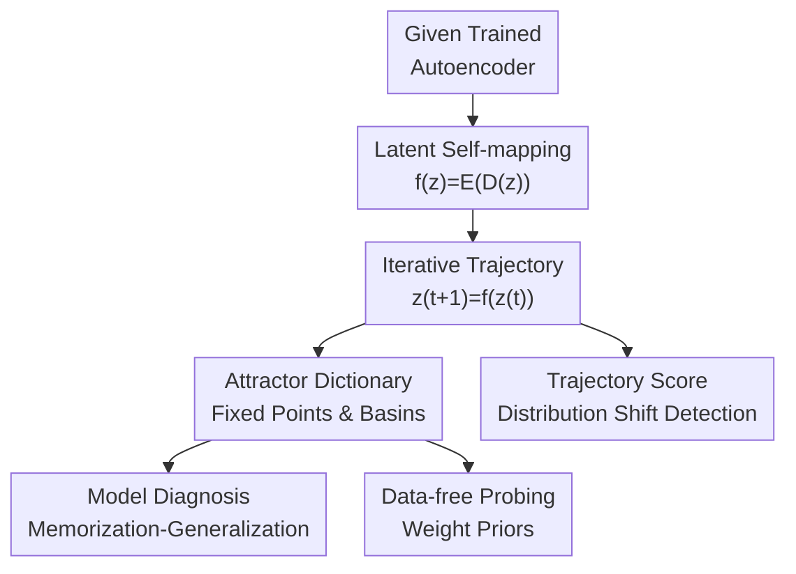

# Navigating the Latent Space Dynamics of Neural Models

**Conference**: ICLR2026  
**OpenReview**: [https://openreview.net/forum?id=Zunww3FHPU](https://openreview.net/forum?id=Zunww3FHPU)  
**Code**: Not open-sourced (committed to release after acceptance)  
**Area**: Learning Theory / Representation Learning Analysis  
**Keywords**: Latent Space Dynamics, Autoencoders, Attractors, Memorization and Generalization, Out-of-Distribution Detection

## TL;DR

This paper interprets autoencoders as dynamical systems acting on a latent manifold: repeatedly executing $f(z)=E(D(z))$ induces a latent vector field whose attractors and trajectories explain the model's memorization-generalization state, probe prior information in pre-trained weights without data, and facilitate out-of-distribution (OOD) detection.

## Background & Motivation

**Background**: Representation learning typically understands neural networks as mappings from high-dimensional inputs to low-dimensional latent spaces, focusing on whether latent representations are linearly separable, semantically consistent, or suitable for downstream tasks. For autoencoders (AEs), VAEs, MAEs, or AE backbones in diffusion models, analysis often targets reconstruction error, bottleneck dimensions, regularization terms, or latent distributions, while rarely studying the "dynamics formed when the model is repeatedly applied in the latent space."

**Limitations of Prior Work**: Existing theories regarding autoencoders memorizing training samples mostly rely on strong over-parameterization or specific network forms, explaining whether the model stores samples like associative memory. However, real-world models often exist in complex intermediate states: some attractors are close to training samples, while others resemble category prototypes or low-dimensional dictionaries. These structures change with early training stages, regularization strength, and bottleneck dimensions. It is difficult to distinguish these states solely by reconstruction loss, as two models may have similar training errors but interpolate in completely different ways outside the training support.

**Key Challenge**: The objective of an autoencoder requires $D(E(x))$ to be close to the input while compressing local degrees of freedom through mechanisms like bottlenecks, weight decay, noise, masking, KL divergence, or sparsity. The former encourages retaining sample details, while the latter encourages the mapping to contract within the data neighborhood. The key observation of this paper is that this contraction is not just an optimization side effect; it causes $f=E\circ D$ to develop fixed points and attraction basins in the latent space, which carry information about what the model "remembers, where it generalizes, and how it distinguishes distributions."

**Goal**: The authors aim to establish a unified perspective interpreting autoencoders and their variants as discrete dynamical systems on the latent space. They seek to answer: first, why actual trained neural mappings naturally induce attractors; second, which model properties correspond to attractors and trajectories; and third, whether this representation can become an actionable analysis tool for real foundation models.

**Key Insight**: Instead of training an additional probe, the paper uses only the existing encoder $E$ and decoder $D$ of an AE to construct the self-mapping $f(z)=E(D(z))$. Starting from any latent point $z_0$ and iteratively computing $z_{t+1}=f(z_t)$ yields a trajectory. The trajectory residual $f(z)-z$ represents the vector field direction, and the convergence point $z^*=f(z^*)$ is the attractor. This perspective is attractive because it transforms priors hidden in model weights into geometric objects, requiring no labels—and in some experiments, not even real input data.

**Core Idea**: Induce a vector field using the latent self-mapping $E\circ D$ of an autoencoder, transforming a "reconstruction model" into a "navigable dynamical system," and then utilize attractors and trajectories to analyze memorization, generalization, weight priors, and distribution shifts.

## Method

### Overall Architecture

The proposed method is an analysis framework rather than a new model requiring training. Given any trained autoencoder or model with an encoder-decoder structure, the authors define $f(z)=E(D(z))$ in the latent space. Starting from training samples, test samples, or pure noise to initialize latent points, they iteratively compute $z_{t+1}=f(z_t)$. The direction, convergence speed, final attractors, and their basins of each trajectory are treated as model representations to explain model states or construct downstream analysis scores.

Formally, the discrete iteration

$$
z_{t+1}=f(z_t), \quad z_0=z
$$

corresponds to continuous residual dynamics

$$
\frac{\partial z}{\partial t}=f(z)-z.
$$

Thus, $f(z)-z$ is the direction of the latent vector field at $z$. If $f$ is locally a contraction mapping with a Lipschitz constant less than 1, the Banach Fixed-Point Theorem guarantees convergence to a fixed point. If the absolute values of the eigenvalues of the Jacobian $J_f$ at the fixed point are all less than 1, it is an attractor that pulls in neighboring trajectories.

### Key Designs

**1. Latent Self-mapping: Turning Autoencoders into Training-free Vector Fields**

The fundamental design is reinterpreting the AE's encoder-decoder combination as a self-mapping on the latent space. While we usually care if $F(x)=D(E(x))$ reconstructs the input image, the authors focus on taking a point $z$ in latent space, decoding it to input space, and encoding it back: $f(z)=E(D(z))$. If $z$ is near the latent manifold deemed reasonable by the model, $f(z)$ should not be far; if $z$ is in an unfamiliar or low-density region, $f(z)-z$ pushes it toward regions the model prefers.

This construction introduces no additional learning targets. The vector field is not fitted but is a geometric object defined by the model's parameters. Consequently, an AE can be "navigated": starting from a training sample's latent code to see which attractor it reaches; starting from test samples to check basin coverage; or starting from Gaussian noise to see if weights push noise toward stable patterns. Model analysis shifts from point-wise reconstruction error to full trajectories and fixed points.

**2. Contractivity Assumption: Explaining the Emergence of Attractors**

Rather than assuming all neural networks are contraction mappings, the authors trace contractivity to inductive biases in training pipelines. Bottleneck dimensions $k=\dim(Z)$ strictly limit the rank of the encoder Jacobian; weight decay reduces weight norms, tending to lower the Jacobian spectral norm; denoising, masking, and data augmentation require insensitivity to local perturbations, effectively penalizing rates of change in the data neighborhood. VAE KL-divergence, SAE sparsity constraints, and contractive AE Jacobian penalties all fit this picture.

From this viewpoint, the training goal is a trade-off between reconstruction and local contraction. The paper expresses this as MSE with a regularization term, e.g., $\|x-F(x)\|_2^2+\lambda R(\Theta)$, emphasizing that $R$ can be explicit or implicit contraction pressure. When $\|J_f(z)\|_\sigma<1$ holds in a neighborhood, iterating $z_{t+1}=f(z_t)$ pulls nearby points to a fixed point. With strong non-linearity, different initializations fall into different basins, forming an attractor dictionary.

**3. Attractor Dictionary: Decomposing Memorization and Generalization with Fixed Points**

The interpretation of attractors is crucial: they are not just "bad memory points" but a dictionary of prototypes stored in weights. In extreme memorization states, the decoded attractor $D(z^*)$ may be very close to a specific training sample. In well-generalized states, attractors resemble prototypes or bases covering the latent distribution, capable of reconstructing different samples using fewer atoms.

The authors provide an error decomposition: let $Z^*$ be a set of attractors and $\Pi(E(x))$ be the nearest attractor to a test sample's latent code. If the decoder is $L_D$-Lipschitz, reconstruction error splits into two parts: prototype error (sample to decoded attractor) and coverage error (latent code to nearest attractor). If attractors stick strictly to training samples, training prototype error is low but coverage is narrow; if attractors cover the test distribution, the model generalizes better.

**4. Trajectory Statistics: Detecting Distribution Shifts via Paths**

OOD samples might sometimes fall into the same basins as ID samples. Thus, the paper uses the entire path rather than just the final attractor. For a test sample $z$, the trajectory $\pi(z)=[z_0,\ldots,z_N]$ is recorded, and the average distance from each point in the trajectory to the set of training attractors $Z^*_{train}$ is calculated:

$$
\mathrm{score}(z)=\frac{1}{N}\sum_{z_i\in\pi(z)} d(z_i,Z^*_{train}).
$$

This score captures two scenarios: if an OOD sample never enters a training attractor basin, the distance remains large; if it enters the same basin but with different convergence speed or path shape, the average distance still exposes the difference. Unlike KNN, which is static, this score utilizes the model's dynamical response—"placing a sample in the model's flow field to see how it is pushed."

### Loss & Training

Ours does not involve training new models; it analyzes existing or from-scratch AEs by iterating $f=E\circ D$. The basic AE training objective is MSE plus regularization:

$$
L_{MSE}(x)=\sum_{x\in X}\|x-F_\Theta(x)\|_2^2+\lambda R(\Theta).
$$

For denoising or masked AEs, the goal is reconstructing the original input from perturbed samples $T\sim p(T)$, e.g., $\|x-F(Tx)\|_2^2$. These are not new losses but sources of the "induced local contraction" identified by the authors. For calculating attractors, iterations continue until the residual is below a threshold (e.g., $10^{-6}$ for small AEs, $10^{-5}$ for foundation models).

## Key Experimental Results

### Main Results

Experimental lines: 1) Adjusting bottleneck dimensions on MNIST/CIFAR10 to observe attractor-memorization relations. 2) Calculating attractors from Gaussian noise in Stable Diffusion AE to test them as data-free dictionaries. 3) Using latent trajectories in ViT-MAE for OOD detection.

| Experimental Question | Model / Data | Key Metrics | Main Conclusion |
|----------|-------------|----------|----------|
| Bottleneck effect on mem-gen | Conv AE; MNIST / CIFAR10; $k=2$ to $512$ | Memorization coefficient, test error | Small $k$ and strong reg. lead to attractors close to training samples (poor generalization); mid-high $k$ allows attractors to cover distribution. |
| Attractor evolution during training | MNIST Conv AE; $k=128$ | Attractor count, train/noise attractor similarity | Models start with few attractors/strong memory; attractor count increases and stabilizes; noise attractors converge toward training attractors. |
| Data-free probing of foundation models | Stable Diffusion AE; 4096 noise attractors | OMP reconstruction MSE vs sparsity | Noise attractors act as a better dictionary than random orthogonal bases across multiple datasets (ImageNet, etc.). |
| Trajectory-based OOD detection | ViT-MAE; ImageNet training attractors | FPR95, AUROC | Trajectory distance to training attractors significantly outperforms static baselines (KNN, Mahalanobis). |

In OOD detection, the trajectory score clearly outperforms KNN:

| OOD Dataset | Method | FPR95 ↓ | AUROC ↑ |
|------------|------|---------|---------|
| SUN397 | Trajectory to Train Attractor | 29.60 | 91.20 |
| SUN397 | KNN | 100.00 | 42.59 |
| Places365 | Trajectory to Train Attractor | 29.95 | 90.99 |
| Places365 | KNN | 100.00 | 32.36 |
| Texture | Trajectory to Train Attractor | 25.85 | 92.63 |
| Texture | KNN | 34.50 | 89.41 |

### Ablation Study

Rather than "removing modules," the authors ablate regularization strength, initial distributions, and detection scores.

| Configuration / Control | Key Metric | Description |
|-------------|----------|------|
| Strong reg. AE ($k=2\sim16$) | High mem. coefficient | Attractors converge to training samples; over-regularization creates narrow-coverage memory prototypes. |
| Increasing $k$ to $128\sim512$ | Lower mem. coefficient | Attractors cover more directions; higher effective rank of decoded attractor matrix (generalization). |
| Stable Diffusion Noise Attractors | OMP MSE lower than random bases | Attractors induced from weights contain signals closer to real image distributions even without input data. |
| Trajectory vs. Reconstruction Error | Improvement in AUROC | Single-step reconstruction error fails to characterize distribution shifts; full latent paths retain richer information. |

### Key Findings

- Attractors do not only correspond to over-parameterized over-fitting. Small bottlenecks or strong regularization also induce training-sample-style memorization, differing from the "big model = memory" narrative.
- Evolution of attractors: Models transition from a coarse contraction field (few attractors) to a multi-basin structure covering the data distribution.
- Trajectories remain distinguishable even when final attractors are similar, supporting the use of paths for OOD detection.
- Stable Diffusion AE noise attractors can reconstruct multi-domain images, showing that visual priors in weights can be exposed via dynamical sampling (black-box model probing).

## Highlights & Insights

- **AE as Flow Fields**: Instead of inventing new architectures, the paper ingeniously iterates existing $E\circ D$. This aligns phenomena like denoising scores, contractive AEs, and associative memory under one dynamical systems framework.
- **Granular Memorization/Generalization**: Generalization is not just "less memory" but whether attractors cover the distribution at the right granularity.
- **Data-free Probing**: Extracting geometric dictionaries from Stable Diffusion weights via noise initialization is a highly insightful way to probe pre-trained priors.
- **Path over Endpoint**: OOD samples might share basins with ID samples, but their "travel path" and speed differ. This suggests a shift from comparing final representations to comparing model response dynamics.

## Limitations & Future Work

- **Architecture Scope**: Currently most applicable to encoder-decoder structures. Extensions to pure classifiers or next-token predictors require surrogate AEs or defining residuals in output space.
- **Contractivity Verification**: While inductive biases exist, the local Lipschitz constant of large models is hard to verify globally.
- **Computational Cost**: Calculating attractors for foundation models requires many iterations; setting thresholds and sampling counts requires careful budget analysis.
- **OOD Baselines**: While outperforming static baselines like KNN, it needs comparison against more modern, specialized OOD methods and more complex distribution shifts.

## Related Work & Insights

- **vs. Denoising/Contractive AE**: Extends the link between residuals and score functions to full trajectories and attractors.
- **vs. Associative Memory**: While prior work focuses on over-parameterization, Ours shows under-fitting states also induce memorization-style attractors.
- **vs. Neural ODE/DEQ**: Unlike ODEs that model depth, this system iterates a latent self-mapping after training, serving as a model analysis operator.
- **vs. Hopfield Networks**: Memories are not specifically trained modules but emerge naturally from the AE's encoder-decoder weights.

## Rating

- **Novelty**: ⭐⭐⭐⭐⭐ Systematizing the AE latent self-map as a vector field to explain mem/gen is highly distinctive.
- **Experimental Thoroughness**: ⭐⭐⭐⭐ Good coverage of SD-AE and ViT-MAE; however, comparisons with state-of-the-art OOD methods across non-AE models remain preliminary.
- **Writing Quality**: ⭐⭐⭐⭐ Clear logic; Figures 2-5 effectively link theory to phenomena.
- **Value**: ⭐⭐⭐⭐⭐ Inspiring for representation learning, model diagnosis, and mechanistic interpretability.

<!-- RELATED:START -->

## Related Papers

- [\[ICLR 2026\] Quotient-Space Diffusion Models](quotient-space_diffusion_models.md)
- [\[ICLR 2026\] Neural Posterior Estimation with Latent Basis Expansions](neural_posterior_estimation_with_latent_basis_expansions.md)
- [\[ICLR 2026\] On the Expressiveness of State Space Models via Temporal Logics](on_the_expressiveness_of_state_space_models_via_temporal_logics.md)
- [\[ICLR 2026\] Transformers Learn Latent Mixture Models In-Context via Mirror Descent](transformers_learn_latent_mixture_models_in-context_via_mirror_descent.md)
- [\[ICLR 2026\] A Theoretical Analysis of Mamba's Training Dynamics: Filtering Relevant Features for Generalization in State Space Models](a_theoretical_analysis_of_mambas_training_dynamics_filtering_relevant_features_f.md)

<!-- RELATED:END -->
