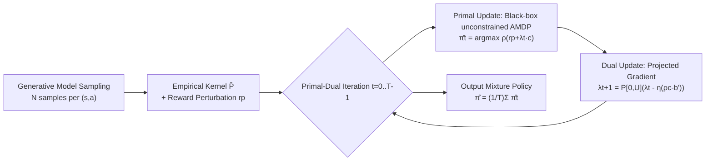

# Near-Optimal Sample Complexity Bounds for Constrained Average-Reward MDPs

**Conference**: ICLR 2026  
**OpenReview**: [https://openreview.net/forum?id=PCuvo9uIXK](https://openreview.net/forum?id=PCuvo9uIXK)  
**Code**: None (Pure theory)  
**Area**: Learning Theory / Reinforcement Learning Theory  
**Keywords**: Constrained Average-Reward MDP (CAMDP), Sample Complexity, Generative Model, Primal-Dual, Minimax Lower Bound, Slater Constant  

## TL;DR
This paper provides the **first near minimax-optimal sample complexity upper and lower bounds for learning $\varepsilon$-optimal policies in Constrained Average-Reward MDPs (CAMDPs) under a generative model**: $\tilde O\big(SA(B+H)/\varepsilon^2\big)$ for the relaxed feasibility setting and $\tilde O\big(SA(B+H)/(\varepsilon^2\zeta^2)\big)$ for the strict feasibility setting. These results, complemented by matching lower bounds, characterize how long-term constraints affect learning difficulty.

## Background & Motivation
- **Background**: The sample complexity of unconstrained Average-Reward MDPs (AMDPs) has recently been well-characterized—Zurek & Chen (2024) proved a near minimax-optimal rate of $\tilde\Theta\big(SA(B+H)/\varepsilon^2\big)$ under a generative model, where $H$ is the span of the optimal bias function and $B$ is the transient time. Discounted Constrained MDPs (CMDPs) also have minimax-optimal bounds established by Vaswani et al. (2022).
- **Limitations of Prior Work**: **CAMDP research is almost blank.** While agents must maximize steady-state long-term average rewards while satisfying average constraints on cost, risk, or resources (corresponding to long-term fairness, sustainability, and safety), there were no prior sample complexity results for learning CAMDPs. The statistical limits for relaxed and strict feasibility settings were entirely unknown.
- **Key Challenge**: Analysis techniques for discounted CMDPs (such as Bellman contraction) **fail** in the average-reward setting. Without episode resets or geometric discounting, one must reason directly about long-term steady-state behavior without discounting. The introduction of constraints further couples the primal-dual variables and is influenced by the size of the feasible region (the Slater constant $\zeta$).
- **Goal**: To characterize the sample size required to learn an $\varepsilon$-optimal policy under a generative model (a simulator that can sample transitions for any $(s,a)$), covering both **relaxed feasibility** (allowing constraint violation up to $\varepsilon$) and **strict feasibility** (zero constraint violation).
- **Core Idea**: **[Reduction + Primal-Dual]** The constrained average-reward problem is reduced to solving a sequence of unconstrained AMDPs where rewards are weighted by Lagrange multipliers. These are solved using a black-box AMDP solver. Constraint satisfaction is managed via projected gradient ascent on dual variables, with the dual range tightened using the Slater constant for strict feasibility.

## Method

### Overall Architecture
The algorithm is a **model-based primal-dual iterator**. It first collects $N$ samples per $(s,a)$ to estimate the empirical transition kernel $\hat P$. Then, on the empirical model, it alternates between "solving an unconstrained AMDP (primal update)" and "updating Lagrange multipliers via projected gradient (dual update)." Finally, it outputs a mixture policy $\hat\pi=\frac{1}{T}\sum_t\hat\pi_t$ from $T$ iterations. The same algorithm is instantiated for both relaxed and strict settings by parameterizing the constraint threshold $b'$, the dual bound $U$, and the sample size $N$.

### Key Designs
**1. Reduction to Unconstrained AMDPs: Embedding constraints into rewards.** Instead of directly solving the constrained optimization $\max_\pi \rho^\pi_r(s)\ \text{s.t.}\ \rho^\pi_c(s)\ge b$, the algorithm formulates it as a saddle-point problem $\max_\pi\min_{\lambda\ge0}\big[\rho^\pi_r(s)+\lambda(\rho^\pi_c(s)-b')\big]$. Thus, each primal update only requires solving an **unconstrained** AMDP with rewards $r_p+\lambda_t c$: $\hat\pi_t=\arg\max_\pi \rho^\pi_{r_p+\lambda_t c}$. This allows the use of any existing black-box solver (e.g., policy iteration), reusing the $SA(B+H)/\varepsilon^2$ machinery from Zurek & Chen.

**2. Discounting + Reward Perturbation for Empirical AMDPs.** Solving directly on the non-discounted empirical model is unstable due to the lack of contraction. The authors approximate each empirical AMDP as a discounted MDP with $\gamma=1-\frac{\varepsilon_{\text{opt}}}{4(B+H)}$. The reward is perturbed with $r_p(s,a)=r(s,a)+Z(s,a)$ where $Z\sim U[0,\omega]$ to ensure the uniqueness and stability of the Blackwell-optimal policy. The coupling of $\gamma$ and $\omega=(1-\gamma)\bar\varepsilon/6$ ensures the approximation error is precisely controlled by $B+H$.

**3. Dual Projected Gradient + Slater Constant to bound $|\lambda^\star|$.** Dual variables are updated via $\lambda_{t+1}=P_{[0,U]}\big(\lambda_t-\eta(\rho^{\hat\pi_t}_c(s)-b')\big)$. Theorem 1 shows that with $T=\frac{U^2}{\varepsilon_{\text{opt}}^2}\big[1+\frac{1}{(U-\lambda^\star)^2}\big]$, the mixture policy satisfies $\rho^{\hat\pi}_{r_p}(s)\ge\rho^{\hat\pi^\star}_{r_p}(s)-\varepsilon_{\text{opt}}$ and $\rho^{\hat\pi}_c(s)\ge b'-\varepsilon_{\text{opt}}$. Crucially, the **Slater constant $\zeta=\max_\pi\rho^\pi_c(s)-b$ (feasibility margin)** bounds $|\lambda^\star|$. In the relaxed setting, $|\lambda^\star|\le \frac{2(1+\omega)}{\varepsilon+\varepsilon_{\text{opt}}}$, whereas the strict setting requires a dual bound $U \propto 1/\zeta$ to eliminate violations, leading to the $1/\zeta^2$ factor.

**4. Parameter Instantiation for Relaxed vs. Strict.** The same algorithm handles both by setting $b'=b-\frac{3\varepsilon}{8}$ (relaxed, allowing an $\varepsilon$ violation) or by **tightening** the constraint threshold $b'>b$ (strict, utilizing a margin to guarantee zero violation). For the relaxed setting, $N=\tilde O\big(SA(B+H)/\varepsilon^2\big)$ is sufficient for concentration of the empirical constraint value, while the strict setting requires more samples to accommodate the $\zeta$ margin.

## Key Experimental Results
> This is a **purely theoretical work with no numerical experiments**. The core "results" are the proved sample complexity upper and lower bounds.

### Main Results: Sample Complexity Bounds

| Setting | Constraint Guarantee | Upper Bound | Lower Bound |
|------|----------|----------------|------|
| Relaxed Feasibility | $\rho^{\hat\pi}_c\ge b-\varepsilon$ | $\tilde O\big(SA(B+H)/\varepsilon^2\big)$ | — |
| Strict Feasibility | $\rho^{\hat\pi}_c\ge b$ (zero violation) | $\tilde O\big(SA(B+H)/(\varepsilon^2\zeta^2)\big)$ | $\tilde\Omega\big(SA(B+H)/(\varepsilon^2\zeta^2)\big)$ |

Both require $\rho^{\hat\pi}_r(s)\ge\rho^\star_r(s)-\varepsilon$. $S, A$ are state/action counts, $H$ is bias span, $B$ is transient time, and $\zeta$ is the Slater constant.

### Comparison with Prior Work

| Work | Setting | Constraint | Rate |
|------|------|------|----|
| Zurek & Chen (2024) | Average Reward | Unconstrained | $\tilde\Theta\big(SA(B+H)/\varepsilon^2\big)$ |
| Vaswani et al. (2022) | Discounted | Constrained | minimax-optimal (discounted) |
| **Ours** | **Average Reward** | **Constrained** | $\tilde O\big(SA(B+H)/\varepsilon^2\big)$ / $\tilde\Theta\big(SA(B+H)/(\varepsilon^2\zeta^2)\big)$ |

### Key Findings
- **Provable Separation**: Strict feasibility costs an extra $1/\zeta^2$ factor compared to relaxed feasibility. The matching lower bound proves this dependence is **necessary**—the first such lower bound for strict feasibility in CAMDPs.
- The rate for the relaxed setting is **identical** to unconstrained AMDPs ($\tilde O(SA(B+H)/\varepsilon^2)$), suggesting that allowing $\varepsilon$ violation means constraints do not significantly increase learning complexity in the main order.
- The upper bound is minimax-optimal regarding $S, A, B, H$, unifying and extending previous lines of work.

## Highlights & Insights
- **Filling the Gap**: This work provides the first near-optimal bounds for CAMDP sample complexity under a generative model, connecting unconstrained AMDP theory with discounted CMDP theory.
- **Elegant Reduction**: Decomposing the "constrained + average reward" problem into "dual iteration + unconstrained AMDP black-box" leverages existing optimal mechanisms without reinventing average-reward concentration analysis.
- **Lower Bound Insight**: The $1/\zeta^2$ factor is not an artifact of the analysis but an **intrinsic statistical cost** of strict feasibility—the narrower the feasible region (smaller $\zeta$), the more expensive it is to learn without violation.
- The algorithm's dependence on $\zeta$ can be replaced by an estimate, making it more practical for implementations where $\zeta$ is unknown.

## Limitations & Future Work
- **Generative Model Assumption**: Relies on a simulator capable of sampling any $(s,a)$, which does not cover more realistic online exploration settings without resets. The optimal rate for online CAMDP remains open.
- **Reward/Constraint Knowledge**: Assumes $r, c$ are known and only $P$ is unknown. While this doesn't change the main-order complexity, a full characterization with unknown rewards is not provided.
- **Precise Characterization of Multiple Constraints**: The paper focuses on a single constraint; how multiple constraints and $\zeta$ estimation errors enter the bounds could be further explored.
- Numerical validation of constants and logarithmic factors ($\tilde O$ hidden terms) was not performed.

## Related Work & Insights
- **Unconstrained Average-Reward MDP**: Zurek & Chen (2024) provide the foundational $\tilde\Theta(SA(B+H)/\varepsilon^2)$ rate used in the primal update; the $B$ parameter handles multichain structures.
- **Discounted Constrained MDP**: Vaswani et al. (2022) provide the dual template and discounted minimax-optimal bounds, which this paper adapts to the average-reward setting.
- **Online CAMDP**: Bai et al. (2024) study model-free online settings for sublinear regret, focusing on asymptotic behavior, which complements this paper's finite-sample generative model guarantees.
- **Insight**: Reducing complex structured constraint problems to a sequence of optimal unconstrained sub-problems via dual control is a powerful paradigm. The Slater constant serves as a natural bridge between "constraint strictness" and "statistical cost."

## Rating
- **Novelty**: ⭐⭐⭐⭐⭐ — First near minimax-optimal bounds for CAMDPs under a generative model, proving the separation between relaxed and strict feasibility.
- **Experimental Thoroughness**: ⭐⭐⭐ — Pure theory work with no numerical experiments, but the matching upper/lower bounds and complete derivations satisfy requirements for a theory paper.
- **Writing Quality**: ⭐⭐⭐⭐ — Clear definitions of parameters ($H, B, \zeta$), reduction logic, and proof sketches.
- **Value**: ⭐⭐⭐⭐⭐ — Unifies and extends research on AMDPs and CMDPs, providing fundamental statistical limits for long-term RL under safety/fairness constraints.

<!-- RELATED:START -->

## Related Papers

- [\[ICLR 2026\] Minimax Sample Complexity of Graph Neural Networks: Lower Bounds and Structural Effects](minimax_sample_complexity_of_graph_neural_networks_lower_bounds_and_structural_e.md)
- [\[ICLR 2026\] Sample Complexity and Representation Ability of Test-time Scaling Paradigms](sample_complexity_and_representation_ability_of_test-time_scaling_paradigms.md)
- [\[ICLR 2026\] How hard is learning to cut? Trade-offs and sample complexity](how_hard_is_learning_to_cut_trade-offs_and_sample_complexity.md)
- [\[ICLR 2026\] Mitigating the Curse of Detail: Scaling Arguments for Feature Learning and Sample Complexity](mitigating_the_curse_of_detail_scaling_arguments_for_feature_learning_and_sample.md)
- [\[ICLR 2026\] Near Optimal Robust Federated Learning Against Data Poisoning Attack](near_optimal_robust_federated_learning_against_data_poisoning_attack.md)

<!-- RELATED:END -->
