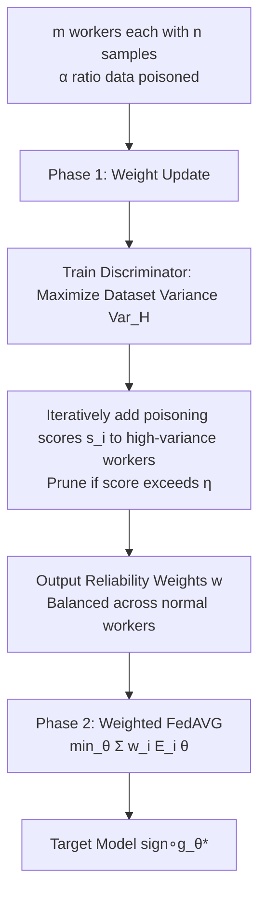

# Near Optimal Robust Federated Learning Against Data Poisoning Attack

**Conference**: ICLR 2026  
**OpenReview**: [https://openreview.net/forum?id=gs6zKwv1gL](https://openreview.net/forum?id=gs6zKwv1gL)  
**Code**: TBD  
**Area**: Learning Theory / Robust Federated Learning  
**Keywords**: Data Poisoning, Federated Learning, Minimax Lower Bound, Robustness, H-divergence, VC dimension  

## TL;DR
Addressing the "low data per worker, high number of workers" data poisoning scenario in Federated Learning, this paper first provides the minimax lower bound of attack loss and then designs a two-stage mechanism involving "training a discriminator to assign reliability weights" to workers. This ensures that the upper bound **asymptotically matches the lower bound** as $m\to\infty$, and the attack loss depends only on the task's VC dimension $d$ rather than the gradient dimension.

## Background & Motivation
**Background**: Federated learning (FL) decentralizes model training across a large number of nodes without centralizing data, yet it naturally inherits vulnerabilities to poisoning attacks. Poisoning is categorized into model poisoning (malicious workers directly tamper with uploaded gradients, becoming completely untrustworthy) and data poisoning (attackers only pollute the raw data of workers, while the workers themselves honestly compute gradients based on the polluted data). The latter has a lower entry barrier (classic attacks like label-flipping do not require knowledge of the target model type) and is more realistic, yet it has been neglected for a long time.

**Limitations of Prior Work**: Mainstream approaches directly apply **robust gradient aggregation** (e.g., geometric median, iterative filtering, Krum) designed for model poisoning by treating outlier gradients as poisoned and removing them. However, applying these to data poisoning faces two major flaws. First, the server must perform outlier detection every round, leading to cumulative computational overhead. Second, gradients are high-dimensional vectors, and **higher dimensionality makes outlier detection harder**. Figure 1(b-c) shows that for the same batch of data, poisoned gradients are harder to distinguish from normal ones as models grow from 2-layer to 32-layer networks. Crucially, the attack loss bounds for these methods scale as $O\big((\frac{\mathrm{trace}(\Sigma_g)}{n})^{1/2}+(\frac{d_g}{mn})^{1/2}\big)$, where $\Sigma_g$ is the gradient covariance and $d_g$ is the gradient dimension. Both expand as models grow, preventing the bound from converging even as the number of workers $m\to\infty$.

**Key Challenge**: This paper focuses on a "difficult yet practical" setting where the number of samples per worker $n$ is very small (rendering local poisoning detection impossible), but the total number of workers $m$ is large (providing enough total information to learn the task, provided poisoned data can be identified). In this setting, per-gradient denoising is both expensive and inaccurate, but collective statistical information could be exploited.

**Goal**: To answer "how well one can defend against arbitrary data poisoning in the worst case." Defense is decomposed into two goals: maximizing the accuracy of the target model on clean data (low attack loss) and limiting the gain attackers obtain from the attack (even if such gain is not directly captured by attack loss, such as in Trojan attacks).

**Key Insight**: **Discriminator instead of gradient denoising** — Rather than per-round gradient outlier detection, a **discriminator model** is trained before the target model to directly distinguish worker datasets. This is used to assign a one-time reliability weight to each worker. The discriminator's training objective is defined by a "dataset variance" concept induced by H-divergence, rewriting the attack loss bound to depend only on the task VC dimension $d$ instead of the gradient dimension $d_g$.

## Method

### Overall Architecture
The algorithm consists of two phases (Algorithm 1): The **reliability weight update phase** first trains a discriminator model and uses it to compute a weight vector $w\in\mathbb{R}^m$ for $m$ workers (non-negative elements summing to 1; higher weights denote higher credibility). The **target model training phase** uses $w$ as weighting coefficients to train the target model by minimizing the weighted error $\theta^*=\arg\min_\theta\sum_i w_i E_i(\theta)$, implemented directly via weighted FedAVG. The essence of the mechanism lies in the first phase, which moves "poisoning identification" from online per-round gradient detection to one-time offline discriminator training.

### Key Designs

**1. Using H-divergence induced "dataset variance" as a discrimination signal**: To distinguish datasets rather than gradients, the key is to define a metric characterizing differences between datasets. The paper utilizes H-divergence $d_\mathcal{H}(D,D')$ to measure the separability of two distributions from the perspective of a hypothesis class $\mathcal{H}$, and then induces "dataset variance": for weights $w$, parameters $\theta$, and label vector $a$, define $\mathrm{Var}_{\theta,a}(\{W_i\},w)=\sum_i w_i\big(F_i(\theta,a)-\sum_j w_j F_j(\theta,a)\big)^2$, where $F_i(\theta,a)=\sum_{y'}a_{y'}P_{(x,y)\sim W_i}[y=y',\,\mathrm{sign}(g_\theta(x))=1]$ represents the proportion of samples in worker $i$ where the "true label is $y'$ but predicted as 1". Maximizing over $\theta,a$ yields $\mathrm{Var}_\mathcal{H}(\{W_i\},w)$. The intuition is that highly correlated datasets have small variance; thus, variance among normal workers is naturally small, and large variance must be primarily contributed by poisoned workers.

**2. Constraining weights to a provably small H-divergence feasible region**: To make the weighted distribution $D_w$ approximate the unknown ground truth $D$, weights must satisfy two conditions: the weighted variance $\mathrm{Var}_\mathcal{H}(\{W_i\},w)\le t$ must be small, and weights must be **as dispersed as possible** across $(1-\alpha)m$ normal workers. This is formalized as the feasible region $C_{\beta,\xi,t}=\{w\in V_{m,\beta,\xi}:\mathrm{Var}_\mathcal{H}(\{W_i\},w)\le t\}$, where $V_{m,\beta,\xi}$ constrains $\sum_i w_i=1$, the sum of weights on normal workers $\sum_{i\in S_n}w_i=\xi$, and each $0\le w_i\le\frac{1}{\beta m}$ ($\alpha<\beta\le1-\alpha$, capping individual weights to prevent collapse). The paper proves that if $w\in C_{\beta,\xi,t}$, the H-divergence between $D_w$ and $D$ can be bounded by $t$ and $\beta$.

**3. Iterative pruning weight solver (Algorithm 2)**: To find weights in $C_{\beta,\xi,t}$, the algorithm starts with the full set of workers $S=[m]$ and uniform weights, maintaining a poisoning score vector $s$. Each round, it solves $\theta,a\leftarrow\arg\max\sum_i w_i(F_i-\sum_j w_j F_j)^2$ to find the hypothesis maximizing variance, computes the deviation $\tau_i$ for each $i$, and accumulates scores $s_i$ based on $\tau_i/\tau_{\max}$. If a score exceeds threshold $\eta$, the worker is removed from $S$, and weights are redistributed. This continues until $|S|<(1-2\alpha)m$. This "score those who boost variance" process gradually filters out poisoners.

**4. Minimax lower bound and Asymptotic Optimality**: In the IID setting, Theorem 3.1 provides an attack loss lower bound of $\frac{\alpha}{2(1-\alpha)\sqrt n}$. In the non-IID setting, Theorem 3.2 uses the Dirichlet concentration parameter $\gamma$ to give a lower bound $\Omega(\frac{\alpha}{\sqrt\gamma}+\frac{\alpha}{\sqrt n})$. Theorem 5.1 proves that for $\alpha\le\frac13$ and $n>1+d/m$, the algorithm achieves an upper bound of $\tilde O(\sqrt{1/n}+\sqrt{d/mn})$ with probability $1-\delta$, which **asymptotically matches the lower bound** as $m\to\infty$, and depends only on VC dimension $d$ rather than $d_g$.

**5. Effective Poison Rate (EPR) for measuring attacker gain**: Standard attack loss fails to capture gains from Trojan or free-rider attacks. The paper introduces Effective Poison Rate (EPR). A mechanism $M$ is $c$-EPR if there exists a dataset $D$ with H-divergence to normal data no more than $c$ such that the output distribution of $M$ is identical whether using the actual (poisoned) datasets or everyone using $D$. This mechanism reduces EPR to $\tilde O(\sqrt{1/n}+\sqrt{d/mn})$ (IID), indicating that the attack impact is **sub-proportional** and substantially weakened.

## Key Experimental Results

### Main Results
Evaluation was conducted on MNIST / CIFAR-10 with flip-label and backdoor attacks. Baseline defenses include geometric median, iterative filtering, and Krum.

| Setting | Ours vs Baselines (Trend) |
|------|----------------------|
| IID, 200 normal + 50 poisoned workers, varying $n$ (30→120) | Consistently higher test accuracy, lower attack accuracy; **advantage increases as $n$ decreases** |
| IID, 30 samples/worker, varying poisoning rate $\beta$ (0.3→0.9) | Higher test accuracy, lower attack accuracy |
| Non-IID (Dirichlet 1.0), varying poisoning rate $\beta$ | Outperforms all baselines on both metrics |

- Higher **test accuracy** implies lower attack loss; higher **attack accuracy** (accuracy on flipped labels) implies higher attacker gain. Ours excels in both.

### Attack Loss Bound Comparison

| Method | IID Attack Loss Bound | Dimensionality Dependency | Convergence as $m\to\infty$ |
|------|----------------|----------|------------------------|
| dimension-wise / geometric median | $O\big((\tfrac{\mathrm{trace}(\Sigma_g)}{n})^{1/2}+(\tfrac{d_g}{mn})^{1/2}\big)$ | Gradient dim $d_g$ | No (expands with model) |
| iterative filtering | $O\big((\tfrac{\|\Sigma_g\|_2}{n})^{1/2}+(\tfrac{d_g}{mn})^{1/2}\big)$ | Gradient dim $d_g$ | No |
| **Ours** | $\tilde O\big((\tfrac1n)^{1/2}+(\tfrac{d}{mn})^{1/2}\big)$ | VC dimension $d$ | **Yes (matches lower bound)** |
| Minimax Lower Bound | $\dfrac{\alpha}{2(1-\alpha)\sqrt n}$ | — | — |

### Key Findings
- **Efficiency**: The communication complexity for both stages is identical to FedAVG, whereas baselines require complex server-side robust aggregation.
- **Small $n$, large $m$ is the sweet spot**: Per-gradient denoising fails when single-worker information is insufficient, but the collective variance signal remains clear.
- **Tight Bounds**: The upper bound converges to $\tilde O(\sqrt{1/n})$ as $m\to\infty$, which is the same order as the lower bound $\Omega(1/\sqrt n)$.

## Highlights & Insights
- **Decoupling from Gradient Dimension to VC Dimension**: This is the most fundamental improvement over robust gradient aggregation, explaining why data poisoning can have "cheaper" defenses than model poisoning.
- **Minimax Optimality**: By proving matching lower and upper bounds, the "near-optimal" claim is established as a theoretical conclusion rather than an empirical slogan.
- **EPR Metric**: Using $c<\alpha$ as a criterion to characterize sub-proportional attack impact captures gains (like Trojans) that attack loss cannot see.

## Limitations & Future Work
- **Theoretical Constraint $\alpha<\frac13$**: Requires at least 2/3 of the datasets to be clean, which is typical for robust aggregation but a limitation nonetheless.
- **Optimization as a Black Box**: The theory treats parameter optimization as a black box that reaches the optimum, whereas actual implementations use SGD approximations.
- **Binary Classification Focus**: The theoretical core is developed for binary settings; multi-class tasks rely on reductions, and constants/separability for complex tasks require further validation.

## Related Work & Insights
- **Robust Gradient Aggregation** remains a primary competitor; the paper points out that their dependence on $\mathrm{trace}(\Sigma_g)$ and $d_g$ causes divergence as models grow, a fundamental weakness in data poisoning scenarios.
- **H-divergence** is creatively adapted from domain adaptation theory to define dataset variance and EPR, serving as the bridge between dataset separability and robustness bounds.
- **Dirichlet Non-IID Modeling** quantifies the heterogeneity of FL, showing that stronger heterogeneity ($\gamma$) makes poisoning harder to defend against by increasing the lower bound.

## Rating
- **Novelty**: ⭐⭐⭐⭐⭐ Shifting defense from gradient space to dataset space using H-divergence is highly original.
- **Experimental Thoroughness**: ⭐⭐⭐⭐ Covers various settings and attacks, though experiments on large-scale models are relatively light.
- **Writing Quality**: ⭐⭐⭐⭐ Logic chain from motivation to lower bounds to optimal algorithms is clear.
- **Value**: ⭐⭐⭐⭐ Provides significant theoretical and algorithmic support for a "cheaper" defense against data poisoning.

<!-- RELATED:START -->

## Related Papers

- [\[ICLR 2026\] A Near-Optimal Best-of-Both-Worlds Algorithm for Federated Bandits](a_near-optimal_best-of-both-worlds_algorithm_for_federated_bandits.md)
- [\[ICLR 2026\] Near-Optimal Sample Complexity Bounds for Constrained Average-Reward MDPs](near-optimal_sample_complexity_bounds_for_constrained_average-reward_mdps.md)
- [\[ICLR 2026\] Noise Tolerance of Distributionally Robust Learning](noise_tolerance_of_distributionally_robust_learning.md)
- [\[ICLR 2026\] Robust Amortized Bayesian Inference with Self-Consistency Losses on Unlabeled Data](robust_amortized_bayesian_inference_with_self-consistency_losses_on_unlabeled_da.md)
- [\[ICLR 2026\] Escaping Model Collapse via Synthetic Data Verification: Near-term Improvements and Long-term Convergence](escaping_model_collapse_via_synthetic_data_verification_near-term_improvements_a.md)

<!-- RELATED:END -->
