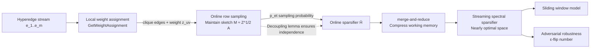

# Nearly Space-Optimal Graph and Hypergraph Sparsification in Insertion-Only Data Streams

Conference: ICLR 2026  
Code: Not released  
Area: Learning Theory / Streaming Algorithms (Graph & Hypergraph Sparsification)  
Keywords: Graph sparsification, spectral sparsification, hypergraph, streaming model, online leverage score sampling, adversarial robustness  

## TL;DR

This paper presents nearly space-optimal algorithms for graph and hypergraph spectral sparsification in insertion-only streams. It reduces the space complexity of graph spectral sparsifiers from the previous $O(\frac{n}{\varepsilon^2}\log^2 n)$ bits to $O(\frac{n}{\varepsilon^2}\log n\cdot\text{poly}(\log\log n))$ and introduces the first streaming hypergraph sparsifier with factors exceeding offline results by only poly-iterated-log terms relative to $m$. It simultaneously addresses online, sliding window, and adversarial robustness settings.

## Background & Motivation

**Background**: Graph/hypergraph sparsification aims to compress large graphs into smaller ones that preserve cut or spectral properties, serving as a core acceleration component for graph representation learning, lightweight GNNs, Laplacian solvers, and spectral clustering. Offline settings are mature—Batson et al. (2014) constructed graph spectral sparsifiers with $O(n/\varepsilon^2)$ edges, and Jambulapati et al. (2023) / Lee (2023) achieved an upper bound of $O(\frac{nr}{\varepsilon^2}\log n\log r)$ for hypergraphs.

**Limitations of Prior Work**: When data arrives in a **stream** (network logs, IoT, financial transactions), algorithms must process it in a single pass under strict memory constraints without storing the entire graph. Whether offline optimal sampling complexity can be transferred to streaming settings without extra space cost remained an open question. Specifically, dynamic streaming algorithms (Kapralov et al. 2020) require $O(\frac{n}{\varepsilon^2}\log^2 n)$ bits, an extra $\log n$ factor over the offline optimum. Existing streaming algorithms for hypergraphs (Soma et al. 2024, Khanna et al. 2025a) carry factors like $\log^2 n\log r$ or $\text{polylog}(m)$, which are catastrophic for large-scale hypergraphs where $r$ can be $\Omega(n)$ and $m$ can be $\Omega(2^n)$.

**Key Challenge**: Under streaming constraints, it is impossible to store the "prefix subgraph" to calculate sampling probabilities for each (hyper)edge. However, accurate sampling probabilities must depend on the global structure, creating a conflict between space budget and sampling precision.

**Goal**: To answer whether graph sparsification in streaming models requires more space than offline settings, and to reduce the gap to poly-iterated-log (i.e., $\text{poly}(\log\log n)$).

**Core Idea**: **Online sampling followed by merge-and-reduce**. A nearly optimal online sampling subroutine "pre-thins" the stream, making the input to the merge-and-reduce framework sufficiently short, thereby reducing the inherited $\text{polylog}(n)$ factor to $\text{poly}(\log\log n)$. To make online hypergraph sampling feasible, two key tools are designed: **local weight assignment** and a **decoupling lemma**.

## Method

### Overall Architecture

The algorithm uses an **online hypergraph sparsifier** as its foundation, adding wrappers to achieve streaming, sliding window, and adversarial robustness results. The key to the online layer is: for each incoming hyperedge, "local weight assignment" decomposes it into a set of weighted clique edges in the associated graph; then "online row sampling" maintains a 2-spectral approximation sketch $M$ of the weighted prefix matrix $Z_t^{1/2}A_t$ to define sampling probabilities. The "decoupling lemma" ensures these probabilities are independent, allowing chaining arguments to bound sampling complexity. The streaming layer then feeds $M$ into merge-and-reduce, reducing $\log n$ to $\log\log n$.

### Key Designs

**1. Online leverage score sampling: replacing "full prefix graph" with "prefix sketch".** Classic spectral sparsification samples edges according to effective resistance $r_e=w(e)(\chi_u-\chi_v)L_G^{-1}(\chi_u-\chi_v)^\top$, equivalent to the leverage score $\tau_i=a_i(A^\top A)^{-1}a_i^\top$ of the corresponding row in the incidence matrix $A$. In a stream, the full graph is unavailable; this paper instead uses **online leverage scores** $\tau_i^{OL}(A):=a_i(A_i^\top A_i)^{-1}a_i^\top$, which only depend on the prefix matrix $A_i$ arrived before the current row. Since online leverage scores are monotonic regarding prefixes, sampling based on them provides an "over-estimate" of offline probabilities, ensuring spectral approximation while controlling the number of sampled rows.

**2. Local weight assignment: spreading hyperedges into cliques in a controlled manner.** The hypergraph spectral energy $Q_H(x)=\sum_e w(e)\max_{(u,v)\in e}(x_u-x_v)^2$ contains a $\max$ term, which cannot be directly sampled as matrix rows. Kapralov et al. (2021) proposed replacing each hyperedge with a clique in the associated graph and greedily shifting weights from "high-ratio edges" to "low-ratio edges" until ratios $q_{uv}=\tau_{uv}(Z^{1/2}A)/z_{uv}$ are within a $\gamma$-factor range. This paper **localizes** this (Algorithm 2): when a new hyperedge $e$ arrives, weight-shifting is performed only on its own clique ($\lambda\leftarrow\min\{z_{uv},\frac{\gamma-1}{2\gamma\cdot q_{uv}}\}$, $z_{uv}\!+\!=\!\lambda,\ z_{u'v'}\!-\!=\!\lambda$), leaving historical weights unchanged. This maintains weight matrix consistency. Proof-wise, each local shift monotonically increases a spanning tree potential with an upper bound, ensuring convergence to a $\gamma$-balanced assignment. This yields Theorem 2.2: the weight sum is $w(e)$, and $\max_{(u,v)\in e}a_{uv}(A_t^\top Z_t A_t)^{-1}a_{uv}^\top=O\!\big(\sum_{(u,v)\in e}\tau_{uv}(Z_t^{1/2}A_t)\big)$, meaning the sampling probability is bounded by the sum of clique leverage scores.

**3. Decoupling lemma: making sampling probabilities independent for chaining analysis.** Naively, the sampling probability of the $t$-th hyperedge is determined by the sketch $M=(M^\top M)^{-1}$, which is composed of previously sampled edges. This creates entanglement, preventing the use of concentration inequalities. This paper (Lemma 2.3) points out that the sketch $M$ is maintained independently by **online row sampling**, and its internal randomness is independent of the decision to "include the entire hyperedge in $\hat H$". Thus, by fixing the internal randomness of online row sampling, the sequence of matrices $M_1,\dots,M_m$ is fixed, making each $p_{e_t}=\min\{1,2\rho\max_{(u,v)}a_{uv}w(e_t)(M^\top M)^{-1}a_{uv}^\top\}$ independently defined. This independence is critical for applying the chaining argument from Jambulapati et al. (2023) to achieve optimal sampling complexity ($\rho=O(\frac{1}{\varepsilon^2}\log m\log r)$).

**4. Streaming framework: online sampling leading merge-and-reduce to pay only poly-iterated-log.** Merge-and-reduce partitions the stream and merges upward, using precision $\varepsilon'=\frac{\varepsilon}{2\log(mn)}$ to reconstruct coresets at each node. Doing this directly introduces $\log m$ factors. Following Cohen-Addad et al. (2023), this paper uses "pre-emptive online sampling": if the initial online sampling is nearly optimal (sampling $O(\frac{n}{\varepsilon^2}\log n)$ edges for graphs), the stream entering merge-and-reduce is significantly shorter. Consequently, the $\text{polylog}(n)$ in coreset size degrades to $\text{poly}(\log\log n)$. The challenge is that online sampling requires the "online coreset from the previous step" to calculate probabilities, but streaming cannot store the full coreset. This paper uses the **sparsifier $\hat S$ output by the previous streaming step** (rather than the full coreset) to define the next online sampling probability (Algorithm 3), with refined analysis (Theorem 3.1, ridge leverage scores $\tilde\ell_i=O(1)\cdot a_i^\top(\hat A_{i-1}^\top\hat A_{i-1}+\lambda I)^{-1}a_i$) proving it remains a valid online coreset.

**5. Adversarial robustness: upgrading high-probability algorithms via ε-flip number.** The streaming result is first pushed into the high-probability regime (success $1-\delta$, space increasing by $O(\log\frac{1}{\delta})$), then the computation path framework of Ben-Eliezer et al. (2020) is applied. This requires the **ε-flip number** (the number of times $f$ increases by an $\varepsilon$ proportion) of the target function to be small. This paper uses the Laplacian eigenvalues of the input hypergraph's associated graph to control when to switch outputs, changing only when eigenvalues increase by an $\varepsilon$ proportion. Eigenvalues increase at most $\frac{n\log m}{\varepsilon}$ times, resulting in a flip number of $\frac{n\log m}{\varepsilon}$. Combining this with high-probability results yields a space-efficient adversarially robust algorithm.

## Key Experimental Results

This is a purely theoretical work with no empirical experiments; the "key results" refer to space complexity comparisons with previous state-of-the-art.

### Graph Spectral Sparsification Space Comparison (Bits)

| Setting | Source | Space |
|---|---|---|
| Offline | Batson et al. (2014) | $O(\frac{n}{\varepsilon^2}\log n)$ |
| Streaming | Kapralov et al. (2020) | $O(\frac{n}{\varepsilon^2}\log^2 n)$ |
| Streaming | **Ours (Thm 1.1)** | $O(\frac{n}{\varepsilon^2}\log n\cdot\text{poly}(\log\log n))$ |

Ours matches the offline optimum within a $\text{poly}(\log\log n)$ factor, saving a $\log n$ factor compared to prior streaming results.

### Hypergraph Spectral Sparsification / Other Settings

| Problem | Source | Space (Bits) |
|---|---|---|
| Hypergraph (Streaming) | Soma et al. (2024) | $\frac{rn}{\varepsilon^2}\log^2 n\log r$ |
| Hypergraph (Streaming) | Khanna et al. (2025a) | $\frac{rn}{\varepsilon^2}\cdot\text{polylog}(m)$ |
| Hypergraph (Streaming) | **Ours (Thm 1.3)** | $\frac{rn}{\varepsilon^2}\log^2 n\cdot\text{poly}(\log r,\log\log m)$ |
| Graph min-cut (Streaming) | Ding et al. (2024) | $O(\frac{n}{\varepsilon}\log^{c+1} n)$ |
| Graph min-cut (Streaming) | **Ours (Thm 1.2)** | $O(\frac{n}{\varepsilon}\log^{c} n\log\frac{1}{\varepsilon})$ |
| Hypergraph (Adv. Robust, Thm 1.5) | **Ours** | $\frac{n}{\varepsilon^2}\text{poly}(r,\log n,\log r,\log\log\frac{m}{\delta})$ |
| Hypergraph (Sliding Window, Thm 1.6) | **Ours** | $\frac{rn}{\varepsilon^2}\log n\cdot\text{polylog}(m,r)$ |

### Key Findings

- For hypergraphs, this is the first work to remove the $\log m$ dependence (where $m$ can be $\Omega(2^n)$ in the worst case), bringing streaming space into the poly-iterated-log neighborhood of offline sampling complexity.
- The online algorithm itself is optimal up to polylog factors, allowing seamless migration to the sliding window model (at the cost of slightly higher space than pure streaming, as low-contribution edges in the recent $W$ window cannot be discarded).
- The update time is $\text{poly}(n)$, with the bottleneck being the online sampling probabilities requiring matrix multiplication time $\tilde O(n^\omega)$ where $\omega\approx 2.37$. Relaxing space constraints could allow for faster updates.

## Highlights & Insights

- **"Online prefixing + merge-and-reduce" is a universal recipe for shaving polylog factors into poly-iterated-log**: As long as the prefixing online sampling is nearly optimal, the stream entering merge-and-reduce is short, and the logarithmic factors in coreset reconstruction naturally degrade to iterated logarithms.
- **Local weight assignment + decoupling lemma provide the missing pieces for online hypergraphs**: The former solves how to spread the $\max$ energy of hyperedges into sampleable matrix rows, while the latter addresses whether concentration inequalities still hold under online serial dependency.
- **One online core for four settings**: Streaming, sliding window, adversarial robustness, and online settings are all essentially built on the same online hypergraph sparsifier, demonstrating the leverage of online primitives.

## Limitations & Future Work

- **Slow Update Time**: $\text{poly}(n)$ ($\tilde O(n^\omega)$ for online sampling probabilities). Concurrent works by Goranci & Momeni (2025) and Khanna et al. (2025a) trade worse space for better update times—these represent different trade-offs; this paper prioritizes space.
- **Hypergraph space still contains $\log^2 n\cdot\text{poly}(\log r)$**, leaving an iterated-logarithmic gap from a "perfect offline match." Polynomial dependence on $r$ persists in the adversarial robustness results.
- **Purely Theoretical**: There are no empirical experiments. The actual benefits of these constants and iterated logarithmic factors on large-scale real-world graphs/hypergraphs, and comparisons with heuristic sparsification, remain to be validated.

## Related Work & Insights

- **Offline Spectral Sparsification**: Effective resistance sampling (Spielman & Srivastava 2008) and $O(n/\varepsilon^2)$ edge construction (Batson et al. 2014) are the sampling complexity benchmarks that this work aims to match.
- **Online Row Sampling**: Online leverage score sampling from Cohen et al. (2020) is used as a direct tool for maintaining the sketch $M$.
- **Hypergraph Sparsification**: Soma & Yoshida (2019) formalized $(1+\varepsilon)$ hypergraph spectral sparsification; the greedy weight balancing of Kapralov et al. (2021) is localized here.
- **Streaming Coreset Framework**: Merge-and-reduce and the "online prefixing" idea from Cohen-Addad et al. (2023) form the backbone of the streaming layer.
- **Adversarially Robust Streams**: The $\varepsilon$-flip number / computation path framework of Ben-Eliezer et al. (2020) is extended to hypergraph sparsification.

## Rating

- **Novelty** ⭐⭐⭐⭐: The combination of local weight assignment, the decoupling lemma, and the streaming trick of using previous sparsifiers instead of online coresets constitutes a genuinely new toolchain covering four settings.
- **Experimental Thoroughness** ⭐⭐⭐: Purely theoretical. While complexity comparisons are solid, there is no empirical verification.
- **Writing Quality** ⭐⭐⭐⭐: Clarity in contribution and comparison tables, a progressive technical overview, and clear mapping between main theorems and the appendix.
- **Value** ⭐⭐⭐⭐: Resolves the long-standing question of whether streaming requires more space than offline settings, with fundamental implications for large-scale graph compression and spectral solvers.

<!-- RELATED:START -->

## Related Papers

- [\[ICML 2026\] Quantum Algorithms for Triangle Cut Sparsification](../../ICML2026/learning_theory/quantum_algorithms_for_triangle_cut_sparsification.md)
- [\[ICLR 2026\] Quotient-Space Diffusion Models](quotient-space_diffusion_models.md)
- [\[ICLR 2026\] Metric $k$-Clustering using only Weak Comparison Oracles](metric_k-clustering_using_only_weak_comparison_oracles.md)
- [\[ICLR 2026\] Near Optimal Robust Federated Learning Against Data Poisoning Attack](near_optimal_robust_federated_learning_against_data_poisoning_attack.md)
- [\[ICLR 2026\] Minimax Sample Complexity of Graph Neural Networks: Lower Bounds and Structural Effects](minimax_sample_complexity_of_graph_neural_networks_lower_bounds_and_structural_e.md)

<!-- RELATED:END -->
