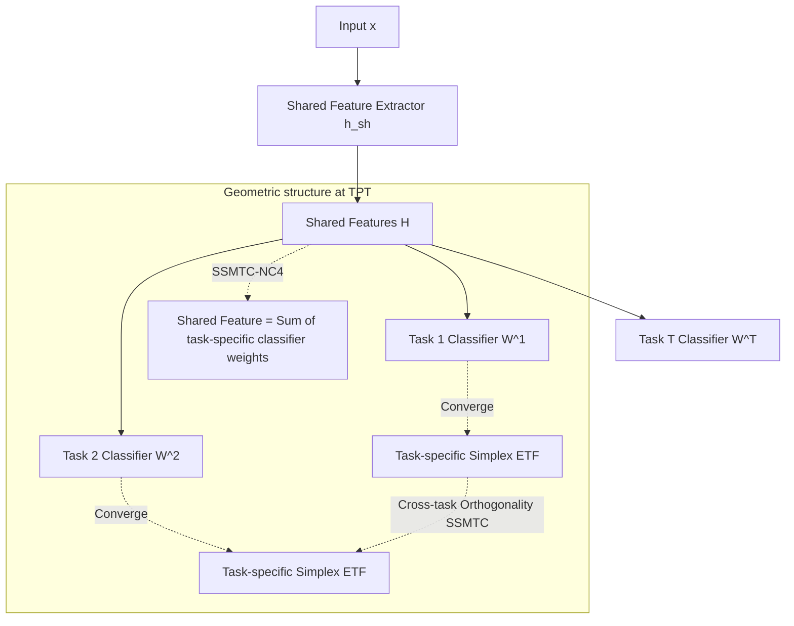

# Neural Collapse in Multi-Task Learning

**Conference**: ICLR 2026  
**OpenReview**: [https://openreview.net/forum?id=M4t2JUMlfI](https://openreview.net/forum?id=M4t2JUMlfI)  
**Code**: TBD  
**Area**: learning_theory  
**Keywords**: Neural Collapse, Multi-Task Learning, Simplex ETF, Unconstrained Feature Model, Inductive Bias, Feature Sharing  

## TL;DR
This paper generalizes "Neural Collapse" (NC) theory from single-task to multi-task learning (MTL) for the first time. It characterizes the geometric structures of task-specific classifiers and features at the terminal phase of training (TPT) under both single-source and multi-source MTL settings (e.g., task-specific Simplex ETF, cross-task orthogonality, and shared features being the sum of task-specific features). Through rigorous proofs using the Unconstrained Feature Model (UFM), the authors reveal an inductive bias where task correlation reshapes classifier geometry and promotes feature alignment.

## Background & Motivation

**Background**: Neural Collapse (NC) was discovered by Papyan et al. (2020): when deep networks enter the terminal phase of training (TPT)—where training error reaches zero but loss continues to decrease—the last-layer features and classifiers converge to a highly symmetric, architecture/dataset-independent structure. This is summarized by four properties: (NC1) within-class feature collapse to class means; (NC2) class means converging to a Simplex Equiangular Tight Frame (Simplex ETF); (NC3) self-duality between classifier weights and class means; and (NC4) classification behaving as a nearest class center decision. NC has been widely used to explain imbalanced learning, transfer learning, continual learning, and multi-label learning.

**Limitations of Prior Work**: To date, almost all empirical and theoretical studies of NC have been confined to **single-task, single-classifier** settings. The geometric relationship between multiple classifiers and shared features in **Multi-Task Learning (MTL)** remains largely unexplored. MTL, dominated by "hard parameter sharing" (one shared feature extractor + multiple task-specific heads), lacks a mathematical characterization of its feature space, task-specific learning, and cross-task interactions.

**Key Challenge**: In single-task NC, "one classifier converges to one ETF." In MTL, however, **multiple task-specific classifiers share the same underlying features**. A single ETF cannot describe how multiple classifiers coexist or how shared features are partitioned across tasks. Direct application of single-task conclusions fails to explain unique MTL phenomena like transfer and interference.

**Goal**: Characterize the geometric structure of task-specific classifiers and features during TPT under two standard MTL settings—Single-Source Multi-Task Classification (SSMTC, e.g., Multi-MNIST) and Multi-Source Multi-Task Classification (MSMTC, e.g., CIFAR100-Split)—and provide theoretical guarantees.

**Key Insight**: **[Geometric Characterization]** Generalize the single-task ETF into a compound structure of "task-specific ETFs + cross-task orthogonality." **[Mechanism]** Prove that the shared feature is the (scaled) sum of task-specific latent features, meaning task-specific classifiers decouple the shared feature into task-specific subspaces. **[Inductive Bias]** Reveal that task correlation reshapes the classifier geometry; stronger correlation leads to higher alignment between classifiers of different tasks, making learned features closer to the shared features.

## Method

### Overall Architecture
The paper does not propose a new algorithm but establishes a closed loop of **empirical observation + theoretical proof** for the geometric structures emerging at the end of MTL training. The architecture adopts standard hard parameter sharing: a shared feature extractor $h^{sh}$ outputs shared features, and multiple task-specific linear classifiers $f^t(h)=W^t h + b^t$ perform classification. Theoretical analysis utilizes the **Unconstrained Feature Model (UFM)** pervasive in NC research—treating the last-layer features $H$ as free optimization variables. This simplifies the complex "network + data" optimization into a weighted weight-decay optimization problem over $\{W^t\}, H, \{b^t\}$ to analyze global optima.

### Key Designs

**1. SSMTC-NC: Compound ETF with Cross-task Orthogonality + Shared Feature Decomposition.** Under the single-source setting (one image with multiple labels), the feature of sample $x$ is written via a non-convex UFM loss Eq.(3): $\min \sum_t c_t L_{CE}(W^t H + b^t, Y^t) + \lambda_H\|H\|_F^2 + \lambda_W\sum_t c_t\|W^t\|_F^2 + \lambda_b\sum_t c_t\|b^t\|_2^2$. Five properties (SSMTC-NC1~5) are observed at TPT. The core innovations are NC2/NC3/NC4: each task's classifier collapses into a **task-specific Simplex ETF** (NC2: $\langle\tilde w^t_k, \tilde w^t_{k'}\rangle\to \frac{K}{K-1}\delta_{k,k'}-\frac{1}{K-1}$), while **classifier subspaces of different tasks are mutually orthogonal** (NC3: $\langle\tilde w^t_k, \tilde w^{t'}_{k'}\rangle\to 0,\ t\neq t'$). Orthogonality implies tasks can be optimized independently without interference. NC4 provides the "composition formula" for shared features: normalized shared feature means converge to the direction of the sum of corresponding task-specific label weights $\tilde h^{k_1,\dots,k_T}_j\to \frac{\sum_t w^t_{k_t}}{\|\sum_t w^t_{k_t}\|_2}$. This clarifies that shared features are superpositions of task-specific classifier weights. Theorem 3.1 proves that under balanced data, $d\ge\sum_t K_t - T$, and $\lambda_H\lambda_W<\frac{N}{4K}$, **any global optimum** of Problem (3) exactly satisfies these five properties.

**2. MSMTC-NC: Task-independent Self-dual ETF.** In the multi-source setting (different tasks use different data, each with independent feature matrices $H^t$), the loss becomes Eq.(4). Here, the geometry is "cleaner": each task **independently** reproduces the full single-task NC—within-task feature collapse (NC1), convergence of both classifiers and class means to Simplex ETFs (NC2), **self-duality** $\|\tilde\mu^t_k-\tilde w^t_k\|_2^2\to 0$ (NC3), and nearest center classification (NC4). Since data is separated, the shared extractor performs "one single-task NC for each task." Theorem 3.2 proves global optimality for these four properties under $d\ge\max_t K_t - 1$ and $\lambda_H\lambda_W<\frac{n_t}{4}$.

**3. Shared Feature = Sum of Task-specific Latent Features (Mechanism).** To verify NC4 is not just a mathematical coincidence, a "feature dissection" experiment was designed: after training on Multi-MNIST-10-10, images $x^{L,R}$ were cropped to keep only the top-left $x^L$ or bottom-right $x^R$. Feeding these into the network yields $h^L$ and $h^R$. $h^L$ satisfies full NC1/NC2/NC3 relative to classifier $W^L$, as does $h^R$ to $W^R$. This confirms $h^L$ and $h^R$ are the "task-specific latent features." Furthermore, combined feature means satisfy $\tilde\mu^{L,R}_{k_1,k_2}\to \frac{\tilde\mu^L_{k_1}+\tilde\mu^R_{k_2}}{\|\tilde\mu^L_{k_1}+\tilde\mu^R_{k_2}\|}$. **Shared features are superpositions of task-specific latent features, and task-specific classifiers act as decouplers into respective subspaces.**

**4. Task Correlation Reshapes Classifier Geometry (Inductive Bias).** Fixing total samples $N$ and systematically varying the sampling ratio of label pairs $(k_1, k_2)$ transitions the system from "label balanced" to "task balanced." Orthogonality in SSMTC-NC3 breaks, becoming **Correlated-NC3: As $n_{k_1,k_2}$ increases, $\cos(w^1_{k_1}, w^2_{k_2})$ increases.** Theorem 5.1 provides a closed-form expression for $\cos(w^1_1, w^2_1)$ for two binary tasks, matching experimental curves. The implication is profound: **stronger task correlation aligns task-specific features and classifiers with the shared representation.** Grad-CAM++ visualizations on CelebA support this: when correlations between "Eyeglasses" and "Mouth-Slightly-Open" are artificially enhanced, their salient regions overlap significantly.

## Key Experimental Results

### Main Results (Verification of SSMTC-NC / MSMTC-NC)
Verification that NC metrics converge toward zero at TPT across 4 architectures × 4 datasets.

| Setting | Dataset | Backbone | Evaluation Metrics | Conclusion |
|------|--------|----------|----------|----------|
| SSMTC | Multi-MNIST-10-10, Multi-CIFAR10-10-10, CIFAR100-Cross-10x10 | VGG11/13, ResNet18/34 | $S_{NC1}\sim S_{NC5}$ (Within-class var, ETF angles/norms, Cross-task cosine, Feature-classifier sum diff, NCC error) | All metrics drop to 0, consistent across architectures/datasets |
| MSMTC | CIFAR100-Split-5x20, etc. | VGG11/13, ResNet18/34 | $M_{NC1}\sim M_{NC4}$ | Each task independently reproduces ETF + self-duality; metrics approach 0 |

### Ablation Study

| Dimension | Setting | Conclusion |
|------|------|------|
| MTL Weighting Strategies | MGDA / Uncertainty Weight / PCgrad / DWA / FAMO / FairGrad | NC occurs under various weighting strategies; not dependent on uniform weights |
| Class Imbalance | Variable classes per task | Generalized SSMTC-NC still holds (Appendix B.2/D.2) |
| Learning Rate / $(\lambda_H,\lambda_W)$ | Multiple hyperparameter sets | NC phenomenon is robust |
| Large-scale Data | CelebA, ImageNet-1K | NC still emerges |
| Parameter Efficient Training | Replacing last layer with NC properties | Parameters can be replaced, validating theoretical utility |

### Key Findings
- **Geometric Bifurcation**: SSMTC exhibits a compound structure (Task-specific ETF + Orthogonality + Summation); MSMTC reverts to task-independent self-dual ETFs.
- **Decouple-able Shared Features**: Shared features are proven to be superpositions of task-specific latent features, with classifiers acting as decouplers.
- **Correlation-Alignment Law**: $\cos(w^1_{k_1},w^2_{k_2})$ increases monotonically with sample correlation; closed-form solutions match empirical results; Grad-CAM++ shows overlapping saliency for correlated tasks.

## Highlights & Insights
- **Extending Proved Theory to New Scenarios**: NC is well-studied for single tasks; this work discovers that MTL is not just a stack of single tasks. The "orthogonality + sum decomposition" in SSMTC is a novel geometry absent in single-task theory.
- **Theoretical-Empirical Closed Loop**: Every empirical phenomenon is backed by global optimality theorems (Thm 3.1/3.2/5.1). Correlated-NC3 provides a verifiable closed-form cosine expression, moving beyond post-hoc explanation to precise prediction.
- **Intuitive Mechanistic Explanations**: Feature dissection and Grad-CAM++ make abstract questions—like "what constitutes a shared feature"—tangible, shifting from pure geometry to an understanding of MTL mechanics.
- **Universality of Inductive Bias**: The law that "task correlation reshapes geometry and promotes alignment" provides a geometric framework to explain positive/negative transfer in MTL.

## Limitations & Future Work
- **UFM Idealization**: Theory relies on the Unconstrained Feature Model, assuming features can be optimized arbitrarily and data is balanced, which differs from finite-capacity networks and long-tailed data.
- **Linear Heads and CE Loss**: Analysis is limited to final-layer linear classifiers and cross-entropy loss; applicability to non-linear heads, contrastive loss, or regression tasks is unknown.
- **Limited Scope of Task Correlation**: Closed-form solutions for Correlated-NC3 were derived primarily for two binary tasks; complex correlation structures with more tasks/classes remain to be systematically characterized.
- **Lack of Quantitative Prediction for Negative Transfer**: While correlation leads to alignment, the point at which alignment causes interference or negative transfer remains unquantified.

## Related Work & Insights
- **Neural Collapse Lineage**: Following Papyan et al. (2020), NC was extended to imbalanced learning (Fang et al. 2021), transfer learning (Galanti et al. 2022), and multi-label learning; this work completes the "MTL" puzzle.
- **UFM / Layer-Peeled Model**: Uses standard UFM tools (Mixon et al. 2022; Fang et al. 2021a) expanded for multi-classifier scenarios.
- **Feature-based MTL**: Complements work on feature sharing (Zhang & Yang 2022) by providing fine-grained geometric characterizations of the TPT phase.
- **MTL Weighting**: Demonstrates factors like MGDA or PCgrad do not alter the fundamental emergence of NC.

## Rating
- **Novelty**: ⭐⭐⭐⭐⭐ First systematic generalization of NC to MTL, discovering novel "orthogonal compound ETF" structures and geometric inductive biases.
- **Experimental Thoroughness**: ⭐⭐⭐⭐ Solid verification across backbones, datasets, and weighting strategies; however, lacks application on complex real-world MTL pipelines.
- **Writing Quality**: ⭐⭐⭐⭐ Clear Phenomenon-Theorem-Explanation structure. Excellent use of visualizations to explain abstract concepts.
- **Value**: ⭐⭐⭐⭐ Provides a theoretical foundation for MTL representation geometry; "correlation-reshaping-geometry" is highly insightful for understanding transfer.

<!-- RELATED:START -->

## Related Papers

- [\[ICLR 2026\] Pretrain–Test Task Alignment Governs Generalization in In-Context Learning](pretraintest_task_alignment_governs_generalization_in_in-context_learning.md)
- [\[ICML 2026\] Multi-task Linear Regression without Eigenvalue Lower Bounds: Adaptivity, Robustness and Safety](../../ICML2026/learning_theory/multi-task_linear_regression_without_eigenvalue_lower_bounds_adaptivity_robustne.md)
- [\[ICLR 2026\] Heads Collapse, Features Stay: Why Replay Needs Big Buffers](heads_collapse_features_stay_why_replay_needs_big_buffers.md)
- [\[ICLR 2026\] Multi-Condition Conformal Selection](multi-condition_conformal_selection.md)
- [\[ICLR 2026\] Preventing Model Collapse Under Overparametrization: Optimal Mixing Ratios for Interpolation Learning and Ridge Regression](preventing_model_collapse_under_overparametrization_optimal_mixing_ratios_for_in.md)

<!-- RELATED:END -->
