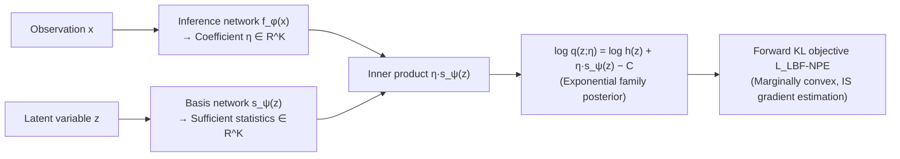

# Neural Posterior Estimation with Latent Basis Expansions

**Conference**: ICLR 2026  
**OpenReview**: [https://openreview.net/forum?id=jsPQFNmnln](https://openreview.net/forum?id=jsPQFNmnln)  
**Code**: To be confirmed  
**Area**: Probabilistic Methods / Amortized Variational Inference / Simulation-Based Inference (SBI)  
**Keywords**: Neural Posterior Estimation, Variational Families, Exponential Families, Basis Function Expansion, Convex Optimization, Likelihood-Free Inference  

## TL;DR
The variational family of Neural Posterior Estimation (NPE) is reformulated as "log-density = linear combination of latent basis functions"—an exponential family parameterized by neural networks. This approach maintains high expressivity for low-dimensional posterior projections while ensuring the optimization is (marginally) convex, stably outperforming Gaussian Mixture Models and Normalizing Flows.

## Background & Motivation
**Background**: NPE is currently a popular route for Bayesian inference. It trains a network using synthetic data—comprising "latent variables sampled from a prior + corresponding observations"—to learn the mapping from observations back to latent variables. Once trained, a single forward pass provides a posterior approximation without requiring likelihood calculations. A unique advantage is that when the generative model contains both parameters of interest $z$ and nuisance variables $\xi$, NPE automatically marginalizes $\xi$ by simulating full data and discarding the nuisance components to obtain the projected posterior.

**Limitations of Prior Work**: Like traditional ELBO-based variational inference, NPE is trapped in a dilemma between "variational family expressivity" and "optimization solvability." Simple families (Gaussian) offer stable optimization but poor expressivity. Complex families (Mixture Density Networks/MDNs, Normalizing Flows) are expressive yet prone to shallow local minima and poor optimization landscapes. Furthermore, existing global convergence theories for NPE (McNamara et al. 2024a) only cover simple Gaussian families and do not apply to the flexible families commonly used in practice.

**Key Challenge**: **Achieving high expressivity ⟺ Ensuring optimization is convex and converges to global optima**—these two objectives are mutually exclusive in existing variational families.

**Goal**: To design a variational family specifically tailored for NPE that can approximate complex multimodal posteriors while maintaining favorable convex optimization properties and global convergence guarantees.

**Core Idea**: **[Basis Expansion of Log-Density]** It is noted that in NPE scenarios, the primary interest usually lies in a few low-dimensional parameters of scientific significance. Since NPE does not require likelihood calculations, numerical integration is feasible in low-dimensional latent spaces. Consequently, the **shackle of "closed-form normalization constants" can be abandoned**. The authors leverage this to write the **log-density** of the variational distribution directly as a linear combination of basis functions $\log q(z) \propto \eta^\top s_\psi(z)$, which constitutes an exponential family. Expressivity grows arbitrarily with the number of basis functions $K$, while optimization benefits from the properties of exponential families and convexity.

## Method

### Overall Architecture
LBF-NPE (Latent Basis Function NPE) defines an amortized posterior using two neural networks: a **basis function network** $s_\psi: z \mapsto \mathbb{R}^K$, which provides $K$ basis function values (sufficient statistics) for any latent point $z$; and an **inference network** $f_\phi: x \mapsto \eta \in \mathbb{R}^K$, which maps observations to the coefficients (natural parameters) of these basis functions. The inner product $f_\phi(x)^\top s_\psi(z)$ defines the log-density, formulating the posterior as an exponential family. Training minimizes the forward KL objective of NPE. The entire construction and optimization rely solely on this inner product, leading to properties like convexity, fixed/adaptive bases, and spherical projection.

### Key Designs

**1. Exponential Variational Family: Leveraging $K$ for Expressivity by Modeling Log-Density.** For a fixed observation $x$, the authors define the variational density as $q(z;\eta) \propto h(z)\exp(\eta^\top s_\psi(z))$, where the log-density is $\log q(z;\eta) = \log h(z) + \eta^\top s_\psi(z) - C$. Here, $s_\psi(z)$ denotes sufficient statistics, $\eta$ represents natural parameters, $h(z)$ is an arbitrary finite base measure, and $C$ is the log-normalization constant. Since the number and form of basis functions are arbitrary (output by a deep network), this family is far more expressive than classical exponential families (e.g., Gaussian)—as $K \to \infty$, the exponential family can approximate any distribution. Increasing $K$ gains expressivity at the cost of a higher-dimensional optimization problem.

**2. Amortized Objective and Importance Sampling Gradient: Training without Closed-Form Normalization.** Under amortization, $\eta = f_\phi(x)$. The objective is the forward KL (the standard NPE objective):
$$L_{\text{LBF-NPE}}(\phi,\psi) = -\mathbb{E}_{p(z,x)}\Big[f_\phi(x)^\top s_\psi(z) - \log\int \exp\big(f_\phi(x)^\top s_\psi(\tilde z)\big)\,h(\tilde z)\,d\tilde z\Big].$$
The challenge lies in the integral within the log-normalization term. Due to the Jensen gap, it cannot be estimated unbiasedly via Monte Carlo. However, only an unbiased (consistent) **gradient** is required. The gradient of $\log J$ is derived as an expectation under the "exponentially tilted density $q_{\phi,\psi}$", estimated using **Self-Normalized Importance Sampling (SNIS)**—sampling $P$ points from a proposal $r$ and weighting them by $w(z)=\exp(k_{\phi,\psi}(z))h(z)/r(z)$. While this gradient estimate is biased (shared with wake-sleep algorithms), it is consistent as $P \to \infty$. Algorithm 1 details the full batch gradient calculation.

**3. Affine Gradients and Marginal Convexity: Flattening the Optimization Landscape.** Because the construction and gradients depend only on the inner product $k_{\phi,\psi}(x,z)=f_\phi(x)^\top s_\psi(z)$, the gradient takes a simplified form: $\nabla L = -\mathbb{E}_{p(z,x)}[\nabla k_{\phi,\psi} - \mathbb{E}_{q_{\phi,\psi}}\nabla k_{\phi,\psi}]$. When $\psi$ is fixed, the gradient with respect to the output of $f_\phi$ is the gradient of an affine function; the reverse is also true. Based on this, the authors prove (Proposition 1) that the objective $L(f,s)$ is **marginally convex** with respect to $f$ and $s$—meaning if one network is fixed, the functional is entirely convex with respect to the other. Combined with NTK theory for wide networks, this guarantees convergence to a global optimum via kernel gradient descent in the infinite-width limit, eliminating the common failure mode where complex families are difficult to train.

**4. Fixed vs. Adaptive Bases and Spherical Projection for De-degeneration.** The **fixed basis** variant directly uses B-splines, wavelets (local bases that are non-zero only in parts of the latent space, making gradients sparse and the problem easier to solve), or orthogonal polynomials like those in EigenVI (global bases). In this case, $L(\phi,\psi)$ reduces to a marginal objective only for $\phi$, which is strictly convex and highly stable. The **adaptive basis** variant involves joint alternating optimization of $f_\phi$ and $s_\psi$, utilizing marginal convexity. However, adaptation introduces identifiability issues—the inner product is invariant to arbitrary scaling or rotation of $f$ and $s$, leading to degeneracy. The authors use **spherical projection reparameterization** to map the $(K-1)$-dimensional network output $u$ to the unit hypersphere $\|y\|=1$ via $y = \big(\tfrac{2u}{1+\|u\|^2}, \tfrac{1-\|u\|^2}{1+\|u\|^2}\big)$. This eliminates scaling degeneracy (though rotation degeneracy remains), and when combined with a fixed scaling hyperparameter $w$, significantly stabilizes adaptive training.

## Key Experimental Results

### Main Results: Three Types of 2D Complex Posteriors (Table 1, lower is better)

| Metric | Task | LBF-NPE | NSF | RealNVP | MDN |
|------|------|---------|-----|---------|-----|
| Forward KL | Bands | **0.0048** | 0.016 | 0.015 | 0.182 |
| Forward KL | Ring | **0.0054** | 0.017 | 0.024 | 0.205 |
| Forward KL | Spiral | **0.187** | 0.201 | 0.545 | 0.948 |
| Reverse KL | Ring | **0.0027** | 0.013 | 0.014 | 0.204 |
| NLL | Ring | **0.030** | 0.621 | 0.733 | 1.031 |

Using only **20 adaptive basis functions**, the method achieves near-perfect approximation of complex banded, ring, and spiral posteriors, yielding order-of-magnitude improvements in forward KL compared to MDNs and Normalizing Flows.

### Case Study: Astronomical Redshift Estimation (Table 2, held-out NLL, lower is better)

| Method | LBF-NPE | NSF | MDN |
|------|---------|-----|-----|
| Total NLL | **−57,220 (±152)** | −55,389 (±379) | −50,648 (±322) |

On the LSST DESC DC2 simulated survey dataset, embedded within the BLISS framework for photometric redshift estimation of 153,000 objects, LBF-NPE (fixed B-spline bases) significantly outperforms MDN and NSF.

### Key Findings
- **Convergence Stability**: On a sinusoidal likelihood toy example (with up to 4 posterior peaks), LBF-NPE (14 second-order B-splines) consistently converges to the same optimum across 20 random seeds, whereas a 5-component MDN with equivalent parameters frequently falls into suboptimal local minima.
- **Astronomical Object Detection**: In star localization problems with highly separated multimodal patterns, LBF-NPE represents any pair of separated peaks using learned basis functions, even without direct parameterization of position. Ablations for $K=9, 20, 36, 64$ demonstrate the expressivity advantage of adaptive bases over fixed bases.
- The method consistently outperforms EigenVI, an existing basis-expansion VI method (which requires orthogonal fixed bases and is not amortized).

## Highlights & Insights
- **Leveraging the True Degrees of Freedom in NPE**: While others treat "closed-form normalization constants" as an absolute rule, the authors realize this is unnecessary for low-dimensional posterior projections in a likelihood-free setting. Modeling log-density directly yields the high expressivity of exponential families. This is a classic insight derived from re-examining the source of constraints.
- **Expressivity and Convexity Combined**: Through the structural observation of "inner product dependence," the optimization of a seemingly complex neural exponential family is reduced to a marginally convex problem. This allows the method to bridge with existing NPE global convergence theories—something MDN and flows cannot achieve.
- **By-products of Log-space Modeling**: Linear combinations in log-space equivalent to multiplicative effects in density space, making it easier to "zero out" certain regions. Furthermore, since coefficients and basis functions can be positive or negative, optimization is unconstrained, avoiding the non-negativity constraints usually required by other density estimation methods.

## Limitations & Future Work
- **Biased Gradient Estimation**: The method relies on SNIS to estimate the gradient of the log-normalization term. The bias only vanishes as the number of proposal samples $P \to \infty$. The choice of proposal distribution $r$ impacts practical variance and convergence.
- **Dependency on Low-Dimensional Projections**: The computational feasibility (numerical integration, normalization) is predicated on the assumption that only a few low-dimensional parameters are of interest. For scenarios requiring high-dimensional joint posteriors, the appeal of the method diminishes.
- **Residual Rotation Degeneracy**: Spherical projection only resolves scaling degeneracy. Identifiability issues from rotation invariance persist, and the stability of adaptive training partially relies on the empirical hyperparameter $w$.
- The choice of $K$ and the trade-off between fixed bases (B-splines/wavelets/orthogonal polynomials) and adaptive bases remain largely empirical, lacking an automated selection mechanism.

## Related Work & Insights
- **NPE Lineage**: Simulation-Based Inference (SBI) works such as Papamakarios & Murray (2016) and Cranmer et al. (2020). This work extends the NPE convexity/convergence theory of McNamara et al. (2024a) from Gaussian families to neural exponential families.
- **Basis Expansion VI**: The most direct comparison is EigenVI (Cai et al. 2024), which uses orthogonal fixed eigenfunctions to optimize divergence but is non-amortized and introduces truncation errors; LBF-NPE's basis functions are unconstrained, adaptive, and naturally amortized.
- **Neural Exponential Families**: Pacchiardi & Dutta (2022) first used neural exponential families to represent likelihoods; this work is the first to use them for **posteriors** within an amortized inference framework.
- **Common Variational Families**: MDNs, RealNVP, and Neural Spline Flows serve as primary baselines, with this work systematically demonstrating their disadvantage in being prone to local minima.
- **Insight**: When a "standard constraint" (like closed-form normalization) stems from a default yet potentially inapplicable premise (e.g., high dimensionality or the need for analytical forms), re-evaluating the actual requirements of the task can unlock a superior design space.

## Rating
- **Novelty**: ⭐⭐⭐⭐ — Using "basis expansion of log-density = neural exponential family" for NPE is original. The clever exploit of low-dimensional projections + likelihood-free traits to unlock convex optimization is an insightful contribution.
- **Experimental Thoroughness**: ⭐⭐⭐⭐ — Covers range from toy multimodal examples and 2D synthetic posteriors to astronomical object detection and LSST redshift surveys. Shows order-of-magnitude improvements; however, mostly focuses on posterior approximation metrics and lacks side-by-side comparisons with recent flow/diffusion posteriors at scale.
- **Writing Quality**: ⭐⭐⭐⭐ — Clear logical chain from motivation to construction, properties, variants, and experiments. Convexity propositions and gradient derivations are well-explained. High reproducibility.
- **Value**: ⭐⭐⭐⭐ — Provides a practical variational family for SBI/amortized inference that is both expressive and stably convergent. Directly valuable for scientific fields like astronomy and cosmology requiring trustworthy multimodal posteriors.

<!-- RELATED:START -->

## Related Papers

- [\[ICLR 2026\] Transformers Learn Latent Mixture Models In-Context via Mirror Descent](transformers_learn_latent_mixture_models_in-context_via_mirror_descent.md)
- [\[ICLR 2026\] Score-Based Density Estimation from Pairwise Comparisons](score-based_density_estimation_from_pairwise_comparisons.md)
- [\[ICLR 2026\] Information Estimation with Discrete Diffusion](information_estimation_with_discrete_diffusion.md)
- [\[ICLR 2026\] Proper Velocity Neural Networks](proper_velocity_neural_networks.md)
- [\[ICLR 2026\] Neural Collapse in Multi-Task Learning](neural_collapse_in_multi-task_learning.md)

<!-- RELATED:END -->
