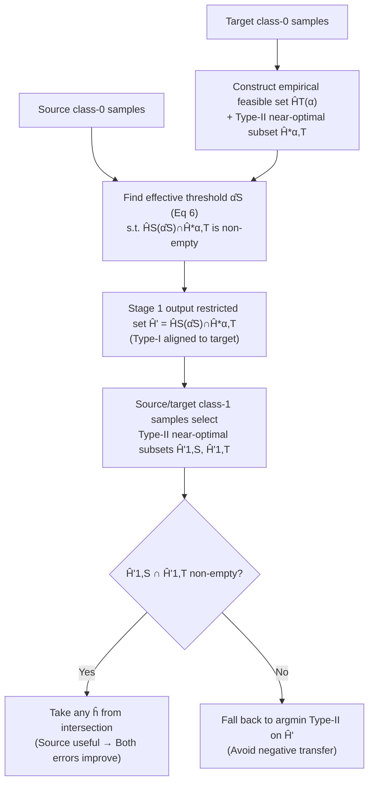

# Neyman-Pearson Classification under Both Null and Alternative Distributions Shift

**Conference**: ICLR 2026  
**OpenReview**: [https://openreview.net/forum?id=pHckxhmBlI](https://openreview.net/forum?id=pHckxhmBlI)  
**Code**: Not disclosed  
**Area**: Learning Theory / Transfer Learning / Neyman-Pearson Classification  
**Keywords**: Neyman-Pearson classification, Transfer learning, Distribution shift, Type-I/Type-II error, Adaptation, Avoiding negative transfer, Convex programming  

## TL;DR
This paper proposes the first Neyman-Pearson (NP) transfer learning process for scenarios where **both class-conditional distributions $\mu_0, \mu_1$ shift between source and target domains**. This method ensures improved Type-I/Type-II errors when the source is useful, avoids negative transfer by falling back to target-only data when it is not, and provides polynomial-time computational guarantees by reducing the problem to a sequence of convex programs.

## Background & Motivation
**Background**: NP classification is a classic framework for handling class imbalance, where the goal is to minimize the Type-II error (the error rate on $\mu_1$) under a hard constraint that the Type-I error (the error rate on $\mu_0$) does not exceed a preset threshold $\alpha$ (e.g., 5%). It is widely used in scenarios where the cost of missed detections is extremely high, such as disease diagnosis, malware detection, and heavy rain warnings. When target samples are scarce, it is natural to leverage extra source data via transfer learning.

**Limitations of Prior Work**: While transfer learning is well-studied for standard classification, it remains underdeveloped for constrained classification like NP. Existing theoretical works (Kalan et al. 2025; Kalan & Kpotufe 2024b) only address a restricted case: **assuming source and target domains share the same $\mu_0$, with shifts occurring only in $\mu_1$**. Furthermore, they often provide only statistical guarantees without considering computational efficiency.

**Key Challenge**: Once $\mu_0$ also shifts ($\mu_{0,S} \neq \mu_{0,T}$), satisfying the $\alpha$-constraint on the source domain **no longer implies** satisfying it on the target domain; the source feasible set $H_S(\alpha)$ and the target feasible set $H_T(\alpha)$ become misaligned. More critically, target class-0 samples ($n_{0,T}$) are often scarce, causing the true Type-I error of the empirical constraint set $\hat H_T(\alpha)$ to significantly exceed $\alpha$. It is also unclear which source threshold $\alpha'$ should be used to filter hypotheses to suppress target Type-I error without sacrificing Type-II error. Selecting a threshold $\alpha'$ that is too small might suppress Type-I error but cause Type-II error to skyrocket; this tradeoff must be determined adaptively from data rather than via manual tuning.

**Goal**: Design an adaptive process that provides both **statistical and computational guarantees** for general cases where both $\mu_0$ and $\mu_1$ may shift, without requiring prior knowledge of the source-target correlation. **Core Idea**: **Automatically calibrate an "effective threshold" $\hat\alpha_S$ using source class-0 samples to align the source constraint with the target constraint, then further reduce Type-II error using source class-1 samples**—employing a two-stage screening and convex programming solution.

## Method

### Overall Architecture
The method consists of a **two-stage adaptive screening process of "aligning constraints, then reducing error"**, implemented as a sequence of convex programs solvable via stochastic gradient methods. The first stage focuses on Type-I error: it uses target class-0 samples to define an empirical feasible hypothesis set, then uses source class-0 samples to find a minimal effective threshold $\hat\alpha_S$ to filter out hypotheses whose true Type-I error would exceed the limit. The second stage focuses on Type-II error: from the remaining hypotheses, it selects subsets with Type-II errors close to optimal on both source and target class-1 samples. The intersection of these subsets determines the final classifier; if the intersection is empty, it safely falls back to the "target-only" solution to avoid negative transfer. The statistical process is ultimately translated into a sequence of convex programs solvable via Stochastic Gradient Descent Ascent (SGDA), providing polynomial-time guarantees.

### Key Designs

**1. Effective Threshold $\hat\alpha_S$: Aligning Source Constraints to the Target.** This is the core innovation specifically designed for $\mu_0$ shifts. The ideal threshold is defined as $\alpha_S := \inf\{\alpha' : H_S(\alpha') \cap T^*(\alpha) \neq \emptyset\}$, the minimum source threshold required for the source feasible set to cover the target optimal solution. The empirical version is $\hat\alpha_S := \inf\{\alpha' \in [\alpha, 1] : \hat H_S(\alpha') \cap \hat H^*_{\alpha,T} \neq \emptyset\}$ (Eq 6), where $\hat H^*_{\alpha,T}$ is the set of hypotheses satisfying target empirical constraints with near-optimal empirical Type-II risk. The intuition is: since $n_{0,T}$ is small, the error bound $\epsilon_{0,T} = \tilde C / \sqrt{n_{0,T}}$ is large, leading $\hat H^*_{\alpha,T}$ to include "bad hypotheses" whose true Type-I error far exceeds $\alpha$. By tightening this to $\hat H' = \hat H_S(\hat\alpha_S) \cap \hat H^*_{\alpha,T}$ using the source domain, bad hypotheses are excluded while retaining those achieving low Type-II error. The paper proves $\hat\alpha_S \le \alpha_S$ when $\alpha < \alpha_S$, and Figure 1 uses a 1D Gaussian example to show how a proper $\alpha_{S}$ term shrinks the feasible set and lowers target Type-I error.

**2. Stage 2 Type-II Intersection + Safe Fallback: Adaptive Avoidance of Negative Transfer.** After obtaining $\hat H'$, near-optimal subsets $\hat H'_{1,D} := \{h \in \hat H' : \hat R_{\phi,\mu_{1,D}}(h) \le \hat R^*_{\phi,\mu_{1,D}}(\hat H') + 2\epsilon_{1,D}\}$ are constructed for $D \in \{S, T\}$. The decision rule (Eq 8) is simple: if $\hat H'_{1,S} \cap \hat H'_{1,T} \neq \emptyset$, it indicates there is a hypothesis deemed "good" by both source and target, meaning source information is useful. Taking any $\hat h$ from the intersection improves both Type-I and Type-II errors. If the intersection is empty, the source and target are inconsistent on class-1 (source is not informative), and the algorithm falls back to $\hat h = \arg\min_{h \in \hat H'} \hat R_{\phi,\mu_{1,T}}(h)$, trusting only the target data. This mechanism **requires no prior knowledge of source-target correlation** to achieve adaptation, which is the source of the "never worse than target-only" guarantee in Theorem 1.

**3. Transfer Modulus Characterizing Source Value.** To quantify the transferability of performance from source to target, the paper introduces two general moduli instead of a single transfer exponent: $\phi_1^{S\to T}(\varepsilon) := \sup\{\mathcal E_{1,T}(h \mid h^*_{S,T,\alpha}) : \mathcal E_{1,S}(h \mid h^*_{S,T,\alpha}) \le \varepsilon\}$ for Type-II transfer and $\phi_0^{S\to T}(\varepsilon) := \sup\{R_{\phi,\mu_{0,T}}(h) : R_{\phi,\mu_{0,S}}(h) \le \varepsilon\}$ for Type-I transfer. Theorem 1 provides a high-probability bound $\mathcal E_{1,T}(\hat h) \le c \cdot \min\{\epsilon_{1,T}, R_{\phi,\mu_{1,T}}(h^*_{S,T,\alpha}) - R_{\phi,\mu_{1,T}}(h^*_{T,\alpha}) + \phi_1^{S\to T}(4\epsilon_{1,S})\}$, and a Type-I bound $\min\{\alpha + 2\epsilon_{0,T}, \phi_0^{S\to T}(\hat\alpha_S + 2\epsilon_{0,S})\}$. When $\mu_{0,S} = \mu_{0,T}$, $\phi_0^{S\to T}$ becomes the identity and $\alpha_S \le \alpha$, reducing the bounds to existing results (Remark 1).

**4. Reduction to Convex Programming + SGDA: Computational Guarantees.** The paper translates the statistical process into solvable optimization. Under a parameterized hypothesis class $h_\theta (\|\theta\| \le B)$ and convex, Lipschitz-gradient losses (Assumption 3, e.g., logistic/linear models), finding $\hat\alpha_S$ is formulated as $\min_{\alpha' \ge \alpha, \theta} \alpha'$ s.t. $g'(\theta, \alpha') \le 0$ (Eq 10), which is converted to a minimax problem $\min_{\alpha' \ge \alpha, \theta} \max_{\lambda \ge 0} \alpha' + \lambda g'(\theta, \alpha')$ (Eq 11). The core operator, CP-Solver (Algorithm 1), uses SGDA with projection steps, treating both objective and constraints as stochastic samples. The overall procedure (Algorithm 2 NP-Transfer-Learning) calls CP-Solver multiple times to solve convex subprograms of varying precision. Theorem 2 proves that the output satisfies statistical guarantees with a polynomial number of random gradient calls, dominated by $\min\{1/\epsilon_{1,S}, 1/\epsilon_{1,T}\}$.

## Key Experimental Results

### Main Results
Experiments were conducted on two real-world climate datasets for heavy rain detection. Source and target domains correspond to different locations. A two-layer ReLU MLP was used, with $n_{0,T} = n_{1,T} = 40$. Source samples $n_{0,S} = n_{1,S}$ were varied from 50 to 950, with $\alpha = 0.1$. TLA (Ours) was compared against Only Target and Only Source.

| Dataset | Scenario | Type-I Error (TLA) | Type-II Error (TLA) | Key Comparison |
|---------|----------|-------------------|--------------------|----------------|
| Yu et al. 2023 (124-dim) | Source informative | Close to 0.1 threshold | Drops to ~0.02–0.05 as $n_S$ increases | Only Target exceeds threshold with higher Type-II |
| NASA POWER 2024 (6-dim) | Source uninformative | Controlled near threshold | ~0.2–0.3, similar to Only Target | Only Source Type-II reaches 0.5–0.9 |

### Ablation Study

| Setting | Observation | Conclusion |
|---------|-------------|------------|
| Source informative (Fig 2) | TLA lowers both Type-I and Type-II, outperforming Only Target | Actively leverages useful source |
| Source uninformative (Fig 3) | TLA matches Only Target, much better than Only Source | Successfully avoids negative transfer (Theorem 1) |
| Synthetic Gaussian data | Similar trends | Validates theory under controlled distributions |
| Threshold $\alpha = 0.1$ | TLA Type-I stably matches 0.1 | Consistent with theoretical Type-I bound $\alpha + 2\epsilon_{0,T}$ |

### Key Findings
- **Adaptivity is the empirical highlight**: The same algorithm requires no prior knowledge of source relevance; it gains from informative sources and remains competitive in uninformative ones, matching the theoretical $\min\{\text{target-only}, \text{source-aided}\}$ guarantee.
- Under small samples ($n_{0,T} = 40$), Only Target fails to even suppress the threshold, highlighting the necessity of source calibration for Type-I control.
- **Gains scale with source samples**: In informative scenarios, Type-II error decreases monotonically as $n_{0,S}$ increases, showing that both $\hat\alpha_S$ estimation and class-1 subset screening benefit from more source data.
- **Dual dataset comparison**: The 124-dim Yu dataset (informative) and 6-dim NASA dataset (uninformative) show the algorithm behaves correctly in opposite scenarios, providing direct evidence for the "double guarantee" of Theorem 1.
- **Effective on MLPs**: Although the theory assumes convexity, experiments using non-convex ReLU MLPs followed expected trends, suggesting robustness in practice.

## Highlights & Insights
- **General NP Transfer**: First work to handle simultaneous shifts in $\mu_0$ and $\mu_1$, generalizing previous "$\mu_1$-only shift" results as special cases.
- **Clever $\hat\alpha_S$ Design**: Transforms the abstract problem of aligning source thresholds into a computable infimum.
- **Statistical + Computational Dual Guarantees**: Moves beyond minimax bounds to provide a polynomial-time SGDA implementation.
- **General Transfer Modulus**: More general than the transfer exponent and can backwards-derive exponent-style expressions.
- **"Prior-free" Adaptation**: The degree of correlation is implicitly estimated from data, making the approach engineering-friendly without requiring hyperparameter tuning for transferability.

## Limitations & Future Work
- **Lack of Matching Lower Bounds**: The minimax lower bound for the general case (dual distribution shift) has not yet been established.
- **Strong Convexity Assumptions**: Computational guarantees rely on convex losses and Lipschitz gradients; applying this to deep neural networks requires a "convex hull" argument, leaving a gap for modern models.
- **Scale of Experiments**: Validated on climate and synthetic datasets with small target samples ($n_{0,T} = 40$); large-scale/high-dimensional modern tasks are not yet tested.
- **Nested CP-Solver Calls**: Algorithm 2 calls multiple convex subprograms sequentially, which might involve significant constant and logarithmic factors in terms of overhead.
- **Code is not public**, making reproduction more difficult for the community.

## Related Work & Insights
- **NP Classification Foundations**: Formalized by Cannon et al. (2002) and Scott & Nowak (2005); use of convex surrogate losses by Rigollet & Tong (2011); distribution-free minimax rates by Kalan & Kpotufe (2024a).
- **Direct Predecessors**: Kalan & Kpotufe (2024b) and Kalan et al. (2025) handle cases where $\mu_0$ is shared; this paper is a strict generalization.
- **Adaptive Transfer**: Leverages the transfer distance/exponent ideas from Hanneke & Kpotufe (2019), but extends them from standard to constrained classification.
- **Comparison to Standard Transfer**: Methods like $\alpha$-ERM or fine-tuning are unconstrained and cannot directly handle the hard Type-I constraints of NP classification.
- **Optimization**: The SGDA + projection framework for CP-Solver is based on Mahdavi et al. (2012).

## Rating
- **Novelty**: ⭐⭐⭐⭐⭐ — First to solve the dual distribution shift in NP transfer; $\hat\alpha_S$ alignment and transfer modulus are significant theoretical contributions.
- **Experimental Thoroughness**: ⭐⭐⭐ — Experiments serve as a proof-of-concept; datasets and scales are relatively small.
- **Writing Quality**: ⭐⭐⭐⭐ — Motivations and challenges are well-articulated, though the notation is dense.
- **Value**: ⭐⭐⭐⭐ — Fills a gap in a common but theoretically scarce area (imbalance + shifts); dual guarantees provide solid potential for application.

<!-- RELATED:START -->

## Related Papers

- [\[ICLR 2026\] Probability Distributions Computed by Autoregressive Transformers](probability_distributions_computed_by_autoregressive_transformers.md)
- [\[ICML 2026\] Expectation Consistency Loss: Rethink Confidence Calibration under Covariate Shift](../../ICML2026/learning_theory/expectation_consistency_loss_rethink_confidence_calibration_under_covariate_shif.md)
- [\[ICLR 2026\] Efficient Best-of-Both-Worlds Algorithms for Contextual Combinatorial Semi-Bandits](efficient_best-of-both-worlds_algorithms_for_contextual_combinatorial_semi-bandi.md)
- [\[ICLR 2026\] High-Dimensional Analysis of Single-Layer Attention for Sparse-Token Classification](high-dimensional_analysis_of_single-layer_attention_for_sparse-token_classificat.md)
- [\[ICLR 2026\] FACT: a first-principles alternative to the Neural Feature Ansatz for how networks learn representations](fact_a_first-principles_alternative_to_the_neural_feature_ansatz_for_how_network.md)

<!-- RELATED:END -->
